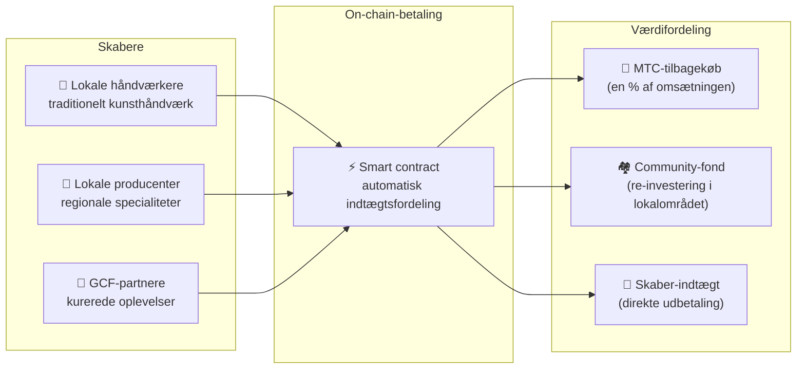

import useBaseUrl from '@docusaurus/useBaseUrl';

# 🗓️ Roadmap og team

>**Til dig, der har læst så langt — vision, økonomisk design og teknisk fundament er på plads.**
> Vi er ikke et kortsigtet spekulationsprojekt.
>**Den væsentlige platformudvikling er allerede afsluttet**, og vi er i fasen for udrulning.

---

## Strategiske milepæle

### 🔥 Fase 1: Opvågnen (1. halvår 2026 ── nu)

**Tema: Grundopbygning og etablering af cashflow**

Webplatformen kører. iOS-apps (Matsuri, J-Times) udgives april 2026. Vi fokuserer på indtjening og tidlig likviditet via et finanssystem direkte under CEO.

| Status | Milepæl | Detaljer |
| :---: | :--- | :--- |
| ✅ | **Webplatform i drift** | Matsuri-webapp og GCF-admin (web) er live |
| ✅ | **Betaling og vækst** | MTC-betalingsfunktion og henvisnings-airdrop implementeret |
| ✅ | **Medier i gang** | Distributionsgrundlag for J-Times (web + podcast) |
| ✅ | **Genesis** | MTC-token udstedt på Solana |
| ✅ | **Likviditet sikret** | Initial likviditetspulje oprettet på Raydium |
| ⬜ | **Incentiver starter** | Likviditetsminedrift med mål-APY 20% |
| ⬜ | **On-chain-betaling** | Produktion af Solana Pay-verifikation |
| ⬜ | **VIP-rekruttering** | Udvalg af 20 tidlige GCF-VIP-medlemmer |

### 🚀 Fase 2: Ekspansion (2. halvår 2026)

**Tema: Real assets og adventure mining**

Vi bruger den færdige webapp fuldt ud og udvider fysiske baser og pilgrimsfunktioner.

| Status | Milepæl | Detaljer |
| :---: | :--- | :--- |
| ⬜ | **Ny funktion** | Adventure mining (pilgrimsfærd) implementeres og frigives |
| ⬜ | **International** | Partnerskaber og VIP-events i Asien (Thailand, Taiwan mv.) |
| ⬜ | **Aktivforvaltning** | Opbygning af portefølje i ejendom, aktier, krypto |
| ⬜ | **Mål nået** | Samlet AUM i økosystemet: **1 mia. ¥** |

### 🌊 Fase 3: Cirkulation (2027+)

**Tema: Masseudbredelse, samskabende økonomi, decentralisering**

Fase for generel åbning, on-chain-markedsplads og et komplet økosystem.

| Status | Milepæl | Detaljer |
| :---: | :--- | :--- |
| ⬜ | **Grand Opening** | Matsuri-app officielt udgivet globalt |
| ⬜ | **Grand Unlock (1/6/2027)** | Founder-lockup ophæves + miningpulje (550M MTC) aktiv + halveringscyklus starter |
| ⬜ | **Samskabende markedsplads** | Lokale specialiteter + GCF-partnerbutikker ── on-chain-betalinger med automatisk MTC-tilbagekøb |
| ⬜ | **Crowdfunding (med NFT-rettigheder)** | Brugere investerer i kulturprojekter på Solana. Støtter modtager NFT, der repræsenterer ejerskab, indtægtsdeling og governance |
| ⬜ | **On-chain-betalinger** | Alle transaktioner i markedspladsen afvikles via smart contracts ── en andel af omsætningen sendes automatisk til MTC-tilbagekøbspuljen |
| ⬜ | **Mål nået** | Samlet AUM i økosystemet: **10 mia. ¥ (~65 mio. $)** |
| ⬜ | **DAO-overgang** | Del af beslutningskompetence overdrages til GCF-fællesskabet |

#### 🏪 Vision for samskabende markedsplads

"Kultur-OS’et" i sin ultimative form ── en **decentral markedsplads**, hvor kulturens skabere og kulturens elskere handler direkte, uden udnyttende mellemled.

| Funktion | Beskrivelse | Status |
| :--- | :--- | :---: |
| **🏺 Lokale specialiteter** | Håndværkere og lokale producenter sælger direkte til kunder i hele verden. 5–10% rabat ved MTC-betaling | ⬜ Vision |
| **🎫 Crowdfunding + NFT-rettigheder** | Invester i kulturprojekter (restaurering af helligdomme, genopblomstring af festivaler, håndværkerværksteder). Modtag NFT som bevis for bidrag, evt. med indtægtsdeling og governance | ⬜ Vision |
| **⚡ On-chain-betaling** | Alle markedspladstransaktioner afvikles i Solana-smart contracts. Omsætningen fordeles automatisk: betaling til skabere + community-fond + MTC-tilbagekøb ── ingen manuelt bogholderi | ⬜ Vision |
| **🗳️ Støtter-governance** | NFT-holdere stemmer om ressourcefordeling i de projekter, de har støttet ── ikke bare en donation, men ægte samskabelse | ⬜ Vision |

:::info Hvorfor det betyder noget
I dag køber turister souvenirs i butikker, der betaler husleje til platformen. I morgen sælger **en håndværker på det japanske land direkte til en fan i København**, og en andel af omsætningen styrker automatisk MTC-økonomien. Det er svinghjulet i sin mest gennemførte form.
:::

---

## 👤 Team

  

### Ko Takahashi ── grundlægger / CEO og chefarkitekt

| Punkt | Detaljer |
| :--- | :--- |
| **Rolle** | Overordnet ansvar for projektet. Platformsdesign, smart contracts, full-stack-udvikling |
| **Vision** | Forslagsstiller til et kultur-OS, der "eksporterer kultur og importerer rigdom" |
| **Stil** | Skriver selv koden, står selv i marken (Golden Gai) – "skin in the game" |

  

### Jon Anders Jensen ── direktør / GCF- og event-operations

| Punkt | Detaljer |
| :--- | :--- |
| **Rolle** | GCF-drift. Designer driften af events og ture, arbejder i felten |
| **Styrker** | Internationalt perspektiv og tillid blandt GCF-medlemmer – bærer "cirkulationen af mennesker" i økosystemet |

  

### Ryunosuke Honda ── direktør / regionskultur-ambassadør

| Punkt | Detaljer |
| :--- | :--- |
| **Rolle** | Broen mellem Japans regionale kulturer og Matsuri-økosystemet |
| **Styrker** | Opdager lokale kulturressourcer og lægger dem ind på Matsuri-platformen for at skabe "Deep Japan"-oplevelser |

### 🌏 GCF-fællesskabet ── udviklingsmedlemmer spredt ud over verden

Matsuri Protocol er ikke skabt af grundlæggerteamet alene.
**GCF-medlemmer fra hele verden** bidrager til protokollens udvikling gennem test, feedback, oversættelser og lokal udrulning.

| Område | Opstilling |
| :--- | :--- |
| **💼 Global finansiering** | Netværk af private investorer i Asien |
| **⚙️ Engineering** | Decentralt team af blockchain- og mobil-udviklere |
| **🏮 Operations** | Stærke pipelines i Shinjuku Golden Gai og andre turiststeder |
| **🌐 Fællesskab** | Tværnationale GCF-medlemmer i Japan, Norge, Thailand, Taiwan mv. |

:::tip Kulturens infrastruktur skabes af os alle
Er du med i GCF, er du også medudvikler af Matsuri Protocol.
Det handler ikke kun om at skrive kode. At vise et lokalt helligsted, oversætte dokumentation, arrangere et event —
alt sammen er med til at sprede protokollen ud i verden.
:::

---

## 🏛️ Governance (DAO)

Matsuri Protocol bevæger sig gradvist fra centralisering mod en **decentraliseret autonom organisation (DAO)**.
GCF-medlemmer (Platinum/Gold) vil på sigt få **stemmeret** om følgende vigtige emner.

| Afstemningsemne | Indhold |
| :--- | :--- |
| **💰 Kapitalfordeling** | Hvilke nye forretningsområder eller marketing skal forretningsomsætningen investeres i |
| **⚙️ Protokol-opdateringer** | Finjustering af app-gebyrer og mining-belønninger |
| **⛩️ Kulturel certificering** | Hvilke festivaler og helligdomme bliver certificeret som "officielle pilgrimssteder" og modtager støtte |

:::info Vær med i revolutionen
Vi bygger ikke bare en app.
Vi bygger en **kulturøkonomi uden grænser**.
:::

---

**[◀ Forrige: Produkt og teknologi](/docs/product-tech)**｜**[⛩️ Tilbage til whitepaper-start](/docs/intro)**
