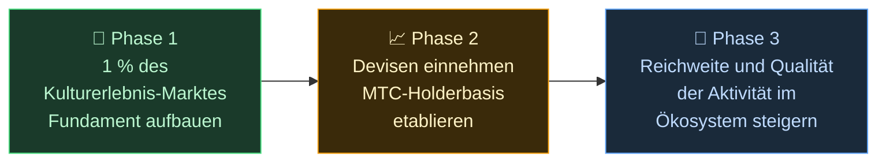

# 🌏 Herausforderungen & Lösungen — unbequeme Wahrheiten und Hoffnung

> **Die Mission ist schön. Die Realität stellt sich ihr in den Weg.**

---

## Doch es gibt unbequeme Wahrheiten, die dieser Mission im Weg stehen

:::info Ein Markt von 10 Billionen Yen (~66 Mrd. $) — und die Energie erreicht jene nicht, die die Kultur tragen
Japans Inbound-Markt wächst auf **10 Billionen Yen (~66 Mrd. $) pro Jahr** zu.
Doch nur ein Bruchteil dieses Nutzens kommt vor Ort an.
:::

### Der Markt, den MTC anvisiert

Wir versuchen nicht, die gesamten 10 Billionen Yen auf einmal zu erobern.

Unser erstes Ziel innerhalb dieses Marktes ist das Segment **Kulturerlebnisse, Guides und lokale Touren.** Wir nehmen **1 % dieses Segments (rund 100 Mrd. Yen / ~660 Mio. $)** als anfängliches Ziel: klein anfangen, stark wachsen.

| Phase | Strategie | Ziel |
| :--- | :--- | :--- |
| **Klein anfangen** | Fokus auf Kulturerlebnisse und Führungen. Erfolge sammeln und durch Mundpropaganda wachsen | Eine Einnahmebasis schaffen |
| **Stark wachsen** | Devisen (Inbound-Einnahmen) einbringen und den Mechanismus der Einnahmenteilung mit MTC-Haltern beweisen | Vertrauen in die MTC-Wirtschaft aufbauen |
| **Qualität erhöhen** | Sobald eine bestimmte Größe erreicht ist, kein Wachstum um des Wachstums willen mehr anstreben; Erlebnisqualität, Aktivitätsspektrum und Community vertiefen | Eine nachhaltige Kulturwirtschaft |

> **Wachstum durch die Qualität der Beteiligten und die Tiefe des Erlebnisses, nicht durch Volumen.** Das ist die Expansionsstrategie von MTC.

Web2-Plattformen haben Menschen weltweit die Freude am Reisen näher gebracht, und wir sind aufrichtig dankbar für das, was sie geschaffen haben. Doch eine zentralisierte Struktur bringt unvermeidliche Nebenwirkungen mit sich.

Algorithmen entscheiden, was sichtbar wird. Anbieter sind gezwungen, um Platzierungen zu konkurrieren. Eine einzelne Bewertung kann den Umsatz heftig schwanken lassen. Provisionssätze ändern sich nach Belieben der Plattform — und die Menschen vor Ort leben in ständiger Angst, ausgewählt oder unsichtbar zu werden.

Was diese Struktur hervorbringt, ist Zwietracht zwischen Anbietern und die Furcht vor unsichtbaren Regeln.
Der Laden nebenan wird zum Rivalen; Kund:innen abzuschotten ergibt mehr Sinn als zu kooperieren. Reisende sehen ihrerseits nur Optionen, die auf „Sterne" und „Rankings" reduziert sind, und wirklich wertvolle Erlebnisse gehen unter.

:::danger Drei Probleme, mit denen die Branche lebt
💸 **Abfluss von Einnahmen** — der Großteil der Einnahmen verlässt das Land als Provisionen an ausländische OTAs und Zwischenhändler

😤 **Erschöpfung vor Ort** — nur die Last des Overtourism bleibt zurück; die Einnahmen, die zählen, kommen nie in der Community an

🚧 **Mauer der Erfahrung** — nur algorithmisch ausgewählte, gleichförmige Touren erscheinen, und Besuchende lernen das „echte Japan" nie kennen
:::

> **Japaner:innen mühen sich ab, Reisende erleben nicht das Echte, und der Wohlstand verschwindet in den Plattformen.**

---

## Wie ändern wir das also?

Heute ist endlich die Technologie da, um diese Struktur an der Wurzel zu verändern.

:::tip Smart Contracts — geteilte Regeln, die niemand umschreiben kann
Provisionssätze und Bedingungen sind in Code gemeißelt. Niemand kann sie willkürlich ändern. Alle agieren unter derselben Regel, automatisch.
:::

:::tip Blockchain — Transparenz, die man tatsächlich sehen kann
Jede Transaktion wird in einem öffentlichen Hauptbuch festgehalten, das jede:r überprüfen kann. Die Ära der in einem Konzern eingesperrten Daten ist vorbei.
:::

:::tip Solana — 0,4-Sekunden-Abwicklung, ~0,0003 $ Gebühren
Keine Schichten von Mittelsmann-Gebühren, keine tagelangen Abwicklungen. Mensch zu Mensch, direkt verbunden.
:::

:::tip KI — die Kosten des Managements selbst lösen sich auf
Ein explosiver Produktivitätssprung lässt jene Kostenstrukturen, die zum Betrieb riesiger Plattformen nötig waren, der Vergangenheit angehören.
:::

Wir leben nicht mehr in einer Zeit, in der Menschen Zwischenhändler brauchen, um sich zu verbinden.

Mit dieser Technologie befreien wir die Inbound-Wirtschaft vom Monopol und führen Einnahmen zurück zu den Menschen vor Ort — in Japan und im Ausland.
Und nicht nur in Japan: Wir bauen **eine Struktur, um die Kulturen der Welt zu schützen und zu verbinden.**

---

**[◀ Vorherige: Vision & Mission](/docs/vision)** | **[▶ Nächste: Die Zukunft, die MTC entwirft](/docs/future)**
