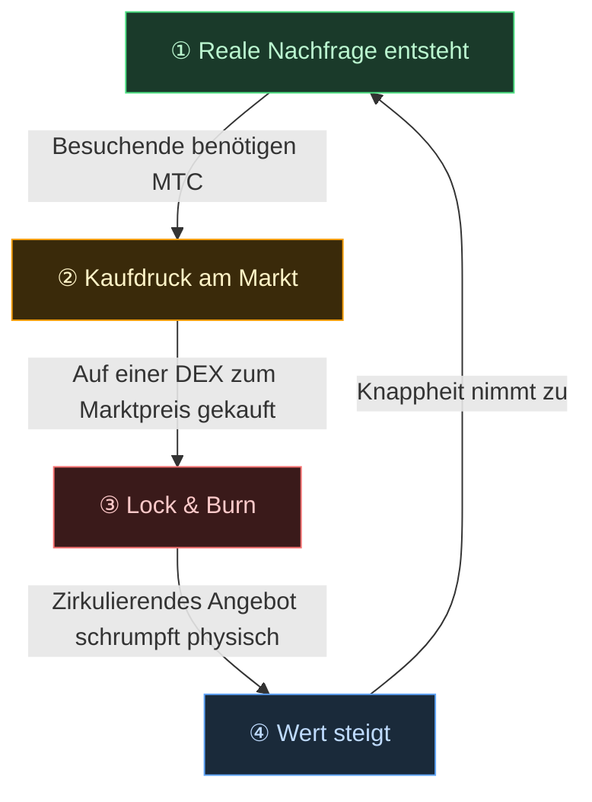

# 🔄 Das wirtschaftliche Schwungrad — eine Wachstumsschleife und ein Kultur-OS

> **Je mehr Besuchende Japan genießen, desto mehr Nachfrage erzeugt das Ökosystem.**
> Dieser Mechanismus aus Angebot und Nachfrage ist das schlagende Herz des Projekts.

---

## Der Angebot-Nachfrage-Mechanismus von MTC

Durch das Design des Matsuri Protocol gilt: **Steigende reale Nachfrage erzeugt Kaufdruck und schafft, kombiniert mit einem schrumpfenden Angebot, die Bedingungen für einen steigenden Wert.**
Das ist keine Stimmungsmache — es ist ein **Mechanismus von Angebot und Nachfrage.**

Dieser Mechanismus läuft in der unten stehenden **Vier-Schritte-Schleife**.

| Schritt | Bezeichnung | Mechanismus |
| :---: | :--- | :--- |
| **①** | **Reale Nachfrage entsteht** | Besuchende benötigen MTC, um eine Führung zu buchen oder ein Ticket-NFT zu erwerben |
| **②** | **Kaufdruck am Markt** | MTC wird zum Marktpreis auf einer DEX (dezentralen Börse) gekauft. Starker Kaufdruck, getragen von Konsum, nicht von Spekulation |
| **③** | **Lock & Burn** | Ein Teil des bei der Abwicklung verwendeten MTC wird sofort per Smart Contract gesperrt oder verbrannt. Das zirkulierende Angebot sinkt physisch |
| **④** | **Knappheit nimmt zu** | Kaufnachfrage wächst, Verkaufsangebot schrumpft. Die Verschiebung im Angebot-Nachfrage-Verhältnis macht jeden Token knapper |

---

---

:::note Die Vision hinter dieser Gleichung
Das größere Bild — das „Kultur-OS", das jenseits des Schwungrads liegt — wird ausführlich auf der nächsten Seite [Die Zukunft, die MTC entwirft](/docs/future) entfaltet.
:::

---

**[◀ Vorherige: Herausforderungen & Lösungen](/docs/challenges)** | **[▶ Nächste: Die Zukunft, die MTC entwirft](/docs/future)**
