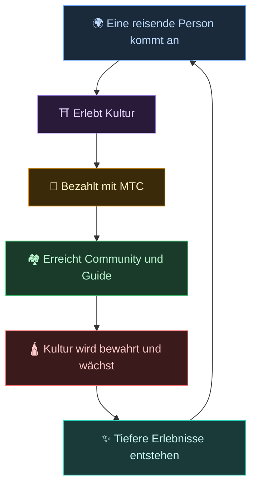
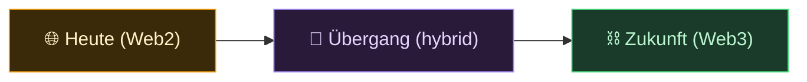
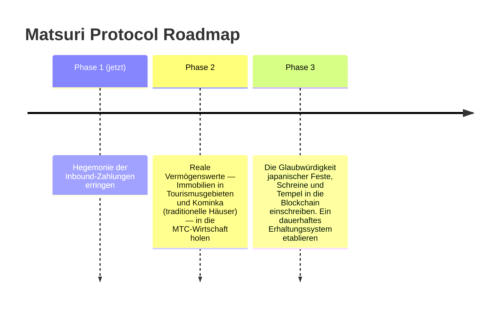

# 🌀 Die Zukunft, die MTC entwirft — eine Wirtschaft, in der jede Form der Beteiligung zirkuliert

> **Wer erlebt, wer vermittelt, wer bewahrt — jedes Gefühl zirkuliert als Wirtschaft und trägt Kultur in die nächste Generation.**

---

## Die Zirkulation, die wir schaffen wollen

MTC ist kein Spekulationstoken.

Reisende begegnen japanischer Kultur und werden bewegt.
Guides vermitteln dieses Gefühl und werden belohnt.
Communitys gedeihen und bewahren ihre Kultur weiter.
Und diese Kultur zieht den oder die nächste Reisende an.

Diese Zirkulation ist der eigentliche Grund, warum es MTC gibt.

---

## Eine Wirtschaft, in der alle drei Seiten belohnt werden

Im alten Tourismusmodell zahlt der Reisende, die Plattform streicht den Gewinn ein, und vor Ort bleibt nichts.
In der MTC-Wirtschaft werden alle Beteiligten belohnt.

| Wer ist beteiligt | Was geschieht | Wie sie belohnt werden |
| :--- | :--- | :--- |
| **🌍 Wer erlebt** | Begegnet japanischer Kultur, zahlt in MTC | Günstiger als in Yen und echter Zugang zu authentischen Erlebnissen. Auch nach der Heimreise über MTC verbunden bleiben |
| **⛩️ Wer vermittelt** | Veranstaltet als Guide Events, veröffentlicht auf J-Times | Direkte Belohnungen, ohne Zwischenhändler, die oben abgreifen. Je mehr du tust, desto mehr MTC verdienst du |
| **🏘️ Wer bewahrt** | Erhält und vermittelt als lokale Community Kultur | Einnahmen kommen direkt an. Communitys gedeihen nachhaltig, statt unter Overtourism zu leiden |

---

## Je weiter die Wirtschaft, desto stärker die Kultur

Die MTC-Wirtschaft beginnt mit dem Buchen von Erlebnissen und reicht in jeden Lebensbereich hinein.

- **Erleben** — authentische Kulturerlebnisse, Schreinbesuch-Mining
- **Kleidung, Essen, Unterkunft** — Pensionen, Läden, Küche, Mode
- **Mit-Schöpfungs-Projekte** — Crowdfunding zur Investition in den Schutz der Kultur
- **Interkulturelles Verständnis** — Räume des Austauschs und gegenseitigen Verstehens über Grenzen hinweg

Je weiter die Wirtschaft wächst, desto dichter fließt MTC durch sie und desto größer wird ihre Kraft, Kultur zu tragen.
Das ist nicht nur ein Geschäftsmodell. Es ist ein **Lebenserhaltungssystem für Kultur.**

---

## Vom Web2 zum Web3 — schrittweise, ohne Zwang

Wir sagen nicht „alles ab Tag eins auf die Blockchain".

Die meisten Menschen kennen Web3 heute noch nicht. Genau deshalb haben wir es so gestaltet, dass man **mit Formen beginnt, die man bereits kennt, und die Vorteile von Web3 nach und nach spürt.**

| Phase | Nutzererlebnis | Was darunter geschieht |
| :--- | :--- | :--- |
| **Heute** | Buchen und Bezahlen wie in jeder gewöhnlichen Web-App. Kreditkarte genügt | Django + Stripe. Zum Einstieg ist keine Wallet nötig |
| **Übergang** | MTC innerhalb der App verdienen und nutzen. Wallet-Verbindung mit einem Tipp | Off-Chain-Scores wandern schrittweise auf die Chain |
| **Zukunft** | Jede Transaktion und jedes Recht ist transparent on-chain festgehalten. Dein Beitrag ist für immer nachweisbar | Eine vollautomatische, manipulationssichere Wirtschaft, getragen von Smart Contracts |

:::tip Web3 muss nicht schwer sein
Kein Wallet-Setup, keine Verwaltung von Seed-Phrasen am Anfang. Während du die App nutzt, trittst du ganz natürlich in Web3 ein. **Bevor du es merkst, bist du bereits Bürger:in von Web3.** Genau dieses Erlebnis gestalten wir.
:::

---

## Eine Wirtschaft, die aus Empathie statt aus Zwang läuft

Und diese Wirtschaft läuft auf Smart Contracts.
Regeln können nicht einseitig nach jemandes Laune umgeschrieben werden — **eine Wirtschaft, in der der Status quo nicht mit Gewalt verändert werden kann.**

Auf diesem Fundament lernen wir aus alter Weisheit und schaffen weiter neuen Wert. 温故知新 — und dann Schöpfung.

> **Eine Welt, in der das Leben sich auch ohne Yen oder Dollar um Kultur herum tragen kann.**
>
> Nicht die Bedeutung von Geld an jemand anderen abgeben, sondern Wert durch deine eigene „Beteiligung" erzeugen und ausgeben.
> Das ist die Freiheit, die MTC liefern will.

---

## 🏁 Das letzte Ziel: das „Kultur-OS"

Unser höchstes Ziel ist nicht bloß eine Bezahl-App.
Es geht darum, **Kultur selbst zu einem OS (Grundschicht) zu machen.**

> Wir bewahren alte Weisheit mit der modernsten Blockchain.
> Das ist die Zukunft, die das Matsuri Protocol zeichnet.

---

:::note Ende des Story-Abschnitts
Wenn du bis hierher gelesen hast, sollte klar sein, warum es MTC gibt.
Als Nächstes folgt die **[Praxis]** — schauen wir uns an, was du tatsächlich mit MTC tun kannst.
:::

**[◀ Vorherige: Wirtschaftliches Schwungrad](/docs/flywheel)** | **[▶ Nächste: Ökosystem](/docs/ecosystem)**
