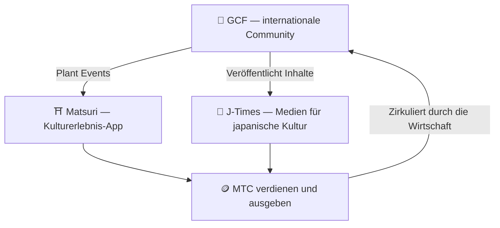

# 🏗️ Das MTC-Ökosystem — eine Wirtschaft, in der Erlebnis, Medien und Community zirkulieren

> **Drei „Orte", an denen die Mission Wirklichkeit wird.**
> Ein Ort zum Erleben, ein Ort zum Lernen, ein Ort zum Verbinden — jeder steht für sich, und MTC verknüpft sie zu einer einzigen zirkulierenden Wirtschaft.

MTC ist nicht nur ein Token. Drei Produkte und eine internationale Community arbeiten zusammen, um eine Wirtschaft zu errichten, die Kultur schützt.

:::tip 🤝 GCF — die internationale Community, die das Ökosystem antreibt
Ein Treffpunkt für Menschen, die japanische Kultur lieben, über Grenzen hinweg. GCF rekrutiert Guides, und diese GCF-Guides leiten Erlebnisse auf Matsuri. Sie veröffentlichen außerdem fesselnde Inhalte auf J-Times — die Aktivität der Community ist der Motor, der das gesamte Ökosystem bewegt.
:::

:::tip ⛩️ Matsuri — Kulturerlebnis-App
Beginnt mit Kulturerlebnis-Buchungen und expandiert in Etappen in **Pensionen**, **Läden** und **Crowdfunding**. Die Wirtschaft wächst aus Erlebnissen heraus in Kleidung, Essen, Unterkunft und gemeinschaftliche Investitionen.

**Schreinbesuch-Mining (seichi junrei — heilige Pilgerfahrt)** — verdiene MTC, indem du Schreine, Tempel und Kulturdenkmäler physisch besuchst. Reisende fließen ganz natürlich von berühmten Hotspots zu versteckten lokalen Schätzen, lösen Overtourism und beleben gleichzeitig Regionen wieder.
:::

:::tip 📰 J-Times — Medien für japanische Kultur
Eine Medienplattform, die den Reiz japanischer Kultur in die Welt trägt. Du verdienst MTC durch Engagement wie das Lesen und Teilen von Artikeln.
:::

---

## 🤝 Social Mining (verbinden und verdienen)

**An das GCF-Admin-Dashboard gekoppelt — Web-Version live (iOS-App geplant für April 2026).**

GCF-Mitglieder erhalten Zugang zu einer eigens entwickelten **GCF-Admin-Web**-Oberfläche.

| Funktion | Was du tun kannst |
| :--- | :--- |
| **🎪 Events erstellen** | Eigene Events und Touren planen und veröffentlichen |
| **📢 Inhalte verbreiten** | J-Times-Artikel und -Inhalte veröffentlichen und verbreiten |
| **📊 Referral-Tracking** | Aktivität und Einnahmen geworbener Nutzer:innen in Echtzeit verfolgen |

:::info Automatische Belohnungen
Jedes Mal, wenn ein:e geworbene:r Freund:in eine Zahlung tätigt, hinterlegt das System **automatisch** eine Belohnung (Revenue Share) in deiner Wallet.
:::

---

## 🎓 Creator Economy (erschaffen und verdienen)

Du konsumierst nicht nur Inhalte — auf Matsuri kann **jede:r** sie erschaffen und monetarisieren.

| Plattform | Was Creator tun können | Erlösmodell |
| :--- | :--- | :--- |
| **📚 Kurs-Marktplatz** | Video- / Textkurse zu japanischer Kultur, Sprache oder Handwerk veröffentlichen | Gebühr pro Einschreibung (Creator Revenue Share) |
| **🎙️ Podcast-Studio** | Audio-Serien produzieren, vertrieben über Spotify, Apple Podcasts und RSS | Episoden nur für Abonnent:innen |
| **🤝 Crowdfunding** | Solana-basierte Kampagnen für Kulturprojekte starten | On-Chain-Tracking der Beiträge |
| **🛍️ User-Shops** | Persönlichen Shop innerhalb der Plattform eröffnen (Handwerk, Waren) | Direktverkauf mit Produkt- / Bewertungssystem |

:::tip KI-gestützte Produktionshilfe
Event-Veranstalter:innen können den **integrierten KI-Assistenten (GPT-4 Turbo)** im Admin-Dashboard nutzen, um Eventbeschreibungen zu schreiben, in 5 Sprachen automatisch zu übersetzen und SEO-optimierte Metadaten zu erzeugen.
:::

---

  

*Community-Treffen in Golden Gai — Verbindung wird zu Mining-Kraft.*

---

:::note Nächste Seite
Um zu sehen, wie Mining tatsächlich funktioniert und wie du verdienst, geht es weiter zu **[Mining & Verdienen →](/docs/mining)**.
:::
