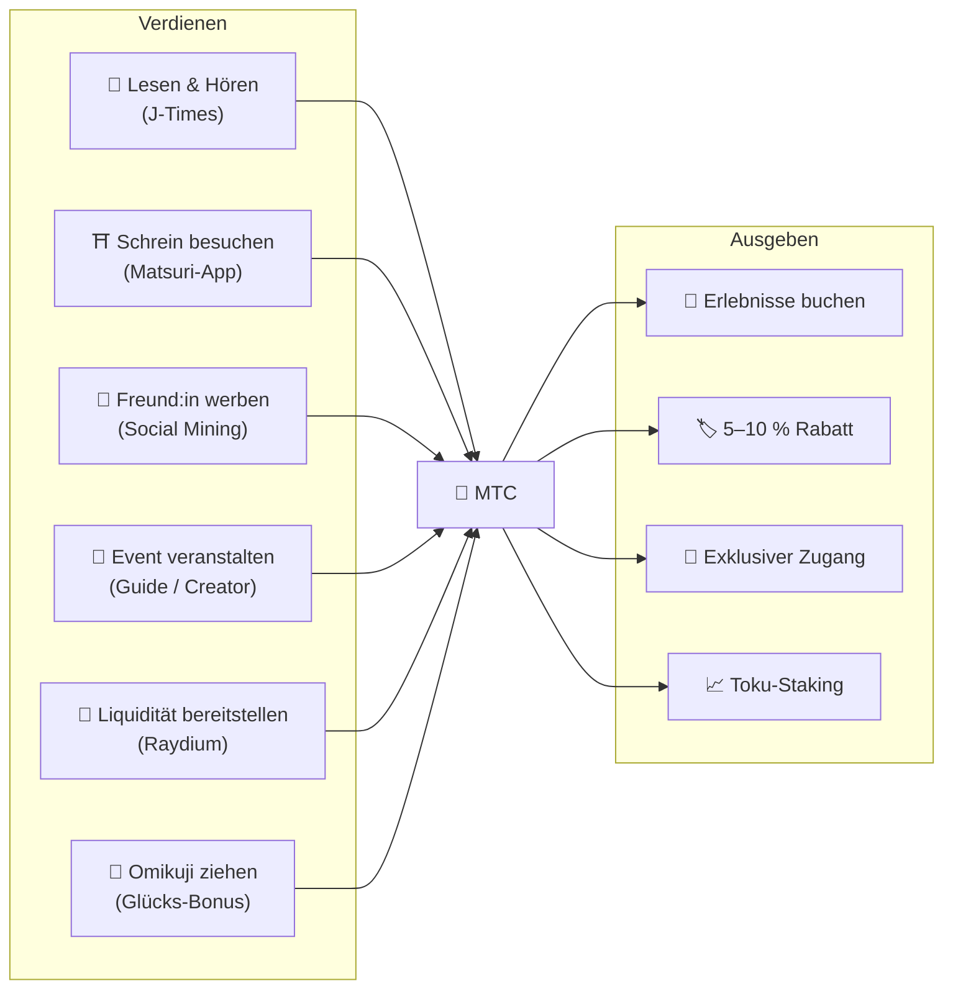
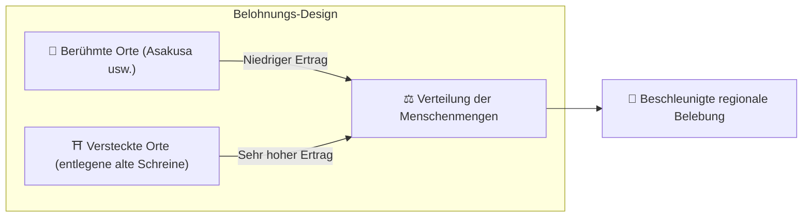
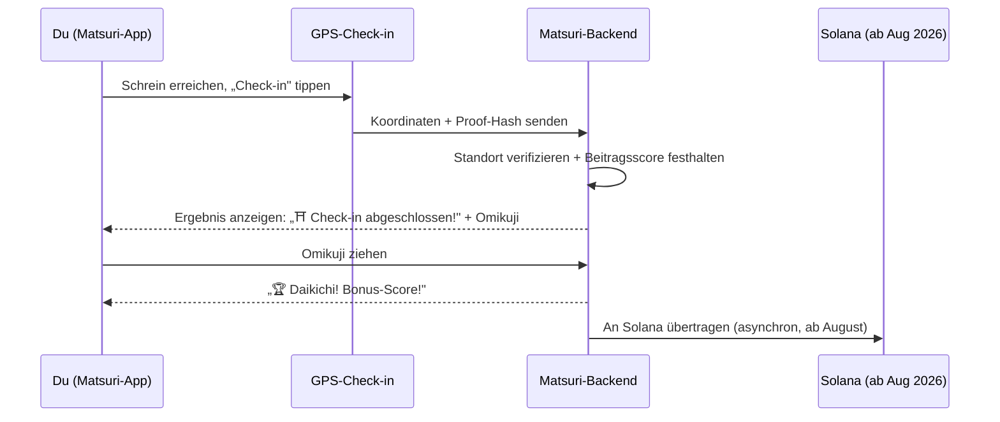
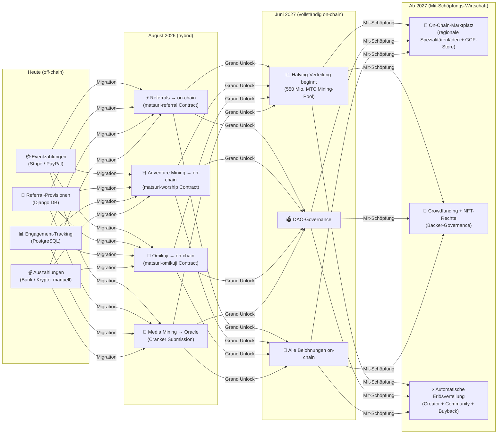

import useBaseUrl from '@docusaurus/useBaseUrl';

# ⛏️ Die fünf Säulen des Mining und wie man verdient

> **Jede Form der „Beteiligung" an Kultur wird zu Wert.**
> Lesen, Gehen, Verbinden, Erschaffen, Unterstützen — jede deiner Handlungen erzeugt MTC.

<small>*Was ist „Mining"? — Bei Bitcoin und ähnlichen Netzwerken erledigen Computer riesige Berechnungen und erhalten als Belohnung neue Coins; das nennt man „Mining". Bei MTC schürft nicht Rechenleistung, sondern **deine eigenen Handlungen** — einen Artikel lesen, einen Schrein besuchen, ein Event veranstalten. Statt nach Gold zu graben, erzeugt die Beteiligung an Kultur MTC. Genau das bedeutet „Mining" hier.*</small>

> Verdiene durch Handeln. Gib es für Erlebnisse aus. Halte es und sieh zu, wie es wächst.

MTC ist kein Spekulationstoken. Er zirkuliert in einer realen Wirtschaft, in der jede Handlung Wert erzeugt und ihn einfängt. Die Web-Anwendung und das Admin-Dashboard sind **bereits live**. Beitragsscores werden derzeit off-chain (in Django) erfasst und wandern ab August 2026 schrittweise on-chain.

:::tip Das große Bild
MTC verfügt über eine **vollständig geschlossene Wirtschaft**: Du verdienst durch reale Aktivität, gibst es für reale Erlebnisse aus, und der Wert wächst, während das Ökosystem wächst. Diese Seite erklärt die Mechanik im Detail.
:::

---

## Der MTC-Lebenszyklus

---

## Die fünf Mining-Säulen

### 1. 📖 Media Mining (lesen, hören, antworten — und verdienen)

**An die offizielle Medienplattform „J-Times" gekoppelt**

Wissen hebt die Qualität einer Reise dramatisch. Öffne die **J-Times-App** und genieße Inhalte zur japanischen Kultur. Neben Text und Audio belohnen wir auch **Verständnistests (Quizze)**. Jede abgeschlossene Aktion schreibt dir automatisch MTC gut.

| Aktion | Erfüllungsbedingung | Typische Belohnung |
| :--- | :--- | :---: |
| **📰 Artikel lesen** | Bis 75 % scrollen | 2–30 MTC |
| **🎧 Podcast hören** | Bis zum Ende abspielen | 2–30 MTC |
| **🎬 Video ansehen** | Detailseite nach dem Anschauen schließen | 2–30 MTC |
| **📤 Inhalte teilen** | Teilen-Menü öffnen | 2–30 MTC |
| **✅ Quiz beantworten** | Verständnistest bestehen | 2–30 MTC |

<small>*Die Höhe der Belohnung variiert je nach Inhaltstyp, Länge und gesamtem Angebotsgleichgewicht des Ökosystems.*</small>

:::tip Aus Wartezeiten wird Mining
Pendelzeiten und Pausen werden zu Zeit, die Belohnungen erzeugt.
:::

:::info Offline-Unterstützung
Kein Internet an einem entlegenen Schrein? Kein Problem. J-Times protokolliert Aktivitäten lokal und **synchronisiert automatisch, sobald du wieder online bist** (Offline-Warteschlange wird 7 Tage aufbewahrt). Verdientes MTC geht dir nicht verloren.
:::

**Was unter der Haube geschieht:**
1. Die J-Times-App erkennt deine Aktion (Lesen, Wiedergabeende, Teilen usw.)
2. Speichert sie auch offline lokal (7 Tage aufbewahrt)
3. Sendet sie zur Verifizierung an den Server, sobald das Netz zurückkehrt
4. Spiegelt sie als Beitragsscore in deinem Saldo wider
5. Ab August 2026: Verifizierte Scores werden über einen Oracle on-chain festgehalten und auf der Blockchain überprüfbar

---

### 2. ⛩️ Adventure Mining (gehen und verdienen)

**Projekt „Junrei" — Smart Contract fertig, Mainnet-Deployment August 2026**

Eine Funktion der nächsten Generation, die GPS und Token-Anreize nutzt, um den physischen „Strom der Menschen" zu lenken. Die Karte heiliger Stätten ist **bereits live** in der Matsuri-Web-App. Beitragsscores werden derzeit off-chain erfasst; die On-Chain-Verteilung der Belohnungen beginnt nach dem Smart-Contract-Deployment im August 2026.

>**Weil du mehr verdienst, gehst du aufs Land.**
> Diese einfache wirtschaftliche Logik löst Overtourism auf und beschleunigt regionale Belebung.

**So funktioniert der Check-in:**

  
  

    
<strong>Worship Mining</strong> — checke nahe einem Schrein ein, erkenne Energie mit der AR-Kamera und ziehe ein Omikuji für Bonus-MTC. Die Tier-Multiplikatoren reichen von 1,0× (Major) bis 10,0× (Hidden Gem).

  

**Grundprinzip — je weniger Besuchende, desto mehr verdienst du:**

| Stättentyp | Beispiele | Typische Belohnung (pro Check-in) |
| :--- | :--- | :---: |
| 🏙️ **Major** | Sensōji, Kiyomizudera, Fushimi Inari | 30–50 MTC |
| 🌆 **Regional Hub** | Ichinomiya jeder Präfektur, regionale Großschreine | 50–100 MTC |
| 🏞️ **Regional** | Historische regionale Schreine | 100–150 MTC |
| ⛰️ **Frontier** | Bergtempel, Inselheiligtümer | 150–200 MTC |

<small>*Die obigen Werte sind geschätzte Basisbelohnungen. Omikuji-Multiplikatoren können sie um ein Vielfaches erhöhen.*</small>

**Weitere Score-Faktoren:**
- **Omikuji-Multiplikator** — ein Zufallsbonus bei jedem Check-in. Daikichi vervielfacht die Belohnung um das Mehrfache
- **Besuchshäufigkeit** — regelmäßige Besuchende sammeln über die Zeit mehr an
- **Gesponserte Stätten** — Kommunen können bestimmte Stätten boosten

:::info Beitragsscore → MTC
Deine Aktivität sammelt sich als **Beitragsscore**. Bei jedem Halving-Epoch (ab Juni 2027) werden die Scores aus dem 550-Mio.-Mining-Pool in MTC umgewandelt. Je größer dein Beitrag zur Community, desto mehr MTC erhältst du. Genaue Boost-Koeffizienten werden in Etappen finalisiert und in Smart Contracts implementiert — das garantiert eine faire Verteilung, abgestimmt auf die tatsächliche Pool-Größe.
:::

---

### 3. 🤝 Social Mining (verbinden und verdienen)

Schon das Vorstellen von Freund:innen verdient dir MTC.

#### Referral-Belohnungen für reguläre Nutzer:innen

Es ist einfach. Wenn sich ein:e Freund:in über deinen Referral-Link anmeldet, erhältst du **300 MTC pro direkter Empfehlung.**

| Bedingung | Belohnung |
| :--- | :--- |
| Eine geworbene Person meldet sich an | **300 MTC** |

Das ist alles. Es gibt keine mehrstufige Belohnung.

#### GCF-Agent-Referral-Belohnungen

[GCF-Mitglieder](/docs/gcf) sind **offizielle Agent:innen**, die für die Expansion des Ökosystems zuständig sind, und haben eine tiefere Belohnungsstruktur.

| Ebene | Beziehung | Provision |
| :---: | :--- | :---: |
| **L1** | Direkte Empfehlung | **20 %** |
| **L2** | Deren Empfehlungen | **5 %** |
| **L3** | Dritte Stufe | **5 %** |
| **L4** | Vierte Stufe | **5 %** |

:::note Über das GCF-Agent-Programm
Diese mehrstufige Belohnung gilt nur für offizielle Agent:innen mit GCF-Mitgliedschaft (nur auf Einladung). Reguläre Nutzer:innen erhalten lediglich die direkte Empfehlung (300 MTC).
GCF-Agent-Provisionen werden auf Grundlage der **tatsächlichen wirtschaftlichen Aktivität** (Erlebniskäufe, Eventteilnahmen usw.) der Geworbenen berechnet. Bloßes Sammeln von Personen erzeugt keine Belohnungen.
:::

**So funktioniert der En-Mining-Score (für GCF-Agenten):**

Der Beitragsscore setzt sich aus zwei Komponenten zusammen:
- **Netzwerkbreite** (30 %) — wie viele Personen du gewonnen hast
- **Wirtschaftliche Aktivität** (70 %) — reale Käufe aus deinem Empfehlungsnetzwerk

Scores sammeln sich über die Zeit an und werden bei jedem Halving-Epoch in MTC umgewandelt.

#### GCF-Admin-Dashboard — Web-Version live

GCF-Mitglieder erhalten Zugang zum eigens entwickelten Admin-Dashboard.

| Funktion | Was du tun kannst |
| :--- | :--- |
| **🎪 Events erstellen** | Eigene Events und Touren planen und veröffentlichen |
| **📢 Inhalte verbreiten** | J-Times-Artikel und -Inhalte veröffentlichen und verbreiten |
| **📊 Referral-Tracking** | Aktivität und Einnahmen geworbener Nutzer:innen in Echtzeit verfolgen |

:::warning Derzeit off-chain → Migration on-chain im August 2026
Referral-Provisionen werden derzeit in Django (PostgreSQL) erfasst und per Banküberweisung oder Krypto ausgezahlt. Ab **August 2026** wandern sie in den **Matsuri Referral Smart Contract** auf Solana und ermöglichen on-chain überprüfbare Auszahlungen.
:::

  

*Community-Treffen in Golden Gai — Verbindung wird zu Mining-Kraft.*

---

### 4. 🎓 Creator- & Guide-Mining (erschaffen und verdienen)

Du konsumierst nicht nur Inhalte — auf Matsuri kann **jede:r** sie erschaffen und monetarisieren. Wenn du GCF-Mitglied, Guide oder Content-Creator bist, verdienst du so:

| Aktivität | Wie du verdienst |
| :--- | :--- |
| **🗺️ Tour leiten** | Guide-Provision (pro Event festgelegt) + Trinkgelder |
| **🎫 Eventtickets verkaufen** | Revenue Share über EventPurchase |
| **📚 Kurs veröffentlichen** | Gebühr pro Einschreibung (Creator Revenue Share) |
| **🎙️ Podcast-Episoden produzieren** | Abo-Einnahmen |
| **🤝 Crowdfunding-Kampagne starten** | Solana-basiertes On-Chain-Tracking der Beiträge |
| **🛍️ User-Shop eröffnen** | Direktverkauf von Handwerk und Waren |

**Trinkgeldsystem:** Nach einem Event können Gäste der/dem Guide ein Trinkgeld geben (Uber-Stil). Trinkgelder werden über Stripe abgewickelt und auf einer öffentlichen Bestenliste erfasst.

:::tip KI-gestützte Produktionshilfe
Event-Veranstalter:innen können den **integrierten KI-Assistenten (GPT-4 Turbo)** im Admin-Dashboard nutzen, um Eventbeschreibungen zu schreiben, in 5 Sprachen automatisch zu übersetzen und SEO-optimierte Metadaten zu erzeugen.
:::

---

### 5. 🏦 Liquidity Mining (einlegen und verdienen)

>**Werde zur Bank.**

Stelle MTC/SOL-Liquidität auf der Raydium-DEX bereit und unterstütze die frühe Handelsinfrastruktur des Ökosystems. Frühe Liquiditätsanbieter werden in einem speziellen Belohnungsprogramm als „Founding Partners" behandelt.

| Punkt | Detail |
| :--- | :--- |
| **Berechtigt** | Jede:r, die/der MTC und SOL hält |
| **Ziel-APY** | **20 %** (anfänglicher Liquiditätsanreiz, als Risikoprämie angesetzt) |
| **DEX** | Raydium (Solana) |
| **Zweck** | Frühphasen-Liquidität sichern und ein stabiles Handelsumfeld aufbauen |

---

## 🎲 Omikuji-Bonus

Jeder Adventure-Mining-Check-in bringt eine kostenlose Omikuji-Ziehung (Glückslos) mit sich. Es ist ein Smart Contract im Omikuji-Stil, der **kostenlos (nur Gas)** beim Abschluss des Check-ins läuft.

| Glückslos | Belohnungs-Multiplikator | Extra-Bonus |
| :--- | :---: | :--- |
| 🏆 **Daikichi (großer Segen)** | Basis × Top-Multiplikator | Goshuin-NFT |
| ✨ **Kichi (Segen)** | Basis × hoher Multiplikator | — |
| 🌸 **Shōkichi (kleiner Segen)** | Basis × kleiner Multiplikator | — |
| 🍃 **Suekichi (zukünftiger Segen)** | Basis × 1,0 | — |
| 💀 **Kyō (Fluch)** | Basis × 1,0 | — |

Wahrscheinlichkeiten und Multiplikatoren lassen sich über das GCF-Admin-Dashboard anpassen und werden vom Betreiber im Hinblick auf das ökosystemweite MTC-Angebotsgleichgewicht verwaltet. Ergebnisse werden durch ein **manipulationssicheres Commit-Reveal-Protokoll** auf Solana bestimmt — niemand kann das Ergebnis nach der Commit-Phase verändern.

<small>*Selbst bei einem Kyō-Ergebnis erhältst du dennoch die Basisbelohnung. Das Design belohnt den Akt des Check-ins selbst.*</small>

:::note Es ist kein Glücksspiel
Es wird kein Geld gesetzt. Es ist lediglich ein Zufallsbonus auf die **Tatsache des „Besucht-Habens"**. Das Sammeln bestimmter NFT-Sets kann das Recht freischalten, an besonderen Events teilzunehmen.
:::

---

## Wofür MTC da ist

| Anwendungsfall | Vorteil | Verfügbarkeit |
| :--- | :--- | :---: |
| **🎫 Erlebnisse buchen** | Touren, Events und kulturelle Aktivitäten in MTC bezahlen | ✅ Verfügbar |
| **🏷️ Rabatt** | 5–10 % Rabatt auf den Yen-Preis bei Zahlung in MTC | ✅ Verfügbar |
| **🔑 Exklusiver Zugang** | NFT-gegated Events, VIP-only Rituale, Privattouren | ✅ Verfügbar |
| **📈 Toku-Staking** | MTC sperren, um deinen Beitragsscore zu boosten (bis zu ~50 % Boost) | 🔜 August 2026 |
| **🗳️ DAO-Governance** | Über Treasury, Protokoll-Upgrades und Stättenakkreditierung abstimmen | 🔜 2027 |
| **🛍️ Partnerläden** | Bei Partnerläden und -restaurants bezahlen | 🔜 Wird ausgeweitet |

:::info MTC als Zahlungsmittel
Innerhalb der Matsuri-App ist MTC ein vollwertiges Zahlungsmittel neben Kreditkarten und Solana Pay. Kein Umrechnungsschritt — wähle an der Kasse „Mit MTC bezahlen", und dein Saldo wird sofort belastet.
:::

### Über die Umrechnung von MTC

:::warning Wichtig: Wir bieten keine MTC-Umrechnungs- / Tausch-Dienste an
Matsuri ist nicht als Krypto-Asset-Börse registriert, daher **tauschen wir MTC unter keinen Umständen direkt in Fiat-Währung (Yen, Dollar usw.).**

Wenn du MTC in andere Krypto-Assets oder Fiat umtauschen möchtest, kannst du das selbst tun:
1. Halte MTC in einer Solana-kompatiblen Wallet wie der **Phantom Wallet**
2. Tausche MTC → SOL auf **Raydium (DEX)**
3. Wandle SOL auf einer zentralisierten Börse (CEX) in Fiat um

Wir prüfen außerdem zukünftige CEX-Listings, mit denen einfachere Umrechnungswege verfügbar werden.
:::

---

## Beispiel: ein Tag in der MTC-Wirtschaft

> **Morgens:** Du liest im Zug drei J-Times-Artikel → verdienst MTC.
> **Mittags:** Du besuchst über die Matsuri-App einen regionalen Schrein → checkst ein, ziehst Kichi (×1,5) → verdienst noch mehr MTC.
> **Abends:** Du buchst mit deinem MTC eine Kulturtour in Shinjukus Golden Gai für 9.000 ¥ (~63 $) mit 10 % Rabatt (zahlst umgerechnet 8.100 ¥ / ~57 $).
> **Ergebnis:** Deine Neugier wurde zu einem realen Erlebnis, und Guide, Schrein und Community erhielten direkt Zahlung. Keine OTA hat 20 % einbehalten.

---

## Wirtschaftliche Tragfähigkeit

:::warning Was passiert, wenn der Mining-Pool aufgebraucht ist?
Der 550-Mio.-MTC-Halving-Pool ist so konzipiert, dass er **Jahrzehnte hält**. Da sich die Ausschüttungsrate alle zwei Jahre halbiert, erreicht er rein mathematisch nie 100 %, und Belohnungen fließen über einen sehr langen Horizont (siehe [Tokenomics](/docs/tokenomics)). Selbst wenn die Ausschüttungen extrem klein werden:

- **Transaktionsgebühren** belohnen Netzwerkteilnehmer:innen weiterhin aus on-chain-Aktivität
- **Das Buyback-Protokoll** (20–25 % der Geschäftseinnahmen) erzeugt steten Kaufdruck
- **Toku-Staking** sperrt zirkulierendes Angebot und mindert den Verkaufsdruck
- **Reale Geschäftseinnahmen** (Events, Mitgliedschaften, Kurse) tragen das Ökosystem unabhängig von Token-Ausschüttungen

MTC wird durch eine **reale Wirtschaft** gestützt — nicht nur durch Token-Emissionen.
:::

---

## On-Chain-Migrationsroadmap

Die Matsuri-Wirtschaft wandert in Etappen von off-chain (Django/PostgreSQL) zu on-chain (Solana Smart Contracts). Durch diese Migration werden alle Operationen **trustless, auditierbar und permissionless**.

| Phase | Zeitplan | Was on-chain geht |
| :--- | :--- | :--- |
| **Phase 1 (jetzt)** | Live | MTC-Token (SPL), Raydium LP, Solana-Pay-Verifizierung |
| **Phase 2 (August 2026)** | Smart-Contract-Mainnet-Deployment | Referral-Provisionen, Adventure-Mining-Belohnungen, Omikuji-Ziehungen, Oracle-basiertes Media Mining |
| **Phase 3 (Juni 2027)** | Grand Unlock | 550-Mio.-MTC-Halving-Verteilung, DAO-Governance, vollständige Dezentralisierung |
| **Phase 4 (ab 2027)** | Mit-Schöpfungs-Wirtschaft | On-Chain-Marktplatz (regionale Spezialitätenläden + GCF-Store), Crowdfunding mit NFT-Rechten, automatische Erlösverteilung an Creator + Community + Buyback |

:::warning Warum stellen wir nicht alles sofort on-chain?
**Wir aktivieren keine On-Chain-Funktion, die Nutzergelder bewegt, bevor das Sicherheitsaudit abgeschlossen ist.** Das ist unser Grundsatz.

Aktueller Stand:
- **Risiko für Nutzergelder: keines** — alle Belohnungen und Scores werden derzeit off-chain (Django) verwaltet. Keine Smart-Contract-Funktion, die Nutzergelder bewegt, ist live
- **Audit-Zeitplan: Q2–Q3 2026** — Contracts werden einer nach dem anderen ins Mainnet deployt, erst nach Bestehen professioneller Sicherheitsaudits
- **Audit-Abschluss ist Voraussetzung für das Deployment** — wir aktivieren niemals einen ungeprüften Smart Contract im Mainnet

In der Off-Chain-Phase verdiente Belohnungen sind dennoch nachprüfbar — jede Transaktion enthält eine `solana_signature` als Beleg der Abwicklung.
:::

---

**[▶ Nächste: Tokenomics](/docs/tokenomics)** | **[◀ Vorherige: Ökosystem](/docs/ecosystem)**
