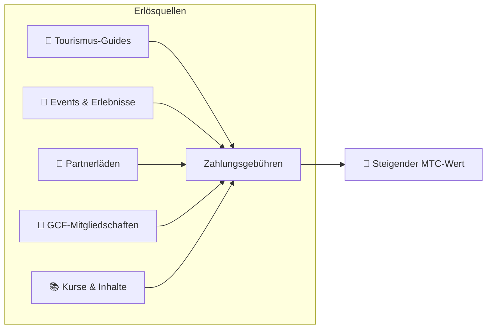

# 💰 Tokenomics — das wirtschaftliche Design von MTC

> **Vertrauen ist in den Code gemeißelt.**
> Das wirtschaftliche Design von MTC wird nicht durch das Versprechen einer Person garantiert, sondern durch Mathematik und Blockchain.


> **„Eine Wirtschaft, in der der Status quo nicht mit Gewalt verändert werden kann" — das ist die Tokenomics von MTC.**

Das wirtschaftliche Design von Matsuri Coin (MTC) ruht auf einer einzigen Überzeugung:
**eine Regel, an der selbst der Betreiber nicht rütteln kann, ist die stärkste Sicherheit, die ein:e Investor:in haben kann.**

Das Angebot ist dauerhaft fixiert. Zusätzliche Emissionen und das Einfrieren von Geldern sind unmöglich. Geschäftswachstum spiegelt sich auf Ebene einer Gleichung im Preis wider —
nicht als „Versprechen", sondern als **Tatsache**, eingeschrieben in die Blockchain.

Diese Seite legt alle wirtschaftlichen Mechanismen von MTC offen.

---

## Token-Spezifikation

Zur Sicherheit der Investor:innen haben wir auf Solana sowohl die „Mint-Authority" als auch die „Freeze-Authority" dauerhaft **abgegeben**.
Zusätzliche Emissionen sind dauerhaft unmöglich. Gelder können nicht eingefroren werden. Es ist ein **vollständig trustless-Design.**

| Punkt | Detail |
| :--- | :--- |
| **Tokenname** | Matsuri Coin |
| **Ticker** | MTC |
| **Chain** | Solana |
| **Mint-Adresse** | `DRENpzmRWM4TwECrCPCfS1k5VBPmanhQg9bcCWP8EZXF` [Solscan →](https://solscan.io/token/DRENpzmRWM4TwECrCPCfS1k5VBPmanhQg9bcCWP8EZXF) |
| **Gesamtangebot** | **900 Millionen** (900.000.000 MTC), fixiert |
| **Mint-Authority** | 🚫 Abgegeben ([on-chain überprüfbar](https://solscan.io/token/DRENpzmRWM4TwECrCPCfS1k5VBPmanhQg9bcCWP8EZXF)) |
| **Freeze-Authority** | 🚫 Abgegeben ([on-chain überprüfbar](https://solscan.io/token/DRENpzmRWM4TwECrCPCfS1k5VBPmanhQg9bcCWP8EZXF)) |
| **Lock-Verwaltung** | Streamflow Finance (verifiziert) |

:::info Warum das wichtig ist
Der Verzicht auf die Mint-Authority bedeutet: „Der Betreiber kann keine weiteren Token prägen und deinen Anteil verwässern." Der Verzicht auf die Freeze-Authority bedeutet: „Niemand kann deine Wallet einfrieren." Das ist das Fundament der Trustlessness.
:::

---

## Token-Verteilung

900 Mio. MTC werden wie folgt verteilt.

<div className="mtc-alloc">
  <div className="mtc-alloc__donut" role="img" aria-label="MTC-Verteilung: 61 % Mining-Pool, 39 % Ökosystem-Betrieb">
    <div className="mtc-alloc__hole">
      <span className="mtc-alloc__total">900M</span>
      <span className="mtc-alloc__unit">MTC</span>
    </div>
  </div>
  <div className="mtc-alloc__legend">
    <div className="mtc-alloc__row mtc-alloc__row--mining">
      <span className="mtc-alloc__dot"></span>
      <span className="mtc-alloc__pct">61 %</span>
      <span className="mtc-alloc__amount">⛏️ 550 Mio. MTC</span>
    </div>
    <div className="mtc-alloc__row mtc-alloc__row--ecosystem">
      <span className="mtc-alloc__dot"></span>
      <span className="mtc-alloc__pct">39 %</span>
      <span className="mtc-alloc__amount">🌐 350 Mio. MTC</span>
    </div>
  </div>
</div>

| Kategorie | Anteil | Menge | Zweck |
| :--- | :---: | :--- | :--- |
| **⛏️ Mining-Pool** | **61 %** | 550 Millionen | Belohnungspool für Beitragende. Freigeschaltet im Juni 2027, ausgeschüttet in einem Zwei-Jahres-Halving-Zyklus. Verteilt nach Beitragsscore |
| **🌐 Ökosystem-Betrieb** | **39 %** | 350 Millionen | Marketing, GCF-Verteilung, Betriebskosten, Liquiditätspool (LP)-Finanzierung, Entwicklungskosten, Werbung, Eventveranstaltung u. v. m. |

:::note Wie der Mining-Pool freigegeben wird
Die 550 Mio. MTC werden nicht auf einen Schlag freigegeben. Sie folgen einem Zwei-Jahres-Halving-Zeitplan und werden **schrittweise nach Beitragsscore verteilt.** Die Freigabe- und Verteilungsregeln werden ab Ende 2026 schrittweise als Smart Contracts implementiert und on-chain überprüfbar.
:::

:::note Über die Verteilung für den Ökosystem-Betrieb
Die 39 %-Betriebszuteilung ist ein Mehrzweckfonds, der zum Wachstum des Ökosystems benötigt wird. Konkrete Verwendungen sind Marketingaktivitäten, anfängliche Verteilung an GCF-Mitglieder, Bereitstellung von Liquidität für den Raydium-Pool, Vergütung des Entwicklungsteams, Werbung sowie Finanzierung von Kulturerlebnis-Events. Die Transparenz der Mittelverwendung wird nach dem Übergang zur DAO der Community-Governance unterliegen.
:::

---

## Erlösstruktur

Was den Wert von MTC stützt, sind **Einnahmen aus realer Geschäftstätigkeit.** Keine Spekulation — reale wirtschaftliche Aktivität trägt den Wert des Tokens.



| Erlösquelle | Detail |
| :--- | :--- |
| **🏯 Erlebnisse & Guides** | Zahlungsgebühren von Tourguides und Kulturerlebnis-Events |
| **🤝 GCF-Mitgliedschaft** | Mitgliedsbeiträge |
| **📚 Inhalte** | Kursgebühren, Medien-Abos |
| **🏪 Marktplatz** | Transaktionsgebühren von Partnerläden (schrittweise Erweiterung) |

:::tip Wachstum, getragen von realer Nachfrage
Je mehr Inbound-Besuchende ankommen, desto mehr Devisen fließen und desto größer wird das Ökosystem. Der Wert von MTC wird nicht durch Spekulation bestimmt, sondern durch **die Anzahl der Menschen, die die Kultur erleben.**
:::

---

## Aktuelle Geschäftstraktion

Die MTC-Wirtschaft ist noch jung, doch reale Aktivität hat bereits begonnen.

| Kennzahl | Status |
| :--- | :--- |
| **Veranstaltete Events** | 50+ (Testbetrieb) |
| **GCF Platinum-Mitglieder** | 20 von 50 Plätzen besetzt |
| **GCF Gold-Mitglieder** | Rekrutierung beginnt in Kürze |
| **Web-Plattform** | Live, gewinnt und bedient derzeit Test-Nutzer:innen |
| **iOS-Apps** | Entwicklung abgeschlossen, geplante Veröffentlichung April 2026 |

:::note Ehrliche Aussage
Wir haben noch keine Bilanz „großer Erfolge" vorzuweisen. 50 Events und Testbetrieb — das ist die Realität von heute. Aber das Produkt läuft, die Community existiert, und wir stehen in der Phase, in der wir von hier aus ernsthaft skalieren.
:::

---

## Buyback-Protokoll

Wir stecken den Gewinn nicht einfach in die eigene Tasche.
Ein fester Prozentsatz der Geschäftseinnahmen ist dafür reserviert, **MTC am Markt zurückzukaufen.**

| Erlösquelle | Zuteilung | Maßnahme |
| :--- | :---: | :--- |
| **Matsuri-HQ-Einnahmen** (Guides, Events) | **20 %** | **Buyback** vom Markt + Aufstockung des Liquiditätspools |
| **GCF-Mitgliedschaft** (Mitgliedsbeiträge) | **25 %** | **Buyback** vom Markt |

:::info Buyback-Status heute
Das Buyback-Protokoll **nimmt den Betrieb auf**, sobald die Geschäftseinnahmen anziehen. Anfangs läuft es off-chain (manuell); ab Ende 2026 wandert es schrittweise zur automatischen Ausführung per Smart Contract. Sobald on-chain, ist die vollständige Ausführungshistorie der Buybacks für jede Person auf der Blockchain nachprüfbar.
:::

Buybacks sind kein „irgendwann"-Versprechen. Sie sind eine als Protokoll programmierte Regel. Jedes Mal, wenn die Geschäftseinnahmen steigen, wird MTC automatisch vom Markt absorbiert — **strukturelle Sicherheit** für Investor:innen.

---

## Logik der Preisbildung

Der nach oben gerichtete Preismechanismus von MTC basiert nicht auf Hoffnung, sondern auf der **Gleichung eines AMM (Automated Market Maker).**

```
Preis = Liquidität (SOL) ÷ Angebot (MTC)
```

| Schritt | Was geschieht | Ergebnis |
| :---: | :--- | :--- |
| **①** | Geschäftseinnahmen (SOL) werden in den Pool eingespeist | **Zähler steigt** |
| **②** | Diese Mittel kaufen MTC am Markt zurück und verbrennen es | **Nenner sinkt** |
| **③** | Zähler ↑ × Nenner ↓ | **Bedingungen für steigende Knappheit sind erfüllt** |

:::info Beschreibung eines Mechanismus, keine Preisgarantie
Diese Gleichung beschreibt ein strukturelles Design: Wenn die Geschäftseinnahmen anhalten und Buybacks ausgeführt werden, bewegt sich das Angebot-Nachfrage-Verhältnis in Richtung Knappheit. Der tatsächliche Preis hängt von Marktnachfrage, äußeren Bedingungen, Liquidität und vielen weiteren Faktoren ab.
:::

---

## Halving-Zeitplan

Die **550 Millionen MTC (etwa 61 % des Gesamtangebots)**, die am 1. Juni 2027 freigeschaltet werden, werden nicht auf den Markt geworfen. Sie sind als **Belohnungspool für Beitragende** reserviert.

Wir haben einen **Zwei-Jahres-Halving-Zyklus** gewählt, schneller als Bitcoins Vier-Jahres-Zyklus.
Die Ausschüttungsrate halbiert sich alle zwei Jahre, sodass Belohnungen theoretisch über Jahrzehnte fließen.

| Zeitraum | Ausschüttungsanteil | Ausgeschüttete Menge | Kumulativ |
| :--- | :---: | :--- | :---: |
| **Periode 1** 2027–2029 | **50 %** | ~275 Mio. | 50 % |
| **Periode 2** 2029–2031 | **25 %** | ~137 Mio. | 75 % |
| **Periode 3** 2031–2033 | **12,5 %** | ~68 Mio. | 87,5 % |
| **Periode 4** 2033–2035 | **6,25 %** | ~34 Mio. | 93,75 % |
| **Ab Periode 5** | Halbiert sich weiter | Abnehmend | → asymptotisch gegen 100 % |

<small>*Mathematisch erreicht es niemals 100 %, und die Ausschüttungen nähern sich asymptotisch null. Gleiches Prinzip wie bei Bitcoin.*</small>

:::tip Je früher du beiträgst, desto mehr MTC erhältst du
Wegen des Halvings hat Periode 1 (2027–2029) die größte Ausschüttungsmenge, und jeder folgende Epoch schüttet pro Ereignis weniger aus. Mit anderen Worten: **Wer früh Beitragsscore aufbaut, erhält mehr MTC.**

Beispiele für Aktivitäten, die zum Beitragsscore zählen:
- Eventerstellung und Teilnahmebilanz
- Beliebte Guide-Kurse durchführen
- Hervorragende Guides werben und entwickeln
- Aufrufe und Shares von J-Times-Inhalten
- Check-ins bei Pilgerfahrten zu heiligen Stätten

Belohnungen werden nicht nach „Reihenfolge des Beitritts", sondern nach **„Quantität und Qualität des Beitrags"** bestimmt.
:::

---

:::note Nächste Seite
Jetzt, wo du das wirtschaftliche Design von MTC verstehst, schauen wir, **wie du als Partner einsteigen kannst.**
**[GCF-Mitgliedschaft →](/docs/gcf)**
:::
