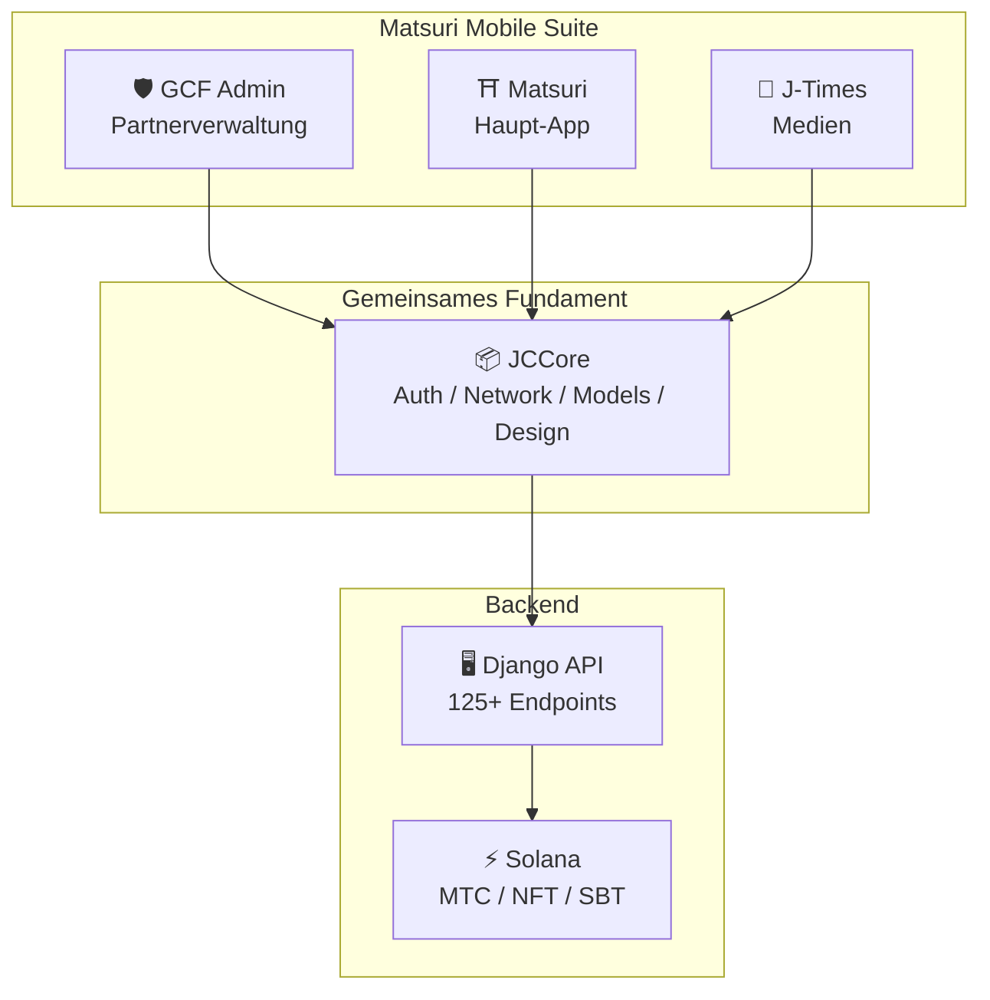
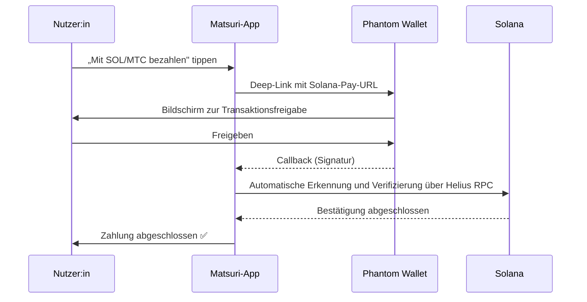
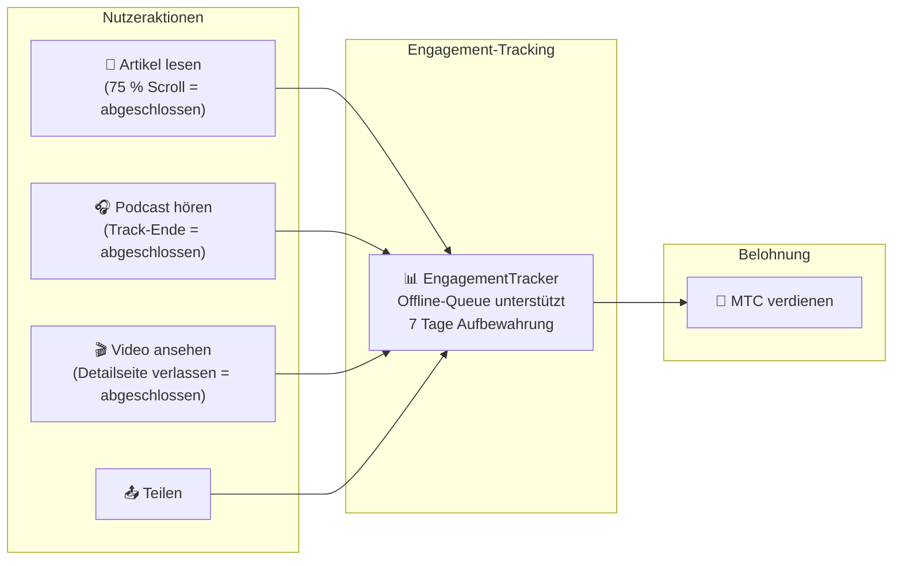
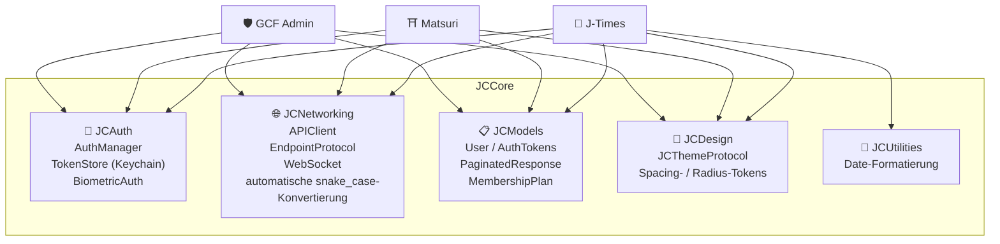
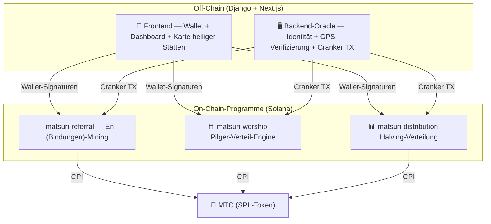
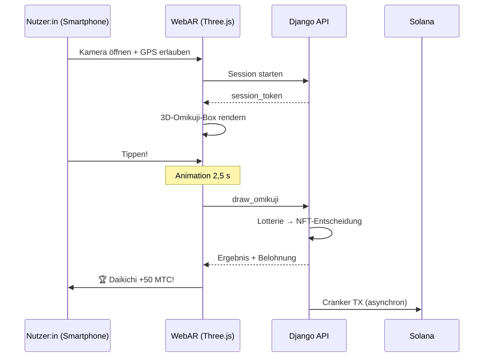

import useBaseUrl from '@docusaurus/useBaseUrl';

# 🔧 Produkt & Technologie — was läuft, beweist alles

> **Was läuft, beweist alles.**
> Unsere Mission besteht nicht nur aus Worten. Die Web-Plattform ist bereits live, und die iOS-Apps befinden sich in der finalen Phase.

Die Web-App und das Admin-Dashboard sind **in Produktion**. Drei native iOS-Apps wurden fertiggestellt und werden zwischen April und Mai 2026 veröffentlicht (Matsuri Anfang Mai). Die Smart Contracts auf Solana sind Open Source — wir sprechen nicht in Konzepten, sondern in **laufendem Code und einem Produkt kurz vor der Landung.**

---

## App-Überblick

| App | Zweck | Status | Unterstützte Sprachen |
| :--- | :--- | :---: | :--- |
| **GCF Admin** | Partnerverwaltung und Betriebs-Tooling | ✅ Veröffentlicht | 🇯🇵🇬🇧🇨🇳🇹🇭🇳🇴 |
| **Matsuri** | Haupt-Consumer-App | ✅ Veröffentlicht | 🇯🇵🇬🇧🇨🇳🇹🇭🇳🇴 |
| **J-Times** | Kulturmedien und Lernen | ✅ Veröffentlicht | 🇯🇵🇬🇧 |

---

## 1. 🛡️ GCF Admin — Partnerverwaltungs-App

:::info Status: im App Store veröffentlicht (v1.0)
Eine Verwaltungs-App für GCF-Mitglieder (Global Community Friends). Die gesamte Funktionalität der Web-Admin-Oberfläche, gebündelt auf dem Smartphone.
:::

  

  
  
  

### Was die App kann

| Kategorie | Funktionen |
| :--- | :--- |
| **📊 Dashboard** | KPI-Karten, Umsatzcharts, Schnellaktionen |
| **👥 Mitgliederverwaltung** | Liste, Details, Bearbeitung, Stufenverwaltung |
| **💰 Umsatzverwaltung** | Provisions-Tracking, MTC-Auszahlungsverwaltung, Auszahlungsmanagement |
| **📝 Inhalteverwaltung** | Erstellen, Bearbeiten und Veröffentlichen von Events, Artikeln, Podcasts und Videos |
| **🎫 Guide-Slots** | Guide-Slots verwalten und Umsätze verfolgen |
| **🖼️ NFT-Dashboard** | Founder's Collection, On-Chain-Verifizierung, NFT-Transfers |
| **⛩️ Verwaltung heiliger Stätten** | CRUD für Stätten, Beacon-Konfiguration |
| **🎲 AR-Mining-Konfiguration** | Omikuji-Wahrscheinlichkeitstabellen, Verwaltung der Belohnungsparameter |
| **📊 Analytics** | Fehlerberichte, Nutzungsanalyse |
| **🔗 Empfehlungen** | Erstellung individueller QR-Codes, Verwaltung des Empfehlungsprogramms |

### Technische Spezifikation

| Punkt | Detail |
| :--- | :--- |
| **Architektur** | Clean Architecture + MVVM + `@Observable` (iOS 17) |
| **Sprache / SDK** | Swift 6.0 / Xcode 16+ / iOS 17.0+ |
| **API-Integration** | 125+ Endpoints |
| **Tests** | 226 Tests / 45 Testklassen |
| **Lokalisierung** | 5 Sprachen (JP/EN/CN/TH/NO) / 957+ Übersetzungsschlüssel |
| **Swift Concurrency** | Strict-Concurrency-konform / null Build-Warnungen |

### QR-Code-Integration

GCF Admin kann Matsuri-gebrandete benutzerdefinierte QR-Codes erstellen. Vielseitige Anwendungsfälle — Eventeinladungen, Empfehlungslinks, Zahlungsanforderungen u. v. m.

---

## 2. ⛩️ Matsuri — Haupt-App

:::info Status: im App Store veröffentlicht (v3.0)
Die Haupt-App für reguläre Nutzer:innen. Eventbuchung, Zahlung, Web3-Wallet, AR-Mining — alles in einer einzigen App. **Jetzt live im App Store.**
:::

  

  
  
  

### Was die App kann

| Kategorie | Funktionen |
| :--- | :--- |
| **🎪 Eventbuchung** | Suche, Buchung, Stripe-Zahlung, Ticket-QR-Verwaltung |
| **💳 Vier Zahlungsmethoden** | Kreditkarte / gespeicherte Karte / MTC-Saldo / Krypto (SOL/MTC) |
| **👛 Web3-Wallet** | MTC-Saldo, Senden/Empfangen, Transaktionsverlauf |
| **🖼️ NFT-Galerie** | Liste gehaltener NFTs/SBTs, On-Chain-Verifizierung |
| **🗺️ Karte heiliger Stätten** | Kartenansicht von Schreinen und Tempeln, Check-ins |
| **🎲 AR-Mining** | WebAR-Omikuji-Erlebnis, MTC verdienen |
| **💬 Chat** | Messaging mit Kontextmenüs |
| **⭐ Wunschliste** | Lieblingsevents und -erlebnisse speichern |
| **🔍 Erweiterte Suche** | Sprachsuche unterstützt |
| **🤝 Empfehlungen** | Am Empfehlungsprogramm teilnehmen, Belohnungen verfolgen |
| **📊 GCF-Dashboard** | Schlanke Admin-Ansicht für GCF-Mitglieder |

### Phantom-Wallet-Integration — Krypto-Zahlungen ohne Eingabe

>**Kein Kopieren und Einfügen von Adressen erforderlich.** Phantom Wallet wird automatisch geöffnet, und die Zahlung wird mit einer einzigen Freigabe abgeschlossen. Die Transaktionssignatur wird automatisch über Helius RPC erkannt.

### Technische Spezifikation

| Punkt | Detail |
| :--- | :--- |
| **Architektur** | Clean Architecture + MVVM + Swift Concurrency |
| **Sprache / SDK** | Swift 6.0 / Xcode 16+ / iOS 17.0+ |
| **Zahlungen** | Stripe PaymentSheet + MTC Balance + Phantom (Solana Pay) |
| **API-Integration** | 72 Endpoints / 16 Kategorien |
| **Tests** | 230+ (Model, ViewModel, Network, Security, DeepLink, E2E) |
| **Lokalisierung** | 5 Sprachen (JP/EN/CN/TH/NO) / 406 Übersetzungsschlüssel |
| **ViewModels** | 25 (vollständig MVVM — null direkte API-Aufrufe aus Views) |
| **Authentifizierung** | Apple Sign In / Google Sign In (PKCE) |

---

## 3. 📰 J-Times — Kulturmedien-App

:::info Status: veröffentlicht — live im App Store
Eine Medienplattform, die die Tiefen japanischer Kultur vermittelt. Artikel lesen, Podcasts hören, Videos ansehen — jede Handlung verdient MTC.
:::

  

  
  

### Was die App kann

| Kategorie | Funktionen |
| :--- | :--- |
| **📖 Artikel** | Parallax-Hero, Initialen, Lesefortschrittsbalken, reichhaltige Inhalte (Markdown, Tabellen, Zitate) |
| **🎧 Podcasts** | Serien-Browsing, Wellenform-Player, Sleep-Timer, AirPlay, Steuerung über den Sperrbildschirm |
| **🎬 Video** | Adaptive Raster-/Listenansicht, Kurzvideos (TikTok-Stil, Doppeltipp) |
| **🔍 Suche** | Multi-Filter, Trending-Tags, Sprachsuche |
| **🧭 Discovery** | Feature-Karussell, Staff Picks, Weekly Top |
| **📚 Bibliothek** | Favoriten, Verlauf (nach Datum), Downloads, Playlists |
| **🎵 Audio-Player** | Mini-Player (per Wischen gesteuert), Vollplayer (Wellenform, Songtexte, Wiederholung) |
| **👤 Mitgliedschaft** | Funktionsvergleich über 3 Stufen (Free / Premium / Pro), Wiederherstellung von Käufen |

### Media Mining — Lesen, Hören und Ansehen als Mining

>**Auch offline festgehalten.** Lies einen Artikel an einem Bergschrein ohne Empfang — sobald das Netz zurückkehrt, wird das Engagement automatisch übermittelt und MTC gutgeschrieben.

### Designsystem — die „vier Säulen" der japanischen Ästhetik

J-Times verwendet ein eigenes Designsystem, das traditionelle japanische Ästhetik in eine moderne UI bringt.

| Säule | Konzept | UI-Anwendung |
| :--- | :--- | :--- |
| **墨 (sumi — Tusche)** | Warmes neutrales Grau | Hintergrund, Texthierarchie |
| **朱 (shu — Zinnober)** | Japanisches Rot (#C53030) | Akzentfarbe, wichtige Aktionen |
| **間 (ma — Raum)** | Negativraum auf einem 4-pt-Raster | Abstände, Atemraum |
| **紙 (kami — Papier)** | Subtile Textur, Glasmorphismus | Kartenoberflächen, Tiefe |

### Technische Spezifikation

| Punkt | Detail |
| :--- | :--- |
| **Architektur** | Clean Architecture + MVVM + Swift Concurrency |
| **Sprache / SDK** | Swift 6.0 / Xcode 16+ / iOS 17.0+ |
| **Externe Abhängigkeiten** | **Null** — ausschließlich Apple-First-Party-Frameworks |
| **API-Integration** | 40+ Endpoints |
| **Tests** | 371 Tests / 20 Dateien |
| **Lokalisierung** | 2 Sprachen (JP/EN) / 310+ Übersetzungsschlüssel |
| **Offline-Unterstützung** | ContentCache (50 MB) + ImageDiskCache (200 MB) + Download-Manager |
| **Authentifizierung** | Apple Sign In / Google Sign In (PKCE) |

---

## Gemeinsames Fundament: die JCCore-Bibliothek

Eine Swift-Package-Bibliothek, die von allen drei Apps gemeinsam genutzt wird.

| Modul | Rolle |
| :--- | :--- |
| **JCAuth** | Keychain-basierte Token-Verwaltung, biometrische Authentifizierung (Face ID / Touch ID) |
| **JCNetworking** | Typsicherer API-Client, WebSocket, automatische snake_case-JSON-Konvertierung |
| **JCModels** | App-übergreifende Datenmodelle (User, AuthTokens usw.) |
| **JCDesign** | Theme-Protokoll, Design-Tokens (Abstände, Eckenradius) |
| **JCUtilities** | Datum- und String-Utilities |

---

## Sicherheit und Privatsphäre

| Punkt | Implementierung |
| :--- | :--- |
| **Auth-Tokens** | Verschlüsselt im iOS-Keychain gespeichert (TokenStore) |
| **Biometrische Auth** | Zwei-Faktor über Face ID / Touch ID |
| **API-Kommunikation** | HTTPS + Zertifikat-Pinning |
| **Wallet-Private-Key** | Niemals in der App gespeichert — an Phantom Wallet delegiert |
| **AR-Mining** | Kamerabilder werden nicht an den Server gesendet (VisionProof) |
| **Offline-Daten** | SwiftData-Verschlüsselung + automatische Ablauffrist |
| **Swift Concurrency** | Actor-Isolation verhindert Race Conditions |

---

## Entwicklungsqualität

### Mobile Apps: **827+ automatisierte Tests** verteilt auf die drei Apps.

| App | Tests | Abgedeckter Bereich |
| :--- | :---: | :--- |
| **GCF Admin** | 226 | Model, ViewModel, Repository, API, Lokalisierung, Navigation |
| **Matsuri** | 230+ | Model, ViewModel, Network, Security, DeepLink, Regression, Performance, E2E |
| **J-Times** | 371 | Model, ViewModel, API, Repository, Navigation, Lokalisierung, Security, Performance |

### Smart Contracts: schrittweise wachsende Tests

Für die Rust-Programme auf Solana haben wir mit Unit-Tests für die Kernlogik (die Math-Module) begonnen und bauen die Testabdeckung in Vorbereitung auf das Sicherheitsaudit (Q2–Q3 2026) schrittweise aus.

---

## Smart Contracts — Open-Source-Design

>**Eine trustless Designphilosophie.**
> Belohnungsberechnung, Empfehlungsbäume, Halving-Zeitplan — jede Logik läuft **on-chain** und ist von jeder Person prüfbar.
> Quelle: [GitHub](https://github.com/Cootakahashi/matsuri-contracts)

---

### Beitragende

| Mitglied | Rolle |
| :--- | :--- |
| **Ko Takahashi** | Founder / Lead Developer — Architektur, Smart Contracts, Full-Stack-Entwicklung |

> 🌏**In Zukunft werden auch GCF-Mitglieder und eine weltweite Entwickler-Community an der Mitentwicklung mitwirken.**
> Als „Kulturinfrastruktur", die für Bestand gebaut ist, ruht das Matsuri Protocol auf Transparenz und Mit-Eigentümerschaft.

---

### Gesamtstruktur

Matsuri deployt **drei Anchor-Programme (Rust)** auf Solana, von denen jedes eine der Säulen des Ökosystems trägt.

---

### 1. 📣 En-Mining (縁 — Bindungen / Verbindung)

**Zweck:** Eine hybride Wachstums-Engine, die sowohl „Breite" (Empfehlungsnetzwerk) als auch „Tiefe" (wirtschaftliche Wirkung) belohnt. Kein einfaches Affiliate-Marketing, sondern ein vollständiges Mining-Protokoll, in dem reale wirtschaftliche Aktivität on-chain Wert erzeugt.

#### Score-Design

Der Beitragsscore basiert auf zwei gewichteten Komponenten:

| Komponente | Gewicht | Zweck |
| :--- | :---: | :--- |
| **Breite** (Anzahl der Empfehlungen) | 30 % | Netzwerkreichweite — wie viele Personen du gewonnen hast |
| **Tiefe** (Zahlungsvolumen) | 70 % | Wirtschaftliche Wirkung — reale Käufe, nicht bloße Anmeldungen |

Scores akkumulieren sich über die Zeit und werden bei jedem Halving-Epoch in MTC umgewandelt. Zusätzliche Boost-Mechanismen sind geplant:

| Boost | Beschreibung | Status |
| :--- | :--- | :---: |
| **Toku (徳 — Tugend)-Staking** | MTC sperren, um den Beitragsscore zu boosten (bis zu ~50 % Boost). Stufen und exakte Multiplikatoren werden gegen den Halving-Pool-Ausschüttungsplan kalibriert | ⬜ Koeffizienten ausstehend |
| **Saison-Ranking** | Top-Performer:innen jedes Epochs erhalten den Titel **Evangelist** (permanenter SBT) und einen Score-Boost. Exakte Sätze werden durch Governance bestimmt | ⬜ Koeffizienten ausstehend |

:::info Schrittweises Parameterdesign
Boost-Koeffizienten (Staking-Stufen, Ranking-Boni) sind absichtlich anpassbar. Sie werden auf Grundlage realer Ökosystem-Daten — Gesamtzahl aktiver Nutzer:innen, Halving-Pool-Ausschüttungsrate, Preisstabilitätsziele — finalisiert und in Smart Contracts gesperrt. Dieser Ansatz garantiert **faire Verteilung**, ohne fixe Renditen zu überversprechen.
:::

#### Anti-Sybil-Schutz (drei Schichten)

| Schicht | Mechanismus | Standort |
| :--- | :--- | :--- |
| **Identitäts-Gate** | X/Twitter OAuth + SMS | Off-Chain (Django) |
| **On-Chain-Gate** | Nur Profile mit `is_verified = true` erhalten Belohnungen | Smart Contract |
| **Tiefen-Gewichtung** | 70 % des Scores = reale Zahlungen → Bots verdienen nichts | Scoring-Engine |

---

### 2. ⛩️ Pilger-Verteil-Engine (Worship Routing Engine)

**Zweck:** Das weltweit erste **ReFi-Protokoll**, das Overtourism mit Token-Ökonomie löst. Besuche heilige Stätten, um MTC zu verdienen. Der entscheidende Twist: *Je weniger Besuchende eine Stätte hat, desto exponentiell mehr Belohnung erhältst du.*

:::tip Kerngedanke
„Inverses Uber-Surge-Pricing" — überfüllte Stätten werden bestraft, Frontier-Stätten geboostet. Touristen ziehen freiwillig zu weniger besuchten Orten **weil sie profitabler sind.**
:::

#### Belohnungs-Designprinzipien

Der Beitragsscore für jeden Besuch wird durch mehrere Faktoren bestimmt:

| Faktor | Prinzip | Wirkung |
| :--- | :--- | :--- |
| **Beliebtheit der Stätte** | Weniger Besuchende = höherer Score | Verteilung von Touristen weg von überfüllten Bereichen |
| **Zeitpunkt des Besuchs** | Frühere Besuchende an einem Tag verdienen mehr | Ermutigung zu Off-Peak-Besuchen |
| **Regionale Stufe** | Regionale und Frontier-Stätten rangieren am höchsten | Treibt regionale Belebung an |
| **Besuchshäufigkeit** | Regelmäßige Besuchende sammeln Bonus-Score | Belohnt fortlaufendes Engagement |
| **Omikuji-Glück** | Zufallsbonus pro Check-in | Spaßiges Gamification-Element |
| **Sponsored-Boost** | Kommunen können bestimmte Stätten boosten | B2B/B2G-Erlösmodell |

:::info Koeffizienten sind anpassbar
Die exakten Multiplikatoren für jeden Faktor (zum Beispiel, wie viel mehr eine regionale Stätte gegenüber einer großen Stätte verdient) werden auf Grundlage des **Halving-Pool-Zeitplans** und realer Nutzungsdaten justiert und schrittweise in Smart Contracts gesperrt. Die Designprinzipien stehen fest — die Koeffizienten entwickeln sich mit dem Ökosystem.
:::

---

### 3. 📊 Halving-Verteilung

**Zweck:** Inspiriert vom Halving-Zeitplan von Bitcoin halbiert sich die MTC-Verteilung pro Epoch automatisch. Mathematisch garantierte Knappheit.

| Instruction | Beschreibung |
| :--- | :--- |
| `initialize` | Verteilungspool initialisieren |
| `register_miner` | Eine:n Miner:in registrieren |
| `update_score` | Einen Score aktualisieren |
| `advance_epoch` | Epoch vorrücken (Halving ausführen) |
| `claim_distribution` | Verteilungs-Belohnung beanspruchen |

---

### 4. 🎴 AR-Mining — WebAR-Omikuji-Erlebnis

**Zweck:** Lass mit einem Smartphone-Browser ein AR-Omikuji im realen Raum erscheinen und schürfe darüber MTC. **Kein App-Download erforderlich.** Die weltweit erste WebAR × Blockchain-Infrastruktur, die Shintō-Spiritualität mit Spitzentechnologie verschmilzt.

#### Architektur

#### Konfiguration der Omikuji-Wahrscheinlichkeit (GCF Admin)

Basis Points (10000 = 100 %) mit 0,01 % Präzision. Anpassbar über den GCF-Admin-Bildschirm.

| Grad | Seltenheit | Bonus | NFT |
|------|-----------|---------|-----|
| 🏆 Daikichi | Selten | Maximaler Bonus | ✅ |
| ✨ Kichi | Ungewöhnlich | Hoher Bonus | Optional |
| 🌸 Shōkichi | Häufig | Kleiner Bonus | — |
| 🍃 Suekichi | Häufig | Teilnahmenachweis | — |
| 💀 Kyō | Ungewöhnlich | Teilnahmenachweis | — |

Wahrscheinlichkeiten und Belohnungs-Koeffizienten werden auf Grundlage von Ökosystemgröße und Halving-Ausschüttungen schrittweise finalisiert und in Smart Contracts implementiert.

#### ZK-Proof of Vision (5-Schichten-Sicherheit)

Eliminiert GPS-Spoofing und Replay-Angriffe in mehreren Schichten. **Zum Schutz der Privatsphäre werden Kamerabilder niemals an den Server gesendet.**

| Schicht | Was verifiziert wird | Gewichtung |
| :--- | :--- | :--- |
| Temporal | Sitzungszeit 5–120 s | /20 |
| Motion | Natürlichkeit der Gyro-Daten (Erkennung der Handzittern) | /20 |
| Light | Konsistenz von Umgebungslicht × Tageszeit | /20 |
| HMAC | proof_hash-Signaturverifizierung | /20 |
| Fingerprint | Geräte-Eindeutigkeit | /20 |
| **Gesamt** | **60/100 oder mehr = PASS** | |

#### Belohnungs-Design

Belohnungen werden als **Beitragsscore** auf Grundlage mehrerer Faktoren festgehalten, darunter Stättentyp, Omikuji-Ausgang und regionale Stufe. Konkrete Koeffizienten werden in Etappen, abgestimmt auf den Halving-Ausschüttungsplan und das Ökosystemwachstum, finalisiert und in Smart Contracts implementiert.

---

### Reine Math-Module (auditierbare Kernlogik)

Jedes Programm isoliert Score- und Belohnungsberechnung in einem **reinen, auditierbaren `math.rs`-Modul:**

- **Null Seiteneffekte** — kein I/O, keine Speicherallokation, keine externen Aufrufe
- **Dokumentierte Formeln** — LaTeX-Notation in rustdoc
- **Overflow-Analyse** — u128-Zwischenwerte mit bewiesenen Wertebereichen
- **Umfassende Tests** — Edge-Cases, Grenzwerte, Verhältnisprüfung
- **Anpassbare Koeffizienten** — Belohnungsparameter sind so ausgelegt, dass sie über Governance aktualisierbar sind, was eine schrittweise Kalibrierung im Wachstum des Ökosystems erlaubt

---

### Sicherheitsmodell

Diese Contracts sind **vollständig Open Source.** Sicherheit beruht auf mathematischen Garantien, nicht auf Intransparenz.

| Prinzip | Implementierung |
| :--- | :--- |
| **PDA-only Vaults** | Token-Vaults werden von PDAs (program-derived addresses) kontrolliert — kein menschlicher Schlüssel kann abheben |
| **Checked Arithmetic** | Alle Berechnungen verwenden `checked_*`-Arithmetik — Overflow ist unmöglich |
| **Trennung der Befugnisse** | Admin (Multisig) ≠ Cranker (begrenzte Aktionen) ≠ User (Self-Custody) |
| **Notfall-Pause** | Admin kann das Programm nur als Reaktion auf eine Sicherheitsbedrohung pausieren. Doch **keine Bewegung oder Beschlagnahme von Geldern ist möglich** — Pause ist ein „Schild zum Schützen", kein Mittel, um Regeln zu ändern |
| **Unveränderliche Tokenomics** | Halving-Rate, Gesamtpool und Epoch-Länge können nach der initialen Konfiguration nicht geändert werden |
| **Reine Math-Module** | Belohnungs-/Score-Logik liegt in einer separaten, testbaren Math-Bibliothek |
| **Vision Proof** | 5-schichtige Spoof-Erkennung, die niemals Kameradaten überträgt (datenschutzwahrend) |

---

**[▶ Nächste: Roadmap & Team](/docs/roadmap)** | **[◀ Vorherige: Tokenomics](/docs/tokenomics)**
