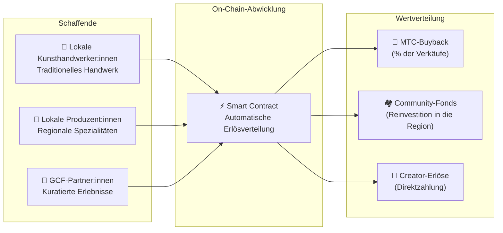

import useBaseUrl from '@docusaurus/useBaseUrl';

# 🗓️ Roadmap & Team

>**An alle, die bis hierher gelesen haben — die Vision, das wirtschaftliche Design und das technische Fundament stehen alle.**
> Wir sind kein kurzfristiges Spekulationsprojekt.
>**Die Hauptentwicklung der Plattform ist bereits abgeschlossen,** und wir treten in die Phase ein, in der wir sie skalieren.

---

## Strategische Meilensteine

### 🔥 Phase 1: Erwachen (erste Hälfte 2026 — jetzt)

**Thema: Fundament und Cashflow**

Die Web-Plattform ist live, und alle drei iOS-Apps (GCF Admin, J-Times, Matsuri) sind seit April 2026 im App Store. Wir konzentrieren uns auf Monetarisierung durch ein vom CEO geführtes Finanzsystem und auf die Sicherung früher Liquidität.

| Status | Meilenstein | Detail |
| :---: | :--- | :--- |
| ✅ | **Web-Plattform live** | Matsuri Web-App und GCF-Admin-Dashboard (Web) sind aktiv |
| ✅ | **Zahlungen und Wachstum** | MTC-Zahlungsfunktion und Referral-Airdrop-Funktion implementiert |
| ✅ | **Medienstart** | J-Times (Web & Podcast) Distributionsbasis aufgebaut |
| ✅ | **Genesis** | MTC-Token auf der Solana-Chain ausgegeben |
| ✅ | **Liquidität gesichert** | Initialer Liquiditätspool auf Raydium erstellt |
| ⬜ | **Anreize beginnen** | Start des Liquidity Mining mit Ziel-APY 20 % |
| ⬜ | **On-Chain-Zahlungen** | Solana-Pay-Verifizierung geht in Produktion |
| ⬜ | **VIP-Rekrutierung** | Auswahl der initialen 20 GCF-VIP-Mitglieder abgeschlossen |

### 🚀 Phase 2: Expansion (zweite Hälfte 2026)

**Thema: reale Vermögenswerte und Adventure Mining**

Wir nutzen die fertige Web-App voll aus und bauen physische Standorte sowie die „Pilger"-Funktion aus.

| Status | Meilenstein | Detail |
| :---: | :--- | :--- |
| ⬜ | **Neue Funktion live** | Adventure Mining (Pilgerfahrt) Implementierung und Veröffentlichung |
| ⬜ | **Auslandsexpansion** | Aufbau von Partnerstandorten in Asien (Thailand, Taiwan u. a.) & VIP-Events |
| ⬜ | **Vermögensverwaltung** | Aufbau eines Portfolios aus Immobilien, Aktien und Krypto |
| ⬜ | **Ziel** | Ökosystemweiter Vermögensumfang von **1 Mrd. ¥ (~6,5 Mio. $)** |

### 🌊 Phase 3: Zirkulation (ab 2027)

**Thema: Massenadoption, Mit-Schöpfungs-Wirtschaft, Dezentralisierung**

Öffnung für die Allgemeinheit, On-Chain-Marktplatz und voller Ökosystem-Betrieb.

| Status | Meilenstein | Detail |
| :---: | :--- | :--- |
| ⬜ | **Grand Opening** | Weltweite offizielle Veröffentlichung der Matsuri-App |
| ⬜ | **Great Unlock (1.6.2027)** | Founder-Lockup-Freigabe + Mining-Pool (550 Mio.) wird aktiv + Halving-Zyklus beginnt |
| ⬜ | **Mit-Schöpfungs-Marktplatz** | Regionale Spezialitätenläden + GCF-Partner-Shops — On-Chain-Zahlungen mit automatischem MTC-Buyback |
| ⬜ | **Crowdfunding (NFT-Rechte)** | Nutzer:innen finanzieren Kulturprojekte auf Solana. Backer erhalten NFTs, die Eigentum, Erlösteilung und Governance-Rechte repräsentieren |
| ⬜ | **On-Chain-Zahlungen** | Alle Marktplatz-Transaktionen werden per Smart Contract abgewickelt — ein fester Prozentsatz der Verkäufe wird automatisch in den MTC-Buyback-Pool geleitet |
| ⬜ | **Ziel** | Ökosystemweiter Vermögensumfang von **10 Mrd. ¥ (~65 Mio. $)** |
| ⬜ | **DAO-Übergang** | Schrittweise Übertragung der Entscheidungsbefugnis an die GCF-Community |

#### 🏪 Das Konzept des Mit-Schöpfungs-Marktplatzes

Der ultimative Ausdruck des „Kultur-OS" — ein dezentraler Marktplatz, auf dem **Kultur-Schaffende und Kulturliebende direkt handeln**, ohne ausbeuterische Zwischenhändler.

| Funktion | Beschreibung | Status |
| :--- | :--- | :---: |
| **🏺 Regionaler Spezialitätenladen** | Kunsthandwerker:innen und lokale Produzent:innen verkaufen weltweit direkt an Kund:innen. 5–10 % Rabatt bei Zahlung in MTC | ⬜ Konzept |
| **🎫 Crowdfunding + NFT-Rechte** | Finanziere Kulturprojekte (Schreinrestaurierung, Wiederbelebung von Festen, Handwerkswerkstätten). Erhalte NFTs, die deinen Beitrag belegen und Erlösteilung oder Governance-Rechte verleihen können | ⬜ Konzept |
| **⚡ On-Chain-Abwicklung** | Jede Marktplatz-Transaktion wird über einen Solana-Smart-Contract abgewickelt. Erlöse splitten sich automatisch: Creator-Zahlung + Community-Fonds + MTC-Buyback — keine manuelle Buchhaltung nötig | ⬜ Konzept |
| **🗳️ Backer-Governance** | NFT-Holder stimmen darüber ab, wie ihre finanzierten Projekte Ressourcen verteilen — keine bloße Spende, sondern echte Mit-Schöpfung | ⬜ Konzept |

:::info Warum das wichtig ist
Heute kaufen Touristen Souvenirs in Läden, die „Miete" an ihre Vermieter — die Plattform — zahlen. Morgen wird **eine ländliche Kunsthandwerkerin in Kyoto direkt an einen Fan in Kopenhagen verkaufen**, und ein Teil dieses Verkaufs wird automatisch die MTC-Wirtschaft stärken. Das ist das Schwungrad in seiner vollendeten Form.
:::

---

## 👤 Team

  

### Ko Takahashi — Founder / CEO & Lead Architect

| Punkt | Detail |
| :--- | :--- |
| **Rolle** | Gesamtleitung des Projekts. Plattformdesign, Smart Contracts, Full-Stack-Entwicklung |
| **Vision** | Verfechter des „Kultur-OS", das „Kultur exportiert und Wohlstand importiert" |
| **Haltung** | Schreibt den Code selbst und steht selbst auf dem Boden (Golden Gai) — ein Praktiker des „Skin in the Game" |

  

### Jon Anders Jensen — Director / GCF & Eventbetrieb

| Punkt | Detail |
| :--- | :--- |
| **Rolle** | GCF-Operations. Gestaltet den Betrieb von Events und Touren und arbeitet vor Ort |
| **Stärken** | Trägt durch eine internationale Perspektive und vertrauensvolle Beziehungen zu GCF-Mitgliedern den „menschlichen" Strom des Ökosystems |

  

### Ryunosuke Honda — Director / Botschafter regionaler Kultur

| Punkt | Detail |
| :--- | :--- |
| **Rolle** | Die Brücke zwischen regionalen Kulturen und Communitys in ganz Japan und dem Matsuri-Ökosystem |
| **Stärken** | Entdeckt regionale Kulturschätze und bringt sie auf die Matsuri-Plattform, um „Deep Japan"-Erlebnisse zu ermöglichen |

### 🌏 GCF-Community — Entwicklungsmitglieder rund um die Welt

Das Matsuri Protocol wird nicht allein vom Gründungsteam gebaut.
**GCF-Mitglieder weltweit** tragen durch Tests, Feedback, Übersetzungen und regionale Verbreitung zur Entwicklung des Protokolls bei.

| Bereich | Struktur |
| :--- | :--- |
| **💼 Globale Finanzen** | Partnerschaften mit privaten Investorennetzwerken in ganz Asien |
| **⚙️ Engineering** | Ein verteiltes Engineering-Team über Blockchain- und Mobile-App-Entwicklung |
| **🏮 Operations** | Starke Pipelines mit lokalen Communitys in Shinjuku Golden Gai und großen Reisezielen |
| **🌐 Community** | Eine multinationale GCF-Mitgliederbasis, darunter Japan, Norwegen, Thailand und Taiwan |

:::tip Kulturinfrastruktur, die wir gemeinsam bauen
Wenn du GCF beitrittst, wirst auch du zu:r Mit-Entwickler:in des Matsuri Protocol.
Code zu schreiben ist nicht die einzige Form des Beitrags. Heilige Stätten in deiner Region vorzustellen, Dokumentation zu übersetzen, Events zu planen —
all das ist Kraft, die dieses Protokoll in die Welt trägt.
:::

---

## 🏛️ Governance (DAO)

Das Matsuri Protocol wandert schrittweise von der Zentralisierung zu einer **DAO (dezentralen autonomen Organisation)**.
GCF-Mitglieder (Platinum / Gold) werden mit der Zeit **Stimmrechte** über folgende Schlüsselthemen halten.

| Abstimmungspunkt | Inhalt |
| :--- | :--- |
| **💰 Mittelallokation** | In welche neuen Geschäfte und welches Marketing Geschäftseinnahmen investiert werden |
| **⚙️ Protokoll-Updates** | Feinjustierung der App-Gebührensätze und der Mining-Belohnungssätze |
| **⛩️ Kulturelle Akkreditierung** | Welche Feste und Schreine als „offizielle Pilgerstätten" akkreditiert und finanziell gefördert werden |

:::info Werde Teil der Revolution
Wir bauen nicht nur eine App.
Wir bauen eine **grenzenlose Kulturwirtschaft.**
:::

---

**[◀ Vorherige: Produkt & Technologie](/docs/product-tech)** | **[⛩️ Zurück zum Whitepaper-Anfang](/docs/intro)**
