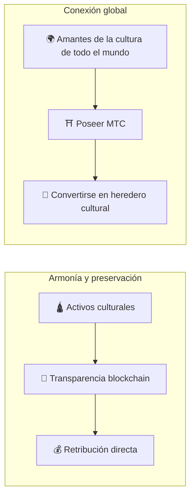

# ⛩️ Bienvenido a Matsuri Coin

> **Código para la armonía. Valor para la paz.**
> Un puente de «Wa» en un mundo dividido. MTC es la brújula que guía de la competencia a la co-creación.

**Matsuri Coin (MTC)** es un utility token descentralizado construido sobre la blockchain de Solana.
Está diseñado como un **«Culture OS»** — un sistema operativo cultural que conecta la herencia espiritual de Japón, el «Deep Japan», con la economía global.

No estamos construyendo un simple sistema de pagos.
Estamos construyendo un **puente entre Japón y el mundo** — un nuevo marco de co-creación donde los amantes de la cultura se unen más allá de las fronteras.

---

## 🎯 Nuestra misión

:::info Canalizando ¥10 billones en energía de mercado hacia el futuro de la cultura
El mercado de turismo receptivo de Japón crece hasta **¥10 billones** por año.
Pero bajo la superficie se esconde una **verdad incómoda**.
:::

### Los problemas de los que nadie habla

| Problema | Realidad |
| :--- | :--- |
| 💸 **Fuga de ingresos** | La mayor parte de los ingresos se filtra al extranjero en forma de comisiones para OTAs e intermediarios foráneos |
| 😤 **Agotamiento comunitario** | El sobreturismo llena las comunidades de multitudes, pero ningún ingreso regresa a los locales |
| 🚧 **El muro de la experiencia** | Los paquetes turísticos apenas rozan la superficie — los viajeros nunca conectan con el *verdadero* Japón |

> **«Los japoneses sufren, los viajeros solo ven una fachada, y la riqueza desaparece en las comisiones de las plataformas.»**

Usamos Web3 para desmantelar este sistema disfuncional.
Tu pago llega **directamente** a las comunidades locales y a la preservación cultural — con total transparencia, sin intermediarios.

---

## 🏗️ El modelo híbrido: Cultura × Tecnología

La mayoría de los proyectos cripto persiguen solo ganancias y tratan la cultura como un bien desechable.
MTC invierte la ecuación: construimos una **«economía que protege la cultura»** — la estructura híbrida que debió existir desde el principio.

| Pilar | Significado |
| :--- | :--- |
| **🛕 Armonía y preservación** | Los pagos turísticos fluyen a través de la blockchain directamente hacia la preservación cultural y el apoyo artesanal. Las comunidades (GCF) conservan la soberanía sobre su propio patrimonio |
| **🌍 Conexión global** | Infraestructura que permite a cualquier persona, en cualquier lugar, apoyar el espíritu «Wa» de Japón. Poseer MTC es participar en la historia viva de Japón |

---

## 💎 ¿Por qué usar MTC?

El ecosistema MTC ofrece tanto **enriquecimiento espiritual** como **ventajas económicas tangibles**.

### ✨ Valor experiencial

| Beneficio | Detalles |
| :--- | :--- |
| **🎌 Experiencias con significado** | Desbloquea el «Deep Japan» — zonas sagradas cerradas al público, ceremonias privadas en santuarios, eventos culturales exclusivos |
| **🌐 Un vínculo de por vida** | Mantén tu conexión con Japón a través de MTC mucho después de volver a casa |
| **⚖️ Comercio justo** | Los smart contracts eliminan intermediarios. Tu pago llega directamente a quienes lo merecen |

### 💰 Ventajas económicas

| Beneficio | Detalles |
| :--- | :--- |
| **🏷️ Tarifas preferenciales** | Paga con MTC y ahorra un **5–10 %** frente al precio en yenes. Ej.: tour de ¥30.000 → ~¥27.000 |
| **🔑 Acceso exclusivo** | NFT-tickets para lugares «solo con invitación» y eventos limitados — exclusivo para holders de MTC |
| **🛡️ Cobertura cambiaria** | Bloquea el valor de tu experiencia antes de viajar — sin preocuparte por fluctuaciones de tipo de cambio |

---

## ⚡ ¿Por qué Solana?

Para servir tanto a la «demanda turística real» como al «trading de alta frecuencia», solo había **una blockchain viable**.

| Comparación | Ethereum | Solana |
| :--- | :---: | :---: |
| **Comisiones** | ¥100–¥1.000+ | **~¥0,04** |
| **Finalidad** | 12 s – minutos | **0,4 segundos** |
| **Rendimiento** | ~15 TPS | **Miles de TPS** |

:::tip La prueba de la ofrenda
Un micropago tan pequeño como «echar ¥100 en la caja de ofrendas» exige comisiones **inferiores a ¥1**. Solo Solana pasa esta prueba.
:::

---

:::note Listos para arrancar
MTC pone fin a la era del turismo que solo *consume* cultura. Bienvenido al viaje hacia la **co-creación** — construyamos el futuro juntos.
:::

**[▶ Visión: ¿Por qué ahora?](/docs/vision)** ｜ **[▶ Únete al GCF (membresía VIP)](/docs/economy)**
