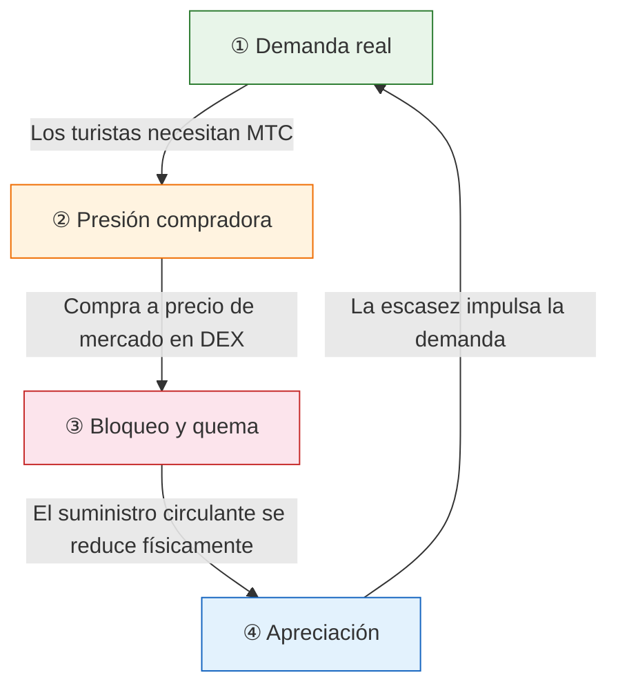
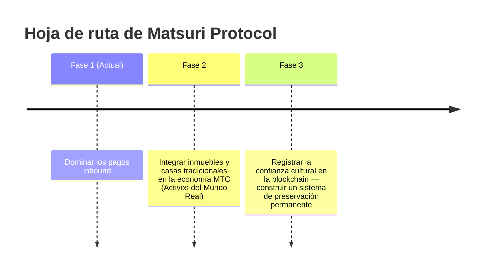

# 🎯 Visión: La estrategia «Inbound First»

> **De la dependencia de subsidios a la autonomía.**
> La era de mantener las economías locales con respiración artificial de fondos públicos ha terminado. Inyectamos capital extranjero directamente en la cultura.

La gran mayoría de los proyectos de revitalización regional fracasan — porque lo único que hacen es redistribuir presupuestos públicos cada vez más reducidos.

**Matsuri Protocol toma el camino diametralmente opuesto.**

---

## 1. Estrategia: La máquina de exportación cultural

Redefinimos los recursos turísticos de Japón — no como «bienes de consumo», sino como **instrumentos financieros exportables**.

| Problema | Realidad | Impacto |
| :--- | :--- | :--- |
| 💸 **Fuga de ingresos** | Comisiones a OTAs extranjeras (Booking.com, Expedia, etc.) | **15–20 % de los ingresos** se fugan — una pérdida a escala nacional |
| 🚧 **El muro invisible** | Barreras de idioma y pago | Los viajeros de alto patrimonio no acceden a experiencias «Deep Japan» |

:::tip El rol de MTC
MTC es la **única llave maestra** que detiene la fuga y derriba los muros.
:::

---

## 2. El volante económico

La firma de Matsuri Protocol: **el entusiasmo de los turistas impulsa matemáticamente la subida del precio de MTC.**
No es esperanza — es **mecánica de oferta y demanda**.

### ¿Por qué sube MTC?

Un **ciclo automático de 4 pasos** impulsa el precio:

| Paso | Nombre | Mecanismo |
| :---: | :--- | :--- |
| **①** | **Demanda real** | Los turistas necesitan MTC para reservar guías y comprar NFT-tickets |
| **②** | **Presión compradora** | MTC se compra a precio de mercado en DEX — impulsado por consumo, no especulación |
| **③** | **Bloqueo y quema** | Una parte de los MTC usados en pagos se bloquea o quema instantáneamente — el suministro se reduce físicamente |
| **④** | **Apreciación** | La demanda de compra crece, la oferta de venta decrece — el valor de escasez sube matemáticamente |

:::info La verdad fundamental
**«Cuanto más disfrutan los turistas de Japón, más crece el patrimonio de los holders de MTC.»**
Esta simple ecuación es el latido del proyecto.
:::

---

## 3. Destino final: El Culture OS

Nuestro objetivo final no es una app de pagos.
Es **convertir la cultura en sistema operativo**.

> Protegemos una **cultura milenaria** con **tecnología blockchain de vanguardia**.
> Este es el futuro que Matsuri Protocol está construyendo.

---

**[▶ Siguiente: ¿Cómo generamos ingresos reales? (La economía)](/docs/economy)**
