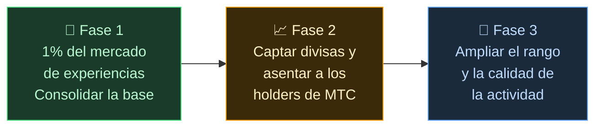

# 🌏 Problemas y soluciones — verdades incómodas, y esperanza

> **El propósito es bello. Pero la realidad lo obstaculiza.**

---

## La verdad incómoda que obstaculiza este propósito

:::info 10 billones de yenes de energía de mercado que no llegan a quienes sostienen la cultura
El mercado de turismo receptivo japonés crece hasta alcanzar los **10 billones de yenes (~60 000 M €)** anuales.
Sin embargo, la mayor parte de ese beneficio no llega al terreno.
:::

### El mercado que apunta MTC

No vamos a por los 10 billones enteros.

Lo que apuntamos primero es, dentro de ese mercado, el de las **experiencias culturales, guías y tours regionales**. Nuestra primera meta es el **1% de ese segmento (unos 100 000 M ¥, ~650 M €)**: empezar pequeño y fortalecernos.

| Fase | Estrategia | Objetivo |
| :--- | :--- | :--- |
| **Empezar pequeño** | Concentración en experiencias culturales y tours guiados. Ganar historial y expandirse por boca a boca | Consolidar la base de ingresos |
| **Fortalecerse** | Captar divisas (ingresos del turismo receptivo) y demostrar el mecanismo de reparto hacia los holders de MTC | Construir confianza en la economía MTC |
| **Elevar la calidad** | Una vez alcanzada cierta escala, priorizar la calidad de la experiencia, el rango de actividad y la profundidad de la comunidad por encima de la expansión | Una economía cultural sostenible |

> **No perseguimos cantidad; crecemos por la calidad de los participantes y la profundidad de la experiencia.** Esa es la estrategia de expansión de MTC.

Las plataformas Web2 llevaron al mundo la maravilla del viaje. Les agradecemos lo logrado.
Pero la estructura centralizada trajo efectos secundarios inevitables.

Los algoritmos deciden «qué se muestra» y los negocios son obligados a competir por posiciones en el ranking. Una sola reseña puede cambiar drásticamente las ventas y las comisiones varían al arbitrio de la plataforma —— el terreno vive siempre con el miedo de «ser elegido o desaparecer».

Esta estructura genera fragmentación entre negocios y miedo a reglas invisibles.
El local de al lado se convierte en rival; acaparar resulta más racional que cooperar. Y los viajeros solo reciben opciones uniformadas por «número de estrellas» o «ranking», mientras las experiencias realmente valiosas quedan enterradas.

:::danger Tres problemas que enfrenta el terreno
💸 **Fuga de ingresos** — La mayor parte se escapa al extranjero como comisiones a OTAs e intermediarios

😤 **Agotamiento local** — Solo queda el peso del sobreturismo; los ingresos esenciales no se devuelven a las comunidades

🚧 **El muro de la experiencia** — Solo aparecen tours uniformes elegidos por algoritmos; no se encuentra el «Japón auténtico»
:::

> **Los japoneses sufren, los viajeros no conocen la realidad y la riqueza se esfuma hacia las plataformas.**

---

## Entonces, ¿cómo cambiarlo?

Hoy, por fin, están reunidas las tecnologías capaces de cambiar esta estructura desde la raíz.

:::tip Smart contracts — Reglas comunes que no pueden reescribirse
Comisiones y condiciones quedan grabadas en código; nadie puede cambiarlas a su antojo. Reglas iguales para todos, ejecutadas automáticamente.
:::

:::tip Blockchain — Transparencia total, todo a la vista
Cada transacción se registra en un libro contable público que cualquiera puede verificar. Se acabó la era en que los datos se encerraban dentro de las empresas.
:::

:::tip Solana — Liquidación en 0,4 s, comisiones de 0,04 ¥
Ya no hacen falta múltiples capas de intermediarios ni días de espera para liquidar. Las personas se conectan directamente.
:::

:::tip IA — Elimina el propio coste de gestión
El salto explosivo de productividad convierte en cosa del pasado la estructura de costes necesaria para mantener grandes plataformas.
:::

Ya no hace falta depender de intermediarios: hoy las personas pueden conectarse directamente.

Con esta tecnología liberamos la economía receptiva del monopolio y devolvemos los ingresos al terreno de Japón y de cada país.
Y no solo para Japón: construimos **un sistema para proteger y conectar las culturas del mundo**.

---

**[◀ Anterior: Visión y propósito](/docs/vision)**｜**[▶ Siguiente: El futuro que dibuja MTC](/docs/future)**
