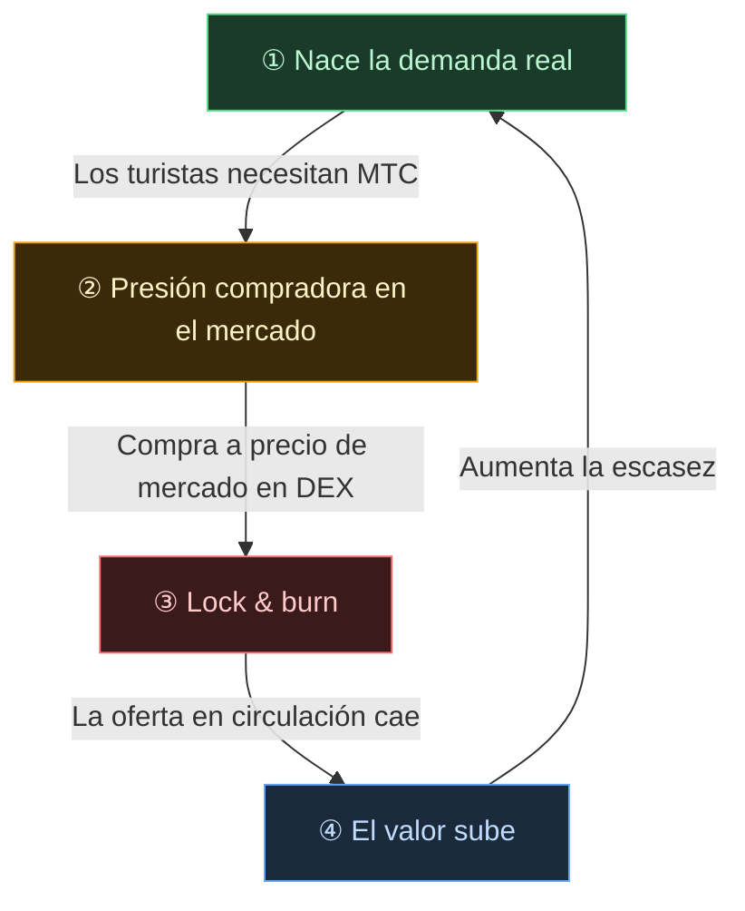

# 🔄 Flywheel económico — el ciclo de crecimiento y el OS cultural

> **Cuanto más disfrutan los turistas de Japón, más aumenta la demanda del ecosistema.**
> Este mecanismo de oferta y demanda es el corazón del proyecto.

---

## Mecanismo de oferta y demanda de MTC

El diseño del Matsuri Protocol hace que **el aumento de la demanda real genere presión compradora y, combinado con la reducción de la oferta, se creen las condiciones para la revalorización**.
No es un argumento emocional, sino un **mecanismo de oferta y demanda**.

El siguiente **ciclo de cuatro pasos** sostiene este mecanismo.

| Paso | Nombre | Mecanismo |
| :---: | :--- | :--- |
| **①** | **Nace la demanda real** | Los turistas necesitan MTC para reservar guías o comprar NFT-ticket |
| **②** | **Presión compradora en el mercado** | MTC se compra a precio de mercado en un DEX. Una compra fuerte basada en consumo, no en especulación |
| **③** | **Lock & burn** | Parte del MTC usado en pagos queda bloqueado o quemado de inmediato por un smart contract. La oferta circulante se reduce físicamente |
| **④** | **Aumenta la escasez** | La demanda compradora sube y la oferta vendedora baja. El cambio en el equilibrio aumenta la escasez unitaria |

---

---

:::note La visión que sostiene esta fórmula
La imagen completa del «OS cultural» que hay detrás del flywheel se explica en la próxima página, [El futuro que dibuja MTC](/docs/future).
:::

---

**[◀ Anterior: Problemas y soluciones](/docs/challenges)**｜**[▶ Siguiente: El futuro que dibuja MTC](/docs/future)**
