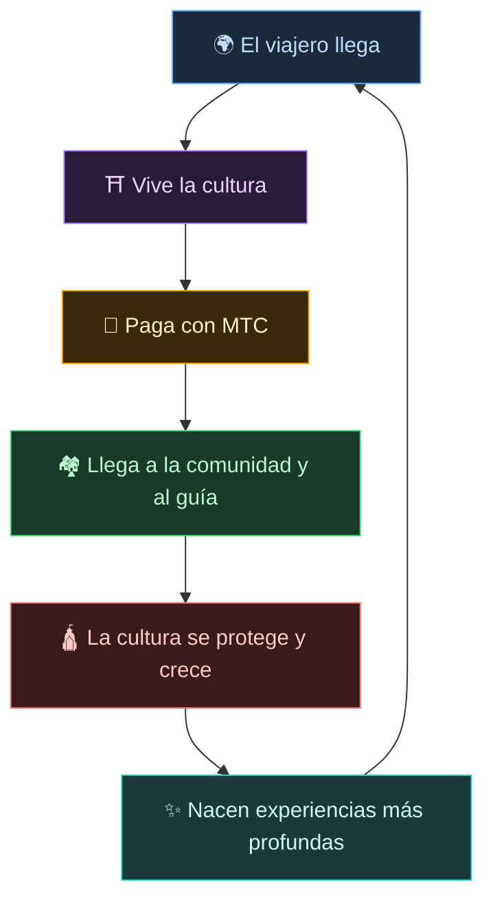
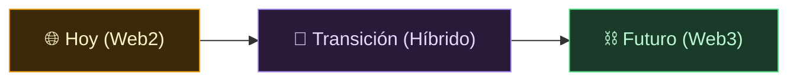
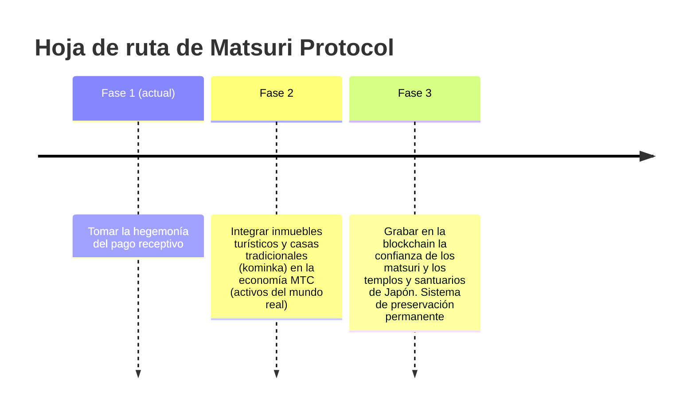

# 🌀 El futuro que dibuja MTC — una economía donde todo «vínculo» circula

> **Quien vive la experiencia, quien la transmite, quien la protege. Todas las intenciones circulan como economía y entregan la cultura a la siguiente generación.**

---

## El ciclo que queremos realizar

MTC no es un token para especular.

El viajero toca la cultura japonesa y se emociona.
El guía transmite esa emoción y es recompensado.
La comunidad prospera y puede seguir protegiendo su cultura.
Y esa cultura, a su vez, atrae a nuevos viajeros.

Este ciclo es la razón misma por la que MTC existe.

---

## Una economía donde los tres actores son recompensados

En el turismo tradicional, el viajero paga, la plataforma se lleva el beneficio y nada queda en el terreno.
En la economía MTC, todos los que participan son recompensados.

| Quién participa | Qué ocurre | Cómo se le recompensa |
| :--- | :--- | :--- |
| **🌍 Quien vive la experiencia** | Toca la cultura japonesa y paga con MTC | Accede a experiencias auténticas más baratas que en yenes. Tras el regreso, sigue conectado a través de MTC |
| **⛩️ Quien transmite** | Organiza eventos como guía y publica contenido en J-Times | Recompensa directa sin intermediarios. Cuanto más activo, más MTC recibe |
| **🏘️ Quien protege** | Mantiene y transmite la cultura como comunidad local | Los ingresos llegan directamente. Prosperidad sostenible, sin sobreturismo |

---

## Cuanto más se expande la economía, más fuerte se vuelve la cultura

La economía MTC empieza por la reserva de experiencias y, con el tiempo, se extiende a todas las facetas de la vida.

- **Experiencia** — Experiencias culturales auténticas, minado de peregrinación
- **Vida cotidiana** — Casas de huéspedes, tiendas, gastronomía, moda
- **Proyectos de co-creación** — Inversión para proteger la cultura mediante crowdfunding
- **Entendimiento intercultural** — Espacios de encuentro y comprensión mutua más allá de las fronteras

Cuanto más se amplía la economía, más grueso se vuelve el ciclo a través de MTC y mayor es la fuerza que sostiene la cultura.
Esto no es un simple modelo de negocio, sino un **soporte vital para la cultura**.

---

## De Web2 a Web3 — sin fricciones, por fases

No pedimos que todo pase a la blockchain de un día para otro.

Hoy, la mayoría aún no está familiarizada con Web3. Por eso hemos diseñado **un camino que arranca con lo ya familiar y permite descubrir los beneficios de Web3 poco a poco**.

| Fase | Experiencia del usuario | Lo que hay detrás |
| :--- | :--- | :--- |
| **Hoy** | Reservas y pagos como en cualquier web. Tarjeta de crédito válida | Django + Stripe. No hace falta wallet para empezar |
| **Transición** | Ganas y usas MTC en la app. Conexión a wallet con un toque | Las puntuaciones off-chain migran progresivamente on-chain |
| **Futuro** | Todas las transacciones y derechos se registran transparentemente en la blockchain. Tu aportación queda demostrada para siempre | Economía completamente automatizada e inalterable mediante smart contracts |

:::tip Web3 no es difícil
No necesitas configurar wallet ni gestionar frases semilla desde el principio. Mientras usas el servicio, tocas de forma natural el mundo Web3 —— **cuando te des cuenta, ya serás habitante de Web3.** Esa es la experiencia que diseñamos.
:::

---

## Una economía movida por empatía, no por poder

Este espacio económico funciona gracias a los smart contracts.
Las reglas no pueden cambiarse unilateralmente por el poder o la conveniencia de nadie —— **un sistema donde el statu quo no puede alterarse por la fuerza**.

Sobre esa base, seguimos creando nuevo valor aprendiendo de la sabiduría antigua. 温故知新 y, más allá, innovación.

> **Un mundo donde, incluso sin yenes ni dólares, la vida se sostiene alrededor de la cultura.**
>
> En lugar de confiar el valor de la moneda a otros, tú generas y usas valor a través de tu propio «vínculo».
> Esa es la libertad que MTC quiere ofrecer.

---

## 🏁 El destino final: el «OS cultural»

Nuestro objetivo último no es una simple app de pagos.
**Queremos convertir la propia cultura en un OS (base)**.

> Protegemos la sabiduría ancestral con la blockchain más avanzada.
> Este es el futuro que dibuja Matsuri Protocol.

---

:::note Aquí termina la parte narrativa
Quien haya llegado hasta aquí ya entiende por qué existe MTC.
Lo siguiente es la **[parte práctica]**: veamos qué se puede hacer realmente con MTC.
:::

**[◀ Anterior: Flywheel económico](/docs/flywheel)**｜**[▶ Siguiente: Ecosistema](/docs/ecosystem)**
