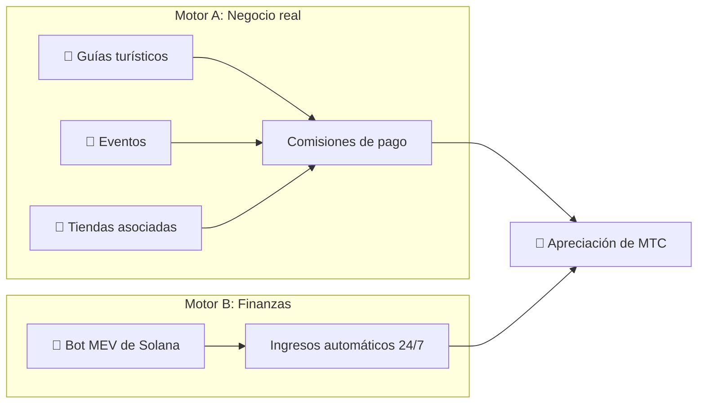

# 💰 Sistema económico

> La economía de Matsuri Coin (MTC) es simple pero blindada.
> **Dos motores de ingresos — negocio real y algoritmos financieros — generan beneficios y los redistribuyen programáticamente a los holders.**


---

## 1. Doble motor de ingresos



| Motor | Fuente de ingresos | Funcionamiento |
| :--- | :--- | :--- |
| **🏯 Motor A (Negocio)** | Comisiones de pago de guías, eventos y tiendas asociadas | Más turistas → más capital extranjero → expansión del ecosistema |
| **🤖 Motor B (Finanzas)** | Trading automatizado con el bot MEV de Solana | Programa de trading de alta frecuencia dirigido por el CEO que extrae beneficios de las ineficiencias del mercado on-chain 24/7/365 |

---

## 2. Protocolo de recompra (mecanismo de apreciación)

No nos embolsamos los beneficios.
Los smart contracts canalizan los ingresos directamente hacia la **apreciación de MTC**.

| Fuente de ingresos | Asignación | Acción |
| :--- | :---: | :--- |
| **Ventas Matsuri HQ** (Guías y eventos) | **20 %** | **Recompra** en el mercado + inyección en pool de liquidez |
| **Membresía GCF** (Cuotas) | **25 %** | **Recompra** en el mercado |

:::info Lógica fundamental
**«Crecimiento del negocio = MTC se compra constantemente en el mercado abierto.»**
Esta ecuación respalda el valor de tu activo.
:::

---

## 3. Lógica de determinación de precios

Nuestro mecanismo de precios se basa en la **fórmula AMM (Automated Market Maker)** — no en ilusiones.

```
Precio = Liquidez (SOL) ÷ Oferta (MTC)
```

| Paso | Qué ocurre | Resultado |
| :---: | :--- | :--- |
| **①** | Los ingresos del negocio (SOL) se inyectan en el pool | **Numerador ↑** |
| **②** | MTC se recompra del mercado y se quema | **Denominador ↓** |
| **③** | Numerador ↑ × Denominador ↓ | **El precio sube matemáticamente** |

---

## 4. GCF (Global Community Friends)

GCF es la organización asociada **solo por invitación** (DAO) que escala el ecosistema Matsuri.
No es un club — es un **colectivo empresarial** que comparte beneficios.


### Niveles de membresía

| Nivel | Rol | Privilegios |
| :---: | :--- | :--- |
| **👑 Platinum** | Propietario / VIP | Derechos máximos. Primeras **50 plazas** únicamente. Poder de decisión + dividendos sustanciales |
| **🥇 Gold** | Embajador | El equipo operativo. Derecho a ganar **sin techo** a través de la actividad. Tasas de mining y referidos maximizadas |

### Beneficio ①: Real-Work Mining (derechos de minado)

Los **550 millones de MTC (~61 % del suministro total)** que se desbloquean el 1 de junio de 2027 se reservan como **pool de recompensas para contribuidores** — no se vuelcan al mercado.

:::tip Totalmente basado en rendimiento
Los MTC se distribuyen automáticamente del pool según tu contribución (ventas, visitantes, sesiones de guía).
:::

**Calendario de halving (ciclo de 2 años):**

| Periodo | Emisión | Volumen |
| :--- | :---: | :--- |
| **Época 1** 2027 – 2029 | **50 %** | ~275 M tokens |
| **Época 2** 2029 – 2031 | **25 %** | ~137 M tokens |
| **Época 3** 2031 – 2033 | **12,5 %** | ~68 M tokens |

:::caution Ventana del primer llegado
Más rápido que el halving de Bitcoin (4 años) — usamos un **ciclo de 2 años**.
Quienes se comprometan al máximo **los primeros dos años desde 2027** aseguran una ventaja de primer llegado aplastante.
:::

### Beneficio ②: Comisión de referidos premium

Recomienda productos de alto valor (membresías, circuitos VIP, inmuebles asociados) y gana **comisiones premium (USDC + MTC)** — muy por encima de los programas de afiliados estándar. Pagadas **al instante** vía smart contract.

---

## 5. Especificaciones del token

Hemos **revocado** permanentemente las autoridades de Mint y Freeze en Solana.
Nunca más se emitirán tokens adicionales. Nunca más se congelarán fondos. **Diseño completamente trustless.**

| Elemento | Detalles |
| :--- | :--- |
| **Nombre del token** | Matsuri Coin |
| **Ticker** | MTC |
| **Blockchain** | Solana |
| **Suministro total** | **900.000.000 MTC** (Fijo) |
| **Autoridad Mint** | 🚫 Revocada |
| **Autoridad Freeze** | 🚫 Revocada |
| **Contrato de bloqueo** | Streamflow Finance (Verificado) |

:::warning Solo con invitación — plazas limitadas
GCF cerrará el reclutamiento en el momento en que se llenen las plazas limitadas (Platinum: 50 / Gold: en ajuste).
Poseer este derecho significa entrar en el **círculo interno** de la economía Matsuri.
:::

---

**[▶ Siguiente: Ecosistema y mining](/docs/ecosystem)** ｜ **[Únete a Discord](#)**
