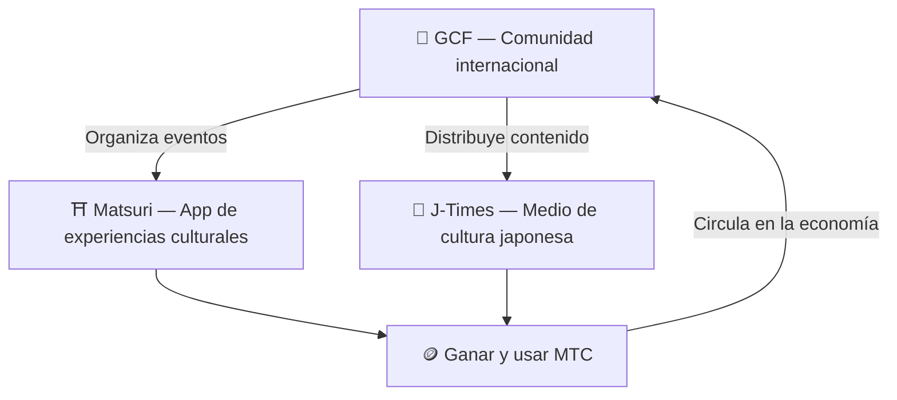

# 🏗️ Ecosistema MTC — una economía donde experiencia, medios y comunidad circulan

> **Tres «lugares» para hacer realidad el propósito.**
> Un lugar para vivir, un lugar para conocer, un lugar para conectar —— independientes entre sí pero unidos por MTC en un único ecosistema circular.

MTC no es un simple token. Tres productos y una comunidad internacional colaboran para hacer realidad una economía al servicio de la cultura.

:::tip 🤝 GCF — Comunidad internacional que mueve el ecosistema
Un espacio donde quienes aman la cultura japonesa se conectan más allá de las fronteras. GCF recluta guías y esos guías GCF operan las experiencias en Matsuri. Además, publican contenido atractivo en J-Times —— la actividad de la comunidad es el motor que mueve todo el ecosistema.
:::

:::tip ⛩️ Matsuri — App de experiencias culturales
Comienza con la reserva de experiencias culturales y se amplía progresivamente a **casas de huéspedes**, **tiendas** y **crowdfunding**. La economía se extiende desde la experiencia a la vestimenta, la comida, el alojamiento y la inversión de co-creación.

**Minado de peregrinación (Sanpai)** — Obtén MTC visitando físicamente templos, santuarios y enclaves culturales. Dispersa el flujo de personas de los lugares famosos hacia rincones regionales y resuelve a la vez el sobreturismo y el desarrollo local.
:::

:::tip 📰 J-Times — Medio de cultura japonesa
Una plataforma de medios que lleva el atractivo de la cultura japonesa al mundo. Puedes ganar MTC leyendo, compartiendo e interactuando con los artículos.
:::

---

## 🤝 Minado social (gana conectando)

**Integrado con el panel de gestión GCF ── Versión web en marcha (app iOS prevista para abril de 2026)**

Los miembros del GCF acceden al **panel web exclusivo GCF**.

| Función | Qué puedes hacer |
| :--- | :--- |
| **🎪 Crear eventos** | Diseñar y publicar tus propios eventos y tours |
| **📢 Distribuir contenido** | Difundir artículos y contenidos de J-Times |
| **📊 Seguimiento de referidos** | Seguir en tiempo real el comportamiento y los ingresos de tus referidos |

:::info Recompensa automática
Cada vez que un amigo referido realiza un pago, el sistema **transfiere automáticamente** la recompensa (reparto de ventas) a tu wallet.
:::

---

## 🎓 Economía del creador (gana creando)

Más allá de consumir contenido, en la plataforma Matsuri **cualquiera** puede crear y monetizar su contenido.

| Plataforma | Lo que puede hacer el creador | Modelo de ingresos |
| :--- | :--- | :--- |
| **📚 Marketplace de cursos** | Publicar cursos en vídeo/texto sobre cultura, idioma y artesanía japonesa | Comisión por inscripción (reparto al creador) |
| **🎙️ Estudio de pódcast** | Producir series de audio con distribución en Spotify, Apple Podcasts y RSS | Episodios exclusivos por suscripción |
| **🤝 Crowdfunding** | Lanzar campañas de financiación sobre Solana para proyectos culturales | Seguimiento de aportaciones on-chain |
| **🛍️ Tienda de usuario** | Abrir tu propia tienda dentro de la plataforma (artesanía, merchandising) | Venta directa con sistema de productos y reseñas |

:::tip Creación asistida por IA
Los anfitriones de eventos pueden usar el **asistente IA integrado (GPT-4 Turbo)** desde el panel para redactar descripciones de evento, traducir automáticamente a 5 idiomas y generar metadatos optimizados para SEO.
:::

---

  

*Encuentro comunitario en Golden Gai —— los vínculos se convierten en poder de minado.*

---

:::note Siguiente página
Si quieres conocer el mecanismo concreto de minado y cómo ganar, continúa en **[Minado y formas de ganar →](/docs/mining)**.
:::
