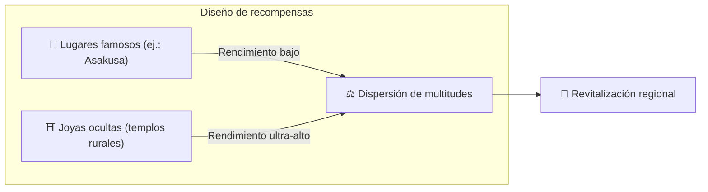

# ⛏️ Los tres pilares del mining

> **Prueba de Acción (Proof of Action)**
> Matsuri Coin no se mina con GPUs, sino con **acción humana**.

La web app y el panel de administración están **ya operativos** — empieza a ganar **ahora mismo** con las actividades siguientes.

---

## 1. 📖 Media Mining (Lee, escucha, responde y gana)

**Impulsado por «J-Times», el medio oficial**

El conocimiento transforma la calidad del viaje.
Recompensamos el aprendizaje — lectura, escucha **y** demostración de comprensión mediante quizzes.

| Acción | Qué haces | Recompensa |
| :--- | :--- | :--- |
| **📰 Lee y gana** | Lee artículos de J-Times sobre historia, sintoísmo, zen | MTC otorgados |
| **🎧 Escucha y gana** | Escucha podcasts exclusivos sobre cultura japonesa profunda | MTC otorgados |
| **✅ Responde y gana** | Aprueba quizzes para demostrar retención de conocimiento | MTC otorgados (al instante) |

:::tip Tiempo muerto → Tiempo de mining
El trayecto al trabajo, el almuerzo, el vuelo — cada rato libre se convierte en una oportunidad de ingresos.
:::

---

## 2. 🤝 Social Mining (Conecta y gana)

**A través del Panel GCF Admin — ya en funcionamiento**

Los miembros GCF reciben acceso a la **«GCF Admin Web»** dedicada.

| Funcionalidad | Qué puedes hacer |
| :--- | :--- |
| **🎪 Crear eventos** | Planifica y publica tus propios eventos y tours |
| **📢 Distribución de contenido** | Amplifica artículos de J-Times y contenido a través de tu red |
| **📊 Seguimiento de referidos** | Monitoriza en tiempo real la actividad e ingresos de los usuarios referidos |

:::info Pagos automáticos
Cada vez que un amigo referido realiza una transacción, el sistema deposita **automáticamente** tu parte de ingresos en tu cartera.
:::

---

## 3. 🗺️ Adventure Mining (Camina y gana)

**Proyecto «PEREGRINACIÓN» — próxima fase (en desarrollo)**

Una funcionalidad de próxima generación que usa GPS e incentivos de tokens para redirigir el flujo físico de turistas.

> **«La gente va al campo porque es más rentable.»**
> Esta lógica económica resuelve el sobreturismo y acelera la revitalización regional.

### 🎲 El protocolo «Omikuji»

Un smart contract tipo sorteo que se activa **gratis (solo gas)** al hacer check-in.

| Resultado | Qué recibes |
| :--- | :--- |
| **🎊 Gran fortuna** | Airdrop bonus de MTC |
| **📜 NFT Drop** | **«Goshuin NFT»** exclusivo del lugar visitado |
| **🏆 Colección completa** | Completar un set desbloquea el acceso a eventos especiales |

:::note Esto no es apuesta
No se requiere ninguna apuesta económica. Solo un bonus aleatorio por **haberte presentado**.
:::

---

## 4. 🏦 Liquidity Mining (Aporta y gana)

> **Conviértete en el banco.**

Ofrecemos un programa de recompensas especial para los usuarios que aporten liquidez MTC/SOL en Raydium.

| Elemento | Detalles |
| :--- | :--- |
| **Quién** | Proveedores de liquidez tempranos («socios fundadores») |
| **APY objetivo** | **50 %** (configurado como prima de riesgo) |
| **Por qué** | Asegurar liquidez inicial para un entorno de trading estable |

---

**[▶ Siguiente: Hoja de ruta y equipo](/docs/roadmap)** ｜ **[◀ Anterior: La economía](/docs/economy)**
