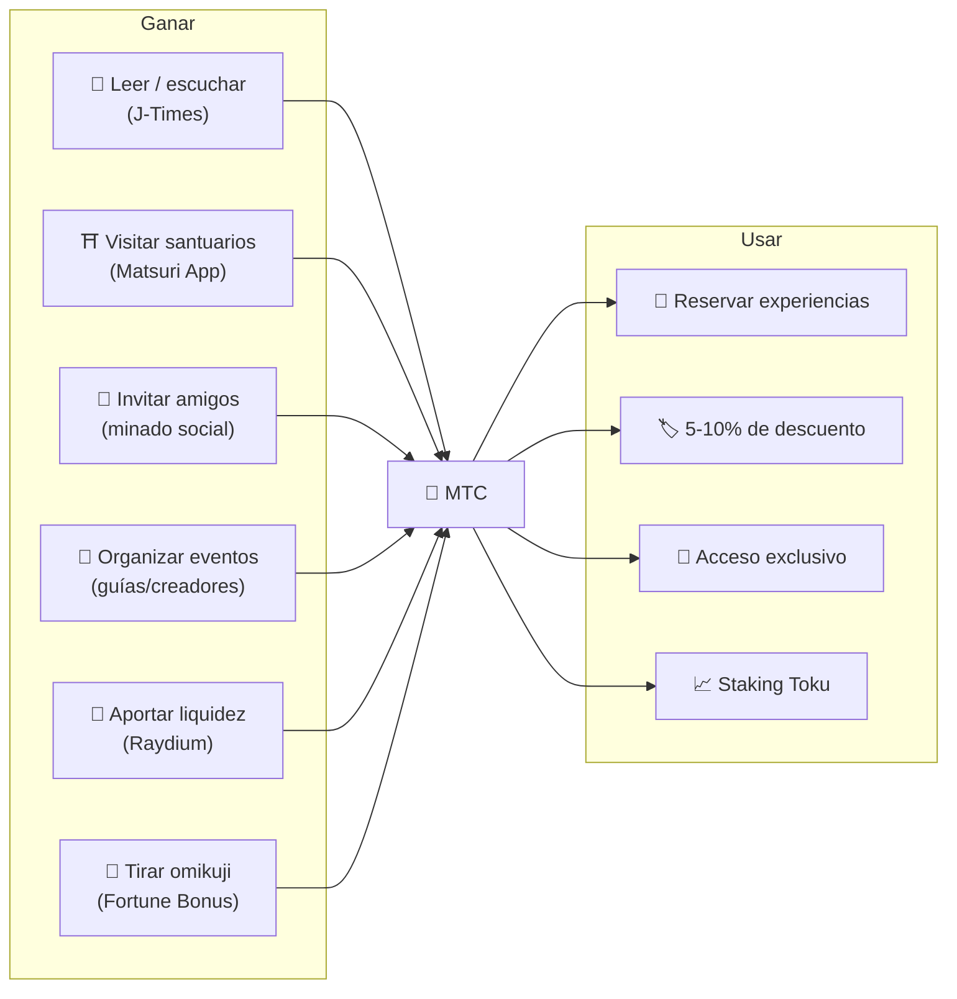
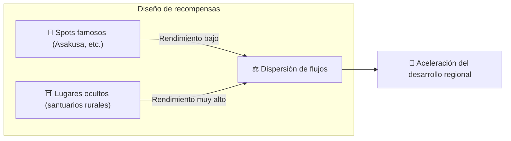
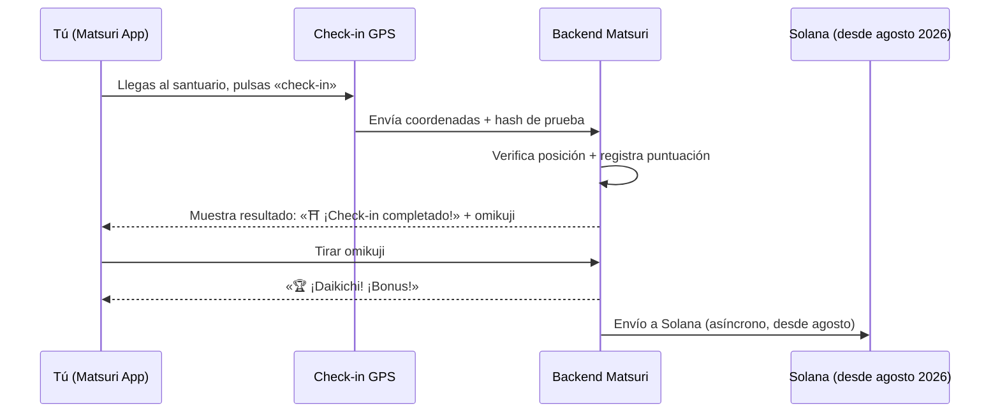
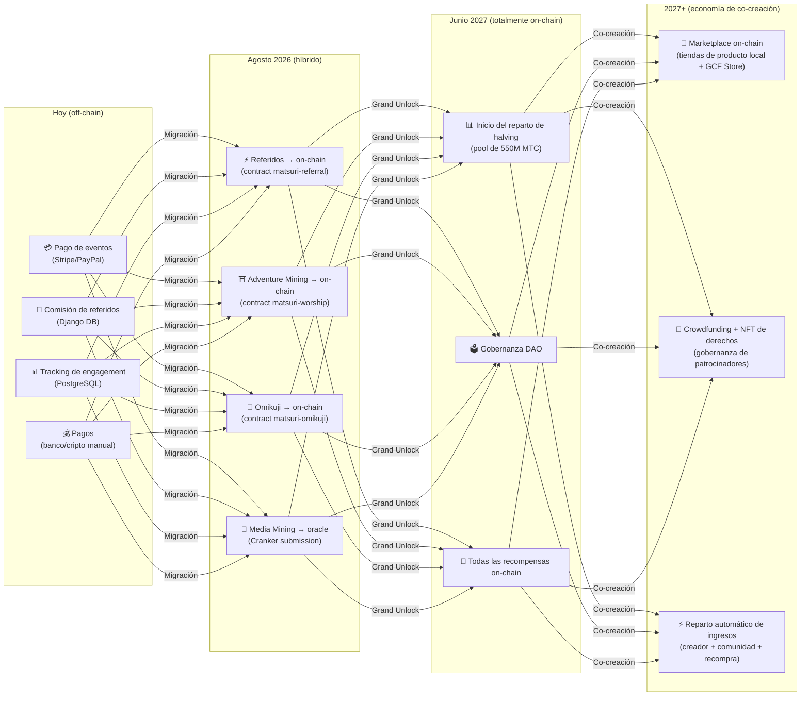

# ⛏️ Los cinco pilares del minado y cómo ganar

> **Cualquier «vínculo» con la cultura se convierte directamente en valor.**
> Leer, caminar, conectar, crear, apoyar — cada una de tus acciones genera MTC.

<small>*※ ¿Qué es el «minado»? —— En Bitcoin y otras criptomonedas, ordenadores realizan enormes cálculos y reciben como recompensa monedas nuevas. A eso se le llama «minado». En MTC, la «minería» no la hace la potencia de cálculo sino **tu propia acción** —— leer un artículo, visitar un santuario, organizar un evento. En vez de excavar oro, es tu vínculo con la cultura lo que genera MTC. Ese es nuestro concepto de «minado».*</small>

> Ganar actuando. Gastar en experiencias. Conservar para crecer.

MTC no es un token especulativo. Todas las acciones generan valor y circulan en una economía real que lo captura. La web y el panel de gestión **ya están en marcha**. De momento los puntos de contribución se registran off-chain (Django); se migrarán por fases on-chain a partir de agosto de 2026.

:::tip Visión general
MTC tiene una **economía circular completa**: ganas con actividad real, gastas en experiencias reales, y el valor crece a medida que se expande el ecosistema. En esta página detallamos cómo funciona.
:::

---

## Ciclo de vida de MTC

---

## Los 5 pilares del minado

### 1. 📖 Media Mining (gana leyendo, escuchando y respondiendo)

**Integrado con el medio oficial «J-Times»**

El conocimiento mejora drásticamente la calidad del viaje. Abre la **app de J-Times** y disfruta de contenido sobre cultura japonesa. Además del aprendizaje con texto y audio, premiamos los **controles de comprensión (quizzes)**. Cada acción completada otorga MTC automáticamente.

| Acción | Condición | Recompensa estimada |
| :--- | :--- | :---: |
| **📰 Leer un artículo** | Scroll hasta el 75 % | 2–30 MTC |
| **🎧 Escuchar un pódcast** | Reproducir hasta el final | 2–30 MTC |
| **🎬 Ver un vídeo** | Cerrar detalles tras el visionado | 2–30 MTC |
| **📤 Compartir contenido** | Mostrar la hoja de compartir | 2–30 MTC |
| **✅ Responder un quiz** | Aprobar el test de comprensión | 2–30 MTC |

<small>*※ La recompensa varía según el tipo y la duración del contenido y el equilibrio de suministro del ecosistema*</small>

:::tip Los ratos libres se convierten en minado
Los trayectos y las pausas se transforman en tiempo que produce recompensa.
:::

:::info Soporte offline
¿Sin cobertura en un santuario rural? Sin problema. J-Times registra la actividad en local y **se sincroniza automáticamente al volver a conectarte** (cola offline con 7 días de retención). No perderás los MTC ganados.
:::

**Lo que ocurre por detrás:**
1. La app de J-Times detecta tu acción (terminar de leer, ver completo, compartir...)
2. Queda registrada localmente incluso sin conexión (7 días)
3. Cuando vuelve la red, se envía al servidor para verificación
4. Se refleja como puntuación de contribución en tu saldo
5. A partir de agosto de 2026: las puntuaciones verificadas se registran on-chain mediante oracle, y serán verificables en la blockchain

---

### 2. ⛩️ Adventure Mining (gana caminando)

**Proyecto «Peregrinación» ── Smart contract finalizado, despliegue en mainnet en agosto de 2026**

Función de próxima generación que usa GPS e incentivos en token para controlar físicamente el «flujo de personas». El mapa de lugares sagrados **ya está en marcha** en la Matsuri Web App. De momento la puntuación de contribución se registra off-chain; el reparto de recompensas on-chain empezará tras el despliegue del smart contract en agosto de 2026.

>**Ganas, por eso vas a las regiones.**
> Esta lógica económica resuelve el sobreturismo y acelera la revitalización regional.

**Cómo funciona el check-in:**

**Principio básico — cuantos menos visitantes, más ganas:**

| Tipo de lugar | Ejemplo | Recompensa por check-in |
| :--- | :--- | :---: |
| 🏙️ **Principal** | Sensō-ji, Kiyomizu-dera, Fushimi Inari | 30–50 MTC |
| 🌆 **Regional central** | Ichinomiya de prefectura, grandes santuarios regionales | 50–100 MTC |
| 🏞️ **Regional** | Santuarios históricos de regiones | 100–150 MTC |
| ⛰️ **Frontera** | Templos de montaña, lugares sagrados insulares | 150–200 MTC |

<small>*※ Cifras base; con los multiplicadores de omikuji pueden multiplicarse varias veces*</small>

**Factores adicionales:**
- **Multiplicador de omikuji** — Bonus aleatorio por check-in. Con daikichi, la recompensa se multiplica varias veces
- **Frecuencia de visita** — Los visitantes regulares ganan más con el tiempo
- **Lugares patrocinados** — Los gobiernos locales pueden impulsar sitios concretos

:::info Puntuación de contribución → MTC
Tu actividad se acumula como **puntuación de contribución**. En cada época de halving (que comienza en junio de 2027), las puntuaciones se convierten en MTC a partir del pool de minado de 550M. Cuanto mayor sea tu contribución a la comunidad, más MTC recibirás. Los coeficientes de boost exactos se fijarán progresivamente y se implementarán en el smart contract — garantizando un reparto justo acorde al tamaño real del pool.
:::

---

### 3. 🤝 Minado social (gana conectando)

Con solo recomendar a tus amigos, puedes ganar MTC.

#### Recompensa de referidos para usuarios generales

Funciona muy sencillo. Cuando un amigo se registra por tu enlace de invitación, recibes **300 MTC por cada referido directo**.

| Condición | Recompensa |
| :--- | :--- |
| Un amigo al que invitaste se registra | **300 MTC** |

Esa es toda la regla. No hay recompensas multinivel.

#### Recompensas por referido para agentes GCF

Los [miembros GCF](/docs/gcf) son **agentes oficiales** encargados de expandir el ecosistema, con una estructura de recompensas más profunda.

| Capa | Relación | Comisión |
| :---: | :--- | :---: |
| **L1** | Referido directo | **20 %** |
| **L2** | Referido del referido | **5 %** |
| **L3** | Tercer nivel | **5 %** |
| **L4** | Cuarto nivel | **5 %** |

:::note Sobre el sistema de agentes GCF
Estas recompensas multinivel se aplican solo a los agentes oficiales con membresía GCF (por invitación). Los usuarios generales solo reciben la recompensa de referido directo (300 MTC).
Las comisiones de los agentes GCF se calculan sobre la **actividad económica real de sus referidos** (compra de experiencias, participación en eventos...). No se paga por reunir personas, se paga por el impacto real.
:::

**Cómo se calcula el En-Mining Score (para agentes GCF):**

El puntaje de contribución se calcula sobre dos factores:
- **Extensión de la red** (30 %) — A cuántas personas has llevado
- **Actividad económica** (70 %) — Compras reales generadas por tu red

La puntuación se acumula con el tiempo y se convierte en MTC en cada época de halving.

#### Panel de gestión GCF ── Versión web en marcha

Los miembros GCF acceden a un panel de gestión exclusivo.

| Función | Qué puedes hacer |
| :--- | :--- |
| **🎪 Crear eventos** | Diseñar y publicar tus propios eventos y tours |
| **📢 Distribuir contenido** | Difundir artículos y contenidos de J-Times |
| **📊 Seguimiento de referidos** | Seguir en tiempo real el comportamiento y los ingresos de tus referidos |

:::warning Hoy off-chain → migración a on-chain en agosto de 2026
Las comisiones de referido se registran actualmente en Django (PostgreSQL) y se pagan por transferencia o cripto. A partir de **agosto de 2026** se migrarán al **smart contract Matsuri Referral** sobre Solana, con pagos auditables on-chain.
:::

  

*Encuentro comunitario en Golden Gai —— los vínculos se convierten en poder de minado.*

---

### 4. 🎓 Minado de creadores y guías (gana creando)

Más allá de consumir contenido, en la plataforma Matsuri **cualquiera** puede producir contenido y monetizarlo. Si eres miembro GCF, guía o creador, estas son tus vías de ingreso:

| Actividad | Cómo se gana |
| :--- | :--- |
| **🗺️ Organizar un tour** | Comisión de guía (configurada por evento) + propinas |
| **🎫 Vender entradas** | Reparto de ingresos vía EventPurchase |
| **📚 Publicar cursos** | Comisión por inscripción (reparto al creador) |
| **🎙️ Producir pódcasts** | Ingresos por suscripción |
| **🤝 Lanzar una campaña de crowdfunding** | Seguimiento on-chain de contribuciones (Solana) |
| **🛍️ Abrir tienda de usuario** | Venta directa de artesanía y merchandising |

**Sistema de propinas:** al terminar el evento, los invitados pueden dejar propina al guía (estilo Uber). Las propinas se procesan por Stripe y se muestran en una tabla pública.

:::tip Creación asistida por IA
Los anfitriones pueden usar el **asistente IA integrado (GPT-4 Turbo)** para redactar descripciones de evento, traducir automáticamente a 5 idiomas y generar metadatos optimizados para SEO desde el panel.
:::

---

### 5. 🏦 Minado de liquidez (gana depositando)

>**Convértete en banco.**

Aporta liquidez al par MTC/SOL en Raydium DEX y sostén la base de trading inicial del ecosistema. Los proveedores de liquidez iniciales tienen un programa especial como «socios fundadores».

| Concepto | Detalle |
| :--- | :--- |
| **Destinatarios** | Cualquier usuario con MTC y SOL |
| **APR objetivo** | **20 %** (incentivo inicial de liquidez, fijado como prima de riesgo) |
| **DEX** | Raydium (Solana) |
| **Sentido** | Asegurar liquidez inicial y construir un entorno de trading estable |

---

## 🎲 Bonus Omikuji

Cada check-in de Adventure Mining incluye un Omikuji (suerte) gratuito. Es un smart contract tipo sorteo que se ejecuta **sin coste (solo gas)** al completar el check-in.

| Suerte | Multiplicador | Bonus adicional |
| :--- | :---: | :--- |
| 🏆 **Daikichi** | Base × multiplicador máximo | NFT Goshuin |
| ✨ **Kichi** | Base × multiplicador alto | — |
| 🌸 **Shōkichi** | Base × multiplicador pequeño | — |
| 🍃 **Suekichi** | Base × 1,0 | — |
| 💀 **Kyō** | Base × 1,0 | — |

Las probabilidades y multiplicadores se gestionan desde el panel GCF y se ajustan según el equilibrio de oferta. El resultado se decide mediante un **protocolo commit-reveal resistente a manipulaciones** en Solana; tras la fase de commit, nadie puede cambiarlo.

<small>*※ Aunque salga Kyō, recibes la recompensa base. Visitar ya se recompensa*</small>

:::note No es apuesta
No hay apuesta monetaria alguna. Es un bonus aleatorio sobre la propia **acción de visitar**. Reunir ciertos NFT puede desbloquear acceso a eventos especiales.
:::

---

## Usos de MTC

| Caso de uso | Ventaja | Disponibilidad |
| :--- | :--- | :---: |
| **🎫 Reservar experiencias** | Paga tours, eventos y actividades culturales con MTC | ✅ Disponible |
| **🏷️ Descuento** | 5-10 % de descuento sobre el precio en yenes al pagar con MTC | ✅ Disponible |
| **🔑 Acceso exclusivo** | Eventos con NFT-gate, ritos VIP, tours privados | ✅ Disponible |
| **📈 Staking Toku** | Bloquea MTC para boost de contribución (hasta ~50 %) | 🔜 Agosto 2026 |
| **🗳️ Gobernanza DAO** | Vota sobre tesorería, actualizaciones y certificación de sitios | 🔜 2027 |
| **🛍️ Tiendas partner** | Paga en tiendas y restaurantes asociados | 🔜 En expansión |

:::info MTC como medio de pago
En la Matsuri App, MTC es un medio de pago de primer nivel junto a la tarjeta de crédito y Solana Pay. Sin conversiones: al pagar, elige «Pagar con MTC» y se descuenta al instante.
:::

### Sobre la conversión de MTC

:::warning Importante: no ofrecemos servicios de conversión ni cambio de MTC
Matsuri Operations no está registrada como casa de cambio de cripto; **no ofrecemos ningún cambio directo entre MTC y divisas fiat (yen, dólar, etc.)**.

Si deseas cambiar MTC por otras criptos o a fiat, puedes hacerlo tú mismo así:
1. Gestiona tus MTC en una wallet Solana como **Phantom Wallet**
2. Cambia MTC → SOL en **Raydium (DEX)**
3. Convierte SOL a fiat en un exchange centralizado (CEX)

En el futuro consideraremos listados en CEX, lo que simplificará la conversión.
:::

---

## Ejemplo: un día en la economía MTC

> **Mañana:** En el tren, lees 3 artículos de J-Times → ganas MTC.
> **Tarde:** En la Matsuri App visitas un santuario rural → check-in, tiras omikuji y sale kichi (×1,5) → más MTC.
> **Noche:** Con los MTC ganados reservas un tour cultural por Golden Gai de 9 000 ¥ con un 10 % de descuento (pagas el equivalente a 8 100 ¥).
> **Resultado:** Tu curiosidad cultural se ha transformado en una experiencia real y el guía, el santuario y la comunidad han recibido el pago directamente. Ninguna OTA se ha quedado el 20 %.

---

## Sostenibilidad económica

:::warning ¿Qué pasa si el pool de minado se agota?
El pool de halving de 550M MTC está diseñado para durar **décadas**. Como se divide a la mitad cada dos años, matemáticamente nunca llega al 100 % y las recompensas continúan a largo plazo (ver [Tokenomics](/docs/tokenomics)). Aun cuando la emisión sea mínima:

- Las **comisiones de transacción** seguirán retribuyendo a los participantes de la red
- El **protocolo de recompra** (20-25 % de los ingresos del negocio) generará presión compradora permanente
- El **staking Toku** bloqueará oferta en circulación y reducirá la presión vendedora
- **Los ingresos reales del negocio** (eventos, membresías, cursos) sostienen el ecosistema independientemente de la emisión del token

MTC se respalda en una **economía real** —— no es mera emisión de token.
:::

---

## Hoja de ruta de migración on-chain

La economía Matsuri migra progresivamente de off-chain (Django/PostgreSQL) a on-chain (smart contracts Solana). Esta migración hace que todas las operaciones sean **trustless, auditables y sin permisos**.

| Fase | Calendario | Qué se lleva on-chain |
| :--- | :--- | :--- |
| **Fase 1 (actual)** | En marcha | Token MTC (SPL), LP en Raydium, verificación Solana Pay |
| **Fase 2 (agosto 2026)** | Despliegue de smart contracts en mainnet | Comisiones de referido, recompensas de Adventure Mining, sorteo Omikuji, Media Mining vía oracle |
| **Fase 3 (junio 2027)** | Grand Unlock | Reparto de halving de 550M MTC, gobernanza DAO, descentralización completa |
| **Fase 4 (2027+)** | Economía de co-creación | Marketplace on-chain (tiendas locales + GCF Store), crowdfunding con NFT de derechos, reparto automático a creador + comunidad + recompra |

:::warning ¿Por qué no se lleva todo on-chain ahora?
**Hasta que no se complete la auditoría de seguridad, no activamos funciones on-chain que muevan fondos de los usuarios.** Es nuestro principio.

Estado actual:
- **Riesgo para los fondos de los usuarios: ninguno** — todas las recompensas y puntuaciones se gestionan off-chain (Django) y no hay ninguna función activa por smart contract que mueva fondos de los usuarios
- **Calendario de auditoría: Q2–Q3 de 2026** — tras una auditoría profesional, los contratos cuya seguridad se confirme se desplegarán progresivamente en mainnet
- **La auditoría completa es prerrequisito para el despliegue** — no activaremos ningún smart contract no auditado en mainnet

Las recompensas del periodo off-chain también son verificables: toda transacción incluye `solana_signature` como prueba de pago.
:::

---

**[▶ Siguiente: Tokenomics](/docs/tokenomics)** ｜ **[◀ Anterior: Ecosistema](/docs/ecosystem)**
