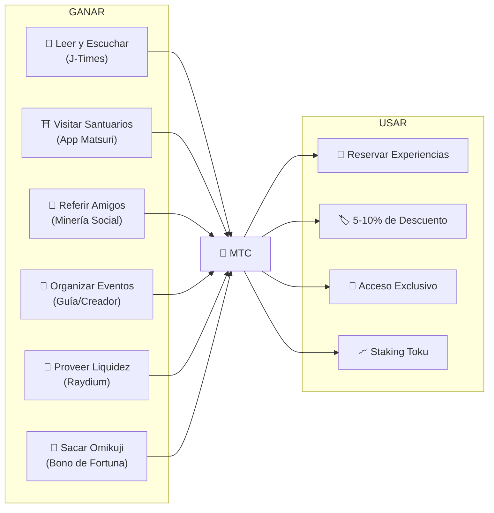
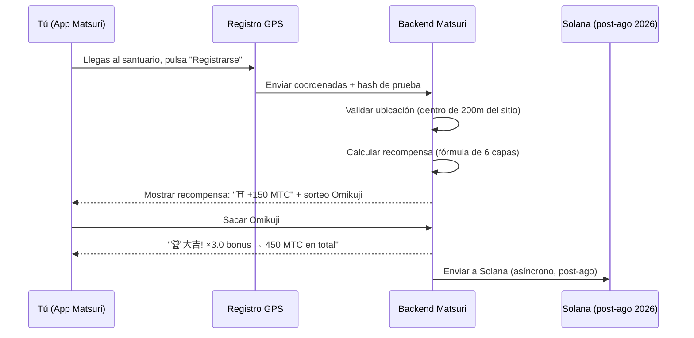
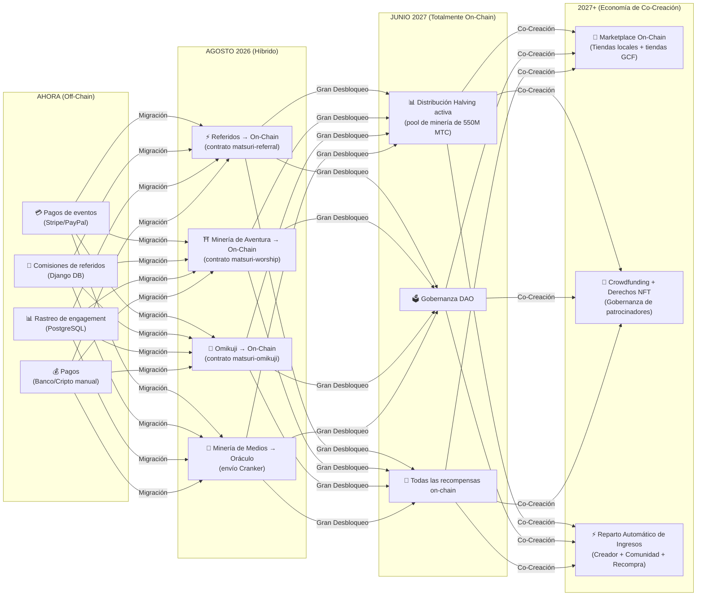

# 💎 Cómo Ganar y Usar MTC

> **Gana con acciones. Gasta en experiencias. Mantén para crecer.**
> MTC no es solo un token especulativo — fluye a través de una economía real donde cada acción crea y captura valor.

:::tip La Visión General
MTC tiene una **economía circular completa**: lo ganas a través de actividades reales, lo gastas en experiencias reales, y su valor crece a medida que el ecosistema se expande. Esta página te muestra exactamente cómo.
:::

---

## El Ciclo de Vida del MTC



---

## Cómo Ganar MTC

### 1. 📖 Minería de Medios — Lee, Escucha y Mira en J-Times

Abre la **app J-Times** y consume contenido sobre la cultura japonesa. Cada acción completada te otorga MTC automáticamente.

| Acción | Criterio de Finalización | Recompensa |
| :--- | :--- | :---: |
| **Leer un artículo** | Desplazarse al 75% de profundidad | MTC |
| **Escuchar un podcast** | Reproducción completa | MTC |
| **Ver un video** | Salir de la pantalla de detalle tras verlo | MTC |
| **Compartir contenido** | Hoja de compartir presentada | MTC |
| **Completar un cuestionario** | Aprobar la prueba de comprensión | MTC (instantáneo) |

:::info Soporte Sin Conexión
¿Sin internet en un santuario rural? No hay problema. J-Times registra tu actividad localmente y **sincroniza automáticamente cuando vuelves a estar en línea** (cola offline con retención de 7 días). Nunca pierdes MTC ganado.
:::

**Cómo funciona internamente:**
1. `EngagementTracker` en la app detecta eventos de finalización
2. Las acciones se almacenan localmente (incluso sin conexión)
3. Al restaurarse la red, las acciones se agrupan y envían a la API Django
4. La API valida y acredita MTC a tu saldo
5. A partir de agosto de 2026: las acciones se enviarán on-chain mediante el oráculo Cranker

---

### 2. ⛩️ Minería de Aventura — Visita Sitios Sagrados con la App Matsuri

Abre la **app Matsuri**, encuentra un santuario o templo en el Mapa de Sitios Sagrados, ve allí y regístrate. Cuanto menos visitado sea el sitio, más ganas.

**Flujo paso a paso:**



**Multiplicadores de recompensa — por qué lo rural paga más:**

| Tipo de Sitio | Ejemplos | Multiplicador |
| :--- | :--- | :---: |
| 🏙️ **Principal** | Sensoji, Kiyomizu-dera, Fushimi Inari | ×1 |
| 🌆 **Regional** | Ichinomiya prefecturales, grandes santuarios regionales | ×2 |
| 🏞️ **Rural** | Santuarios históricos en el campo | ×5 |
| ⛰️ **Frontera** | Templos de montaña, sitios sagrados en islas remotas | ×10 |

**Además, bonificaciones adicionales:**
- **Bono de Pionero** — el primer visitante del día gana más (decaimiento armónico)
- **Bono de Racha** — visita días consecutivos para hasta +50%
- **Omikuji** — sorteo de fortuna aleatorio: 大吉 = ×3.0, 吉 = ×1.5, 小吉 = ×1.2
- **Balizas Patrocinadas** — los municipios depositan MTC para impulsar sitios específicos

> **Ejemplo:** Visita un santuario remoto de montaña (×10) como el 2.º visitante del día, con una racha de 5 días (+10%), y saca 吉 (×1.5) = recompensa base amplificada **16.5×**.

---

### 3. 🤝 Minería Social — Refiere Amigos y Construye Tu Red

Comparte tu código de referido. Cuando tu red realiza transacciones, ganas automáticamente.

| Capa | Relación | Comisión |
| :---: | :--- | :---: |
| **L1** | Tú → Amigo (directo) | **20%** |
| **L2** | Amigo → Su amigo | **5%** |
| **L3** | 3.er grado | **5%** |
| **L4** | 4.º grado | **5%** |

**Cómo funciona la puntuación En-Mining:**

```
Tu Puntuación = (Referidos Directos × 30%) + (Volumen de Transacciones de la Red × 70%)
               × Multiplicador de Staking Toku (1.0× – 10.0×)
               × Impulso por Título (+5% por temporada clasificada, máx. +50%)
```

> **Dato clave:** El 70% de tu puntuación proviene de **actividad económica real** en tu red, no solo de registros. Invitar a 1.000 personas que nunca gastan rinde menos que invitar a 10 gastadores activos.

:::warning Actualmente Off-Chain → Migración On-Chain en Agosto 2026
Las comisiones de referidos actualmente se rastrean en Django (PostgreSQL) y se pagan mediante transferencia bancaria o cripto. A partir de **agosto de 2026**, todo el sistema de comisiones de referidos migrará al **smart contract Matsuri Referral** en Solana — haciendo los pagos trustless, instantáneos y auditables on-chain.
:::

---

### 4. 🎪 Minería de Creadores y Guías — Organiza Eventos, Crea Contenido

Si eres miembro de GCF, guía o creador de contenido:

| Actividad | Cómo Ganas |
| :--- | :--- |
| **Organizar un tour** | Comisión de guía (fijada por evento) + propinas |
| **Vender entradas de eventos** | Reparto de ingresos vía EventPurchase |
| **Publicar un curso** | Tarifa por inscripción |
| **Crear episodios de podcast** | Ingresos por suscripción |
| **Lanzar una campaña de crowdfunding** | Contribuciones basadas en Solana |

**Sistema de propinas:** Después de cada evento, los invitados pueden dar propina a los guías (estilo Uber). Las propinas se procesan vía Stripe y se muestran en un leaderboard público.

---

### 5. 🏦 Minería de Liquidez — Provee Liquidez en Raydium

Provee liquidez MTC/SOL en Raydium DEX y gana recompensas.

| Elemento | Detalles |
| :--- | :--- |
| **APY Objetivo** | 50% (incentivo de liquidez temprana) |
| **DEX** | Raydium (Solana) |
| **Quién** | Cualquiera que posea MTC y SOL |

---

### 6. 🎲 Bono Omikuji — Multiplicador de Fortuna

Cada registro de Minería de Aventura incluye un sorteo Omikuji (fortuna) gratuito. Este multiplicador se aplica sobre todos los demás bonos.

| Fortuna | Probabilidad | Multiplicador |
| :--- | :---: | :---: |
| 🏆 **大吉** (Gran Bendición) | 5% | ×3.0 |
| ✨ **吉** (Bendición) | 15% | ×1.5 |
| 🌸 **小吉** (Pequeña Bendición) | 30% | ×1.2 |
| 🍃 **末吉** (Bendición Futura) | 35% | ×1.0 |
| 💀 **凶** (Infortunio) | 15% | ×1.0 |

El resultado se determina mediante un **protocolo commit-reveal a prueba de manipulaciones** en Solana. Ni siquiera el servidor puede cambiar tu resultado después de la fase de commit.

---

## Dónde Gastar MTC

| Caso de Uso | Beneficio | Disponible |
| :--- | :--- | :---: |
| **🎫 Reservar experiencias** | Paga tours, eventos y actividades culturales con MTC | ✅ Ahora |
| **🏷️ Descuento** | 5–10% de descuento vs. precio en yenes al pagar con MTC | ✅ Ahora |
| **🔑 Acceso exclusivo** | Eventos con acceso NFT, ceremonias solo VIP, tours privados | ✅ Ahora |
| **📈 Staking Toku** | Bloquea MTC para aumentar tu multiplicador de minería (1.0× → 10.0×) | 🔜 Ago 2026 |
| **🗳️ Gobernanza DAO** | Vota sobre la tesorería, actualizaciones del protocolo y certificación de sitios | 🔜 2027 |
| **🛍️ Tiendas asociadas** | Paga en tiendas y restaurantes participantes | 🔜 Expandiendo |

:::info MTC como Medio de Pago
En la app Matsuri, MTC es un método de pago de primera clase junto con tarjetas de crédito y Solana Pay. No se necesita conversión — selecciona "Pagar con MTC" en el checkout y el saldo se deduce al instante.
:::

### Ejemplo: Un Día en la Economía MTC

> **Mañana:** Lee 3 artículos de J-Times en el tren → gana MTC.
> **Tarde:** Visita un santuario rural con la app Matsuri → regístrate, saca 吉 (×1.5) → gana más MTC.
> **Noche:** Usa el MTC ganado para reservar un tour cultural por Golden Gai de ¥9.000 con 10% de descuento (pagas el equivalente a ¥8.100).
> **Resultado:** Tu curiosidad cultural financió una experiencia real — y el guía, el santuario y la comunidad recibieron un pago directo. Ninguna OTA se llevó un 20% de comisión.

### Sostenibilidad Económica

:::warning ¿Qué Pasa Cuando se Agota el Pool de Minería?
El pool de halving de 550M MTC está diseñado para durar **décadas** (20 épocas × 2 años = 40 años teóricos). Pero incluso después de que se agote el pool:

- Las **comisiones por transacción** de la actividad on-chain continúan recompensando a los participantes de la red
- El **protocolo de recompra** (20-25% de los ingresos del negocio) crea presión de compra perpetua
- El **staking Toku** bloquea el suministro circulante, reduciendo la presión de venta
- Los **ingresos reales del negocio** (eventos, membresías, cursos) sostienen el ecosistema independientemente de la distribución de tokens

MTC está respaldado por una **economía real** — no solo por emisiones de tokens.
:::

---

## Hoja de Ruta de Migración On-Chain

La economía Matsuri se está moviendo progresivamente de off-chain (Django/PostgreSQL) a on-chain (smart contracts de Solana). Esta transición hace que todas las operaciones sean **trustless, auditables y sin permisos**.



| Fase | Cronograma | Qué se Mueve On-Chain |
| :--- | :--- | :--- |
| **Fase 1 (Ahora)** | En vivo | Token MTC (SPL), LP en Raydium, verificación Solana Pay |
| **Fase 2 (Ago 2026)** | Despliegue de smart contracts en mainnet | Comisiones de referidos, recompensas de Minería de Aventura, sorteos Omikuji, Minería de Medios vía oráculo |
| **Fase 3 (Jun 2027)** | Gran Desbloqueo | Distribución de halving de 550M MTC, gobernanza DAO, descentralización total |
| **Fase 4 (2027+)** | Economía de Co-Creación | Marketplace on-chain (tiendas locales + tiendas GCF), crowdfunding con derechos NFT, reparto automático de ingresos a creadores + comunidad + recompra |

:::warning ¿Por Qué No Todo On-Chain Hoy?
Mover todo on-chain antes de una **auditoría de seguridad profesional** (planificada para Q2 2026) sería irresponsable. El enfoque híbrido actual nos permite iterar de forma segura mientras nos preparamos para operaciones trustless on-chain. Las recompensas off-chain siguen siendo verificables — cada transacción tiene una `solana_signature` como prueba de liquidación.
:::

---

**[▶ Siguiente: Apps Móviles](/docs/mobile-apps)** ｜ **[◀ Anterior: Ecosistema y Minería](/docs/ecosystem)**
