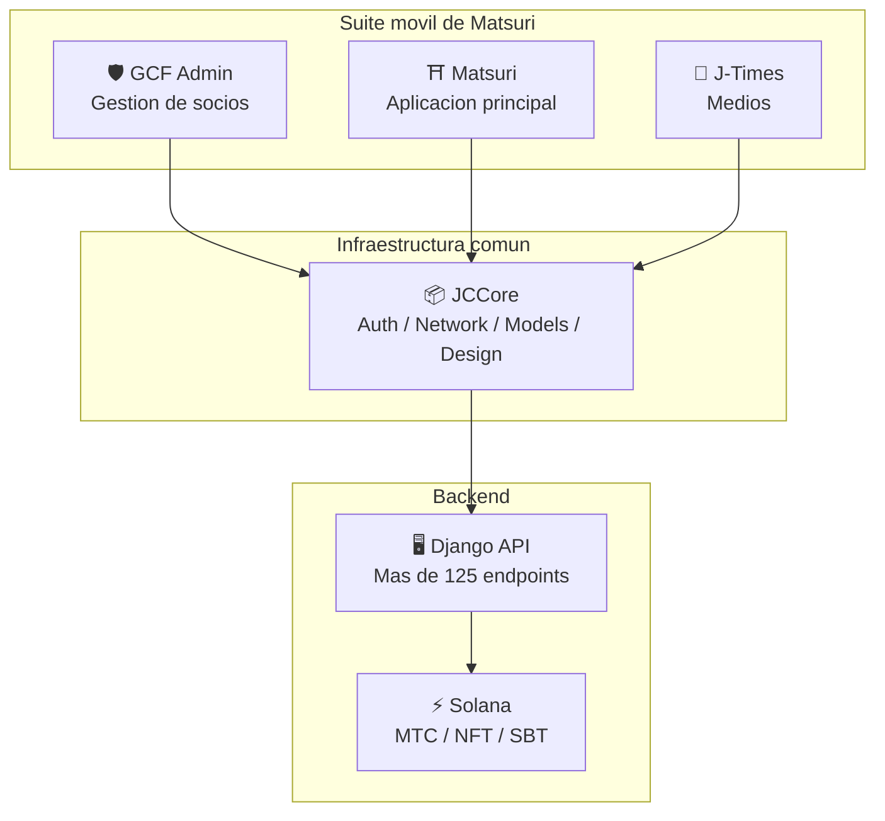
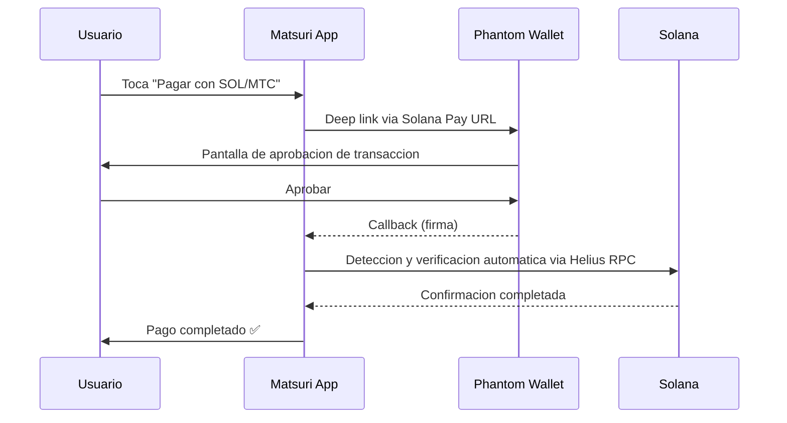
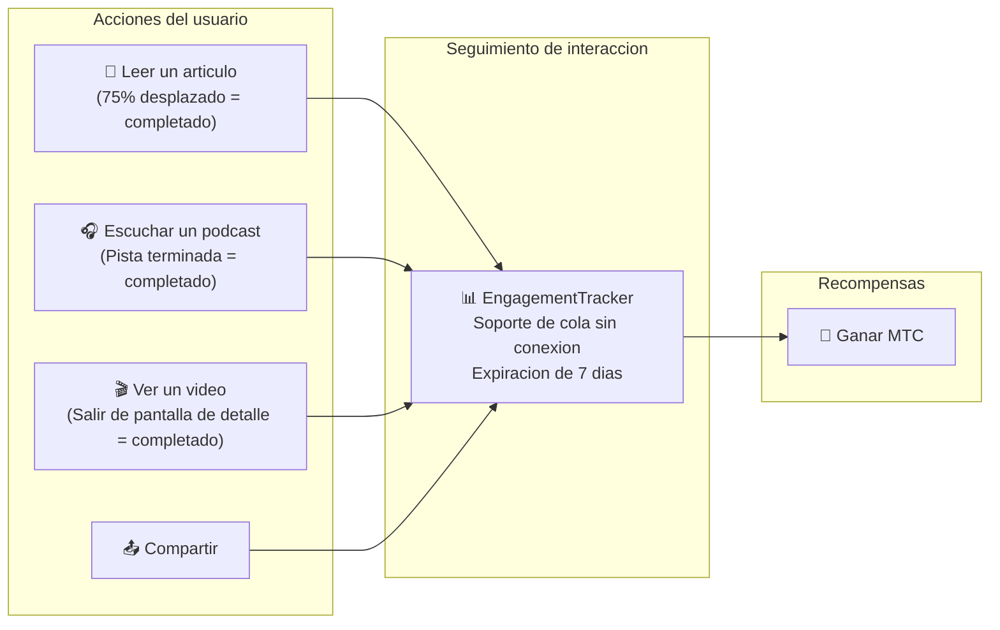
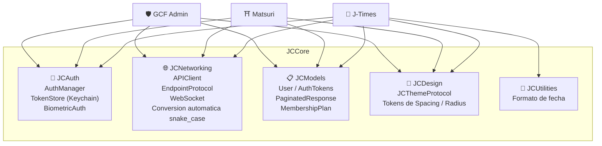

# 📱 Suite de aplicaciones moviles

> **Tres aplicaciones iOS nativas que cubren todas las capas del ecosistema Matsuri.**
> Desarrolladas completamente con Swift 6 / iOS 17+. Autenticacion, red y diseno unificados a traves de la biblioteca compartida **JCCore**.

:::tip Por que esto es importante para los inversores
La mayoria de los proyectos Web3 tienen un sitio web y un whitepaper. Matsuri tiene **3 aplicaciones iOS en produccion con mas de 827 pruebas automatizadas**, infraestructura compartida e integracion nativa con Solana. Esta es una profundidad de ejecucion poco comun en el mercado de tokens.
:::

---

## Vista general de aplicaciones

| Aplicacion | Proposito | Estado | Idiomas |
| :--- | :--- | :---: | :--- |
| **GCF Admin** | Gestion de socios y operaciones | ✅ Publicada | 🇯🇵🇬🇧🇨🇳🇹🇭🇳🇴 |
| **Matsuri** | Aplicacion principal para consumidores | 🔜 Finales de abril 2026 | 🇯🇵🇬🇧🇨🇳🇹🇭🇳🇴 |
| **J-Times** | Medios culturales y aprendizaje | 🔜 Finales de abril 2026 | 🇯🇵🇬🇧 |

---

## 1. 🛡️ GCF Admin — Aplicacion de gestion de socios

:::info Estado: Publicada en App Store (v1.0)
Una aplicacion de gestion operativa para miembros de GCF (Global Community Friends). Todas las funciones del panel de administracion web reunidas en una aplicacion movil.
:::

  
  
  

### Que puedes hacer con esta aplicacion

| Categoria | Funcion |
| :--- | :--- |
| **📊 Panel de control** | Tarjetas KPI, graficos de ventas, acciones rapidas |
| **👥 Gestion de miembros** | Lista, detalles, edicion, gestion de niveles |
| **💰 Gestion de ingresos** | Seguimiento de comisiones, gestion de retiros MTC, gestion de pagos |
| **📝 Gestion de contenido** | Creacion, edicion y publicacion de eventos, articulos, podcasts y videos |
| **🎫 Espacios de guias** | Gestion de espacios de guias, seguimiento de ingresos |
| **🖼️ Panel de NFT** | Founder's Collection, verificacion on-chain, transferencia de NFT |
| **⛩️ Gestion de sitios sagrados** | CRUD de sitios, configuracion de beacons |
| **🎲 Configuracion de mineria AR** | Tablas de probabilidad de omikuji, gestion de parametros de recompensa |
| **📊 Analiticas** | Informes de errores, analisis de uso |
| **🔗 Referidos** | Generacion de codigos QR personalizados, gestion del programa de referidos |

### Especificaciones tecnicas

| Elemento | Detalles |
| :--- | :--- |
| **Arquitectura** | Clean Architecture + MVVM + `@Observable` (iOS 17) |
| **Lenguaje / SDK** | Swift 6.0 / Xcode 16+ / iOS 17.0+ |
| **Integracion API** | Mas de 125 endpoints |
| **Pruebas** | 226 pruebas / 45 clases de prueba |
| **Localizacion** | 5 idiomas (JA/EN/ZH/TH/NB) / Mas de 957 claves de traduccion |
| **Swift Concurrency** | Compatible con Strict Concurrency / cero advertencias de compilacion |

### Integracion de codigos QR

GCF Admin puede generar codigos QR personalizados con el logotipo de Matsuri. Admite multiples usos como invitaciones a eventos, enlaces de referidos y solicitudes de pago.

---

## 2. ⛩️ Matsuri — Aplicacion principal

:::info Estado: Lanzamiento previsto para finales de abril 2026 (v3.0)
La aplicacion principal para usuarios generales. Todo en una sola aplicacion — reserva de eventos, pagos, billetera Web3 y mineria AR.
:::

  
  
  

### Que puedes hacer con esta aplicacion

| Categoria | Funcion |
| :--- | :--- |
| **🎪 Reserva de eventos** | Busqueda, reserva, pago con Stripe, gestion de QR de entradas |
| **💳 4 metodos de pago** | Tarjeta de credito / tarjeta guardada / saldo MTC / criptomonedas (SOL/MTC) |
| **👛 Billetera Web3** | Visualizacion de saldo MTC, envio/recepcion, historial de transacciones |
| **🖼️ Galeria NFT** | Lista de NFT/SBT en posesion, verificacion on-chain |
| **🗺️ Mapa de sitios sagrados** | Vista de mapa de santuarios y templos, check-in |
| **🎲 Mineria AR** | Experiencia omikuji WebAR, ganar MTC |
| **💬 Chat** | Mensajeria con menu contextual |
| **⭐ Lista de deseos** | Guardar eventos y experiencias favoritas |
| **🔍 Busqueda avanzada** | Soporte de busqueda por voz |
| **🤝 Referidos** | Participacion en programa de referidos, seguimiento de recompensas |
| **📊 Panel de GCF** | Panel de administracion simplificado para miembros GCF |

### Integracion con Phantom Wallet — Pago con criptomonedas sin entrada manual

> **Sin copiar direcciones.** Phantom Wallet se abre automaticamente, el usuario aprueba y el pago se completa. Las firmas de transaccion se detectan automaticamente via Helius RPC — la experiencia de pago con criptomonedas mas fluida del mercado.

:::tip Por que esto es importante
La mayoria de las aplicaciones Web3 obligan a los usuarios a copiar direcciones de billetera, ingresar montos manualmente y esperar confirmaciones. La integracion de Matsuri con Solana Pay reduce esto a **un solo toque** — igualando la experiencia de usuario de Apple Pay mientras se liquida on-chain.
:::

### Especificaciones tecnicas

| Elemento | Detalles |
| :--- | :--- |
| **Arquitectura** | Clean Architecture + MVVM + Swift Concurrency |
| **Lenguaje / SDK** | Swift 6.0 / Xcode 16+ / iOS 17.0+ |
| **Pagos** | Stripe PaymentSheet + MTC Balance + Phantom (Solana Pay) |
| **Integracion API** | 72 endpoints / 16 categorias |
| **Pruebas** | Mas de 230 (Model, ViewModel, Network, Security, DeepLink, E2E) |
| **Localizacion** | 5 idiomas (JA/EN/ZH/TH/NB) / 406 claves de traduccion |
| **Numero de ViewModels** | 25 (MVVM completo — cero llamadas API directas desde Views) |
| **Autenticacion** | Apple Sign In / Google Sign In (PKCE) |

---

## 3. 📰 J-Times — Aplicacion de medios culturales

:::info Estado: Lanzamiento previsto para finales de abril 2026
Una plataforma de medios que transmite la profundidad de la cultura japonesa. Lee articulos, escucha podcasts, mira videos — gana MTC con cada accion.
:::

  

### Que puedes hacer con esta aplicacion

| Categoria | Funcion |
| :--- | :--- |
| **📖 Articulos** | Hero con parallax, capitular, barra de progreso de lectura, contenido enriquecido (Markdown, tablas, citas) |
| **🎧 Podcasts** | Navegacion por series, reproductor con forma de onda, temporizador de sueno, AirPlay, controles en pantalla de bloqueo |
| **🎬 Videos** | Vista adaptable de cuadricula/lista, videos cortos (estilo TikTok, doble toque) |
| **🔍 Busqueda** | Multiples filtros, etiquetas en tendencia, busqueda por voz |
| **🧭 Descubrimiento** | Carrusel destacado, selecciones del equipo, populares de la semana |
| **📚 Biblioteca** | Favoritos, historial (por fecha), descargas, listas de reproduccion |
| **🎵 Reproductor de audio** | Mini reproductor (control por deslizamiento), reproductor completo (forma de onda, letras, repeticion) |
| **👤 Membresia** | Comparacion de funciones de 3 niveles (Free / Premium / Pro), restauracion de compras |

### Media Mining — Leer, escuchar y ver se convierte en mineria

> **Se registra incluso sin conexion.** Aunque leas un articulo en un templo remoto en las montanas sin cobertura, los datos de interaccion se envian automaticamente al recuperar la conexion y se otorga MTC.

### Sistema de diseno — Estetica japonesa en "cuatro pilares"

J-Times utiliza un sistema de diseno unico que traduce la estetica japonesa tradicional a una interfaz de usuario moderna.

| Pilar | Concepto | Aplicacion en UI |
| :--- | :--- | :--- |
| **墨 (Sumi)** | Tonos grises neutros calidos | Color de fondo, jerarquia de texto |
| **朱 (Shu)** | Rojo japones (#C53030) | Color de acento, acciones importantes |
| **間 (Ma)** | Espaciado en cuadricula de 4pt | Espaciado, espacio para respirar |
| **紙 (Kami)** | Textura sutil, glassmorfismo | Superficies de tarjetas, expresion de profundidad |

### Especificaciones tecnicas

| Elemento | Detalles |
| :--- | :--- |
| **Arquitectura** | Clean Architecture + MVVM + Swift Concurrency |
| **Lenguaje / SDK** | Swift 6.0 / Xcode 16+ / iOS 17.0+ |
| **Dependencias externas** | **Cero** — solo frameworks nativos de Apple |
| **Integracion API** | Mas de 40 endpoints |
| **Pruebas** | 371 pruebas / 20 archivos |
| **Localizacion** | 2 idiomas (JA/EN) / Mas de 310 claves de traduccion |
| **Soporte sin conexion** | ContentCache (50MB) + ImageDiskCache (200MB) + gestor de descargas |
| **Autenticacion** | Apple Sign In / Google Sign In (PKCE) |

---

## Infraestructura comun: Biblioteca JCCore

Una biblioteca Swift Package compartida utilizada por las tres aplicaciones.

| Modulo | Rol |
| :--- | :--- |
| **JCAuth** | Gestion de tokens basada en Keychain, autenticacion biometrica (Face ID / Touch ID) |
| **JCNetworking** | Cliente API con tipado seguro, WebSocket, conversion automatica JSON snake_case |
| **JCModels** | Modelos de datos compartidos entre aplicaciones (User, AuthTokens, etc.) |
| **JCDesign** | Protocolo de tema, tokens de diseno (espaciado, bordes redondeados) |
| **JCUtilities** | Utilidades de fecha y cadenas de texto |

---

## Seguridad y privacidad

| Elemento | Implementacion |
| :--- | :--- |
| **Tokens de autenticacion** | Almacenamiento cifrado en iOS Keychain (TokenStore) |
| **Autenticacion biometrica** | Autenticacion de dos factores via Face ID / Touch ID |
| **Comunicacion API** | HTTPS + Certificate Pinning |
| **Claves privadas de billetera** | No se almacenan claves privadas en la aplicacion — delegado a Phantom Wallet |
| **Mineria AR** | Las imagenes de la camara no se envian al servidor (VisionProof) |
| **Datos sin conexion** | Cifrado SwiftData + expiracion automatica |
| **Swift Concurrency** | Prevencion de condiciones de carrera mediante aislamiento de actor |

---

## Calidad de desarrollo

Un total de **mas de 827 pruebas automatizadas** en las 3 aplicaciones.

| Aplicacion | Numero de pruebas | Areas de cobertura |
| :--- | :---: | :--- |
| **GCF Admin** | 226 | Model, ViewModel, Repository, API, Localization, Navigation |
| **Matsuri** | 230+ | Model, ViewModel, Network, Security, DeepLink, Regression, Performance, E2E |
| **J-Times** | 371 | Model, ViewModel, API, Repository, Navigation, Localization, Security, Performance |

---

**[▶ Siguiente: Hoja de ruta y equipo](/docs/roadmap)** | **[◀ Anterior: Ecosistema y mineria](/docs/ecosystem)**
