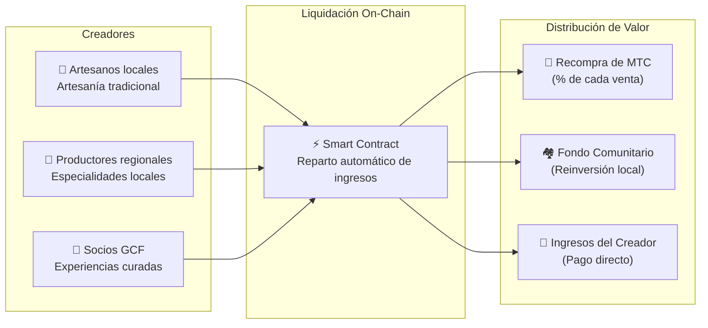

# 🗓️ Hoja de ruta y gobernanza

> **El camino hacia la certeza.**
> Este no es un proyecto especulativo a corto plazo.
> **El desarrollo de la plataforma central está completado** — estamos en fase de expansión.

---

## Hitos estratégicos

### 🔥 Fase 1: El Despertar (S1 2026 — Actual)

**Tema: Cimientos y generación de flujo de caja**

El producto está construido. El enfoque actual es la monetización a través del sistema financiero dirigido por el CEO y la garantía de liquidez inicial.

| Estado | Hito | Detalles |
| :---: | :--- | :--- |
| ✅ | **Lanzamiento de producto** | Matsuri Webapp y GCF Admin Dashboard operativos |
| ✅ | **Pagos y crecimiento** | Pagos MTC + funciones de airdrop por referidos entregados |
| ✅ | **Lanzamiento de medios** | Infraestructura de distribución J-Times (Web y Podcast) en línea |
| ✅ | **Génesis** | MTC Token Generation Event en Solana |
| ✅ | **Liquidez** | Pool LP inicial creado en Raydium |
| ⬜ | **Programa de incentivos** | Lanzamiento de liquidity mining con APY objetivo del 50 % |
| ⬜ | **Puesta en marcha** | Bot MEV/arbitraje de Solana en producción |
| ⬜ | **Captación VIP** | Selección de los primeros 20 miembros VIP del GCF |

### 🚀 Fase 2: Expansión (S2 2026)

**Tema: Activos del mundo real y Adventure Mining**

Aprovechar la webapp completada para expandir bases físicas y la funcionalidad «Peregrinación».

| Estado | Hito | Detalles |
| :---: | :--- | :--- |
| ⬜ | **Lanzamiento funcional** | Adventure Mining (Peregrinación) en línea |
| ⬜ | **Expansión global** | Bases asociadas y eventos VIP en Asia (Tailandia, Taiwán, etc.) |
| ⬜ | **Gestión de activos** | Construcción de portafolio inmobiliario, acciones y cripto a partir de ingresos |
| ⬜ | **Objetivo** | AUM total del ecosistema: **¥1.000 millones (~$6,5 M)** |

### 🌊 Fase 3: Circulación (2027+)

**Tema: Adopción masiva, economía de co-creación y descentralización**

Apertura pública, marketplace on-chain y funcionamiento completo del ecosistema.

| Estado | Hito | Detalles |
| :---: | :--- | :--- |
| ⬜ | **Gran apertura** | Lanzamiento mundial de Matsuri App |
| ⬜ | **Gran desbloqueo (1 de junio de 2027)** | Liberación del lockup del fundador + Pool de mining (550 M MTC) activo + Ciclo de halving comienza |
| ⬜ | **Marketplace de co-creación** | Tiendas de especialidades locales + tiendas asociadas GCF — liquidación on-chain con recompra automática de MTC |
| ⬜ | **Crowdfunding con derechos NFT** | Los usuarios financian proyectos culturales en Solana. Los patrocinadores reciben NFTs que representan propiedad, reparto de ingresos o derechos de gobernanza sobre el proyecto financiado |
| ⬜ | **Liquidación on-chain de tiendas** | Todas las transacciones del marketplace se liquidan mediante smart contracts — un porcentaje de cada venta fluye automáticamente al pool de recompra de MTC |
| ⬜ | **Objetivo** | AUM total del ecosistema: **¥10.000 millones (~$65 M)** |
| ⬜ | **Transición DAO** | Transferencia parcial del poder de decisión a la comunidad GCF |

#### 🏪 Visión del Marketplace de Co-Creación

La expresión máxima de "Culture OS" — un marketplace descentralizado donde **creadores y entusiastas de la cultura realizan transacciones directamente**, sin intermediarios extractivos.

| Característica | Descripción | Estado |
| :--- | :--- | :---: |
| **🏺 Tiendas de especialidades locales** | Artesanos y productores regionales venden directamente a una audiencia global. Pago con MTC = 5–10% de descuento | ⬜ Visión |
| **🎫 Crowdfunding + derechos NFT** | Financia un proyecto cultural (restauración de santuario, revitalización de festival, taller artesanal). Recibe un NFT que representa tu contribución — con posible reparto de ingresos o derechos de gobernanza | ⬜ Visión |
| **⚡ Liquidación on-chain** | Cada transacción del marketplace se liquida mediante smart contracts de Solana. Los ingresos se reparten automáticamente: pago al creador + fondo comunitario + recompra de MTC — sin contabilidad manual | ⬜ Visión |
| **🗳️ Gobernanza de patrocinadores** | Los titulares de NFT votan sobre cómo los proyectos financiados asignan recursos — verdadera co-creación, no solo donación | ⬜ Visión |

:::info Por qué esto importa
Hoy, los turistas compran recuerdos en tiendas que pagan alquiler a plataformas intermediarias. Mañana, **un artesano en la zona rural de Kioto vende directamente a un fan en Copenhague** — y un porcentaje de esa venta fortalece automáticamente la economía MTC. Este es el "efecto volante" en su máxima expresión.
:::

---

## 👤 Equipo

### Ko Takahashi — Fundador / CEO y arquitecto jefe

| Elemento | Detalles |
| :--- | :--- |
| **Rol** | Dirección general del proyecto. Diseño y desarrollo del algoritmo financiero central (Bot MEV Solana) |
| **Visión** | Creador del concepto «Exportar cultura, importar prosperidad» |
| **Actitud** | Escribe código de día, atiende su bar en Golden Gai de noche — la definición de «skin in the game» |

### Jon Anders Jensen

### Ryunosuke Honda

### 🌏 Comunidad GCF — Colaboradores de desarrollo global

Matsuri Protocol no está construido solo por el equipo fundador.
**Los miembros de GCF en todo el mundo** contribuyen a través de pruebas, comentarios, traducción y expansión regional.

| Área | Equipo |
| :--- | :--- |
| **💼 Finanzas globales** | Red de inversores privados en toda Asia |
| **⚙️ Ingeniería** | Equipo de ingeniería distribuido, blockchain y desarrollo móvil |
| **🏮 Operaciones** | Sólida red de contactos con comunidades locales de Shinjuku Golden Gai y los principales puntos turísticos |
| **🌐 Comunidad** | Miembros GCF multinacionales de Japón, Noruega, Tailandia, Taiwán y más |

:::tip Construye juntos la infraestructura de la cultura
Únete al GCF y conviértete en co-desarrollador de Matsuri Protocol.
Contribuir no es solo escribir código — presentar sitios sagrados locales, traducir documentos, organizar eventos — todo ayuda a difundir este protocolo por el mundo.
:::

### Socios estratégicos

| Área | Equipo |
| :--- | :--- |
| **💼 Finanzas globales** | Red de inversores privados en toda Asia |
| **⚙️ Ingeniería** | Equipo de ingeniería distribuido, blockchain y desarrollo móvil |
| **🏮 Operaciones** | Sólida red de contactos con comunidades locales de Shinjuku Golden Gai y los principales puntos turísticos |

---

## 🏛️ Gobernanza (DAO)

Matsuri Protocol transitará progresivamente hacia una **organización autónoma descentralizada (DAO)**.
Los miembros GCF (Platinum/Gold) tendrán **derecho a voto** en decisiones clave:

| Votación | Alcance |
| :--- | :--- |
| **💰 Asignación de fondos** | Qué nuevas iniciativas o campañas de marketing financiar |
| **⚙️ Actualizaciones del protocolo** | Ajuste fino de tasas de comisión y curvas de recompensas de mining |
| **⛩️ Certificación cultural** | Qué festivales y santuarios certificar como «lugares de peregrinación oficiales» y financiar |

:::info Únete a la revolución
No estamos construyendo solo una app.
Estamos construyendo una **economía cultural sin fronteras**.
:::

---

**[◀ Volver al inicio del whitepaper](/docs/intro)** ｜ **[Únete a Discord](#)**
