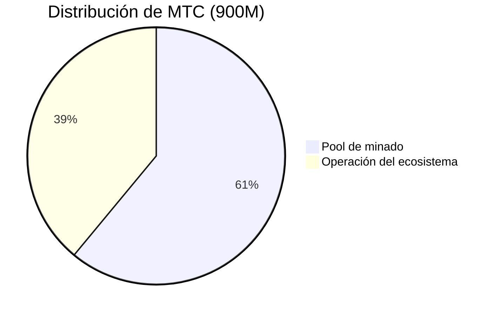
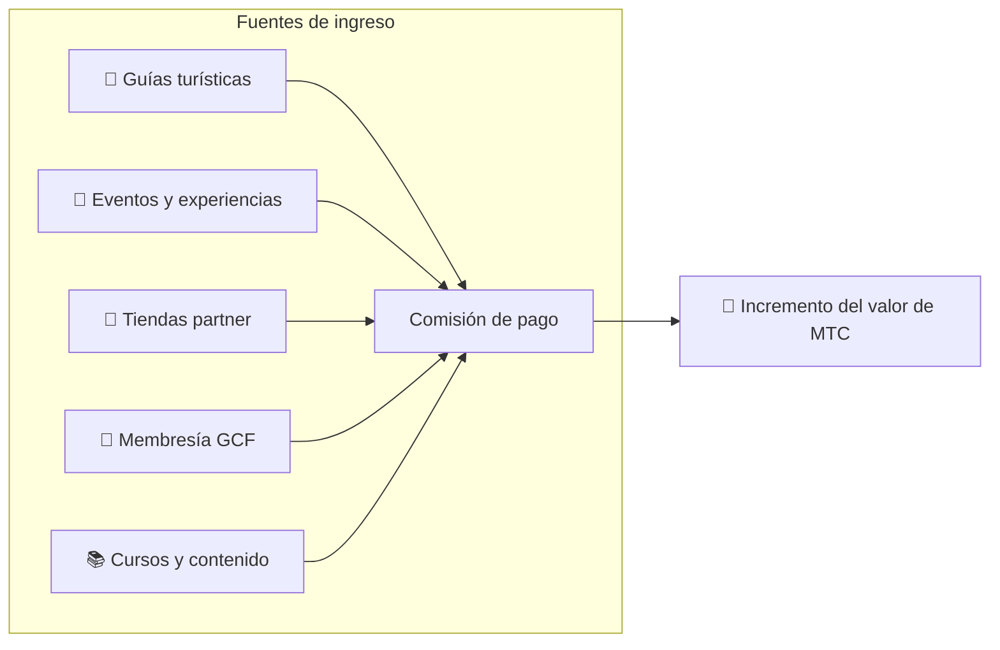

# 💰 Tokenomics — el diseño económico de MTC

> **La confianza está grabada en el código.**
> El diseño económico de MTC no depende de la promesa de nadie: está garantizado por las matemáticas y la blockchain.


> **«Un sistema económico donde el statu quo no puede alterarse por la fuerza» —— así es la tokenomics de MTC.**

El diseño económico de Matsuri Coin (MTC) se apoya en una convicción:
**las reglas que ni siquiera el equipo puede manipular son la mayor garantía para el inversor**.

Suministro fijo para siempre. Emisión adicional y congelación imposibles. El crecimiento del negocio se refleja en el precio a nivel matemático ——
esto no es una «promesa»: es un **hecho** grabado en la blockchain.

En esta página exponemos con total transparencia el mecanismo económico de MTC.

---

## Especificaciones del token

Para garantizar la seguridad de los inversores, **renunciamos de forma permanente** a los permisos de «Mint» y «Freeze» en Solana.
La emisión adicional es imposible para siempre y las wallets no pueden ser congeladas. **Diseño totalmente trustless**.

| Concepto | Detalle |
| :--- | :--- |
| **Nombre del token** | Matsuri Coin |
| **Ticker** | MTC |
| **Cadena** | Solana |
| **Dirección de minting** | `DRENpzmRWM4TwECrCPCfS1k5VBPmanhQg9bcCWP8EZXF` [Solscan →](https://solscan.io/token/DRENpzmRWM4TwECrCPCfS1k5VBPmanhQg9bcCWP8EZXF) |
| **Suministro total** | **900 millones** (900 000 000 MTC) fijo |
| **Mint Authority** | 🚫 Renunciada ([verificable on-chain](https://solscan.io/token/DRENpzmRWM4TwECrCPCfS1k5VBPmanhQg9bcCWP8EZXF)) |
| **Freeze Authority** | 🚫 Renunciada ([verificable on-chain](https://solscan.io/token/DRENpzmRWM4TwECrCPCfS1k5VBPmanhQg9bcCWP8EZXF)) |
| **Gestión de locks** | Streamflow Finance (verificado) |

:::info Por qué importa
Renunciar al Mint Authority significa que «el equipo no puede imprimir tokens a su antojo y diluir tu parte». Renunciar al Freeze Authority significa que «nadie puede congelar tu wallet». Estas son las bases del modelo trustless (sin necesidad de confianza).
:::

---

## Distribución del token

La distribución de los 900M MTC es la siguiente.



| Categoría | % | Cantidad | Uso |
| :--- | :---: | :--- | :--- |
| **⛏️ Pool de minado** | **61 %** | 550 millones | Pool de recompensas para contribuyentes. Desbloqueo en junio de 2027, con halving cada dos años. Reparto según puntuación de contribución |
| **🌐 Operación del ecosistema** | **39 %** | 350 millones | Marketing, distribución GCF, operaciones, liquidez (LP), desarrollo, publicidad, organización de eventos, etc. |

:::note Liberación del pool de minado
Los 550M MTC no se liberan de una vez. Siguen un calendario de halving de dos años y **se reparten progresivamente según la puntuación de contribución**. Las reglas de liberación y reparto se implementarán como smart contracts a finales de 2026 y serán verificables on-chain.
:::

:::note Sobre la cuota de operación del ecosistema
El 39 % de operación es un fondo polivalente necesario para el crecimiento del ecosistema. Sus usos concretos incluyen marketing, distribución inicial a miembros GCF, aportaciones al pool de liquidez en Raydium, remuneración del equipo de desarrollo, publicidad y organización de eventos culturales. La transparencia en su uso pasará a ser competencia de la gobernanza comunitaria tras la transición a DAO.
:::

---

## Estructura de ingresos

Lo que sostiene el valor de MTC son **los ingresos de negocios reales**. No es especulación: la actividad económica real respalda el valor del token.



| Fuente | Contenido |
| :--- | :--- |
| **🏯 Experiencias y guías** | Comisiones de pago de guías turísticas y eventos culturales |
| **🤝 Membresía GCF** | Cuotas de membresía |
| **📚 Contenido** | Inscripciones a cursos, suscripciones de medios |
| **🏪 Marketplace** | Comisiones de tiendas partner (ampliación progresiva) |

:::tip Crecimiento respaldado por demanda real
Cuanto más turismo receptivo, más divisas entran y más se expande el ecosistema. El valor de MTC no se decide por la especulación, sino por **el número de personas que viven la cultura**.
:::

---

## Resultados actuales del negocio

La economía MTC está aún en su fase inicial, pero ya hay actividad real.

| Indicador | Resultado |
| :--- | :--- |
| **Eventos realizados** | Más de 50 (operación de prueba) |
| **Miembros GCF Platinum** | 20 incorporados (de 50) |
| **Miembros GCF Gold** | Próximo inicio de convocatoria |
| **Plataforma web** | En marcha, captando y operando usuarios en pruebas |
| **App iOS** | Desarrollo completado, lanzamiento previsto en abril de 2026 |

:::note Hablando con honestidad
Todavía no tenemos «resultados de gran éxito». 50 eventos y operación de pruebas —— esa es la realidad hoy. Pero el producto funciona, la comunidad existe y estamos en la fase de escalar de verdad.
:::

---

## Protocolo de recompra

No tenemos intención de «meter en la caja del equipo lo que se gane».
Destinaremos un porcentaje fijo de los ingresos del negocio a la recompra de MTC en el mercado.

| Fuente | Ratio | Acción |
| :--- | :---: | :--- |
| **Ventas de Matsuri HQ** (guías / eventos) | **20 %** | **Recompra** en el mercado + aporte al pool de liquidez |
| **Membresía GCF** (cuotas) | **25 %** | **Recompra** en el mercado |

:::info Estado actual de la recompra
El protocolo de recompra **empezará a operar** a medida que se consoliden los ingresos del negocio. Al inicio se ejecutará off-chain (manualmente) y, a partir de finales de 2026, se migrará progresivamente a ejecución automática mediante smart contract. Tras la transición on-chain, el historial de recompras será verificable en la blockchain por cualquiera.
:::

La recompra no es una promesa de «algún día». Es una regla programada como protocolo. Cada vez que el negocio factura, MTC se succiona automáticamente del mercado —— esa es la **tranquilidad estructural** para el inversor.

---

## Lógica de fijación de precio

El mecanismo de revalorización de MTC no depende de expresiones de deseo, sino de **la fórmula del AMM (Automated Market Maker)**.

```
Precio = Liquidez (SOL) ÷ Suministro (MTC)
```

| Paso | Qué ocurre | Resultado |
| :---: | :--- | :--- |
| **①** | Los ingresos del negocio (SOL) entran al pool | **Sube el numerador** |
| **②** | Con ese capital se recompran y queman MTC en el mercado | **Baja el denominador** |
| **③** | Numerador ↑ × Denominador ↓ | **Se crean las condiciones para mayor escasez** |

:::info Es una descripción del mecanismo, no una garantía de precio
Esta fórmula describe un diseño estructural: «si los ingresos del negocio continúan y se ejecuta la recompra, el equilibrio oferta-demanda se mueve hacia la escasez». El precio real depende de la demanda, el entorno externo, la liquidez y muchos otros factores.
:::

---

## Calendario de halving

Los **550 millones de MTC (~61 % del suministro)** que se desbloquean el 1 de junio de 2027 no se venderán en el mercado, sino que se reservan como **pool de recompensas para contribuyentes**.

Usamos un **halving cada dos años**, más rápido que el ciclo de cuatro años de Bitcoin.
Cada dos años la emisión se divide a la mitad y, en teoría, la recompensa se mantiene durante décadas.

| Periodo | % de emisión | Cantidad emitida | Acumulado |
| :--- | :---: | :--- | :---: |
| **Era 1** 2027 – 2029 | **50 %** | ~275 millones | 50 % |
| **Era 2** 2029 – 2031 | **25 %** | ~137 millones | 75 % |
| **Era 3** 2031 – 2033 | **12,5 %** | ~68 millones | 87,5 % |
| **Era 4** 2033 – 2035 | **6,25 %** | ~34 millones | 93,75 % |
| **Era 5+** | Sigue el halving | Descenso progresivo | → tiende al 100 % |

<small>*※ Matemáticamente nunca se alcanza el 100 %; la emisión se aproxima a cero. Es el mismo principio que Bitcoin.*</small>

:::tip Cuanto antes contribuyas, más MTC recibirás
Por el halving, la emisión de la Era 1 (2027–2029) es la mayor; a medida que avanzan las épocas, la cantidad por vez se reduce. Es decir, **quienes acumulen puntos de contribución desde el principio recibirán más MTC**.

Ejemplos de actividades que suman puntos:
- Creación y convocatoria de eventos
- Operación de cursos de guía populares
- Introducción y formación de buenos guías
- Visualizaciones y shares de contenido J-Times
- Check-ins de peregrinación a lugares sagrados

Las recompensas no se deciden por el «orden de llegada», sino por **«cuánto contribuyes»**.
:::

---

:::note Siguiente página
Si has entendido el diseño económico de MTC, toca ver **cómo participar como socio**.
**[Membresía GCF →](/docs/gcf)**
:::
