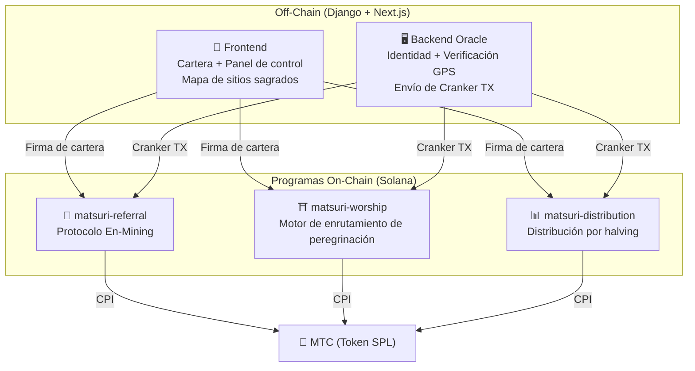
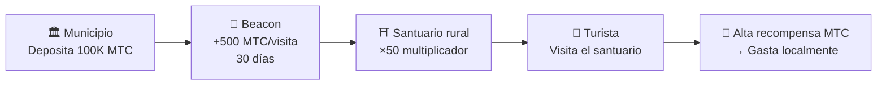
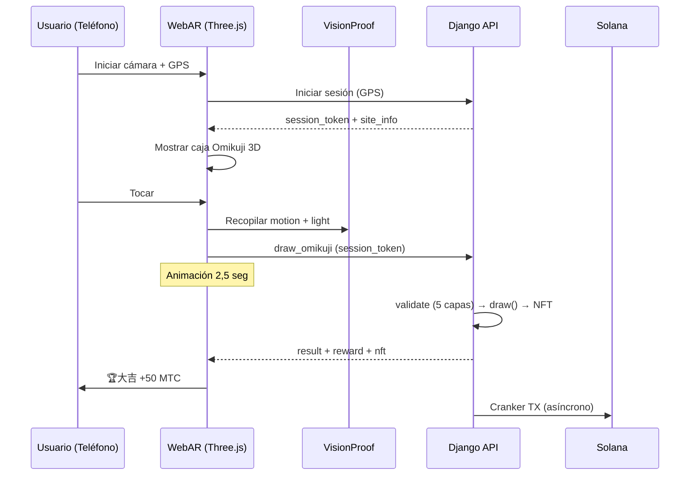

# ⚡ Contratos Inteligentes — Arquitectura de código abierto

> **Diseño sin necesidad de confianza (Trustless).**
> Toda la lógica de recompensas, árboles de referidos y calendarios de halving se ejecutan **en cadena** mediante programas Rust auditables.
> Código fuente: [GitHub](https://github.com/Cootakahashi/matsuri-contracts)

---

## Descripción general

Matsuri despliega **tres programas Anchor (Rust)** en Solana, cada uno gestionando un pilar distinto del ecosistema:



---

## 1. 📣 Protocolo En-Mining (縁マイニング)

**Propósito:** Un motor de crecimiento híbrido que recompensa tanto la *amplitud* (alcance de referidos) como la *profundidad* (impacto económico). No es solo un programa de afiliados — es un protocolo de minería completo donde la actividad económica del mundo real genera valor on-chain.

### Diseño de Puntuación

La puntuación de contribución se basa en dos componentes ponderados:

| Componente | Peso | Propósito |
| :--- | :---: | :--- |
| **Amplitud** (número de referidos) | 30% | Alcance de red — cuántas personas traes |
| **Profundidad** (volumen de liquidación) | 70% | Impacto económico — compras reales, no solo registros |

Las puntuaciones se acumulan con el tiempo y se convierten en MTC en cada época de halving. Se planean mecanismos de impulso adicionales:

| Impulso | Descripción | Estado |
| :--- | :--- | :---: |
| **Staking Toku (徳)** | Bloquea MTC para aumentar tu puntuación de contribución (hasta ~50% de impulso). Los niveles y multiplicadores exactos se calibrarán en base al calendario de liberación del pool de halving | ⬜ Coeficientes por definir |
| **Clasificaciones por temporada** | Los mejores de cada época obtienen el título de **Evangelista** (SBT permanente) y un impulso de puntuación. Los porcentajes exactos se determinarán mediante gobernanza | ⬜ Coeficientes por definir |

:::info Diseño Progresivo de Parámetros
Los coeficientes de impulso (niveles de staking, bonificaciones por clasificación) se dejan intencionalmente ajustables. Se finalizarán en base a datos reales del ecosistema — total de usuarios activos, tasa de liberación del pool de halving y objetivos de estabilidad de precios — y luego se fijarán en los contratos inteligentes. Este enfoque asegura una **distribución justa** sin prometer rendimientos fijos.
:::

### Defensa anti-Sybil (3 capas)

| Capa | Mecanismo | Ubicación |
| :--- | :--- | :--- |
| **Puerta de identidad** | X/Twitter OAuth + SMS | Off-chain (Django) |
| **Puerta on-chain** | Solo perfiles con `is_verified = true` ganan | Contrato inteligente |
| **Ponderación de profundidad** | 70% de la puntuación = pagos reales → los bots no ganan nada | Motor de puntuación |

---

## 2. ⛩️ Motor de enrutamiento de peregrinación (Worship Routing Engine)

**Propósito:** El primer **protocolo ReFi del mundo que resuelve el sobreturismo usando economía de tokens.** Visita sitios sagrados → gana MTC. Pero aquí está el giro: *los sitios menos visitados pagan exponencialmente más.*

:::tip La clave
Es el «surge pricing inverso de Uber» — los sitios concurridos son penalizados, los sitios fronterizos obtienen bonificaciones. Los turistas se dirigen a ubicaciones menos visitadas porque **es más rentable.**
:::

### Principios de Diseño de Recompensas

La puntuación de contribución para cada visita se determina por múltiples factores:

| Factor | Principio | Efecto |
| :--- | :--- | :--- |
| **Popularidad del sitio** | Los sitios menos visitados otorgan puntuaciones más altas | Dirige turistas lejos de áreas sobresaturadas |
| **Momento de la visita** | Los primeros visitantes del día obtienen puntuación más alta | Fomenta visitas fuera de horas pico |
| **Nivel regional** | Los sitios rurales y fronterizos tienen el mayor rango | Impulsa la revitalización regional |
| **Frecuencia de visita** | Los visitantes regulares acumulan puntuaciones de bonificación | Recompensa el compromiso constante |
| **Fortuna Omikuji** | Sorteo de bonificación aleatorio en cada registro | Capa de gamificación divertida |
| **Impulsos patrocinados** | Los municipios pueden impulsar sitios específicos | Modelo de ingresos B2B/B2G |

:::info Los Coeficientes Son Ajustables
Los multiplicadores exactos para cada factor (ej. cuánto más gana un sitio rural vs. uno principal) se **calibrarán en base al calendario del pool de halving** y datos reales de uso, luego se fijarán progresivamente en los contratos inteligentes. El principio de diseño es fijo — los coeficientes evolucionan con el ecosistema.
:::

### Beacons Patrocinados (B2B/B2G)

Municipios, compañías ferroviarias y juntas de turismo pueden **depositar MTC** para crear zonas de alta recompensa temporales en sitios específicos.



---

## 3. 📊 Distribución por halving

**Propósito:** 550M MTC distribuidos a lo largo de décadas mediante un **ciclo de halving de 2 años**.

### Calendario de halving

```
Pool total: 550.000.000 MTC

Época 0 (2027–2029):  275.000.000 MTC  (50%)
Época 1 (2029–2031):  137.500.000 MTC  (25%)
Época 2 (2031–2033):   68.750.000 MTC  (12,5%)
Época 3 (2033–2035):   34.375.000 MTC  (6,25%)
∑ → 550.000.000 MTC (total asintótico)
```

### Fórmula de recompensa individual

```
your_reward = epoch_budget × (your_score / total_score)
```

Toda la aritmética usa **computación intermedia de 128 bits** — matemáticamente imposible de desbordar.

### Fuentes de puntuación

| Actividad | Peso |
| :--- | :--- |
| **Sesiones de guía** | Alto |
| **Venta de entradas** | Alto |
| **Red de referidos** | Medio |
| **Minería de peregrinación** | Medio |
| **Participación en medios** | Bajo |

:::info Avance de época sin permisos
La instrucción `advance_epoch` puede ser llamada por **cualquiera** — no se necesita administrador.
:::

---

## 4. 🎴 Minería AR — WebAR Omikuji Mining

**Propósito:** Haz que los Omikuji AR aparezcan en el espacio real solo con el navegador del smartphone para minar MTC. **No requiere descarga de app.** La primera infraestructura WebAR × Blockchain del mundo.

### Arquitectura



### Optimistic UI (espera cero)

| Paso | Tiempo | Procesamiento |
|---------|------|------|
| Tocar → Efecto | 0ms | Animación inmediata |
| API draw_omikuji | ~50ms | Django sortea + NFT |
| Efecto completado | 2500ms | Resultado → Mostrar |
| Solana TX | ~400ms | En segundo plano |

### Configuración Omikuji (Admin GCF)

Puntos base (10000 = 100%) con precisión del 0,01%. Ajustable desde el panel de Admin GCF.

| Grado | Rareza | Bono | NFT |
|------|-----------|---------|-----|
| 🏆 大吉 | Rara | Mayor bonificación | ✅ |
| ✨ 吉 | Poco común | Alta bonificación | Opcional |
| 🌸 小吉 | Común | Pequeña bonificación | — |
| 🍃 末吉 | Común | Participación registrada | — |
| 💀 凶 | Poco común | Participación registrada | — |

Las probabilidades y coeficientes de recompensa se finalizarán progresivamente en base a la escala del ecosistema y la cantidad de liberación del halving, e implementarán en los contratos inteligentes.

### ZK-Proof of Vision (5 capas)

Elimina la suplantación de GPS y ataques de repetición. **No se envían datos de cámara** al servidor.

| Capa | Verificación | Puntos |
|-------|---------|------|
| Temporal | Sesión 5-120 seg | /20 |
| Motion | Giroscopio 0,005-0,5 | /20 |
| Light | Luz × hora del día | /20 |
| HMAC | Firma proof_hash | /20 |
| Fingerprint | Unicidad del dispositivo | /20 |
| **Total** | **Umbral PASS** | **60/100** |

### Diseño de Recompensas

Las recompensas se registran como una **puntuación de contribución** basada en múltiples factores, incluyendo el tipo de sitio, el resultado del Omikuji y el nivel regional. Los coeficientes específicos se finalizarán progresivamente de acuerdo con el calendario de liberación del halving y el crecimiento del ecosistema, e implementarán en los contratos inteligentes.

---

## Módulos matemáticos (Código abierto)

Todos los programas separan la lógica de puntuación/recompensas en **módulos `math.rs` puros y auditables** con:

- **Cero efectos secundarios** — sin I/O, sin asignaciones, sin llamadas externas
- **Fórmulas documentadas** — notación LaTeX en rustdoc
- **Análisis de desbordamiento** — valores intermedios u128 con límites probados
- **Pruebas exhaustivas** — casos extremos, condiciones límite, verificación de ratios
- **Coeficientes ajustables** — los parámetros de recompensa están diseñados para ser actualizables mediante gobernanza, permitiendo una calibración progresiva a medida que el ecosistema crece

---

## Modelo de seguridad (Código abierto)

Contratos **totalmente de código abierto.** Seguridad basada en garantías matemáticas.

| Principio | Implementación |
| :--- | :--- |
| **Bóvedas PDA** | Controladas por PDA — ninguna clave humana puede drenarlas |
| **Aritmética verificada** | `checked_*` — desbordamiento imposible |
| **Separación de autoridad** | Admin (multisig) ≠ Cranker ≠ Usuario |
| **Pausa de emergencia** | Admin puede pausar; no puede robar fondos |
| **Tokenomics inmutables** | Halving, pool total y duración de épocas fijados una vez |
| **Módulos matemáticos puros** | Lógica separada en bibliotecas auditables |
| **Vision Proof** | Anti-spoofing de 5 capas sin datos de cámara |

---

**[◀ Volver a la hoja de ruta](/docs/roadmap)** ｜ **[Ver código fuente](https://github.com/Cootakahashi/matsuri-contracts)**
