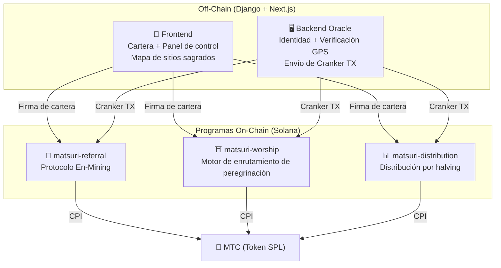
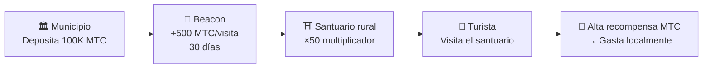
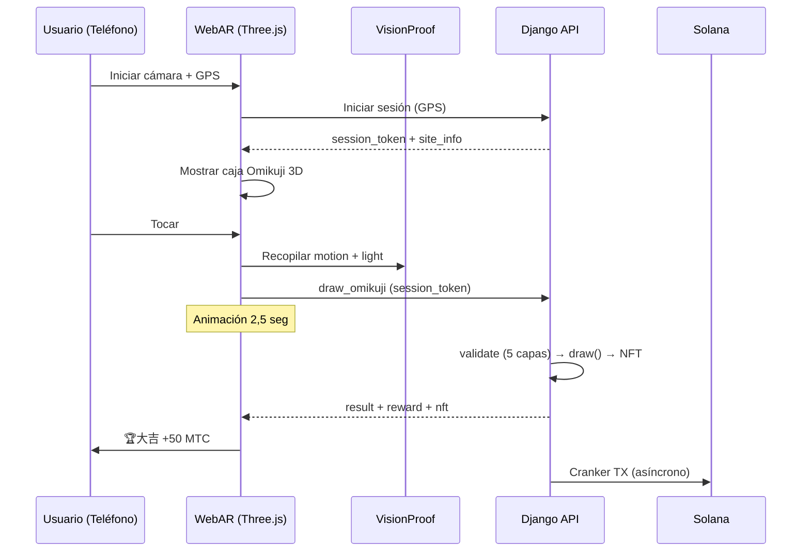

# ⚡ Contratos Inteligentes — Arquitectura de código abierto

> **Diseño sin necesidad de confianza (Trustless).**
> Toda la lógica de recompensas, árboles de referidos y calendarios de halving se ejecutan **en cadena** mediante programas Rust auditables.
> Código fuente: [GitHub](https://github.com/Cootakahashi/matsuri-contracts)

---

## Descripción general

Matsuri despliega **tres programas Anchor (Rust)** en Solana, cada uno gestionando un pilar distinto del ecosistema:



---

## 1. 📣 Protocolo En-Mining (縁マイニング)

**Propósito:** Un motor de crecimiento híbrido que recompensa tanto la *amplitud* (alcance de referidos) como la *profundidad* (impacto económico). No es solo un programa de afiliados — es un protocolo de minería completo donde la actividad económica del mundo real genera valor on-chain.

### Fórmula de puntuación

```
S_final = S_raw × M_toku × B_title

where:
  S_raw   = 0.30 × referidos + 0.70 × (volumen / 10^9)
  M_toku  = f(mtc_apostado) ∈ [1.0×, 10.0×]
  B_title = 1.0 + min(temporadas_clasificado × 0.05, 0.50)
```

| Componente | Peso | Propósito |
| :--- | :---: | :--- |
| **Amplitud** (número de referidos) | 30% | Alcance de red — cuántas personas traes |
| **Profundidad** (volumen de liquidación) | 70% | Impacto económico — compras reales, no solo registros |
| **Multiplicador Toku** | ×1–10 | Bloquea MTC para aumentar la potencia de minería |
| **Impulso de título** | +5%/temporada | Recompensa permanente para los mejores rendimientos consistentes |

### Niveles de staking Toku (徳)

| MTC apostado | Multiplicador | Nivel |
| :--- | :---: | :--- |
| 0 | 1.0× | — |
| 1.000+ | 1.5× | Bronce |
| 10.000+ | 3.0× | Plata |
| 100.000+ | 5.0× | Oro |
| 1.000.000+ | 10.0× | Diamante |

### En no Banzuke (Clasificación por temporada)

Cada temporada (época), los mejores rendimientos se clasifican. Beneficios:
- El 10% superior obtiene el título de **Evangelista** (marca SBT permanente)
- Cada temporada clasificada otorga **+5% de impulso de minería** (acumulativo, tope: 50%)

### Defensa anti-Sybil (3 capas)

| Capa | Mecanismo | Ubicación |
| :--- | :--- | :--- |
| **Puerta de identidad** | X/Twitter OAuth + SMS | Off-chain (Django) |
| **Puerta on-chain** | Solo perfiles con `is_verified = true` ganan | Contrato inteligente |
| **Ponderación de profundidad** | 70% de la puntuación = pagos reales → los bots no ganan nada | Motor de puntuación |

---

## 2. ⛩️ Motor de enrutamiento de peregrinación (Worship Routing Engine)

**Propósito:** El primer **protocolo ReFi del mundo que resuelve el sobreturismo usando economía de tokens.** Visita sitios sagrados → gana MTC. Pero aquí está el giro: *los sitios menos visitados pagan exponencialmente más.*

:::tip La clave
Es el «surge pricing inverso de Uber» — los sitios concurridos son penalizados, los sitios fronterizos obtienen bonificaciones. Los turistas se dirigen a ubicaciones menos visitadas porque **es más rentable.**
:::

### Fórmula de recompensas de 6 capas

```
R_final = R_pioneer × M_dynamic × M_regional × M_streak × M_omikuji

where:
  R_pioneer  = daily_pool / visit_order     (decaimiento armónico 1/n)
  M_dynamic  = controlado por admin ∈ [0.1×, 50×]
  M_regional = tier_table[tier] ∈ {1×, 2×, 5×, 10×}
  M_streak   = 1.0 + min(days × 0.02, 0.50)
  M_omikuji  = lotería de la fortuna ∈ {1.0, 1.2, 1.5, 3.0}
```

### Capa 1: Bonificación de pionero

| Orden de visita | Recompensa vs 1.º | Ejemplo real (pool de 1000 MTC) |
| :---: | :---: | :--- |
| 1.º | 100% | 1.000 MTC |
| 5.º | 20% | 200 MTC |
| 10.º | 10% | 100 MTC |
| 100.º | 1% | 10 MTC |

> **El primer visitante = 100× más recompensa que el 100.º.**

### Capa 2: Multiplicador dinámico

| Escenario | Multiplicador | Efecto |
| :--- | :---: | :--- |
| **Sobreturismo** | 0.1× | 90% de penalización |
| **Normal** | 1.0× | Estándar |
| **Poco visitado** | 10× | 10× impulso |
| **Campaña fronteriza** | 50× | Incentivo máximo |

### Capa 3: Nivel regional

| Nivel | Etiqueta | Mult. | Ejemplos |
| :---: | :--- | :---: | :--- |
| 0 | 🏙️ Principal | 1× | 浅草寺, 清水寺, 伏見稲荷 |
| 1 | 🌆 Medio | 2× | Santuarios principales regionales |
| 2 | 🏞️ Rural | 5× | Templos históricos del campo |
| 3 | ⛰️ Oculto | 10× | Templos de montaña, santuarios insulares |

### Capa 4: Bonificación por racha

+2% por día consecutivo, tope +50%.

### Capa 5: 🎲 Protocolo Omikuji

| Resultado | Probabilidad | Multiplicador |
| :--- | :---: | :---: |
| 🏆 **大吉** | 5% | 3.0× |
| ✨ **吉** | 15% | 1.5× |
| 🌸 **小吉** | 30% | 1.2× |
| 🍃 **末吉** | 35% | 1.0× |
| 💀 **凶** | 15% | 1.0× |

### Capa 6: Beacons patrocinados (B2B/B2G)

Municipios y juntas de turismo pueden **depositar MTC** para crear zonas de alta recompensa temporales.



---

## 3. 📊 Distribución por halving

**Propósito:** 550M MTC distribuidos a lo largo de décadas mediante un **ciclo de halving de 2 años**.

### Calendario de halving

```
Pool total: 550.000.000 MTC

Época 0 (2027–2029):  275.000.000 MTC  (50%)
Época 1 (2029–2031):  137.500.000 MTC  (25%)
Época 2 (2031–2033):   68.750.000 MTC  (12,5%)
Época 3 (2033–2035):   34.375.000 MTC  (6,25%)
∑ → 550.000.000 MTC (total asintótico)
```

### Fórmula de recompensa individual

```
your_reward = epoch_budget × (your_score / total_score)
```

Toda la aritmética usa **computación intermedia de 128 bits** — matemáticamente imposible de desbordar.

### Fuentes de puntuación

| Actividad | Peso |
| :--- | :--- |
| **Sesiones de guía** | Alto |
| **Venta de entradas** | Alto |
| **Red de referidos** | Medio |
| **Minería de peregrinación** | Medio |
| **Participación en medios** | Bajo |

:::info Avance de época sin permisos
La instrucción `advance_epoch` puede ser llamada por **cualquiera** — no se necesita administrador.
:::

---

## 4. 🎴 Minería AR — WebAR Omikuji Mining

**Propósito:** Haz que los Omikuji AR aparezcan en el espacio real solo con el navegador del smartphone para minar MTC. **No requiere descarga de app.** La primera infraestructura WebAR × Blockchain del mundo.

### Arquitectura



### Optimistic UI (espera cero)

| Paso | Tiempo | Procesamiento |
|---------|------|------|
| Tocar → Efecto | 0ms | Animación inmediata |
| API draw_omikuji | ~50ms | Django sortea + NFT |
| Efecto completado | 2500ms | Resultado → Mostrar |
| Solana TX | ~400ms | En segundo plano |

### Probabilidades Omikuji (Admin GCF)

Puntos base (10000 = 100%) con precisión del 0,01%.

| Grado | Valor | Mult. | NFT |
|------|-----------|---------|-----|
| 🏆 大吉 | 5,00% | ×3.0 | ✅ |
| ✨ 吉 | 15,00% | ×1.5 | Opcional |
| 🌸 小吉 | 30,00% | ×1.2 | — |
| 🍃 末吉 | 35,00% | ×1.0 | — |
| 💀 凶 | 15,00% | ×1.0 | — |

### ZK-Proof of Vision (5 capas)

Elimina la suplantación de GPS y ataques de repetición. **No se envían datos de cámara** al servidor.

| Capa | Verificación | Puntos |
|-------|---------|------|
| Temporal | Sesión 5-120 seg | /20 |
| Motion | Giroscopio 0,005-0,5 | /20 |
| Light | Luz × hora del día | /20 |
| HMAC | Firma proof_hash | /20 |
| Fingerprint | Unicidad del dispositivo | /20 |
| **Total** | **Umbral PASS** | **60/100** |

### Fórmula de recompensas

```
Reward = Base(10 MTC) × SiteMultiplier × OmikujiMult × TierMult

TierMult = { Principal: 1.0, Medio: 2.0, Rural: 5.0, Oculto: 10.0 }
```

---

## Módulos matemáticos (Código abierto)

Módulos `math.rs` puros y auditables:

- **Cero efectos secundarios** — sin I/O, sin asignaciones
- **Fórmulas documentadas** — notación LaTeX en rustdoc
- **Análisis de desbordamiento** — valores intermedios u128
- **Pruebas exhaustivas** — casos extremos y límites

```rust
// Ejemplo: Bonificación de Pionero (worship/math.rs)
#[inline]
pub fn pioneer_reward(daily_pool: u64, visit_order: u32) -> u64 {
    if visit_order == 0 { return 0; }
    (daily_pool as u128 / visit_order as u128) as u64
}
```

---

## Modelo de seguridad (Código abierto)

Contratos **totalmente de código abierto.** Seguridad basada en garantías matemáticas.

| Principio | Implementación |
| :--- | :--- |
| **Bóvedas PDA** | Controladas por PDA — ninguna clave humana puede drenarlas |
| **Aritmética verificada** | `checked_*` — desbordamiento imposible |
| **Separación de autoridad** | Admin (multisig) ≠ Cranker ≠ Usuario |
| **Pausa de emergencia** | Admin puede pausar; no puede robar fondos |
| **Tokenomics inmutables** | Halving, pool total y duración de épocas fijados una vez |
| **Módulos matemáticos puros** | Lógica separada en bibliotecas auditables |
| **Vision Proof** | Anti-spoofing de 5 capas sin datos de cámara |

---

**[◀ Volver a la hoja de ruta](/docs/roadmap)** ｜ **[Ver código fuente](https://github.com/Cootakahashi/matsuri-contracts)**
