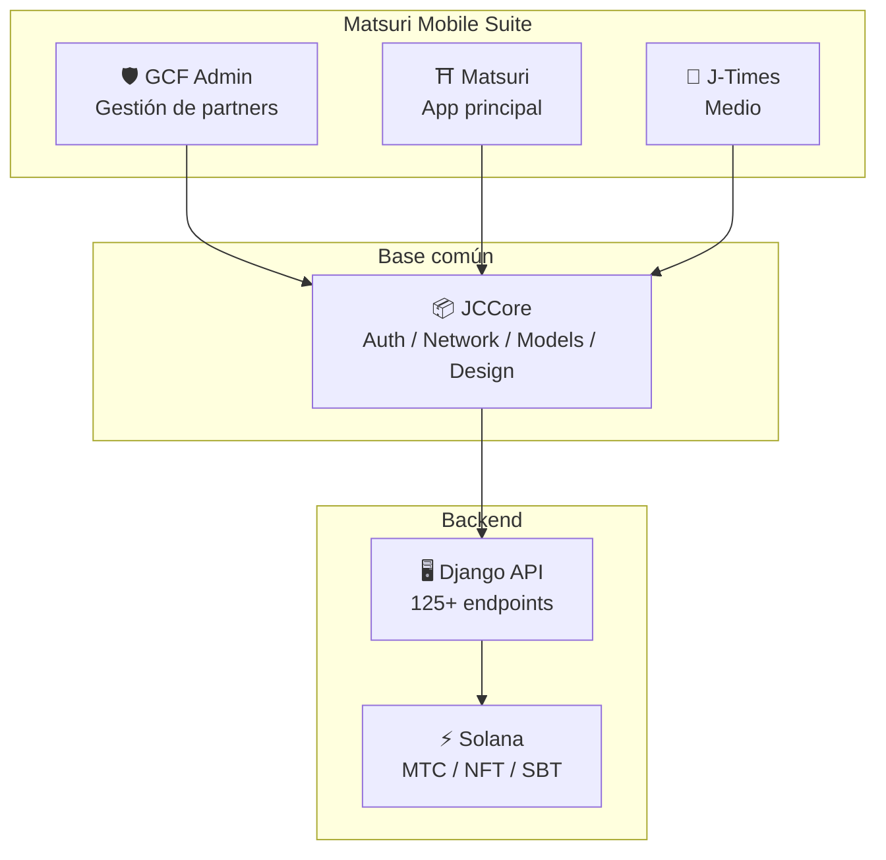
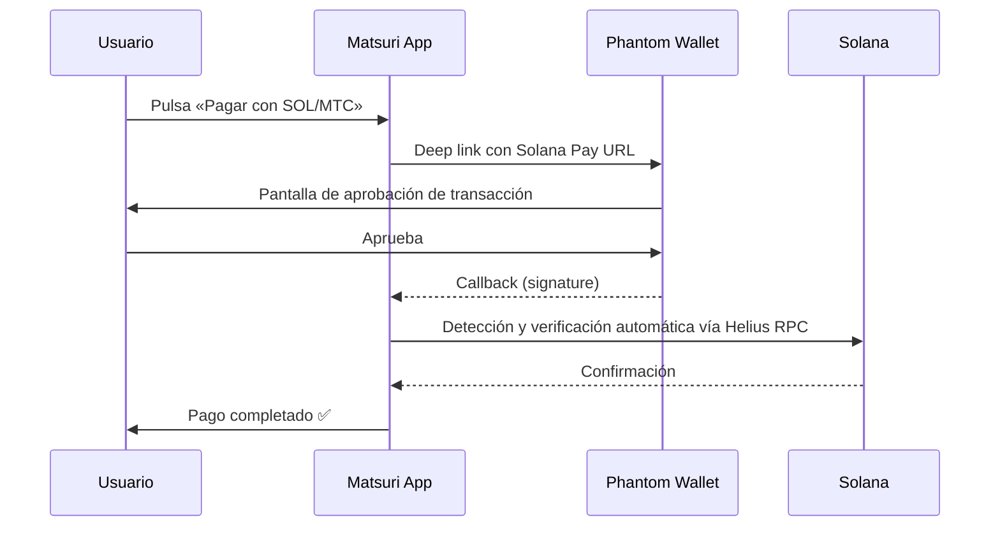
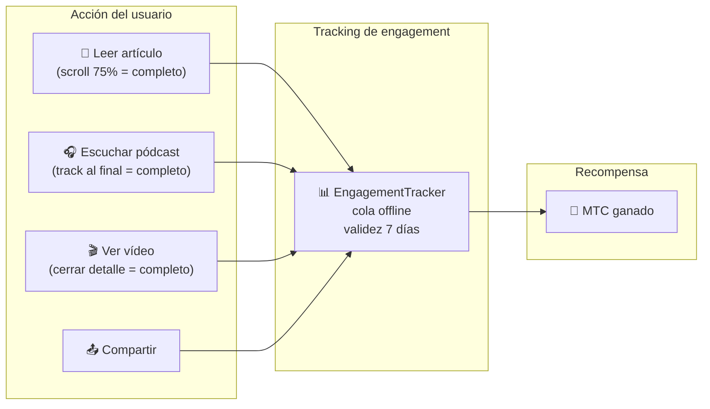
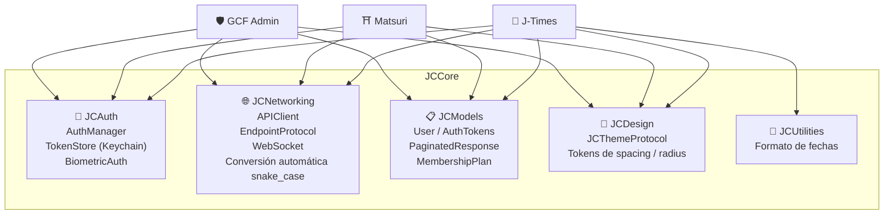
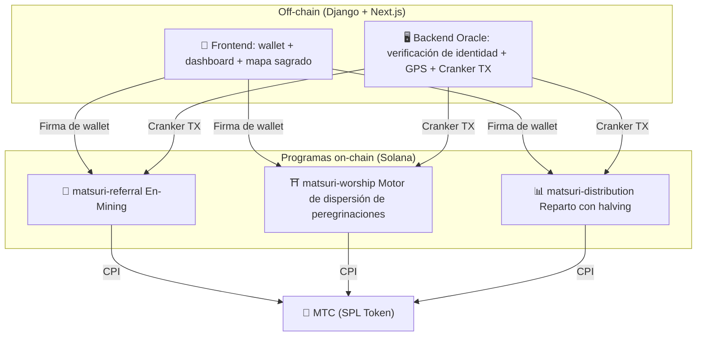
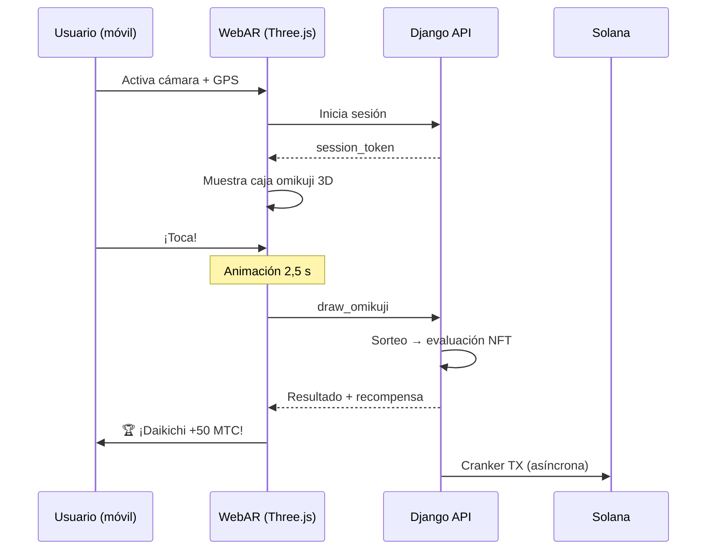

import useBaseUrl from '@docusaurus/useBaseUrl';

# 🔧 Producto y tecnología —— lo que ya funciona lo demuestra todo

> **Lo que ya funciona lo demuestra todo.**
> Nuestro propósito no se queda en palabras. La plataforma web ya opera y las apps iOS están en la recta final.

La app web y el panel de gestión están **en producción**. Las tres apps iOS nativas están listas y se lanzan en abril de 2026. Los smart contracts en Solana son de código abierto —— no hablamos con maquetas sino con **código en funcionamiento y producto a punto de llegar**.

---

## Listado de apps

| App | Uso | Estado | Idiomas |
| :--- | :--- | :---: | :--- |
| **GCF Admin** | Gestión de partners / operaciones | ✅ Lanzada | 🇯🇵🇬🇧🇨🇳🇹🇭🇳🇴 |
| **Matsuri** | App principal para usuarios | 🔜 Abril 2026 | 🇯🇵🇬🇧🇨🇳🇹🇭🇳🇴 |
| **J-Times** | Medio cultural y aprendizaje | 🔜 Abril 2026 | 🇯🇵🇬🇧 |

---

## 1. 🛡️ GCF Admin — app de gestión de partners

:::info Estado: lanzada en App Store (v1.0)
App de gestión de negocio para miembros GCF (Global Community Friends). Todas las funciones del panel web concentradas en móvil.
:::

  

  
  
  

### Lo que se puede hacer

| Categoría | Función |
| :--- | :--- |
| **📊 Dashboard** | Tarjetas de KPI, gráficas de ventas, acciones rápidas |
| **👥 Gestión de miembros** | Lista, detalle, edición, gestión de nivel |
| **💰 Gestión de ingresos** | Tracking de comisiones, retiros MTC, payouts |
| **📝 Gestión de contenido** | Crear, editar y publicar eventos, artículos, pódcasts y vídeos |
| **🎫 Slots de guía** | Gestión de cupos y seguimiento de ingresos |
| **🖼️ Dashboard NFT** | Founder's Collection, verificación on-chain, transferencias |
| **⛩️ Gestión de lugares sagrados** | CRUD de sitios, configuración de beacons |
| **🎲 Ajustes AR Mining** | Tablas de probabilidad omikuji y parámetros de recompensa |
| **📊 Analítica** | Informes de errores, análisis de uso |
| **🔗 Referidos** | Generación de QR personalizados, gestión del programa |

### Especificaciones técnicas

| Concepto | Detalle |
| :--- | :--- |
| **Arquitectura** | Clean Architecture + MVVM + `@Observable` (iOS 17) |
| **Lenguaje / SDK** | Swift 6.0 / Xcode 16+ / iOS 17.0+ |
| **API** | Más de 125 endpoints |
| **Tests** | 226 tests / 45 clases de test |
| **Localización** | 5 idiomas (ja/en/zh/th/no) / más de 957 claves |
| **Swift Concurrency** | Conformidad Strict / cero warnings en build |

### Integración con QR

GCF Admin permite generar QR personalizados con el logo Matsuri. Ideal para invitaciones a eventos, enlaces de referido, solicitudes de pago y más.

---

## 2. ⛩️ Matsuri — app principal

:::info Estado: lanzamiento previsto a finales de abril de 2026 (v3.0)
App principal para el usuario general. Reserva de eventos, pagos, wallet Web3 y minado AR, todo en una sola app.
:::

  
  
  

### Lo que se puede hacer

| Categoría | Función |
| :--- | :--- |
| **🎪 Reserva de eventos** | Búsqueda, reserva, pago Stripe, gestión QR de entradas |
| **💳 4 medios de pago** | Tarjeta / tarjeta guardada / saldo MTC / cripto (SOL/MTC) |
| **👛 Wallet Web3** | Saldo MTC, envío/recepción, historial de transacciones |
| **🖼️ Galería NFT** | Listado de NFT/SBT, verificación on-chain |
| **🗺️ Mapa sagrado** | Visualización de templos y santuarios, check-in |
| **🎲 Minado AR** | Experiencia omikuji WebAR, obtención de MTC |
| **💬 Chat** | Mensajería con menú contextual |
| **⭐ Wishlist** | Favoritos de eventos y experiencias |
| **🔍 Búsqueda avanzada** | Con soporte de voz |
| **🤝 Referidos** | Participación en el programa y tracking |
| **📊 Dashboard GCF** | Panel ligero para miembros GCF |

### Integración con Phantom Wallet — pago cripto sin tecleo

>**Sin copiar ni pegar direcciones.** Phantom Wallet se abre solo; apruebas y listo. La firma se detecta automáticamente vía Helius RPC.

### Especificaciones técnicas

| Concepto | Detalle |
| :--- | :--- |
| **Arquitectura** | Clean Architecture + MVVM + Swift Concurrency |
| **Lenguaje / SDK** | Swift 6.0 / Xcode 16+ / iOS 17.0+ |
| **Pagos** | Stripe PaymentSheet + saldo MTC + Phantom (Solana Pay) |
| **API** | 72 endpoints / 16 categorías |
| **Tests** | Más de 230 (Model, ViewModel, Network, Security, DeepLink, E2E) |
| **Localización** | 5 idiomas (ja/en/zh/th/no) / 406 claves |
| **Nº de ViewModels** | 25 (MVVM total — sin llamadas API directas desde View) |
| **Autenticación** | Apple Sign In / Google Sign In (PKCE) |

---

## 3. 📰 J-Times — app de medios culturales

:::info Estado: lanzamiento previsto a finales de abril de 2026
Plataforma que transmite la profundidad de la cultura japonesa. Lee, escucha pódcasts, mira vídeos —— toda acción otorga MTC.
:::

  

  
  

### Lo que se puede hacer

| Categoría | Función |
| :--- | :--- |
| **📖 Artículos** | Héroe en parallax, capitular, barra de progreso, contenido rico (Markdown, tablas, citas) |
| **🎧 Pódcast** | Navegación por series, reproductor con forma de onda, temporizador, AirPlay, controles en pantalla de bloqueo |
| **🎬 Vídeo** | Grid/lista adaptativos, shorts (estilo TikTok, doble tap) |
| **🔍 Búsqueda** | Multifiltros, tags en tendencia, búsqueda por voz |
| **🧭 Descubrimiento** | Carrusel destacado, selección del equipo, populares de la semana |
| **📚 Biblioteca** | Favoritos, historial por fecha, descargas, playlists |
| **🎵 Reproductor de audio** | Mini player (gestos), full player (onda, letras, repetición) |
| **👤 Membresía** | 3 niveles (Free/Premium/Pro), comparativa, restauración |

### Media Mining —— leer, escuchar y ver se convierte en minado

>**Se registra también sin conexión.** Leer en un santuario de montaña sin señal también cuenta: al reconectar se envía el engagement y se otorga MTC.

### Sistema de diseño —— los «cuatro pilares» del gusto japonés

J-Times lleva al UI moderno la estética tradicional japonesa con un sistema propio.

| Pilar | Concepto | Aplicación UI |
| :--- | :--- | :--- |
| **墨 (Sumi)** | Gris neutro cálido | Fondos, jerarquía de texto |
| **朱 (Shu)** | Rojo japonés (#C53030) | Color acento, acciones clave |
| **間 (Ma)** | Espacio en rejilla de 4pt | Espaciado, respiración |
| **紙 (Kami)** | Textura sutil, glassmorphism | Superficies, profundidad |

### Especificaciones técnicas

| Concepto | Detalle |
| :--- | :--- |
| **Arquitectura** | Clean Architecture + MVVM + Swift Concurrency |
| **Lenguaje / SDK** | Swift 6.0 / Xcode 16+ / iOS 17.0+ |
| **Dependencias externas** | **Ninguna** —— solo frameworks nativos de Apple |
| **API** | Más de 40 endpoints |
| **Tests** | 371 tests / 20 archivos |
| **Localización** | 2 idiomas (ja/en) / más de 310 claves |
| **Offline** | ContentCache (50MB) + ImageDiskCache (200MB) + gestor de descargas |
| **Autenticación** | Apple Sign In / Google Sign In (PKCE) |

---

## Base común: la librería JCCore

Swift Package compartido por las tres apps.

| Módulo | Rol |
| :--- | :--- |
| **JCAuth** | Gestión de tokens con Keychain, biometría (Face ID / Touch ID) |
| **JCNetworking** | Cliente API tipado, WebSocket, conversión JSON a snake_case |
| **JCModels** | Modelos comunes a las apps (User, AuthTokens, etc.) |
| **JCDesign** | Protocolos de tema, design tokens (spacing, radius) |
| **JCUtilities** | Utilidades de fecha y cadenas |

---

## Seguridad y privacidad

| Concepto | Implementación |
| :--- | :--- |
| **Tokens de autenticación** | Cifrados en iOS Keychain (TokenStore) |
| **Biometría** | 2FA con Face ID / Touch ID |
| **Comunicación API** | HTTPS + Certificate Pinning |
| **Clave privada de wallet** | No se guarda en la app — delegada a Phantom Wallet |
| **Minado AR** | Las imágenes de cámara no se envían al servidor (VisionProof) |
| **Datos offline** | SwiftData cifrado + expiración automática |
| **Swift Concurrency** | Aislamiento por actors para evitar race conditions |

---

## Calidad del desarrollo

### Apps móviles: más de **827 tests automáticos** en total entre las 3 apps.

| App | Tests | Cobertura |
| :--- | :---: | :--- |
| **GCF Admin** | 226 | Model, ViewModel, Repository, API, Localization, Navigation |
| **Matsuri** | 230+ | Model, ViewModel, Network, Security, DeepLink, Regression, Performance, E2E |
| **J-Times** | 371 | Model, ViewModel, API, Repository, Navigation, Localization, Security, Performance |

### Smart contracts: cobertura en ampliación progresiva

Para los programas Rust sobre Solana, comenzamos con los tests unitarios de la lógica nuclear (módulo matemático) y ampliamos progresivamente la cobertura de cara a la auditoría de seguridad (Q2–Q3 2026).

---

## Smart contracts — diseño open source

>**Filosofía trustless.**
> Cálculo de recompensas, árbol de referidos, calendario de halving —— toda la lógica se ejecuta **on-chain** y es auditable por cualquiera.
> Código fuente: [GitHub](https://github.com/Cootakahashi/matsuri-contracts)

---

### Contributors

| Miembro | Rol |
| :--- | :--- |
| **Ko Takahashi** | Founder / Lead Developer — diseño de arquitectura, smart contracts, full-stack |

> 🌏**En adelante, miembros GCF y la comunidad de desarrolladores mundial participarán en el desarrollo.**
> Matsuri Protocol, como «infraestructura cultural» destinada a durar, asume la transparencia y la copropiedad como principio.

---

### Arquitectura general

Matsuri despliega **tres programas Anchor (Rust)** en Solana, cada uno a cargo de un pilar del ecosistema.

---

### 1. 📣 En-Mining (縁 minado)

**Objetivo:** un motor de crecimiento híbrido que recompensa tanto la «extensión» (red de referidos) como la «profundidad» (impacto económico). No es una mera afiliación: es un protocolo de minado completo donde la actividad económica real genera valor on-chain.

#### Scoring

La puntuación de contribución se basa en dos componentes ponderados:

| Componente | Peso | Propósito |
| :--- | :---: | :--- |
| **Extensión** (nº de referidos) | 30 % | Alcance de la red — a cuántos has llevado |
| **Profundidad** (volumen pagado) | 70 % | Impacto económico real — compras, no meros registros |

La puntuación se acumula y se convierte en MTC en cada época de halving. Están previstos mecanismos de boost adicionales:

| Boost | Descripción | Estado |
| :--- | :--- | :---: |
| **Staking Toku (徳)** | Bloquea MTC para boost de contribución (hasta ~50 %). Niveles y multiplicadores exactos ajustados según el plan de emisión del pool | ⬜ Coeficiente pendiente |
| **Ranking de temporada** | Los top performers de cada época reciben el título «Evangelista» (SBT permanente) y boost. % exactos por gobernanza | ⬜ Coeficiente pendiente |

:::info Diseño de parámetros progresivo
Los coeficientes de boost (niveles de staking, ranking) son intencionadamente ajustables. Se fijarán con base en datos reales del ecosistema —— usuarios activos, ritmo de emisión del pool, objetivos de estabilidad de precio —— y se blocquearán en el smart contract. Este enfoque garantiza un **reparto justo** sin prometer retornos fijos en exceso.
:::

#### Anti-Sybil en 3 capas

| Capa | Mecanismo | Lugar |
| :--- | :--- | :--- |
| **Gate de identidad** | X/Twitter OAuth + SMS | Off-chain (Django) |
| **Gate on-chain** | Solo perfiles con `is_verified = true` reciben recompensa | Smart contract |
| **Peso de profundidad** | 70 % del score = pagos reales → los bots no ganan nada | Motor de scoring |

---

### 2. ⛩️ Motor de dispersión de peregrinaciones (Worship Routing Engine)

**Objetivo:** el primer **protocolo ReFi** del mundo que usa tokenomics para resolver el sobreturismo. Visita un lugar sagrado y gana MTC —— lo esencial: *cuanto menos visitado, más recompensa, de forma exponencial*.

:::tip Insight central
«Surge pricing inverso» al estilo Uber: los lugares saturados penalizan, los de frontera bonifican. El turista va voluntariamente a sitios poco visitados **porque rentan más**.
:::

#### Principios del diseño de recompensas

La puntuación de cada visita depende de varios factores:

| Factor | Principio | Efecto |
| :--- | :--- | :--- |
| **Popularidad del lugar** | Menos visitantes → mayor puntuación | Dispersa el turismo fuera de las zonas saturadas |
| **Hora de la visita** | Visitas tempranas → mayor puntuación | Fomenta visitas fuera de pico |
| **Tier geográfico** | Los sitios regionales/frontera en lo más alto | Impulsa la revitalización regional |
| **Frecuencia** | Visitantes recurrentes acumulan bonus | Recompensa el engagement sostenido |
| **Suerte del omikuji** | Sorteo aleatorio por check-in | Elemento lúdico |
| **Boost patrocinado** | Gobiernos locales pueden destacar sitios | Modelo B2B/B2G |

:::info Coeficientes ajustables
Los multiplicadores exactos (p. ej. cuánto más rentan los sitios regionales que los principales) se ajustan según el **calendario del pool de halving** y datos reales de uso, y se bloquean progresivamente en el smart contract. El principio queda fijo —— los coeficientes evolucionan con el ecosistema.
:::

---

### 3. 📊 Reparto de halving (Halving Distribution)

**Objetivo:** inspirado en Bitcoin, halving la distribución de MTC por épocas de forma automática. Escasez matemáticamente garantizada.

| Instrucción | Descripción |
| :--- | :--- |
| `initialize` | Inicializar el pool de distribución |
| `register_miner` | Registrar minero |
| `update_score` | Actualizar puntuación |
| `advance_epoch` | Avanzar de época (ejecutar halving) |
| `claim_distribution` | Reclamar recompensa |

---

### 4. 🎴 Minado AR — experiencia omikuji WebAR

**Objetivo:** hacer aparecer un omikuji AR en el espacio real usando solo el navegador del móvil, y minar MTC. **Sin descargar app**. Una infraestructura WebAR × blockchain pionera, fusión entre espiritualidad shintō y tecnología punta.

#### Arquitectura

#### Ajuste de probabilidades (admin GCF)

Control fino al 0,01 % en Basis Points (10 000 = 100 %). Ajustable desde el panel GCF.

| Grado | Rareza | Bonus | NFT |
|------|-----------|---------|-----|
| 🏆 Daikichi | Raro | Bonus máx. | ✅ |
| ✨ Kichi | Poco común | Bonus alto | Opcional |
| 🌸 Shōkichi | Común | Bonus bajo | — |
| 🍃 Suekichi | Común | Registro | — |
| 💀 Kyō | Poco común | Registro | — |

Las probabilidades y los coeficientes de recompensa se fijan progresivamente según el tamaño del ecosistema y la emisión del halving, y se implementan en el smart contract.

#### ZK-Proof of Vision (5 capas de seguridad)

Elimina en capas el spoofing de GPS y los ataques de replay. **Por privacidad, las imágenes de cámara no se envían al servidor.**

| Capa | Qué verifica | Puntos |
| :--- | :--- | :--- |
| Temporal | Duración de sesión 5-120 s | /20 |
| Motion | Naturalidad del giroscopio (vibración manual) | /20 |
| Light | Coherencia luz ambiente × franja horaria | /20 |
| HMAC | Verificación de firma proof_hash | /20 |
| Fingerprint | Unicidad del dispositivo | /20 |
| **Total** | **≥ 60/100 = PASS** | |

#### Diseño de recompensa

La recompensa se registra como **puntuación de contribución** combinando tipo de sitio, resultado del omikuji, tier geográfico, etc. Los coeficientes concretos se fijan progresivamente según el calendario de halving y la evolución del ecosistema, y se implementan en el smart contract.

---

### Módulos matemáticos puros (lógica nuclear auditable)

Todos los programas separan el scoring y el cálculo de recompensas en un **módulo `math.rs` puro y auditable**:

- **Sin efectos secundarios** —— sin I/O, sin asignaciones de memoria, sin llamadas externas
- **Fórmulas documentadas** —— notación LaTeX en rustdoc
- **Análisis de overflow** —— intermedios u128 con rangos probados
- **Tests exhaustivos** —— casos límite, condiciones de frontera, verificación de ratios
- **Coeficientes ajustables** —— parámetros de recompensa actualizables por gobernanza; diseñados para evolucionar con el ecosistema

---

### Modelo de seguridad

Los contratos son **totalmente open source**. La seguridad no se apoya en oscuridad, sino en garantías matemáticas.

| Principio | Implementación |
| :--- | :--- |
| **Vault solo PDA** | Los vaults se controlan con PDA (Program Derived Addresses) —— ninguna clave humana puede extraer fondos |
| **Aritmética con checks** | Uso de `checked_*` en todos los cálculos —— overflow imposible |
| **Separación de roles** | Admin (multisig) ≠ Cranker (operaciones limitadas) ≠ Usuario (autogestión) |
| **Pausa de emergencia** | El admin puede pausar el programa solo ante amenazas de seguridad. **Imposible mover o apropiarse de fondos** —— la pausa es «un escudo para proteger», no un mecanismo para cambiar reglas |
| **Tokenomics inmutable** | Ratio de halving, pool total y duración de época no cambian tras la configuración inicial |
| **Módulo matemático puro** | Lógica de recompensa/score en una librería matemática aislada y testeable |
| **Vision Proof** | Detección de spoofing en 5 capas sin enviar datos de cámara (privacidad) |

---

**[▶ Siguiente: Hoja de ruta y equipo](/docs/roadmap)**｜**[◀ Anterior: Tokenomics](/docs/tokenomics)**
