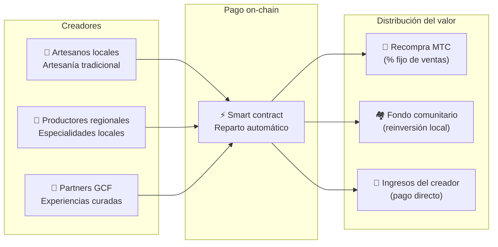

import useBaseUrl from '@docusaurus/useBaseUrl';

# 🗓️ Hoja de ruta y equipo

>**A quienes han leído hasta aquí —— la visión, el diseño económico y la base técnica ya están.**
> No somos un proyecto especulativo de corto plazo.
>**El grueso del desarrollo de la plataforma ya está completo** y estamos en la fase de escalar.

---

## Hitos estratégicos

### 🔥 Fase 1: Despertar (primera mitad de 2026 ── actualidad)

**Tema: consolidar la base y el flujo de caja**

La plataforma web está operativa y las tres apps iOS (GCF Admin, J-Times y Matsuri) ya están disponibles en la App Store (abril de 2026). Nos centramos en la monetización y la liquidez inicial bajo el sistema financiero supervisado por el CEO.

| Estado | Hito | Detalle |
| :---: | :--- | :--- |
| ✅ | **Plataforma web operativa** | Matsuri Web App y panel GCF (web) en marcha |
| ✅ | **Pagos y crecimiento** | Pagos MTC + airdrop de referidos implementados |
| ✅ | **Arranque del medio** | Infraestructura de J-Times (web y pódcast) construida |
| ✅ | **Génesis** | Emisión del token MTC en Solana |
| ✅ | **Liquidez asegurada** | Pool de liquidez inicial creado en Raydium |
| ⬜ | **Inicio de incentivos** | Arranque del minado de liquidez con APR objetivo 20 % |
| ⬜ | **Pago on-chain** | Verificación Solana Pay en producción |
| ⬜ | **Reclutamiento VIP** | Selección de los 20 miembros VIP iniciales del GCF |

### 🚀 Fase 2: Expansión (segunda mitad de 2026)

**Tema: activos reales y Adventure Mining**

Aprovechamos la webapp acabada y ampliamos bases físicas y la función de «peregrinación».

| Estado | Hito | Detalle |
| :---: | :--- | :--- |
| ⬜ | **Nueva función** | Lanzamiento de Adventure Mining (peregrinación) |
| ⬜ | **Despliegue internacional** | Apertura de hubs partner y eventos VIP en Asia (Tailandia, Taiwán...) |
| ⬜ | **Gestión patrimonial** | Construcción de cartera de inmuebles, acciones y criptoactivos |
| ⬜ | **Objetivo cumplido** | Activos totales del ecosistema por **1 000 M ¥** |

### 🌊 Fase 3: Circulación (desde 2027)

**Tema: adopción masiva, economía de co-creación y descentralización**

Apertura al gran público, marketplace on-chain y fase de ecosistema completo en marcha.

| Estado | Hito | Detalle |
| :---: | :--- | :--- |
| ⬜ | **Gran apertura** | Lanzamiento mundial oficial de Matsuri App |
| ⬜ | **Gran desbloqueo (1/6/2027)** | Desbloqueo de los fundadores + pool de minado (550M) activo + inicio del ciclo de halving |
| ⬜ | **Marketplace co-creación** | Tiendas de producto local + GCF Partner Store ── pagos on-chain con recompra automática de MTC |
| ⬜ | **Crowdfunding (con NFT de derechos)** | Usuarios financian proyectos culturales en Solana. Los patrocinadores reciben NFT que representan propiedad, reparto de ingresos y derechos de gobernanza |
| ⬜ | **Pago on-chain** | Todas las transacciones del marketplace liquidadas por smart contract ── un % fijo va al pool de recompra |
| ⬜ | **Objetivo cumplido** | Activos totales del ecosistema por **10 000 M ¥ (~65 M $)** |
| ⬜ | **Transición a DAO** | Transfieren parte de la autoridad de decisión a la comunidad GCF |

#### 🏪 Concepto del marketplace de co-creación

La expresión última del «OS cultural» ── un marketplace descentralizado donde **creadores y amantes de la cultura negocian directamente**, sin intermediarios extractivos.

| Función | Descripción | Estado |
| :--- | :--- | :---: |
| **🏺 Tiendas de producto local** | Artesanos y productores venden directamente a clientes globales. 5-10 % de descuento pagando con MTC | ⬜ Concepto |
| **🎫 Crowdfunding + NFT de derechos** | Financia proyectos culturales (restauración de santuarios, revival de matsuri, talleres de artesanos). Recibes un NFT que prueba tu contribución y puede conferir reparto de ingresos o gobernanza | ⬜ Concepto |
| **⚡ Pago on-chain** | Todas las transacciones del marketplace se liquidan por smart contract Solana. Reparto automático: pago al creador + fondo comunitario + recompra MTC ── sin contabilidad manual | ⬜ Concepto |
| **🗳️ Gobernanza de patrocinadores** | Los titulares de NFT votan sobre la asignación de recursos de los proyectos que financian ── no un simple donativo, co-creación real | ⬜ Concepto |

:::info Por qué importa
Hoy, los turistas compran recuerdos en tiendas que pagan alquiler a la «plataforma-casero». Mañana, **un artesano rural de Kioto vende directamente a un fan de Copenhague** y parte de esa venta alimenta automáticamente la economía MTC. Esta es la forma más acabada del flywheel.
:::

---

## 👤 Equipo

  

### Ko Takahashi ── Fundador / CEO y arquitecto jefe

| Concepto | Detalle |
| :--- | :--- |
| **Rol** | Dirección global del proyecto. Diseño de plataforma, smart contracts y desarrollo full-stack |
| **Visión** | Impulsor del «OS cultural»: exportar cultura, importar riqueza |
| **Postura** | Escribe código con sus propias manos y trabaja en el terreno (Golden Gai) —— «skin in the game» |

  

### Jon Anders Jensen ── Director / Operaciones GCF y eventos

| Concepto | Detalle |
| :--- | :--- |
| **Rol** | Operaciones de GCF. Diseño operativo y trabajo en terreno de eventos y tours |
| **Fortaleza** | Mirada internacional y confianza con los miembros GCF, sosteniendo el «ciclo humano» del ecosistema |

  

### Ryunosuke Honda ── Director / Embajador cultural regional

| Concepto | Detalle |
| :--- | :--- |
| **Rol** | Puente entre las culturas y comunidades locales de Japón y el ecosistema Matsuri |
| **Fortaleza** | Descubre recursos culturales regionales y los sube a la plataforma para realizar la experiencia «Japón profundo» |

### 🌏 Comunidad GCF ── miembros de desarrollo por todo el mundo

Matsuri Protocol no lo construye solo el equipo fundador.
**Los miembros GCF repartidos por el mundo** contribuyen a su evolución mediante tests, feedback, traducciones y despliegue local.

| Área | Estructura |
| :--- | :--- |
| **💼 Finanzas globales** | Red de inversores privados en Asia |
| **⚙️ Ingeniería** | Equipo distribuido de desarrollo blockchain y mobile |
| **🏮 Operaciones** | Canal sólido con comunidades locales de Golden Gai y lugares turísticos clave |
| **🌐 Comunidad** | Miembros GCF multinacionales: Japón, Noruega, Tailandia, Taiwán, etc. |

:::tip Una infraestructura cultural construida entre todos
Si te unes al GCF, también eres co-desarrollador de Matsuri Protocol.
Contribuir no es solo programar. Presentar un lugar sagrado local, traducir documentación, organizar un evento ——
todo es fuerza para llevar este protocolo al mundo.
:::

---

## 🏛️ Gobernanza (DAO)

Matsuri Protocol pasa progresivamente de la centralización a una **organización autónoma descentralizada (DAO)**.
Los miembros GCF (Platinum/Gold) tendrán en el futuro **derecho a voto** sobre las cuestiones clave siguientes.

| Voto | Contenido |
| :--- | :--- |
| **💰 Asignación de fondos** | Qué nuevos negocios y marketing reciben inversión |
| **⚙️ Actualización del protocolo** | Ajustes finos de comisiones y de tasas de minado |
| **⛩️ Certificación cultural** | Qué matsuri, templos y santuarios reciben el estatus de «sitio oficial de peregrinación» y apoyo financiero |

:::info Únete a la revolución
No estamos haciendo solo una app.
Construimos una **economía cultural sin fronteras**.
:::

---

**[◀ Anterior: Producto y tecnología](/docs/product-tech)**｜**[⛩️ Volver al inicio del whitepaper](/docs/intro)**
