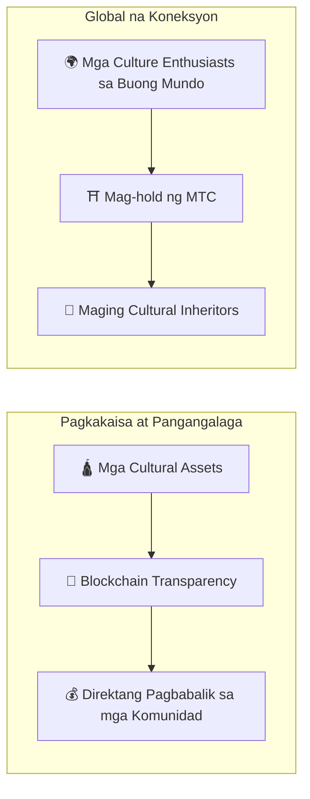

# ⛩️ Maligayang Pagdating sa Matsuri Coin

> **Code para sa Pagkakaisa. Halaga para sa Kapayapaan.**
> Isang tulay ng "Wa" sa isang nagkahiwa-hiwalay na mundo. Ang MTC ang compass na umaakay mula sa kumpetisyon patungo sa co-creation.

Ang **Matsuri Coin (MTC)** ay isang decentralized utility token na itinayo sa Solana blockchain.
Dinisenyo bilang isang **"Culture OS,"** ikinokonekta nito ang espirituwal na pamana ng Japan — "Deep Japan" — sa pandaigdigang ekonomiya.

Hindi lang kami gumagawa ng isa pang payment rail.
Gumagawa kami ng **tulay sa pagitan ng Japan at ng mundo** — isang bagong co-creation framework kung saan ang mga taong nagmamahal sa kultura ay nagkakaisa lampas sa mga hangganan.

---

## 🎯 Ang Aming Misyon

:::info Pag-channel ng ¥10 Trilyon na Market Energy sa Hinaharap ng Kultura
Ang inbound tourism market ng Japan ay lumalaki patungo sa **¥10 trilyon** bawat taon.
Ngunit sa ilalim ng headline na iyan ay may **hindi komportableng katotohanan.**
:::

### Mga Problemang Hindi Pinag-uusapan

| Problema | Ano Talaga ang Nangyayari |
| :--- | :--- |
| 💸 **Revenue Drain** | Ang malaking bahagi ng inbound revenue ay tumutulo sa ibang bansa bilang komisyon sa mga dayuhang OTA at intermediaries |
| 😤 **Community Burnout** | Ang over-tourism ay bumabaha sa mga lokal na lugar ng tao, ngunit walang kita na bumabalik sa mga komunidad na nagdadala ng pasanin |
| 🚧 **Ang Experience Wall** | Ang mga package tours ay dumadaan lang sa ibabaw — hindi talaga nakokonekta ang mga manlalakbay sa *tunay* na Japan |

> **"Ang mga lokal ay nahihirapan, ang mga manlalakbay ay nakakakita ng facade, at ang yaman ay nawawala sa platform fees."**

Ginagamit namin ang Web3 upang buwagin ang sirang sistemang ito.
Ang bayad mo ay direktang umaabot sa mga lokal na komunidad at pagpapanatili ng pamana — **fully transparent, zero middlemen.**

---

## 🏗️ Ang Hybrid Model: Kultura × Teknolohiya

Karamihan sa mga crypto projects ay humahabol sa kita at itinuturing ang kultura bilang disposable.
Binaligtad ng MTC ang script: nagtatayo kami ng **"ekonomiyang nagpoprotekta sa kultura"** — ang hybrid structure na dapat ay nandoon na mula pa sa simula.

| Haligi | Ibig Sabihin |
| :--- | :--- |
| **🛕 Pagkakaisa at Pangangalaga** | Ang bayad ng turista ay dumadaloy sa blockchain rails diretso sa cultural preservation at artisan support. Ang mga komunidad (GCF) ay may sariling soberanya sa kanilang pamana — walang mapagsamantalang middlemen |
| **🌍 Global na Koneksyon** | Imprastraktura na nagpapahintulot sa sinuman, saanman, na suportahan ang espiritu ng "Wa" ng Japan. Ang pagho-hold ng MTC ay nangangahulugang pagbabahagi sa buhay na kasaysayan ng Japan — ikaw ay bahagi ng kwento nito |

---

## 💎 Bakit Gamitin ang MTC?

Ang MTC ecosystem ay nagbibigay ng parehong **espirituwal na kasiyahan** at **tunay na pinansyal na benepisyo.**

### ✨ Halaga ng Karanasan

| Benepisyo | Detalye |
| :--- | :--- |
| **🎌 Makabuluhang Karanasan** | I-unlock ang "Deep Japan" — mga sagradong lugar na sarado sa publiko, pribadong mga seremonya sa shrine, mga invitation-only na cultural events |
| **🌐 Panghabambuhay na Ugnayan** | Manatiling konektado sa Japan sa pamamagitan ng MTC kahit pagkatapos mong umuwi. Isang lugar na lagi mong "mabaBalikan" |
| **⚖️ Patas na Palitan** | Inaalis ng smart contracts ang mga intermediaries. Ang pasasalamat mo (at pera) ay direktang napupunta sa mga taong nag-earn nito |

### 💰 Pinansyal na Benepisyo

| Benepisyo | Detalye |
| :--- | :--- |
| **🏷️ Preferential Rates** | Magbayad gamit ang MTC at magtipid ng **5%–10%** kumpara sa yen pricing. Hal. ¥30,000 tour → ~¥27,000 equivalent |
| **🔑 Exclusive Access** | Ticket NFTs para sa mga invitation-only na venue at limitadong events — para lang sa MTC holders |
| **🛡️ Currency Hedge** | I-lock in ang halaga ng karanasan bago ang iyong biyahe — walang pag-aalala tungkol sa pagbabago ng exchange rate |

---

## ⚡ Bakit Solana?

Ang paglilingkod sa parehong "tunay na tourism demand" at "high-frequency financial trading" ay nag-iwan sa amin ng eksaktong **isang viable blockchain.**

| Metric | Ethereum | Solana |
| :--- | :---: | :---: |
| **Transaction Fee** | ¥100s–¥1,000s | **~¥0.04** |
| **Finality** | 12 s – minuto | **0.4 segundo** |
| **Throughput** | ~15 TPS | **Libu-libong TPS** |

:::tip Ang Temple-Offering Test
Ang micro-payment na kasing liit ng "pagtapon ng ¥100 sa offering box" ay nangangailangan ng fees na **wala pang ¥1.** Tanging Solana lang ang pumapasa sa test na iyan.
:::

---

:::note Handa nang Magsimula
Tinatapos ng MTC ang panahon ng turismo na basta *kumokonsumo* ng kultura. Maligayang pagdating sa paglalakbay ng **co-creation** — sabay-sabay nating itayo ang hinaharap.
:::

**[▶ Vision: Bakit Ngayon?](/docs/vision)** ｜ **[▶ Sumali sa GCF (VIP Membership)](/docs/economy)**
