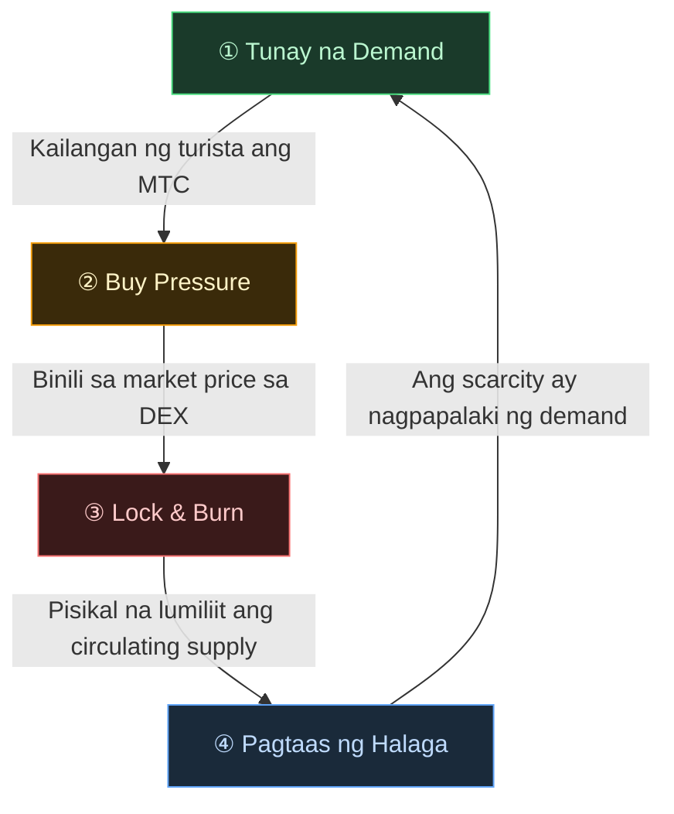
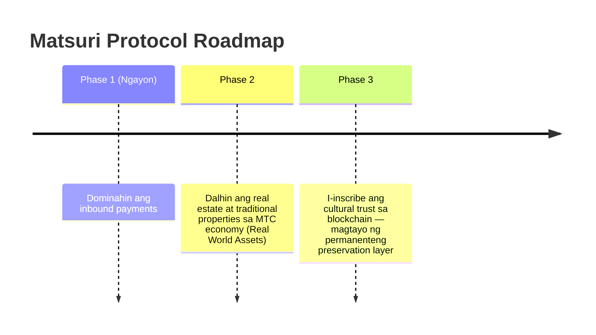

# 🎯 Vision: Ang "Inbound-First" na Estratehiya

> **Mula sa pag-asa sa subsidiya tungo sa soberanya.**
> Tapos na ang panahon ng pagsuporta sa mga rural na ekonomiya gamit ang pera ng buwis. Dini-diretso namin ang dayuhang kapital sa kultura.

Karamihan sa mga regional-revitalisation projects ay nabibigo — dahil ang ginagawa lang nila ay paghahati-hati ng lumiliit na domestic budgets.

**Ang Matsuri Protocol ay ang eksaktong kabaligtaran.**

---

## 1. Estratehiya: Ang Culture Export Machine

Binibigyan namin ng bagong kahulugan ang mga tourism assets ng Japan — hindi bilang "consumables," kundi bilang **exportable financial instruments.**

| Problema | Realidad | Epekto |
| :--- | :--- | :--- |
| 💸 **Revenue Drain** | Komisyon sa mga dayuhang OTA (Booking.com, Expedia, atbp.) | **15%–20% ng revenue** ang tumutulo sa ibang bansa — isang national-scale na pagkalugi |
| 🚧 **Ang Invisible Wall** | Mga balakid sa wika at pagbabayad | Hindi ma-access ng mga high-net-worth na manlalakbay ang mga karanasan sa "Deep Japan" |

:::tip Ang Papel ng MTC
Ang MTC ang **tanging Master Key** na humihinto sa drain at bumubuwag sa wall.
:::

---

## 2. Ang Economic Flywheel

Ang defining feature ng Matsuri Protocol: **ang sigla ng turista ay mathematically nagpapaangat sa presyo ng MTC.**
Hindi pag-asa — **supply-and-demand mechanics.**

### Bakit Tumataas ang MTC?

Isang **4-step na automatic cycle** ang sumusuporta sa presyo:

| Hakbang | Pangalan | Mekanismo |
| :---: | :--- | :--- |
| **①** | **Tunay na Demand** | Kailangan ng mga turista ang MTC para sa guide bookings at Ticket-NFT purchases |
| **②** | **Buy Pressure** | Binibili ang MTC sa market price sa DEX — consumption-driven, hindi speculative |
| **③** | **Lock & Burn** | Ang bahagi ng MTC na ginamit sa pagbabayad ay agad na nila-lock o binu-burn ng smart contracts — pisikal na lumiliit ang supply |
| **④** | **Pagtaas ng Halaga** | Lumalaki ang buy demand, lumiliit ang sell supply — mathematically tumataas ang scarcity value |

:::info Ang Pangunahing Katotohanan
**"Habang mas nag-eenjoy ang mga turista sa Japan, mas lumalaki ang assets ng mga MTC holders."**
Ang simpleng equation na ito ang tibok ng puso ng proyekto.
:::

---

## 3. Ang Endgame: Culture OS

Ang ultimate goal namin ay hindi isang payment app.
Ito ay ang **gawing operating system ang kultura mismo.**

> Pinoprotektahan namin ang **kulturang umabot na ng 1,000 taon** gamit ang **cutting-edge blockchain technology.**
> Iyan ang hinaharap na itinatayo ng Matsuri Protocol.

---

**[▶ Susunod: Paano Talaga Kami Kumikita? (Ang Ekonomiya)](/docs/economy)**
