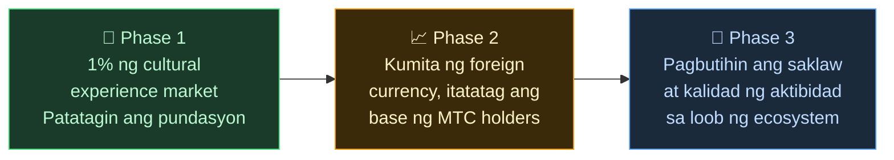

# 🌏 Hamon at Solusyon — Di-komportableng Katotohanan, at Pag-asa

> **Magandang layunin. Ngunit hinahadlangan ito ng realidad.**

---

## Ngunit may mga di-komportableng katotohanang humahadlang sa layuning ito

:::info Ang ¥10 trilyong market energy ay hindi nakakarating sa mga tagapag-ingat ng kultura
Ang inbound market ng Japan ay lumalaki sa taunang sukat na **¥10 trilyon**.
Ngunit karamihan sa benepisyo nito ay hindi nakakarating sa mga nasa larangan mismo.
:::

### Ang merkadong Pinupuntirya ng MTC

Hindi namin hinahabol ang buong ¥10 trilyon.

Unang pinupuntirya namin ang **merkado ng cultural experience · guide · local tours** sa loob nito. Ang **1% (halos ¥100 bilyon)** ng larangang ito ang unang target, magsimula sa maliit at lumaking matatag.

| Phase | Estratehiya | Target |
| :--- | :--- | :--- |
| **Magsimula sa maliit** | Pokus sa cultural experience at guide tour. Mag-ipon ng track record, palawakin sa word of mouth | Pagtatatag ng revenue base |
| **Patatagin** | Kumita ng dayuhang pera (inbound revenue), patunayan ang sistema ng revenue distribution sa mga MTC holder | Pagtatayo ng tiwala sa MTC economy |
| **Pataasin ang kalidad** | Pagkatapos abutin ang isang laki, sa halip na palawakin pa, pagbutihin ang kalidad ng karanasan, saklaw ng aktibidad, at lalim ng community sa loob ng ecosystem | Sustainable cultural economy |

> **Hindi paghabol sa dami, kundi paglago sa kalidad ng nakikilahok at lalim ng karanasan.** Iyan ang estratehiya ng MTC sa pagpapalawak.

Ang mga Web2 platform ay naghatid ng kagandahan ng paglalakbay sa mga tao sa buong mundo. Nagpapasalamat kami sa tagumpay nilang iyon.
Ngunit may mga hindi maiiwasang side effect sa sentralisadong istruktura.

Ang algorithm ang nagpapasya kung "ano ang ipapakita", at ang mga negosyo ay pinagkumpetensya para sa ranking. Ang isang rating sa review ay maaaring magpabago ng benta, at ang commission rate ay mababago ng platform sa kanilang sariling kagustuhan — ang mga nasa larangan ay laging nasa takot na "mapili o maglaho".

Ang istrukturang ito ay nagdudulot ng paghihiwalay ng mga negosyo at takot sa di-nakikitang tuntunin. Ang katabing tindahan ay nagiging kakumpitensya, at ang pag-iingat ay nagiging mas makatuwiran kaysa kooperasyon. Pati ang mga biyahero ay nakakakuha lamang ng pare-parehong mga pagpipilian na pinili sa "bilang ng bituin" at "ranking", at ang mga tunay na mahahalagang karanasan ay nalulubog sa ilalim.

:::danger 3 Hamon na Kinakaharap ng Larangan
💸 **Pagtagas ng Kita** — Ang karamihan ng kita ay tumatagas sa ibang bansa bilang commission sa mga dayuhang OTA at intermediary

😤 **Pagod ng Lokal** — Tanging ang pasanin ng overtourism ang natitira, habang ang kinakailangang kita ay hindi bumabalik sa lokal

🚧 **Pader ng Karanasan** — Pare-parehong tour lamang na pinili ng algorithm ang lumalabas, at hindi nakikilala ang "tunay na Japan"
:::

> **Nagdurusa ang mga Hapones, hindi nakikita ng mga biyahero ang tunay na mukha, at ang yaman ay naglalaho sa mga platform.**

---

## Paano ngayon maaaring baguhin?

Ngunit ngayon, kompleto na ang mga teknolohiyang maaaring magbago ng istrukturang ito mula sa pinagmulan.

:::tip Smart Contract — Mga Tuntuning Hindi Mababago
Ang komisyon at kondisyon ay nakaukit sa code at hindi mababago ng sinuman sa kanilang sariling kagustuhan. Awtomatikong ipinatutupad ang patas na tuntunin para sa lahat.
:::

:::tip Blockchain — Transparency na Nakikita ng Lahat
Lahat ng transaksyon ay naitatala sa pampublikong ledger at masusuri ng kahit sino. Tapos na ang panahon kung saan nakakandado ang data sa loob ng kumpanya.
:::

:::tip Solana — 0.4 Segundong Settlement, 0.04 Yen na Fee
Hindi na kailangan ng maramihang commission ng intermediary, hindi na kailangang maghintay ng ilang araw. Maaaring direktang mag-ugnay ang tao sa tao.
:::

:::tip AI — Pagbubura ng Mismong Management Cost
Ang malaking pag-unlad sa produktibidad ay nagbabalik sa nakaraan ng istrukturang kinakailangan upang mapanatili ang malalaking platform.
:::

Hindi na kailangang umasa sa mga intermediary manager — ito ang panahon kung saan ang mga tao ay maaaring mag-ugnay nang direkta.

Gamit ang teknolohiyang ito, pakakawalan namin ang inbound economy mula sa monopolyo at ibabalik ang kita sa larangan ng Japan at iba pang bansa.
At hindi lamang Japan, itatayo namin ang **sistemang nagbabantay at nag-uugnay ng mga kultura ng mundo**.

---

**[◀ Nakaraan: Bisyon at Layunin](/docs/vision)**｜**[▶ Susunod: Kinabukasan na Inilalarawan ng MTC](/docs/future)**
