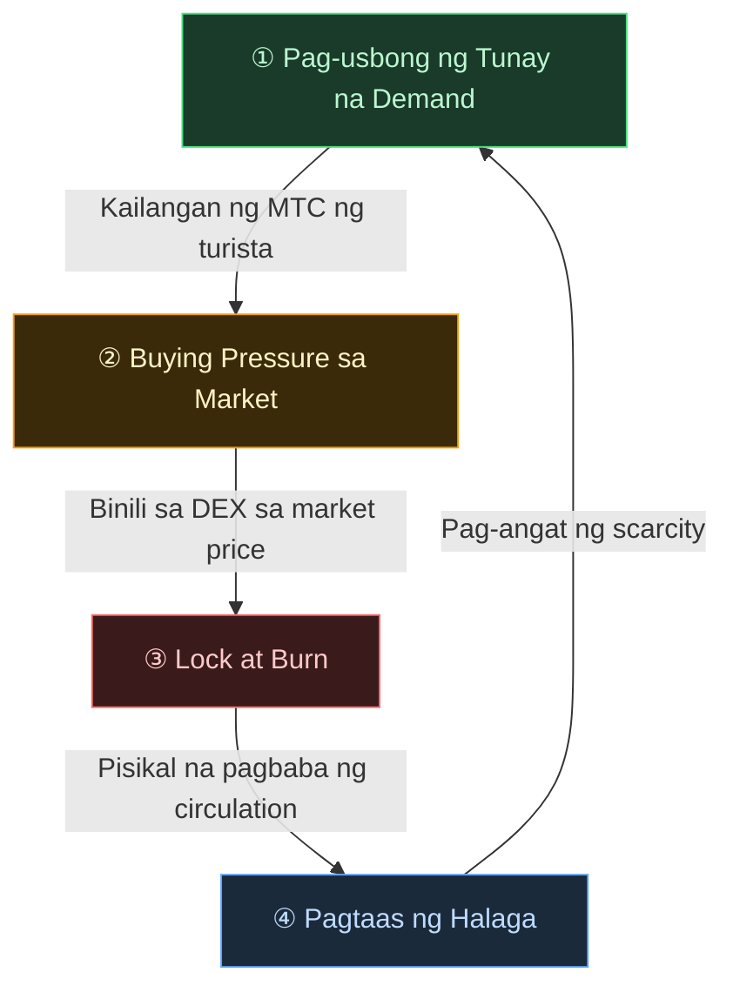

# 🔄 Economic Flywheel — Pag-ikot ng Paglago at Cultural OS

> **Habang mas nag-eenjoy ng Japan ang mga turista, mas tumataas ang demand sa ecosystem.**
> Itong mekanismo ng supply-demand ang puso ng proyekto.

---

## Mekanismo ng Supply-Demand ng MTC

Ayon sa disenyo ng Matsuri Protocol, **ang pagtaas ng tunay na demand ay lumilikha ng buying pressure, at kasabay ng pagbaba ng supply, napupunta sa posisyon ang mga kondisyon para sa pagtaas ng halaga**.
Hindi ito emosyonal na argumento kundi **mekanismo ng supply at demand**.

Ang **4 na hakbang na pag-ikot** na ito ang sumusuporta sa sistemang ito.

| Hakbang | Pangalan | Mekanismo |
| :---: | :--- | :--- |
| **①** | **Pag-usbong ng Tunay na Demand** | Kailangan ng mga turista ang MTC para sa guide booking at ticket NFT purchase |
| **②** | **Buying Pressure sa Market** | Binibili ang MTC sa market price sa DEX (Decentralized Exchange). Malakas na pagbili base sa konsumo, hindi speculation |
| **③** | **Lock at Burn** | Isang bahagi ng MTC na ginamit sa pagbabayad ay agad ina-lock o bino-burn ng smart contract. Pisikal na bumababa ang supply sa circulation |
| **④** | **Pag-angat ng Scarcity** | Dumadami ang demand, bumababa ang supply. Sa pagbabago ng supply-demand balance, nagiging mas scarce ang bawat token |

---

---

:::note Ang Bisyong Sinusuportahan ng Equation na Ito
Ang buong larawan ng "cultural OS" na nasa kabila ng flywheel ay ipapaliwanag nang detalyado sa susunod na pahina [Kinabukasan na Inilalarawan ng MTC](/docs/future).
:::

---

**[◀ Nakaraan: Hamon at Solusyon](/docs/challenges)**｜**[▶ Susunod: Kinabukasan na Inilalarawan ng MTC](/docs/future)**
