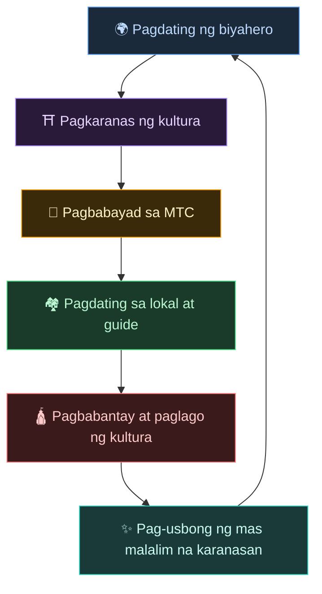
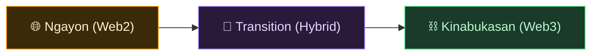
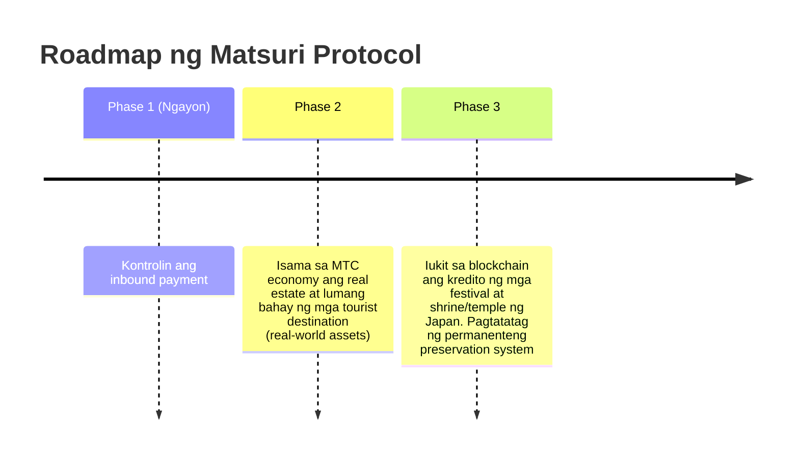

# 🌀 Kinabukasan na Inilalarawan ng MTC — Ekonomiyang Umiikot ang Bawat "Pakikilahok"

> **Ang nakakaranas, ang naghahatid, ang nagbabantay. Ang bawat pag-iisip ay umiikot bilang ekonomiya at inihahatid ang kultura sa susunod na henerasyon.**

---

## Ang Pag-ikot na Gusto Naming Mangyari

Hindi token para sa speculation ang MTC.

Ang biyahero ay nakakakilala sa kulturang Hapones at naa-antig.
Ang guide ay naghahatid nito at gagantimpalaan.
Ang lokal ay umuunlad at patuloy na mababantayan ang kultura.
At ang kulturang iyon ay muling nang-aakit ng bagong biyahero.

Ang pag-ikot na ito ang dahilan kung bakit umiiral ang MTC.

---

## Ekonomiya kung saan Gantimpalaan ang Tatlong Panig

Sa tradisyunal na turismo, ang biyahero ay nagbabayad, kinuha ng platform ang kita, at walang natitira sa larangan.
Sa MTC economy, lahat ng nakikilahok ay gantimpalaan.

| Nakikilahok | Ano ang nangyayari | Paano gagantimpalaan |
| :--- | :--- | :--- |
| **🌍 Ang nakakaranas** | Nakakakilala sa kulturang Hapones, nagbabayad sa MTC | Mas mura kaysa sa yen, may access sa tunay na karanasan. Patuloy na konektado sa pamamagitan ng MTC kahit nakauwi na |
| **⛩️ Ang naghahatid** | Nagsasagawa ng event bilang guide, nag-a-upload ng content sa J-Times | Direktang gantimpala nang walang middle exploitation. Habang aktibo, mas maraming MTC ang gantimpala |
| **🏘️ Ang nagbabantay** | Bilang lokal na community, pinapanatili at ipinapasa ang kultura | Direktang dumarating ang kita. Hindi overtourism, kundi umuunlad sa sustainable na paraan |

---

## Habang Lumalawak ang Economic Zone, Mas Tumitibay ang Kultura

Ang MTC economic zone ay magsisimula sa booking ng karanasan, at unti-unting lalawak sa lahat ng aspeto ng buhay.

- **Karanasan** — tunay na cultural experience, worship mining
- **Damit, pagkain, tirahan** — guesthouse, shop, pagkain, fashion
- **Mga proyektong sama-samang nilikha** — investment sa pagbabantay ng kultura sa crowdfunding
- **International understanding ng iba't ibang kultura** — lugar ng palitan at mutual understanding na lampas sa hangganan

Habang lumalawak ang economic zone, mas lumalakas ang pag-ikot sa pamamagitan ng MTC, at lumalakas ang kakayahang sumuporta sa kultura.
Hindi ito basta business model lamang, kundi **life-support system ng kultura**.

---

## Mula Web2 Patungo sa Web3 — Walang Pilitan, Hakbang-Hakbang

Hindi namin agad sasabihin na "lahat ay sa blockchain".

Ngayon, karamihan ay hindi pa sanay sa Web3. Kaya nga ang disenyo ay **magsimula muna sa pamilyar na anyo at unti-unting maramdaman ang benepisyo ng Web3**.

| Phase | User Experience | Mekanismo sa Likod |
| :--- | :--- | :--- |
| **Ngayon** | Booking ng karanasan at pagbabayad bilang ordinaryong web app. OK sa credit card | Django + Stripe. Pwede simulan nang walang wallet |
| **Transition** | Kumita at gumamit ng MTC sa app. One-tap ang wallet integration | Ang off-chain score ay unti-unting lumilipat sa on-chain |
| **Kinabukasan** | Lahat ng transaksyon at karapatan ay naitatala nang transparent sa blockchain. Ang kontribusyon mo ay patunay habang-buhay | Kompletong awtomatiko at hindi mababago na ekonomiya sa pamamagitan ng smart contract |

:::tip Hindi Mahirap ang Web3
Hindi kailangan sa umpisa ang pagse-setup ng wallet o pag-iingat ng seed phrase. Habang ginagamit ito, natural kang nakakakilala sa mundo ng Web3 — **bago mo napansin, naging residente ka na ng Web3.** Ganyan ang karanasang aming idinisenyo.
:::

---

## Ekonomiyang Gumagalaw sa Pakikiramay, Hindi sa Pwersa

At ang economic zone na ito ay gumagalaw sa pamamagitan ng smart contract.
Hindi maaaring baguhin ng sinuman ang tuntunin nang unilateral base sa kapangyarihan o convenience — **mekanismong pang-ekonomiya kung saan hindi posible ang unilaterong pagbabago sa pamamagitan ng pwersa**.

Sa ibabaw nito, patuloy na lumilikha ng bagong halaga habang natututo sa sinaunang karunungan. Onko chishin (温故知新), at patungo sa bagong paglikha.

> **Kahit walang yen, kahit walang dolyar, isang mundo kung saan nabubuhay batay sa kultura.**
>
> Hindi ipinauubaya ang halaga ng pera sa iba, kundi lumikha at gumamit ng halaga sa pamamagitan ng sariling "pakikilahok".
> Iyan ang kalayaang gustong ihatid ng MTC.

---

## 🏁 Pinal na Destinasyon: "Cultural OS"

Ang pinal naming layunin ay hindi basta payment app.
Kundi **pagbabago ng mismong kultura sa OS (pundasyon)**.

> Babantayan namin ang sinaunang karunungan gamit ang pinakabagong blockchain.
> Ito ang kinabukasang inilalarawan ng Matsuri Protocol.

---

:::note Dito Nagtatapos ang Kuwentong Bahagi
Ang mga nakabasa hanggang dito ay dapat naunawaan na kung bakit umiiral ang MTC.
Susunod ay ang **【Praktikal na Bahagi】** — tingnan natin kung ano ang aktwal na magagawa sa MTC.
:::

**[◀ Nakaraan: Economic Flywheel](/docs/flywheel)**｜**[▶ Susunod: Ecosystem](/docs/ecosystem)**
