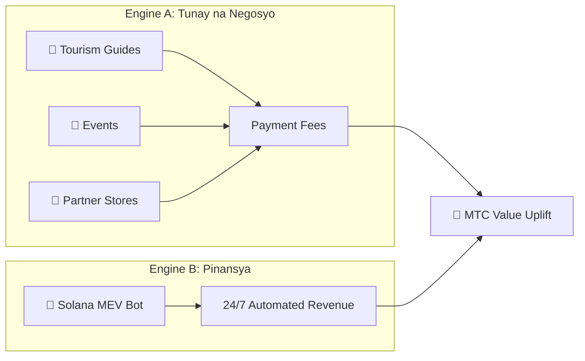

# 💰 Ang Ekonomiya

> Ang ekonomiya ng Matsuri Coin (MTC) ay simple ngunit battle-tested.
> **Dalawang revenue engines — tunay na negosyo at financial algorithms — ang kumikita at programmatically nag-re-redistribute sa mga holders.**


---

## 1. Dual Revenue Engines



| Engine | Revenue Source | Paano Gumagana |
| :--- | :--- | :--- |
| **🏯 Engine A (Tunay na Negosyo)** | Payment fees mula sa tourism guides, events at partner stores | Mas maraming inbound tourists → mas maraming dayuhang kapital ang pumapasok → lumalawak ang ecosystem |
| **🤖 Engine B (Pinansya)** | Solana MEV Bot automated trading | CEO-led na high-frequency program na kumukuha ng kita mula sa on-chain inefficiencies 24/7/365 |

---

## 2. Buyback Protocol (Value Uplift Mechanism)

Hindi namin kinokolekta ang kita.
Ang mga smart-contract rules ay nag-cha-channel ng revenue diretso sa **MTC value uplift.**

| Revenue Source | Allocation | Aksyon |
| :--- | :---: | :--- |
| **Matsuri HQ Sales** (Guides & Events) | **20%** | Market **buyback** + liquidity-pool injection |
| **GCF Membership** (Membership fees) | **25%** | Market **buyback** |

:::info Core Logic
**"Paglago ng negosyo = patuloy na binibili ang MTC sa open market."**
Ang equation na iyan ang sumusuporta sa halaga ng iyong asset.
:::

---

## 3. Price-Determination Logic

Ang mekanismo ng presyo ay tumatakbo sa **AMM (Automated Market Maker) formula** — hindi hopium.

```
Price = Liquidity (SOL) ÷ Supply (MTC)
```

| Hakbang | Ano ang Nangyayari | Resulta |
| :---: | :--- | :--- |
| **①** | Ini-inject ang business revenue (SOL) sa pool | **Numerator ↑** |
| **②** | Binibili ang MTC mula sa market at binu-burn | **Denominator ↓** |
| **③** | Numerator ↑ × Denominator ↓ | **Mathematically tumataas ang presyo** |

---

## 4. GCF (Global Community Friends)

Ang GCF ay ang **invitation-only** na partner organisation (DAO) na nag-i-scale ng Matsuri ecosystem.
Hindi isang membership club — isang **business collective** na nakikibahagi sa upside.


### Mga Membership Tiers

| Tier | Papel | Mga Pribilehiyo |
| :---: | :--- | :--- |
| **👑 Platinum** | Owner / VIP | Top-tier na entitlements. Unang **50 seats** lamang. Decision-making power + malaking dividend income |
| **🥇 Gold** | Ambassador | Ang mga operator. Ang karapatang kumita **nang walang ceiling** sa pamamagitan ng aktibidad. Maximized mining at referral rates |

### Perk ①: Real-Work Mining (Mining Rights)

Ang **550 milyong MTC (~61% ng total supply)** na i-u-unlock noong 1 Hunyo 2027 ay nakalaan bilang **Contributor Reward Pool** — hindi ibinubuhos sa market.

:::tip Fully Performance-Based
Ang MTC ay awtomatikong ipinamamahagi mula sa pool batay sa iyong output (sales, bilang ng bisita, guide sessions).
:::

**Halving Schedule (2-Year Cycle):**

| Panahon | Release | Volume |
| :--- | :---: | :--- |
| **Epoch 1** 2027 – 2029 | **50%** | ~275 M tokens |
| **Epoch 2** 2029 – 2031 | **25%** | ~137 M tokens |
| **Epoch 3** 2031 – 2033 | **12.5%** | ~68 M tokens |

:::caution First-Mover Window
Mas mabilis sa 4-year halving ng Bitcoin — gumagamit kami ng **2-year cycle.**
Ang mga mag-all-in sa **unang dalawang taon mula 2027** ay magla-lock in ng napakalaking first-mover advantage.
:::

### Perk ②: Premium Referral Commissions

Mag-refer ng high-ticket products (memberships, VIP tours, partner real estate) para kumita ng **premium commissions (USDC + MTC)** — hindi maihahambing sa karaniwang affiliate payouts. Binabayad **agad-agad** sa pamamagitan ng smart contract.

---

## 5. Token Specifications

Permanente naming **REVOKED** ang Mint at Freeze authorities sa Solana.
Walang karagdagang issuance — kailanman. Walang fund freezing — kailanman. **Fully trustless by design.**

| Item | Detalye |
| :--- | :--- |
| **Token Name** | Matsuri Coin |
| **Ticker** | MTC |
| **Chain** | Solana |
| **Total Supply** | **900,000,000 MTC** (Fixed) |
| **Mint Authority** | 🚫 Revoked |
| **Freeze Authority** | 🚫 Revoked |
| **Lock Contract** | Streamflow Finance (Verified) |

:::warning Invitation Only — Limitado ang Slots
Isinasara ng GCF ang recruitment sa sandaling mapuno ang limitadong slots (Platinum: 50 / Gold: adjusting).
Ang pagkakaroon ng karapatang ito ay nangangahulugang pagpasok sa **inner circle** ng Matsuri economy.
:::

---

**[▶ Susunod: Ecosystem at Mining](/docs/ecosystem)** ｜ **[Sumali sa Discord](#)**
