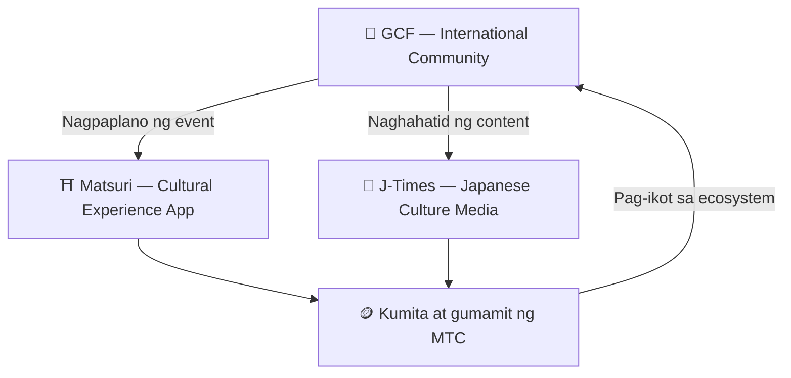

# 🏗️ MTC Ecosystem — Economic Zone na Umiikot ang Karanasan, Media, at Community

> **Tatlong "lugar" para sa pagsasakatuparan ng layunin.**
> Lugar ng pagkaranas, lugar ng pag-alam, lugar ng pag-uugnay — bawat isa ay independyente ngunit umiikot bilang isang ekonomiya sa pamamagitan ng MTC.

Hindi basta token ang MTC. Nakikipagtulungan ang 3 produkto at ang internasyonal na community para maisakatuparan ang ekonomiya para bantayan ang kultura.

:::tip 🤝 GCF — International Community na Nagpapagalaw sa Ecosystem
Lugar kung saan nagkaka-ugnay ang mga taong mahilig sa kulturang Hapones lampas sa hangganan. Ang GCF ay nag-aanyaya ng guide, at ang GCF guide na iyon ang nangangasiwa ng karanasan sa Matsuri. Bukod pa rito, naghahatid ng kahanga-hangang content sa J-Times — ang aktibidad ng community ang engine na nagpapagalaw sa buong ecosystem.
:::

:::tip ⛩️ Matsuri — Cultural Experience App
Nagsisimula mula sa booking ng cultural experience, at unti-unting lumalawak sa **guesthouse**, **shop**, at **crowdfunding**. Mula sa karanasan, lumalawak ang economic zone sa damit, pagkain, tirahan, at co-creative investment.

**Worship Mining (Sacred Pilgrimage)** — Kumita ng MTC sa aktwal na pagbisita sa mga shrine, temple, at cultural landmark. Natural na ipinagkakalat ang daloy ng tao mula sa mga sikat na spot patungo sa mga nakakubling lugar sa probinsya, at sabay na isinasakatuparan ang solusyon sa overtourism at rural revitalization.
:::

:::tip 📰 J-Times — Japanese Culture Media
Media platform na naghahatid ng ganda ng kulturang Hapones sa mundo. Maaaring kumita ng MTC sa pamamagitan ng engagement tulad ng pagbasa at pagshare ng artikulo.
:::

---

## 🤝 Social Mining (Kumita sa Pag-uugnay)

**Nakikipag-ugnay sa GCF Management Dashboard ── Web na bersyon ay gumagana na (ang iOS app ay ilalabas sa April 2026)**

Binibigyan ng access sa espesyal na **GCF Management Web** ang GCF members.

| Feature | Kung ano ang magagawa |
| :--- | :--- |
| **🎪 Paglikha ng Event** | Magplano at mag-post ng sariling event o tour |
| **📢 Content Distribution** | Ipamahagi at palawakin ang artikulo at content ng J-Times |
| **📊 Referral Tracking** | Real-time tracking ng gawi at kita ng users na inireferral |

:::info Awtomatikong Gantimpala
Tuwing nagbabayad ang kaibigang inireferral, awtomatikong ipapadala ng sistema ang gantimpala (revenue share) sa inyong wallet.
:::

---

## 🎓 Creator Economy (Kumita sa Paglikha)

Hindi lang konsumo ng content — sa platform ng Matsuri, **kahit sino** ay maaaring gumawa ng content at kumita.

| Platform | Kung ano ang magagawa ng creator | Revenue Model |
| :--- | :--- | :--- |
| **📚 Course Marketplace** | Mag-publish ng video/text course tungkol sa kulturang Hapones, wika, at crafts | Commission per enrollment (creator revenue share) |
| **🎙️ Podcast Studio** | Gumawa ng audio series na idi-distribute sa Spotify, Apple Podcasts, RSS | Subscription-exclusive episodes |
| **🤝 Crowdfunding** | Mag-launch ng Solana-based fundraising campaign para sa cultural projects | On-chain contribution tracking |
| **🛍️ User Shop** | Magbukas ng personal shop sa loob ng platform (crafts, goods) | Direct sales na may product/review system |

:::tip AI-Powered Production Support
Maaaring gamitin ng event host ang **built-in AI assistant (GPT-4 Turbo)** para sa paggawa ng event description, awtomatikong pagsasalin sa 5 wika, at pag-generate ng SEO-optimized metadata mula sa loob ng management dashboard.
:::

---

  

*Community meetup sa Golden Gai ── ang koneksyon ay nagiging mining power.*

---

:::note Sa Susunod na Pahina
Para sa gustong malaman ang kongkretong mekanismo ng mining at paraan ng pagkita, magtuloy sa **[Mining at Paraan ng Pagkita →](/docs/mining)**.
:::
