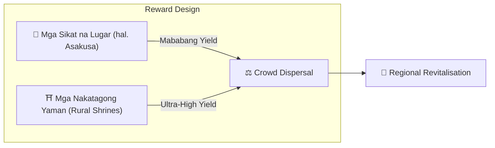

# ⛏️ Ang Tatlong Haligi ng Mining

> **Proof of Action (PoA)**
> Ang Matsuri Coin ay na-mine hindi ng mga GPU, kundi ng **aksyon ng tao.**

Ang web app at admin dashboard ay **live na** — simulan nang kumita **ngayon na** sa pamamagitan ng mga aktibidad sa ibaba.

---

## 1. 📖 Media Mining (Read, Listen & Quiz to Earn)

**Pinapatakbo ng "J-Times" Official Media**

Ang kaalaman ay nagbabago ng kalidad ng paglalakbay.
Ginagantimpalaan namin ang pag-aaral — pagbabasa, pakikinig, **at** pagpapatunay ng pag-unawa sa pamamagitan ng mga quiz.

| Aksyon | Ano ang Gagawin Mo | Gantimpala |
| :--- | :--- | :--- |
| **📰 Read to Earn** | Basahin ang mga artikulo ng J-Times tungkol sa kasaysayan, Shinto, Zen | MTC na ibinigay |
| **🎧 Listen to Earn** | I-stream ang mga exclusive podcasts tungkol sa malalim na kulturang Hapon | MTC na ibinigay |
| **✅ Quiz to Earn** | I-ace ang mga quiz upang patunayan ang pagkakaunawa | MTC na ibinigay (agad-agad) |

:::tip Dead Time → Mining Time
Ang iyong commute, lunch break, flight — bawat libreng sandali ay nagiging reward-generating na pagkakataon.
:::

---

## 2. 🤝 Social Mining (Connect to Earn)

**Pinapatakbo ng GCF Admin Dashboard — Live Na**

Ang mga miyembro ng GCF ay may access sa dedicated **"GCF Admin Web."**

| Feature | Ano ang Magagawa Mo |
| :--- | :--- |
| **🎪 Event Creation** | Mag-plano at mag-publish ng sarili mong mga events at tours |
| **📢 Content Distribution** | I-amplify ang mga artikulo at content ng J-Times sa iyong network |
| **📊 Referral Tracking** | I-track ang aktibidad at revenue ng mga na-refer na users sa real time |

:::info Automatic Payouts
Tuwing ang isang na-refer na kaibigan ay mag-transact, ang sistema ay **awtomatikong** magde-deposit ng iyong revenue share diretso sa iyong wallet.
:::

---

## 3. 🗺️ Adventure Mining (Move to Earn)

**Project "PILGRIMAGE" — Susunod na Phase (In Development)**

Isang next-gen feature na gumagamit ng GPS at token incentives upang i-redirect ang pisikal na daloy ng mga turista.

> **"Pumupunta ang mga tao sa rural dahil mas profitable."**
> Ang economic logic na iyan ang lumutas sa over-tourism at nagpapabilis ng regional revival.

### 🎲 Ang "Omikuji" Protocol

Isang fortune-slip-style smart contract na tini-trigger **nang libre (gas lang)** kapag nag-check-in.

| Resulta | Ano ang Makukuha Mo |
| :--- | :--- |
| **🎊 Grand Fortune** | Bonus MTC airdrop |
| **📜 NFT Drop** | Location-exclusive **"Goshuin NFT"** |
| **🏆 Collection Complete** | Ang pagkumpleto ng set ay nag-u-unlock ng espesyal na event access |

:::note Hindi Sugal
Walang monetary stake na kailangan. Random bonus lang para sa **pagpunta.**
:::

---

## 4. 🏦 Liquidity Mining (Provide to Earn)

> **Maging ang Bangko.**

May espesyal kaming reward programme para sa mga users na nagbibigay ng MTC/SOL liquidity sa Raydium.

| Item | Detalye |
| :--- | :--- |
| **Sino** | Mga maagang liquidity providers ("founding partners") |
| **Target APY** | **20%** (itinakda bilang risk premium) |
| **Bakit** | I-bootstrap ang initial liquidity para sa isang stable trading environment |

---

**[▶ Susunod: Roadmap at Team](/docs/roadmap)** ｜ **[◀ Nakaraang: Ang Ekonomiya](/docs/economy)**
