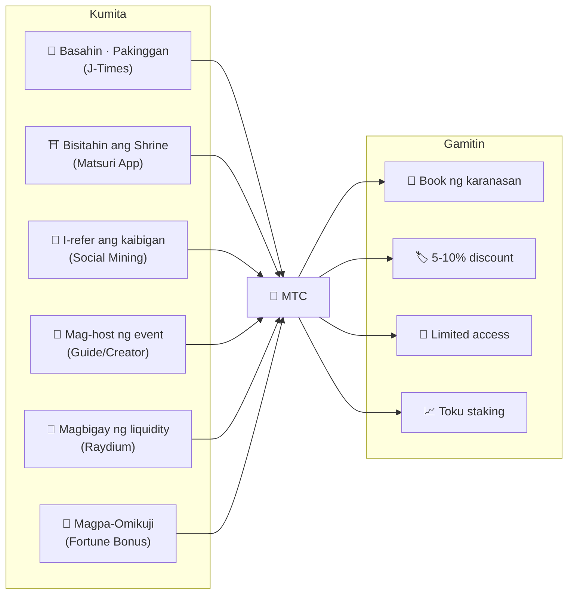
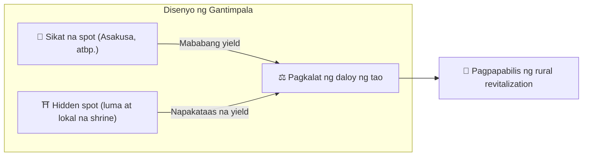
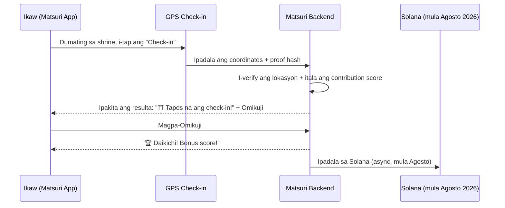
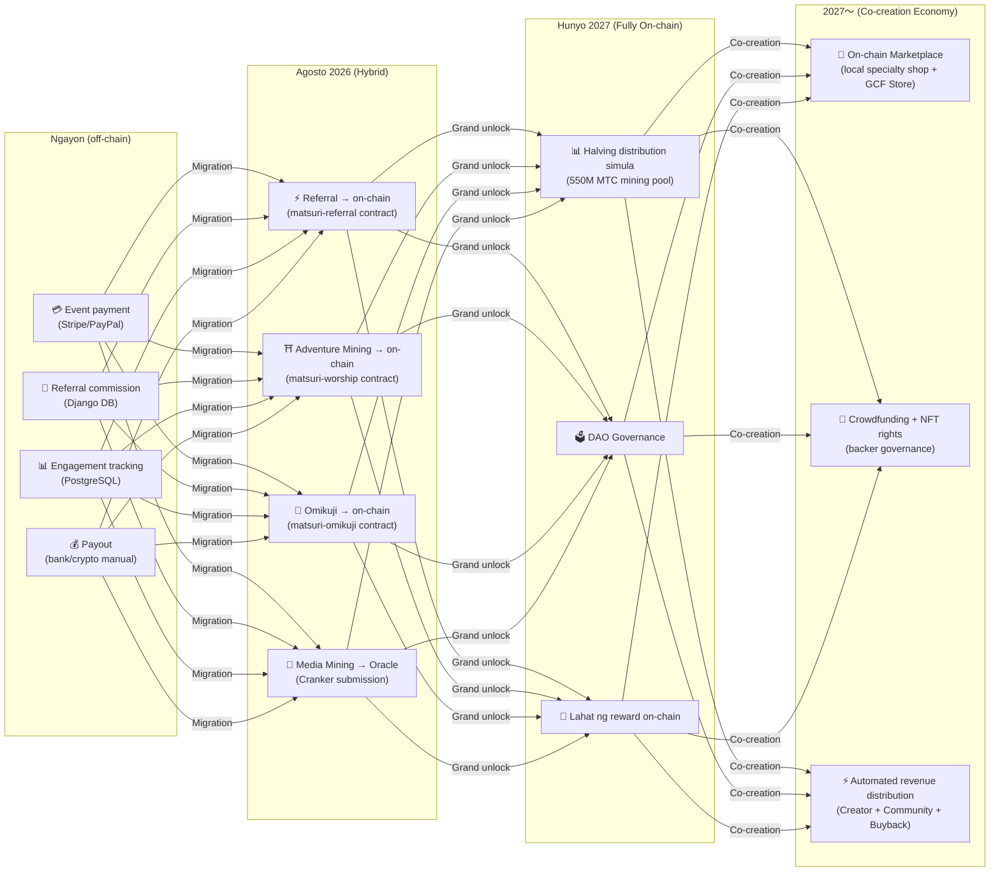

import useBaseUrl from '@docusaurus/useBaseUrl';

# ⛏️ 5 Pillars ng Mining at Paraan ng Pagkita

> **Ang "pakikilahok" sa kultura ay nagiging halaga mismo.**
> Pagbasa, paglakad, pag-uugnay, paglikha, pagsuporta — bawat kilos mo ay lumilikha ng MTC.

<small>*※ Ano ang "Mining"? — Sa Bitcoin at iba pa, ang "mining" ay tinatawag sa pagkuha ng bagong coin bilang gantimpala sa malawakang kalkulasyon ng computer. Sa MTC, hindi computational power kundi **ang sarili mong aksyon** — pagbabasa ng artikulo, pagbisita sa shrine, pag-host ng event — ang itinuturing na "pagmimina". Sa halip na magmina ng ginto, ang pakikilahok sa kultura ay lumilikha ng MTC. Iyan ang aming "mining".*</small>

> Kumita sa aksyon. Gamitin sa karanasan. Pag-aariin at palaguin.

Hindi speculative token ang MTC. Bawat aksyon ay lumilikha ng halaga at umiikot sa real economy na kinukuha rin ang halaga. Ang web application at management dashboard ay **gumagana na ngayon**. Sa kasalukuyan, nakatala ang contribution score sa off-chain (Django), at unti-unting lilipat sa on-chain mula Agosto 2026.

:::tip Buong Larawan
May **kompletong circular economy** ang MTC: Kumita sa tunay na aktibidad, gamitin sa tunay na karanasan, at lumalago ang halaga kasabay ng paglawak ng ecosystem. Sa pahinang ito, ipinapaliwanag namin nang detalyado ang mekanismong ito.
:::

---

## MTC Lifecycle

---

## 5 Pillars ng Mining

### 1. 📖 Media Mining (Kumita sa Pagbasa, Pakikinig, at Pagsagot)

**Naka-link sa opisyal na media "J-Times"**

Nakakatulong nang malaki ang kaalaman sa kalidad ng paglalakbay. Buksan ang **J-Times app** at tangkilikin ang content tungkol sa kulturang Hapones. Bukod sa pag-aaral sa text at audio, may gantimpala din para sa **quiz ng comprehension check**. Awtomatikong binibigyan ng MTC ang bawat tapos na aksyon.

| Aksyon | Kondisyon ng pagtatapos | Gantimpala (estimate) |
| :--- | :--- | :---: |
| **📰 Basahin ang artikulo** | Mag-scroll hanggang 75% | 2〜30 MTC |
| **🎧 Pakinggan ang podcast** | Mag-play hanggang matapos | 2〜30 MTC |
| **🎬 Panoorin ang video** | Isara ang detail screen matapos panoorin | 2〜30 MTC |
| **📤 I-share ang content** | Ipakita ang share sheet | 2〜30 MTC |
| **✅ Sagutin ang quiz** | Pumasa sa comprehension test | 2〜30 MTC |

<small>*※ Nag-iiba ang dami ng gantimpala ayon sa uri at haba ng content at sa supply balance ng buong ecosystem*</small>

:::tip Pati ang Maliliit na Oras ay Nagiging Mining
Ang oras ng biyahe o pahinga ay nagiging oras na lumilikha ng gantimpala.
:::

:::info Offline Support
Walang internet sa rural shrine? Walang problema. Lokal na nitatala ng J-Times ang aktibidad at **awtomatikong nagsa-sync pagbalik online** (7-day offline queue retention). Hindi mawawala ang MTC na kinita.
:::

**Daloy sa likod:**
1. Nade-detect ng J-Times app ang aksyon mo (natapos na pagbasa, pagpanood, share, atbp.)
2. Offline man, naitatala sa lokal (7 days retention)
3. Pagbalik ng network, ipinapadala sa server at na-verify
4. Makikita sa balance bilang contribution score
5. Mula Agosto 2026: Ang na-verify na score ay ita-record sa on-chain sa pamamagitan ng oracle, at makokonfirm sa blockchain

---

### 2. ⛩️ Adventure Mining (Kumita sa Paglakad)

**Project "Pilgrimage" ── Smart contract tapos na, mainnet deploy sa Agosto 2026**

Next-generation feature na kumokontrol ng pisikal na "daloy ng tao" gamit ang GPS at token incentive. Ang sacred map ay **gumagana na** sa Matsuri Web app. Sa kasalukuyan, nakatala ang contribution score sa off-chain, at sisimulan ang on-chain reward distribution pagkatapos ng smart contract deployment sa Agosto 2026.

>**Pumupunta sa probinsya dahil kumikita**
> Ang economic rationality na ito ang lumulutas sa overtourism at nagpapabilis sa rural revitalization.

**Mekanismo ng Check-in:**

  
  

    
<strong>Worship Mining</strong> — mag-check in malapit sa dambana, tuklasin ang enerhiya gamit ang AR camera, bumunot ng omikuji para sa MTC bonus. Multiplier mula 1.0× hanggang 10.0×.

  

**Pangunahing Prinsipyo — Mas maraming kinikita sa mga site na kaunti ang bumibisita:**

| Uri ng Site | Halimbawa | Gantimpala (1 check-in, estimate) |
| :--- | :--- | :---: |
| 🏙️ **Pangunahin** | Sensō-ji, Kiyomizu-dera, Fushimi Inari | 30〜50 MTC |
| 🌆 **Regional Core** | Ichinomiya ng bawat prefecture, regional taisha | 50〜100 MTC |
| 🏞️ **Probinsya** | Makasaysayang lokal na shrine | 100〜150 MTC |
| ⛰️ **Frontier** | Mountain temple, sacred site sa isolated island | 150〜200 MTC |

<small>*※ Estimate ng base reward ang nasa itaas. Maaaring doblehin o paramihin ng Omikuji multiplier*</small>

**Karagdagang Score Factors:**
- **Omikuji Multiplier** — Random bonus sa bawat check-in. Kung Daikichi, doble o higit pa ang gantimpala
- **Frequency ng pagbisita** — Ang mga regular visitor ay mas maraming kinikita habang tumatagal
- **Sponsored Sites** — Maaaring i-boost ng mga local government ang partikular na site

:::info Contribution Score → MTC
Ang aktibidad mo ay inaako bilang **contribution score**. Sa bawat halving epoch (simula Hunyo 2027), ang score ay ginagawang MTC mula sa 550M mining pool. Habang mas mataas ang kontribusyon sa community, mas maraming MTC ang tinatanggap. Ang eksaktong boost coefficient ay unti-unting ititiyak at ipatutupad sa smart contract — ginagarantiya ang patas na distribusyon na naaayon sa aktwal na laki ng pool.
:::

---

### 3. 🤝 Social Mining (Kumita sa Pag-uugnay)

Maaaring kumita ng MTC sa pagrefer lang ng kaibigan.

#### Referral Reward para sa Pangkalahatang User

Simpleng mekanismo. Kapag nagparehistro ang kaibigan mula sa iyong referral link, **binibigyan ka ng 300 MTC kada direktang referral**.

| Kondisyon | Gantimpala |
| :--- | :--- |
| Nag-sign up ang inireferral mong kaibigan | **300 MTC** |

Iyon lamang. Walang multi-level reward.

#### Referral Reward para sa GCF Agent

Ang [GCF member](/docs/gcf) ay may mas malalim na reward structure bilang **opisyal na agent** na nangangasiwa ng pagpapalawak ng ecosystem.

| Layer | Ugnayan | Commission |
| :---: | :--- | :---: |
| **L1** | Direktang referral | **20%** |
| **L2** | Referral ng inireferral | **5%** |
| **L3** | 3rd degree | **5%** |
| **L4** | 4th degree | **5%** |

:::note Tungkol sa GCF Agent System
Ang multi-level reward na ito ay para lamang sa mga opisyal na agent na may GCF Membership (invitation-based). Ang pangkalahatang user ay may direktang referral lamang (300 MTC).
Ang commission ng GCF agent ay kinakalkula base sa **aktwal na economic activity (pagbili ng karanasan, pagdalo sa event, atbp.)** ng inireferral. Hindi nagbibigay ng gantimpala ang pagtitipon lang ng tao.
:::

**Mekanismo ng En-Mining Score (para sa GCF Agents):**

Ang contribution score ay kinakalkula base sa dalawang elemento:
- **Lawak ng network** (30%) — Ilan ang dinala
- **Economic activity** (70%) — Aktwal na pagbili mula sa referral network

Ang score ay umiipon habang lumilipas ang panahon, at kino-convert sa MTC tuwing halving epoch.

#### GCF Management Dashboard ── Web Version Gumagana Na

Binibigyan ng access sa espesyal na management dashboard ang GCF members.

| Feature | Kung ano ang magagawa |
| :--- | :--- |
| **🎪 Paglikha ng Event** | Magplano at mag-post ng sariling event o tour |
| **📢 Content Distribution** | Ipamahagi at palawakin ang artikulo at content ng J-Times |
| **📊 Referral Tracking** | Real-time tracking ng gawi at kita ng users na inireferral |

:::warning Kasalukuyang Off-chain → Lilipat sa On-chain sa Agosto 2026
Ang referral commission ay kasalukuyang tina-track sa Django (PostgreSQL) at binabayaran sa bank transfer o cryptocurrency. Mula **Agosto 2026**, lilipat sa **Matsuri Referral smart contract** sa Solana para maisakatuparan ang on-chain auditable payment.
:::

  

*Community meetup sa Golden Gai ── ang koneksyon ay nagiging mining power.*

---

### 4. 🎓 Creator & Guide Mining (Kumita sa Paglikha)

Hindi lang konsumo ng content — sa platform ng Matsuri, **kahit sino** ay maaaring gumawa ng content at kumita. Kung GCF member, guide, o content creator kayo, maaari kayong kumita sa mga sumusunod na paraan.

| Aktibidad | Paraan ng Pagkita |
| :--- | :--- |
| **🗺️ Mag-host ng tour** | Guide commission (itinatakda sa bawat event) + tip |
| **🎫 Magbenta ng event ticket** | Revenue share sa pamamagitan ng EventPurchase |
| **📚 Mag-publish ng course** | Commission per enrollment (creator revenue share) |
| **🎙️ Gumawa ng podcast episode** | Kita sa subscription |
| **🤝 Mag-launch ng crowdfunding campaign** | Solana-based on-chain contribution tracking |
| **🛍️ Magbukas ng user shop** | Direktang benta ng crafts at goods |

**Tip System:** Pagkatapos ng event, maaaring magbigay ng tip ang mga bisita sa guide (Uber style). Ang tip ay pinoproseso ng Stripe at tina-track sa public leaderboard.

:::tip AI-Powered Production Support
Maaaring gamitin ng event host ang **built-in AI assistant (GPT-4 Turbo)** para sa paggawa ng event description, awtomatikong pagsasalin sa 5 wika, at pag-generate ng SEO-optimized metadata mula sa loob ng management dashboard.
:::

---

### 5. 🏦 Liquidity Mining (Kumita sa Pagdeposito)

>**Maging bangko.**

Mag-provide ng MTC/SOL liquidity sa Raydium DEX at suportahan ang trading base ng ecosystem sa umpisa. Para sa mga early liquidity provider, may espesyal na reward program bilang "founding partner".

| Item | Detalye |
| :--- | :--- |
| **Para sa** | Lahat ng user na may MTC at SOL |
| **Target APY** | **20%** (initial liquidity incentive, itinatakda bilang risk premium) |
| **DEX** | Raydium (Solana) |
| **Kahalagahan** | Tinitiyak ang liquidity sa umpisa ng ecosystem at nagtatayo ng matatag na trading environment |

---

## 🎲 Omikuji Bonus

Kasama sa bawat Adventure Mining check-in ang libreng Omikuji. Smart contract na may Omikuji format na **libreng (gas lang) ipinapatupad** sa pagtatapos ng check-in.

| Kapalaran | Reward Multiplier | Karagdagang Bonus |
| :--- | :---: | :--- |
| 🏆 **Daikichi (Malaking Swerte)** | Base reward × Max multiplier | Goshuin NFT |
| ✨ **Kichi (Swerte)** | Base reward × High multiplier | — |
| 🌸 **Shōkichi (Maliit na Swerte)** | Base reward × Small multiplier | — |
| 🍃 **Suekichi (Hukay ng Swerte)** | Base reward × 1.0 | — |
| 💀 **Kyō (Malas)** | Base reward × 1.0 | — |

Ang probability at multiplier ay maaaring i-adjust mula sa GCF management dashboard, at pinamamahalaan ng operation alinsunod sa MTC supply balance ng buong ecosystem. Ang resulta ay pinapasya ng **tamper-proof commit-reveal protocol** sa Solana, at pagkatapos ng commit phase, walang makakapagbago ng resulta.

<small>*※ Kahit Kyō ang lumabas, natatanggap pa rin ang base reward. Idinisenyo upang ma-gantimpalaan ang mismong kilos ng check-in*</small>

:::note Hindi Sugal Ito
Walang kailangang monetary bet. Random bonus para sa **kilos ng "pagbisita"**. Sa pagkolekta ng partikular na NFT, maaaring ma-unlock ang access sa special events.
:::

---

## Mga Paggamit ng MTC

| Use Case | Benepisyo | Availability |
| :--- | :--- | :---: |
| **🎫 Book ng karanasan** | Magbayad sa MTC para sa tour, event, cultural activity | ✅ Available na |
| **🏷️ Discount** | 5-10% discount sa ¥ price sa MTC payment | ✅ Available na |
| **🔑 Limited Access** | NFT-gated event, VIP-exclusive ritual, private tour | ✅ Available na |
| **📈 Toku Staking** | I-lock ang MTC para mag-boost ng contribution score (hanggang ~50% boost) | 🔜 Agosto 2026 |
| **🗳️ DAO Governance** | Boto sa treasury, protocol upgrade, site certification | 🔜 2027 |
| **🛍️ Partner Store** | Magbayad sa mga partner shop at restaurant | 🔜 Lumalawak |

:::info MTC bilang Payment Method
Sa Matsuri App, ang MTC ay first-class payment method kasabay ng credit card at Solana Pay. Walang conversion — piliin lang ang "Magbayad sa MTC" sa checkout at agad itong ibinabawas sa balance.
:::

### Tungkol sa Pag-convert ng MTC

:::warning Mahalaga: Hindi Kami Nagbibigay ng Serbisyo ng Pag-convert ng MTC
Ang Matsuri operation ay hindi nakarehistro bilang crypto asset exchange business, kaya **hindi kami nagbibigay ng direktang exchange ng MTC at fiat currency (¥, $, atbp.)**.

Kung nais ipag-exchange ang MTC sa ibang crypto asset o fiat currency, maaari itong gawin ng user mismo sa sumusunod na paraan:
1. Pamahalaan ang MTC sa Solana-compatible wallet tulad ng **Phantom Wallet**
2. I-exchange ang MTC → SOL sa **Raydium (DEX)**
3. I-convert ang SOL sa fiat currency sa cryptocurrency exchange (CEX)

Sa hinaharap, isinasaalang-alang din ang listing sa CEX (centralized exchange), at kung ganoon, mas madali ang magiging paraan ng pag-convert.
:::

---

## Halimbawa: Isang Araw sa MTC Economy

> **Umaga:** Magbasa ng 3 artikulo ng J-Times sa tren → Kumita ng MTC.
> **Hapon:** Bisitahin ang lokal na shrine sa Matsuri App → Check-in, magpa-Kichi (×1.5) → Kumita pa ng MTC.
> **Gabi:** Gamitin ang nakuhang MTC para mag-book ng ¥9,000 Shinjuku Golden Gai cultural tour na may 10% discount (nagbabayad ng ¥8,100 equivalent).
> **Resulta:** Ang pagkauhaw mo sa kultura ay naging tunay na karanasan, at direkta ring nakatanggap ng bayad ang guide, shrine, at community. Hindi kumuha ng 20% commission ang OTA.

---

## Sustainability ng Ekonomiya

:::warning Ano ang mangyayari kapag naubos ang mining pool?
Ang 550M MTC halving pool ay idinisenyo upang tumagal ng **ilang dekada**. Dahil nahahati sa dalawa ang emission kada 2 taon, hindi kailanman makakarating sa 100% sa matematika, at patuloy na magbibigay ng gantimpala sa mahabang panahon (tingnan ang [Tokenomics](/docs/tokenomics) para sa detalye). Ngunit kahit pagkatapos maging napakababa ng emission:

- **Transaction fees** ay patuloy na magbibigay ng gantimpala sa mga network participant mula sa on-chain activity
- **Buyback Protocol** (20-25% ng revenue) ay lumilikha ng tuloy-tuloy na buying pressure
- **Toku Staking** ay nagla-lock ng circulating supply at nagpapababa ng selling pressure
- **Tunay na revenue ng negosyo** (event, membership, course) ay sumusuporta sa ecosystem na independyente sa token distribution

Sinusuportahan ang MTC ng **real economy** — hindi lang basta token emission.
:::

---

## Roadmap ng On-Chain Migration

Ang Matsuri economy ay unti-unting lumilipat mula sa off-chain (Django/PostgreSQL) patungong on-chain (Solana smart contracts). Sa pamamagitan ng migration na ito, lahat ng operation ay magiging **trustless, auditable, at permissionless**.

| Phase | Timeline | Ano ang Mako-on-chain |
| :--- | :--- | :--- |
| **Phase 1 (Ngayon)** | Gumagana | MTC token (SPL), Raydium LP, Solana Pay verification |
| **Phase 2 (Agosto 2026)** | Smart contract mainnet deploy | Referral commission, adventure mining reward, Omikuji raffle, media mining sa pamamagitan ng oracle |
| **Phase 3 (Hunyo 2027)** | Grand unlock | 550M MTC halving distribution, DAO governance, kompletong desentralisasyon |
| **Phase 4 (2027〜)** | Co-creation economy | On-chain marketplace (local specialty shop + GCF store), crowdfunding na may NFT rights, automatic revenue distribution sa creator + community + buyback |

:::warning Bakit hindi ngayon on-chain lahat?
**Hindi namin bubuksan ang on-chain function na nagpapagalaw ng pondo ng user hanggang hindi natatapos ang security audit.** Iyan ang prinsipyo namin.

Kasalukuyang Sitwasyon:
- **Panganib sa pondo ng user: Wala** — Sa kasalukuyan, lahat ng reward at score ay pinamamahalaan sa off-chain (Django), at walang gumagana pang function na nagpapagalaw ng pondo ng user sa pamamagitan ng smart contract
- **Iskedyul ng Audit: 2026 Q2〜Q3** — Sa pamamagitan ng professional security audit, unti-unti naming ide-deploy sa mainnet ang mga contract na nakumpirma na safe
- **Kinakailangan ang tapos na audit bago mag-deploy** — Hindi kailanman paaandarin sa mainnet ang smart contract na hindi pa tapos na-audit

Maaaring i-verify ang reward kahit sa off-chain period — lahat ng transaksyon ay may kasamang `solana_signature` bilang proof of settlement.
:::

---

**[▶ Susunod: Tokenomics](/docs/tokenomics)** ｜ **[◀ Nakaraan: Ecosystem](/docs/ecosystem)**
