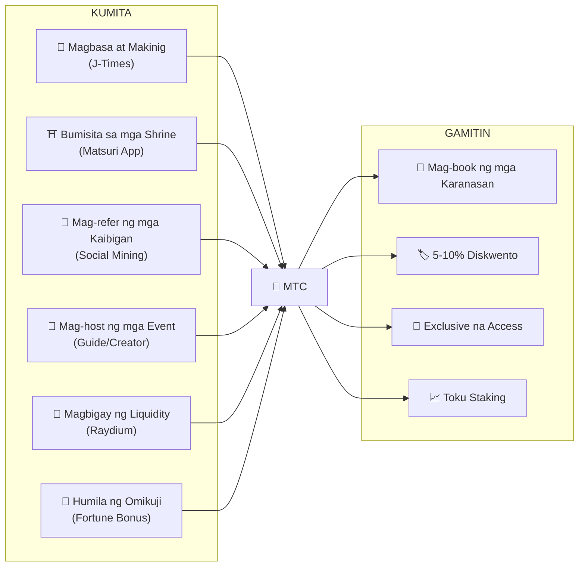
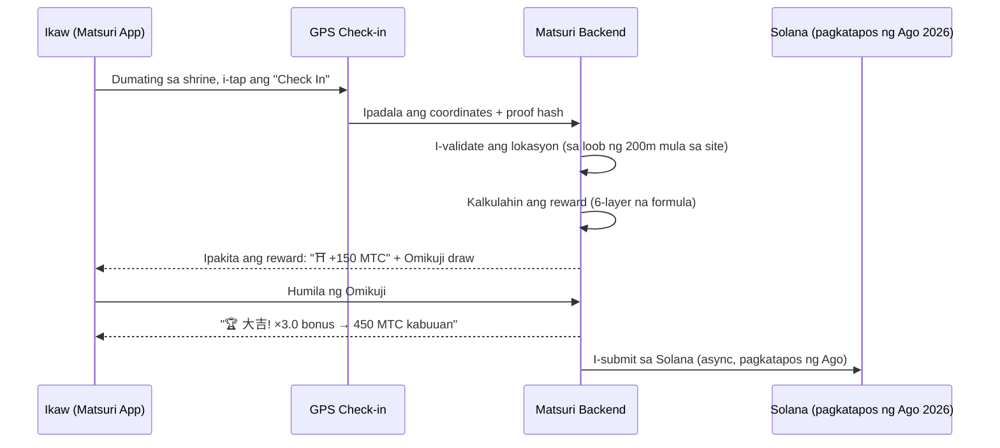
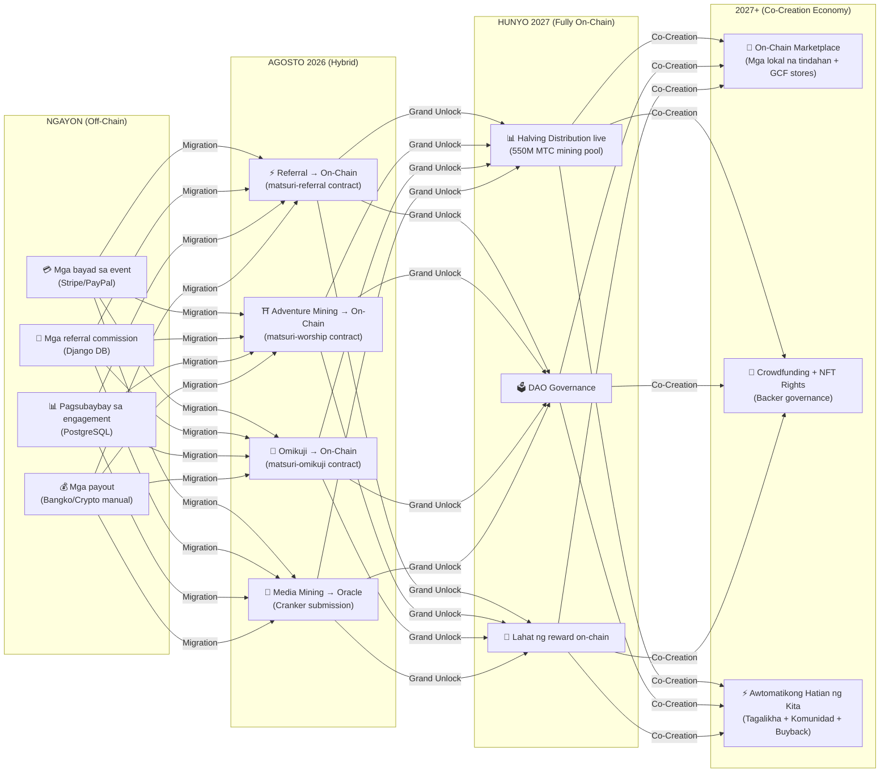

# 💎 Paano Kumita at Gumamit ng MTC

> **Kumita sa pamamagitan ng aksyon. Gastusin sa karanasan. Hawakan para sa paglago.**
> Ang MTC ay hindi lang isang speculative token — umaagos ito sa isang tunay na ekonomiya kung saan bawat aksyon ay lumilikha at kumukuha ng halaga.

:::tip Ang Malaking Larawan
Ang MTC ay may **kumpletong circular economy**: kinikita mo ito sa pamamagitan ng tunay na aktibidad, ginagastos sa tunay na karanasan, at lumalaki ang halaga nito habang lumalawak ang ecosystem. Ipinapakita ng pahinang ito kung paano eksaktong gawin.
:::

---

## Ang Lifecycle ng MTC



---

## Paano Kumita ng MTC

### 1. 📖 Media Mining — Magbasa, Makinig at Manood sa J-Times

Buksan ang **J-Times app** at kumain ng content tungkol sa kulturang Hapon. Bawat nakumpletong aksyon ay awtomatikong kumikita ng MTC.

| Aksyon | Pamantayan ng Pagkumpleto | Reward |
| :--- | :--- | :---: |
| **Magbasa ng artikulo** | Mag-scroll hanggang 75% ng lalim | MTC |
| **Makinig ng podcast** | I-play hanggang matapos | MTC |
| **Manood ng video** | Umalis sa detail screen pagkatapos manood | MTC |
| **Magbahagi ng content** | Naipakita ang share sheet | MTC |
| **Kumpletuhin ang quiz** | Pumasa sa comprehension test | MTC (instant) |

:::info Offline na Suporta
Walang internet sa isang rural na shrine? Walang problema. Nire-record ng J-Times ang iyong aktibidad nang lokal at **awtomatikong sini-sync kapag bumalik ka online** (offline queue na may 7-araw na retention). Hindi mo kailanman mawawala ang nakuhang MTC.
:::

**Paano ito gumagana sa likod ng eksena:**
1. Ang `EngagementTracker` sa app ay nakaka-detect ng completion events
2. Ang mga aksyon ay naka-queue nang lokal (kahit offline)
3. Kapag bumalik ang network, ang mga aksyon ay pinagsasama-sama at ipinapadala sa Django API
4. Vine-validate ng API at kini-credit ang MTC sa iyong balance
5. Pagkatapos ng Agosto 2026: ang mga aksyon ay isu-submit on-chain sa pamamagitan ng Cranker oracle

---

### 2. ⛩️ Adventure Mining — Bumisita sa mga Sagradong Lugar gamit ang Matsuri App

Buksan ang **Matsuri app**, humanap ng shrine o templo sa Sacred Site Map, pumunta doon, at mag-check in. Kung mas kakaunti ang bumibisita sa lugar, mas malaki ang kikitain mo.

**Hakbang-hakbang na daloy:**



**Mga reward multiplier — bakit mas malaki ang bayad sa rural:**

| Uri ng Lugar | Mga Halimbawa | Multiplier |
| :--- | :--- | :---: |
| 🏙️ **Pangunahin** | Sensoji, Kiyomizu-dera, Fushimi Inari | ×1 |
| 🌆 **Rehiyonal** | Prefectural na ichinomiya, rehiyonal na malalaking shrine | ×2 |
| 🏞️ **Rural** | Makasaysayang mga shrine sa kanayunan | ×5 |
| ⛰️ **Frontier** | Mga templo sa bundok, mga sagradong lugar sa malalayong isla | ×10 |

**Dagdag pang mga bonus:**
- **Pioneer Bonus** — ang unang bumisita sa araw ay kumikita ng pinakamataas (harmonic decay)
- **Streak Bonus** — bumisita ng magkakasunod na araw para sa hanggang +50%
- **Omikuji** — random na fortune draw: 大吉 = ×3.0, 吉 = ×1.5, 小吉 = ×1.2
- **Sponsored Beacons** — nagde-deposito ang mga munisipalidad ng MTC para i-boost ang mga partikular na lugar

> **Halimbawa:** Bumisita sa isang malalayong shrine sa bundok (×10) bilang ika-2 na bisita sa araw, na may 5-araw na streak (+10%), at humila ng 吉 (×1.5) = ang base reward ay naging **16.5× ang laki**.

---

### 3. 🤝 Social Mining — Mag-refer ng mga Kaibigan at Buuin ang Iyong Network

Ibahagi ang iyong referral code. Kapag nag-transact ang iyong network, awtomatiko kang kumikita.

| Layer | Relasyon | Commission |
| :---: | :--- | :---: |
| **L1** | Ikaw → Kaibigan (direkta) | **20%** |
| **L2** | Kaibigan → Kanilang kaibigan | **5%** |
| **L3** | Ika-3 na antas | **5%** |
| **L4** | Ika-4 na antas | **5%** |

**Paano gumagana ang En-Mining score:**

```
Iyong Score = (Direktang Referrals × 30%) + (Network Transaction Volume × 70%)
             × Toku Staking Multiplier (1.0× – 10.0×)
             × Title Boost (+5% bawat ranked season, max +50%)
```

> **Mahalagang pananaw:** 70% ng iyong score ay nanggagaling sa **tunay na ekonomikong aktibidad** sa iyong network, hindi lang mga sign-up. Ang pag-imbita ng 1,000 tao na hindi kailanman gumagastos ay kumikita ng mas kaunti kaysa sa pag-imbita ng 10 aktibong gumagastos.

:::warning Kasalukuyang Off-Chain → Lilipat sa On-Chain Agosto 2026
Ang mga referral commission ay kasalukuyang tina-track sa Django (PostgreSQL) at binabayaran sa pamamagitan ng bank transfer o crypto. Simula **Agosto 2026**, ang buong referral commission system ay lilipat sa **Matsuri Referral smart contract** sa Solana — na gagawing trustless, instant, at auditable on-chain ang mga payout.
:::

---

### 4. 🎪 Creator & Guide Mining — Mag-host ng mga Event, Lumikha ng Content

Kung ikaw ay miyembro ng GCF, guide, o content creator:

| Aktibidad | Paano Ka Kumikita |
| :--- | :--- |
| **Mag-host ng tour** | Guide commission (itinakda bawat event) + tips |
| **Magbenta ng event tickets** | Revenue share sa pamamagitan ng EventPurchase |
| **Mag-publish ng kurso** | Per-enrollment fee |
| **Lumikha ng podcast episodes** | Subscription revenue |
| **Maglunsad ng crowdfunding campaign** | Solana-based na mga kontribusyon |

**Sistema ng tip:** Pagkatapos ng bawat event, maaaring mag-tip ang mga bisita sa mga guide (estilo ng Uber). Ang mga tip ay pinoproseso sa pamamagitan ng Stripe at tina-track sa isang pampublikong leaderboard.

---

### 5. 🏦 Liquidity Mining — Magbigay ng Liquidity sa Raydium

Magbigay ng MTC/SOL liquidity sa Raydium DEX at kumita ng mga reward.

| Item | Detalye |
| :--- | :--- |
| **Target APY** | 50% (maagang liquidity incentive) |
| **DEX** | Raydium (Solana) |
| **Sino** | Sinumang may hawak na MTC at SOL |

---

### 6. 🎲 Omikuji Bonus — Fortune Multiplier

Bawat Adventure Mining check-in ay may kasamang libreng Omikuji (fortune) draw. Ang multiplier na ito ay inilalapat sa ibabaw ng lahat ng iba pang bonus.

| Fortune | Probability | Multiplier |
| :--- | :---: | :---: |
| 🏆 **大吉** (Dakilang Biyaya) | 5% | ×3.0 |
| ✨ **吉** (Biyaya) | 15% | ×1.5 |
| 🌸 **小吉** (Maliit na Biyaya) | 30% | ×1.2 |
| 🍃 **末吉** (Hinaharap na Biyaya) | 35% | ×1.0 |
| 💀 **凶** (Malas) | 15% | ×1.0 |

Ang resulta ay tinutukoy ng isang **tamper-proof commit-reveal protocol** sa Solana. Kahit ang server ay hindi makakapagbago ng iyong resulta pagkatapos ng commit phase.

---

## Saan Gagastusin ang MTC

| Gamit | Benepisyo | Available |
| :--- | :--- | :---: |
| **🎫 Mag-book ng mga karanasan** | Magbayad para sa mga tour, event, at kultural na aktibidad gamit ang MTC | ✅ Ngayon |
| **🏷️ Diskwento** | 5–10% na diskwento kumpara sa presyong yen kapag nagbabayad gamit ang MTC | ✅ Ngayon |
| **🔑 Exclusive na access** | NFT-gated na mga event, VIP-only na seremonya, pribadong tour | ✅ Ngayon |
| **📈 Toku Staking** | I-lock ang MTC para i-boost ang iyong mining multiplier (1.0× → 10.0×) | 🔜 Ago 2026 |
| **🗳️ DAO Governance** | Bumoto sa treasury, protocol upgrades, at site certification | 🔜 2027 |
| **🛍️ Mga partner store** | Magbayad sa mga kalahok na tindahan at restaurant | 🔜 Lumalawak |

:::info MTC bilang Pambayad
Sa Matsuri app, ang MTC ay isang first-class na paraan ng pagbabayad kasama ng mga credit card at Solana Pay. Hindi kailangan ng conversion — piliin ang "Magbayad gamit ang MTC" sa checkout at agad na ibabawas ang balance.
:::

### Halimbawa: Isang Araw sa Ekonomiya ng MTC

> **Umaga:** Magbasa ng 3 J-Times na artikulo sa tren → kumita ng MTC.
> **Hapon:** Bumisita sa isang rural na shrine gamit ang Matsuri app → mag-check in, humila ng 吉 (×1.5) → kumita ng mas maraming MTC.
> **Gabi:** Gamitin ang nakuhang MTC para mag-book ng ¥9,000 na Golden Gai cultural tour na may 10% diskwento (magbayad ng katumbas na ¥8,100).
> **Resulta:** Ang iyong kultural na pagkamausisa ay nagpondo ng isang tunay na karanasan — at ang guide, ang shrine, at ang komunidad ay tumanggap lahat ng direktang bayad. Walang OTA ang kumuha ng 20% na bahagi.

### Ekonomikong Sustainability

:::warning Ano ang Mangyayari Kapag Naubos ang Mining Pool?
Ang 550M MTC halving pool ay idinisenyo para tumagal ng **mga dekada** (20 epochs × 2 taon = 40 taon sa teorya). Ngunit kahit pagkatapos maubos ang pool:

- Ang mga **transaction fee** mula sa on-chain na aktibidad ay patuloy na nagre-reward sa mga kalahok sa network
- Ang **buyback protocol** (20-25% ng business revenue) ay lumilikha ng perpetual na buy pressure
- Ang **Toku staking** ay nagla-lock ng circulating supply, binabawasan ang sell pressure
- Ang **tunay na business revenue** (mga event, membership, kurso) ay nagsu-sustain sa ecosystem nang hiwalay sa token distribution

Ang MTC ay sinusuportahan ng isang **tunay na ekonomiya** — hindi lang token emissions.
:::

---

## On-Chain Migration Roadmap

Ang ekonomiya ng Matsuri ay unti-unting lumilipat mula off-chain (Django/PostgreSQL) patungo sa on-chain (Solana smart contracts). Ang transisyong ito ay ginagawang **trustless, auditable, at permissionless** ang lahat ng operasyon.



| Phase | Timeline | Ano ang Lilipat sa On-Chain |
| :--- | :--- | :--- |
| **Phase 1 (Ngayon)** | Live | MTC token (SPL), Raydium LP, Solana Pay verification |
| **Phase 2 (Ago 2026)** | Smart contract mainnet deploy | Mga referral commission, Adventure Mining reward, Omikuji draw, Media Mining sa pamamagitan ng oracle |
| **Phase 3 (Hun 2027)** | Grand Unlock | 550M MTC halving distribution, DAO governance, buong decentralization |
| **Phase 4 (2027+)** | Co-Creation Economy | On-chain marketplace (mga lokal na tindahan + GCF stores), crowdfunding na may NFT rights, awtomatikong hatian ng kita sa mga tagalikha + komunidad + buyback |

:::warning Bakit Hindi Lahat On-Chain Ngayon?
Ang paglipat ng lahat sa on-chain bago ang isang **propesyonal na security audit** (nakaplanong Q2 2026) ay magiging iresponsable. Ang kasalukuyang hybrid na diskarte ay nagpapahintulot sa amin na mag-iterate nang ligtas habang naghahanda para sa trustless on-chain na operasyon. Ang off-chain na mga reward ay nananatiling nabe-verify — bawat transaksyon ay may `solana_signature` para sa settlement proof.
:::

---

**[▶ Susunod: Mga Mobile App](/docs/mobile-apps)** ｜ **[◀ Nakaraan: Ecosystem at Mining](/docs/ecosystem)**
