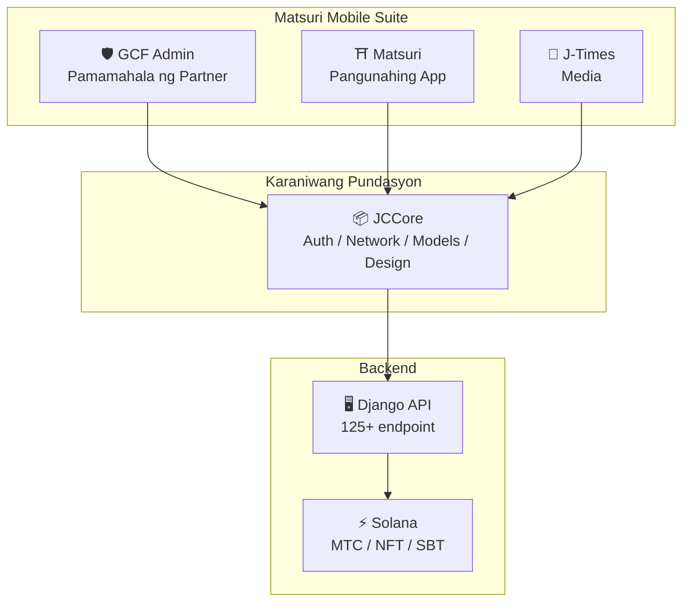
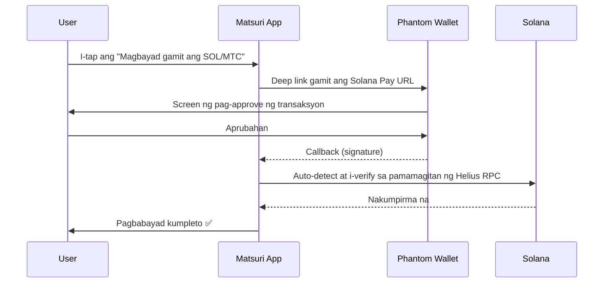
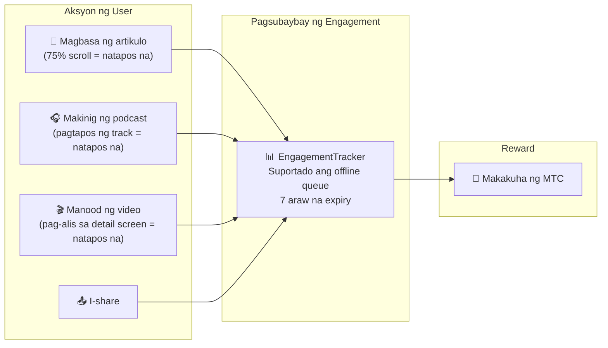
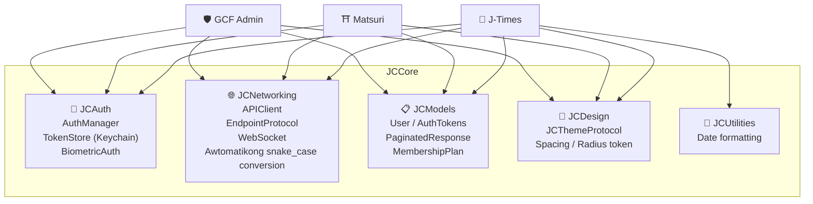

# 📱 Mobile App Suite

> **Tatlong native iOS app na sumasaklaw sa bawat layer ng Matsuri ecosystem.**
> Buong-buong ginawa gamit ang Swift 6 / iOS 17+. Pinag-isang authentication, networking, at disenyo sa pamamagitan ng shared na **JCCore** library.

:::tip Bakit Ito Mahalaga para sa mga Investor
Karamihan sa mga Web3 project ay may website at whitepaper lang. Ang Matsuri ay may **3 production iOS app na may 827+ na automated test**, shared infrastructure, at native Solana integration. Ito ay bihirang lalim ng execution sa token space.
:::

---

## Pangkalahatang-tanaw ng App

| App | Layunin | Status | Mga Wika |
| :--- | :--- | :---: | :--- |
| **GCF Admin** | Pamamahala ng partner at operasyon | ✅ Nailabas na | 🇯🇵🇬🇧🇨🇳🇹🇭🇳🇴 |
| **Matsuri** | Pangunahing app para sa consumer | 🔜 Huling bahagi ng Abril 2026 | 🇯🇵🇬🇧🇨🇳🇹🇭🇳🇴 |
| **J-Times** | Culture media at pag-aaral | 🔜 Huling bahagi ng Abril 2026 | 🇯🇵🇬🇧 |

---

## 1. 🛡️ GCF Admin — App para sa Pamamahala ng Partner

:::info Status: Nailabas na sa App Store (v1.0)
Business management app para sa mga miyembro ng GCF (Global Community Friends). Pinagsama ang lahat ng function ng web admin panel sa mobile.
:::

  
  
  

### Ano ang Magagawa Mo sa App na Ito

| Kategorya | Feature |
| :--- | :--- |
| **📊 Dashboard** | KPI card, sales chart, mabilis na aksyon |
| **👥 Pamamahala ng Miyembro** | Listahan, detalye, pag-edit, pamamahala ng tier |
| **💰 Pamamahala ng Kita** | Pagsubaybay ng komisyon, pamamahala ng MTC withdrawal, pamamahala ng payout |
| **📝 Pamamahala ng Nilalaman** | Paggawa, pag-edit, pag-publish ng event, artikulo, podcast, video |
| **🎫 Guide Slot** | Pamamahala ng guide slot, pagsubaybay ng kita |
| **🖼️ NFT Dashboard** | Founder's Collection, on-chain na pagpapatunay, NFT transfer |
| **⛩️ Pamamahala ng Banal na Lugar** | CRUD ng site, beacon setting |
| **🎲 AR Mining Setting** | Omikuji probability table, pamamahala ng reward parameter |
| **📊 Analytics** | Error report, pagsusuri ng paggamit |
| **🔗 Referral** | Paggawa ng custom QR code, pamamahala ng referral program |

### Teknikal na Detalye

| Aytem | Detalye |
| :--- | :--- |
| **Arkitektura** | Clean Architecture + MVVM + `@Observable` (iOS 17) |
| **Wika / SDK** | Swift 6.0 / Xcode 16+ / iOS 17.0+ |
| **Koneksyon sa API** | 125+ na endpoint |
| **Pagsubok** | 226 na test / 45 na test class |
| **Lokalisasyon** | 5 wika (Hapon, Ingles, Tsino, Thai, Norwegian) / 957+ na translation key |
| **Swift Concurrency** | Sumusunod sa Strict Concurrency / walang build warning |

### QR Code Integration

Sa GCF Admin, maaari kang gumawa ng custom QR code na may Matsuri logo. Magagamit para sa event invitation, referral link, payment request, at marami pa.

---

## 2. ⛩️ Matsuri — Pangunahing App

:::info Status: Inaasahang ilabas sa huling bahagi ng Abril 2026 (v3.0)
Pangunahing app para sa mga karaniwang user. Event booking, pagbabayad, Web3 wallet, AR Mining — lahat sa iisang app.
:::

  
  
  

### Ano ang Magagawa Mo sa App na Ito

| Kategorya | Feature |
| :--- | :--- |
| **🎪 Event Booking** | Paghahanap, pag-book, pagbabayad sa Stripe, pamamahala ng ticket QR |
| **💳 4 na Paraan ng Pagbabayad** | Credit card / naka-save na card / MTC balance / crypto (SOL/MTC) |
| **👛 Web3 Wallet** | Pagpapakita ng MTC balance, pagpapadala at pagtanggap, kasaysayan ng transaksyon |
| **🖼️ NFT Gallery** | Listahan ng hawak na NFT/SBT, on-chain na pagpapatunay |
| **🗺️ Mapa ng Banal na Lugar** | Pagpapakita ng mapa ng shrine at templo, check-in |
| **🎲 AR Mining** | WebAR omikuji experience, pagkuha ng MTC |
| **💬 Chat** | Pagmemensahe na may context menu |
| **⭐ Wishlist** | Pag-save ng paboritong event at karanasan |
| **🔍 Advanced na Paghahanap** | Suportado ang voice search |
| **🤝 Referral** | Pagsali sa referral program, pagsubaybay ng reward |
| **📊 GCF Dashboard** | Simpleng management panel para sa mga miyembro ng GCF |

### Phantom Wallet Integration — Zero-Input na Crypto Payment

> **Walang kailangang i-copy ang address.** Awtomatikong bubukas ang Phantom Wallet, i-approve ng user, at kumpleto na ang bayad. Ang mga transaction signature ay auto-detect sa pamamagitan ng Helius RPC — ang pinakamaayos na crypto payment UX sa merkado.

:::tip Bakit Ito Mahalaga
Karamihan sa mga Web3 app ay pinipilit ang mga user na kopyahin ang wallet address, mano-manong ilagay ang halaga, at maghintay ng kumpirmasyon. Ang Solana Pay integration ng Matsuri ay binabawasan ito sa **isang tap lang** — katulad ng UX ng Apple Pay habang nagse-settle sa on-chain.
:::

### Teknikal na Detalye

| Aytem | Detalye |
| :--- | :--- |
| **Arkitektura** | Clean Architecture + MVVM + Swift Concurrency |
| **Wika / SDK** | Swift 6.0 / Xcode 16+ / iOS 17.0+ |
| **Pagbabayad** | Stripe PaymentSheet + MTC Balance + Phantom (Solana Pay) |
| **Koneksyon sa API** | 72 endpoint / 16 na kategorya |
| **Pagsubok** | 230+ (Model, ViewModel, Network, Security, DeepLink, E2E) |
| **Lokalisasyon** | 5 wika (Hapon, Ingles, Tsino, Thai, Norwegian) / 406 na translation key |
| **Bilang ng ViewModel** | 25 (buong MVVM — walang direktang API call mula sa View) |
| **Authentication** | Apple Sign In / Google Sign In (PKCE) |

---

## 3. 📰 J-Times — Culture Media App

:::info Status: Inaasahang ilabas sa huling bahagi ng Abril 2026
Isang media platform na nagpapahayag ng malalim na aspeto ng kulturang Hapon. Magbasa ng artikulo, makinig ng podcast, manood ng video — bawat aksyon ay nagbibigay ng MTC.
:::

  

### Ano ang Magagawa Mo sa App na Ito

| Kategorya | Feature |
| :--- | :--- |
| **📖 Artikulo** | Parallax hero, drop cap, reading progress bar, rich content (Markdown, table, quote) |
| **🎧 Podcast** | Pag-browse ng series, waveform player, sleep timer, AirPlay, lock screen control |
| **🎬 Video** | Adaptive grid/list display, short video (TikTok style, double-tap) |
| **🔍 Paghahanap** | Multi-filter, trending tag, voice search |
| **🧭 Discovery** | Featured carousel, staff pick, popular ngayong linggo |
| **📚 Library** | Mga paborito, kasaysayan (ayon sa petsa), download, playlist |
| **🎵 Audio Player** | Mini player (swipe control), full player (waveform, lyrics, repeat) |
| **👤 Membership** | Paghahambing ng feature ng 3 tier (Free / Premium / Pro), pagbabalik ng pagbili |

### Media Mining — Ang Pagbabasa, Pakikinig, at Panonood ay Nagiging Mining

> **Nare-record kahit offline.** Kahit magbasa ka ng artikulo sa shrine sa bundok na walang signal, kapag bumalik ang internet, awtomatikong ipapadala ang engagement at ibibigay ang MTC.

### Design System — "Apat na Haligi" ng Japanese Aesthetics

Gumagamit ang J-Times ng natatanging design system na nag-aapply ng tradisyunal na Japanese aesthetics sa modernong UI.

| Haligi | Konsepto | Paggamit sa UI |
| :--- | :--- | :--- |
| **墨 (Sumi)** | Mainit na neutral gray | Background color, text hierarchy |
| **朱 (Shu)** | Japanese red (#C53030) | Accent color, mahahalagang aksyon |
| **間 (Ma)** | 4pt grid na whitespace | Spacing, pakiramdam ng paghinga |
| **紙 (Kami)** | Banayad na texture, glassmorphism | Card surface, pagpapakita ng lalim |

### Teknikal na Detalye

| Aytem | Detalye |
| :--- | :--- |
| **Arkitektura** | Clean Architecture + MVVM + Swift Concurrency |
| **Wika / SDK** | Swift 6.0 / Xcode 16+ / iOS 17.0+ |
| **External Dependency** | **Zero** — Apple native framework lang ang ginagamit |
| **Koneksyon sa API** | 40+ na endpoint |
| **Pagsubok** | 371 na test / 20 file |
| **Lokalisasyon** | 2 wika (Hapon, Ingles) / 310+ na translation key |
| **Offline Support** | ContentCache (50MB) + ImageDiskCache (200MB) + download manager |
| **Authentication** | Apple Sign In / Google Sign In (PKCE) |

---

## Karaniwang Pundasyon: JCCore Library

Swift Package library na ginagamit ng lahat ng 3 app.

| Module | Tungkulin |
| :--- | :--- |
| **JCAuth** | Keychain-based na pamamahala ng token, biometric authentication (Face ID / Touch ID) |
| **JCNetworking** | Type-safe na API client, WebSocket, awtomatikong JSON snake_case conversion |
| **JCModels** | Karaniwang data model sa lahat ng app (User, AuthTokens, atbp.) |
| **JCDesign** | Theme protocol, design token (spacing, border radius) |
| **JCUtilities** | Date at string utility |

---

## Seguridad at Privacy

| Aytem | Implementasyon |
| :--- | :--- |
| **Authentication Token** | Naka-encrypt at naka-save sa iOS Keychain (TokenStore) |
| **Biometric Authentication** | Two-factor authentication gamit ang Face ID / Touch ID |
| **API Communication** | HTTPS + Certificate Pinning |
| **Wallet Private Key** | Hindi nag-iimbak ng private key sa app — ipinasa sa Phantom Wallet |
| **AR Mining** | Hindi nagpapadala ng camera image sa server (VisionProof) |
| **Offline Data** | SwiftData encryption + awtomatikong expiry |
| **Swift Concurrency** | Pag-iwas sa race condition gamit ang Actor isolation |

---

## Kalidad ng Development

Sa kabuuan ng 3 app, **827+ na automated test** ang naipatupad.

| App | Bilang ng Test | Saklaw ng Coverage |
| :--- | :---: | :--- |
| **GCF Admin** | 226 | Model, ViewModel, Repository, API, Localization, Navigation |
| **Matsuri** | 230+ | Model, ViewModel, Network, Security, DeepLink, Regression, Performance, E2E |
| **J-Times** | 371 | Model, ViewModel, API, Repository, Navigation, Localization, Security, Performance |

---

**[▶ Susunod: Roadmap at Team](/docs/roadmap)** ｜ **[◀ Nakaraan: Ecosystem at Mining](/docs/ecosystem)**
