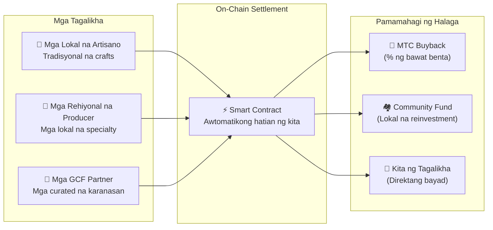

# 🗓️ Roadmap at Governance

> **Ang Daan Patungo sa Katiyakan.**
> Hindi ito isang short-term speculative play.
> **Kumpleto na ang core platform development** — nasa scaling phase na kami.

---

## Mga Strategic Milestones

### 🔥 Phase 1: Awakening (2026 H1 — Ngayon)

**Tema: Foundation at Cash-Flow Generation**

Tapos na ang produkto. Ang focus ngayon ay monetisation sa pamamagitan ng CEO-led financial system at pag-secure ng initial liquidity.

| Status | Milestone | Detalye |
| :---: | :--- | :--- |
| ✅ | **Product Launch** | Matsuri Webapp at GCF Admin Dashboard live na |
| ✅ | **Payments & Growth** | MTC payments + referral-airdrop features naipadala na |
| ✅ | **Media Launch** | J-Times (Web & Podcast) distribution infrastructure live na |
| ✅ | **Genesis** | MTC Token Generation Event sa Solana |
| ✅ | **Liquidity** | Initial LP pool ginawa sa Raydium |
| ⬜ | **Incentive Programme** | 50% target-APY liquidity mining launch |
| ⬜ | **System Go-Live** | Solana MEV / arbitrage bot sa production |
| ⬜ | **VIP Recruitment** | Unang 20 GCF VIP members na pinili |

### 🚀 Phase 2: Expansion (2026 H2)

**Tema: Real-World Assets at Adventure Mining**

I-leverage ang natapos na Webapp upang palawakin ang mga physical bases at ang "Pilgrimage" feature.

| Status | Milestone | Detalye |
| :---: | :--- | :--- |
| ⬜ | **Feature Release** | Adventure Mining (Pilgrimage) goes live |
| ⬜ | **Global Expansion** | Mga partner bases at VIP events sa buong Asia (Thailand, Taiwan, atbp.) |
| ⬜ | **Asset Management** | Real estate, equity at crypto portfolio mula sa business revenue |
| ⬜ | **Target** | Ecosystem-wide AUM na **¥1 bilyon (~$6.5 M)** |

### 🌊 Phase 3: Circulation (2027+)

**Tema: Mass Adoption, Co-Creation Economy at Decentralisation**

Public launch, on-chain marketplace, at buong ecosystem operation.

| Status | Milestone | Detalye |
| :---: | :--- | :--- |
| ⬜ | **Grand Opening** | Matsuri App worldwide release |
| ⬜ | **Grand Unlock (1 Hun 2027)** | Founder lockup release + Mining Pool (550 M MTC) live + Halving cycle nagsisimula |
| ⬜ | **Co-Creation Marketplace** | Mga lokal na specialty shop + GCF partner stores — on-chain settlement na may awtomatikong MTC buyback |
| ⬜ | **Crowdfunding na may NFT Rights** | Ang mga user ay nagpo-pondo ng mga kultural na proyekto sa Solana. Ang mga backer ay tumatanggap ng mga NFT na kumakatawan sa ownership, revenue share, o governance rights sa pinondohang proyekto |
| ⬜ | **On-Chain Shop Settlement** | Lahat ng marketplace transaction ay sine-settle sa pamamagitan ng smart contracts — isang porsyento ng bawat benta ay awtomatikong dumadaloy sa MTC buyback pool |
| ⬜ | **Target** | Ecosystem-wide AUM na **¥10 bilyon (~$65 M)** |
| ⬜ | **DAO Transition** | Bahagyang paglipat ng decision-making sa GCF community |

#### 🏪 Co-Creation Marketplace Vision

Ang pinakamataas na pagpapahayag ng "Culture OS" — isang decentralised marketplace kung saan **ang mga tagalikha ng kultura at mga tagahanga ng kultura ay direktang nag-transact**, walang mapagsamantalang middleman.

| Feature | Paglalarawan | Status |
| :--- | :--- | :---: |
| **🏺 Mga Lokal na Specialty Shop** | Ang mga artisano at rehiyonal na producer ay direktang nagbebenta sa pandaigdigang audience. Pagbabayad sa MTC = 5–10% diskwento | ⬜ Vision |
| **🎫 Crowdfunding + NFT Rights** | Pondohan ang isang kultural na proyekto (pagpapanumbalik ng shrine, pagbuhay ng festival, artisan workshop). Tumanggap ng NFT na kumakatawan sa iyong kontribusyon — na may posibleng revenue share o governance rights | ⬜ Vision |
| **⚡ On-Chain Settlement** | Bawat marketplace transaction ay sine-settle sa pamamagitan ng Solana smart contracts. Awtomatikong hinahati ang kita: bayad sa tagalikha + community fund + MTC buyback — walang manual na accounting | ⬜ Vision |
| **🗳️ Backer Governance** | Ang mga may-hawak ng NFT ay bumoboto kung paano inilalaan ng mga pinondohang proyekto ang mga resources — tunay na co-creation, hindi lang donasyon | ⬜ Vision |

:::info Bakit Ito Mahalaga
Ngayon, ang mga turista ay bumibili ng souvenir mula sa mga tindahan na nagbabayad ng renta sa mga platform landlord. Bukas, **isang artisano sa rural na Kyoto ay direktang nagbebenta sa isang tagahanga sa Copenhagen** — at isang porsyento ng bentang iyon ay awtomatikong nagpapalakas sa ekonomiya ng MTC. Ito ang "flywheel" sa pinakamataas na anyo nito.
:::

---

## 👤 Team

### Ko Takahashi — Founder / CEO & Lead Architect

| Item | Detalye |
| :--- | :--- |
| **Papel** | Pangkalahatang project lead. Nagdidisenyo at nagtatayo ng core financial algorithm (Solana MEV Bot) |
| **Vision** | Tagapaglikha ng "Export Culture, Import Wealth" Culture OS |
| **Ethos** | Nagsusulat ng code sa araw, nagpapatakbo ng bar sa Golden Gai sa gabi — ang kahulugan ng "skin in the game" |

### Jon Anders Jensen

### Ryunosuke Honda

### 🌏 GCF Community — Global Development Contributors

Ang Matsuri Protocol ay hindi itinatayo ng founding team lamang.
Ang **mga miyembro ng GCF sa buong mundo** ay nag-aambag sa pamamagitan ng testing, feedback, pagsasalin, at regional expansion.

| Domain | Team |
| :--- | :--- |
| **💼 Global Finance** | Mga private-investor networks sa buong Asia |
| **⚙️ Engineering** | Distributed engineering guild para sa blockchain at mobile dev |
| **🏮 Operations** | Malalim na pipeline sa mga lokal na komunidad sa Shinjuku Golden Gai at mga pangunahing tourist hubs |
| **🌐 Community** | Multinational GCF members sa Japan, Norway, Thailand, Taiwan, at iba pa |

:::tip Sabay-sabay Itayo ang Imprastraktura ng Kultura
Sumali sa GCF at maging co-developer ng Matsuri Protocol.
Ang pag-aambag ay hindi lang tungkol sa pagsulat ng code — ang pagpapakilala ng mga lokal na sagradong lugar, pagsasalin ng mga dokumento, pag-organisa ng mga event — lahat ay tumutulong sa pagpapalaganap ng protocol na ito sa mundo.
:::

---

## 🏛️ Governance (DAO)

Ang Matsuri Protocol ay progresibong magli-transition sa isang **Decentralised Autonomous Organisation (DAO).**
Ang mga miyembro ng GCF (Platinum / Gold) ay magkakaroon ng **voting rights** sa mga pangunahing desisyon:

| Boto | Saklaw |
| :--- | :--- |
| **💰 Treasury Allocation** | Aling mga bagong venture o marketing initiatives ang i-fund |
| **⚙️ Protocol Upgrades** | Fine-tuning ng mga fee rates at mining reward curves |
| **⛩️ Cultural Certification** | Aling mga festival at shrine ang i-certify bilang "official pilgrimage sites" at pondohan |

:::info Sumali sa Rebolusyon
Hindi lang kami gumagawa ng app.
Gumagawa kami ng **borderless cultural economy.**
:::

---

**[◀ Bumalik sa Whitepaper Top](/docs/intro)** ｜ **[Sumali sa Discord](#)**
