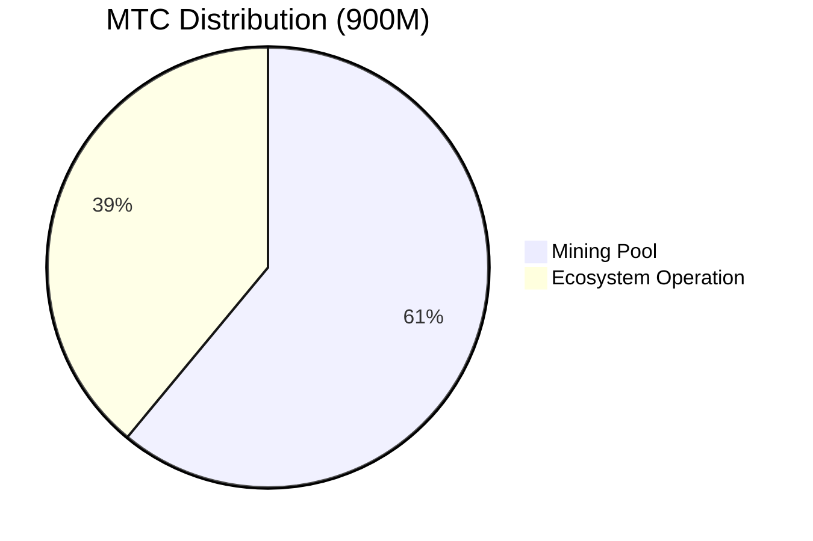
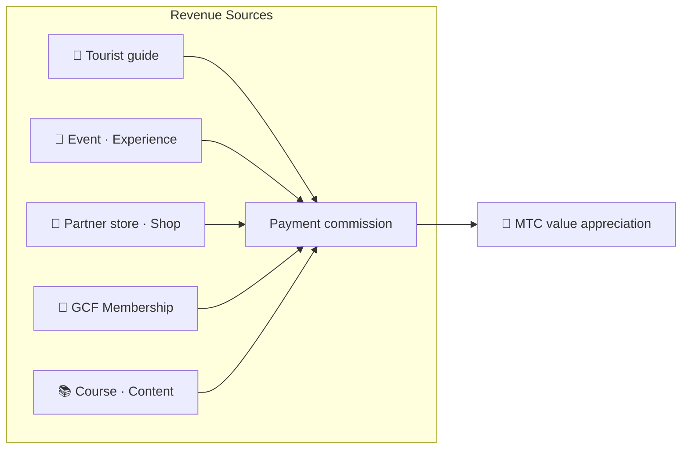

# 💰 Tokenomics — Economic Design ng MTC

> **Ang tiwala ay nakaukit sa code.**
> Ang economic design ng MTC ay hindi pangako ng sinuman kundi ginagarantiyahan ng matematika at blockchain.


> **"Mekanismong pang-ekonomiya na hindi maaaring baguhin sa pamamagitan ng pwersa" — iyan ang tokenomics ng MTC.**

Ang economic design ng Matsuri Coin (MTC) ay nakabatay sa isang paniniwala.
**Ang mga tuntuning hindi magagalaw kahit ng operator ay siyang pinakamalaking kasiguruhan para sa investor.**

Ang supply ay permanenteng nakalagay. Imposible ang dagdag na emission o pagpreso ng pondo. Ang paglago ng negosyo ay nare-reflect sa presyo sa matematical level —
Hindi ito "pangako" kundi **katotohanan** na nakaukit sa blockchain.

Sa pahinang ito, ipinapakita namin nang ganap na transparent ang economic mechanism ng MTC.

---

## Token Specifications

Upang mabigyan ng kasiguruhan ang mga investor, permanenteng **inabandona** ang "Mint Authority" at "Freeze Authority" sa Solana.
Imposible na magdagdag ng emission at imposibleng i-freeze ang pondo. **Kompletong trustless design.**

| Item | Detalye |
| :--- | :--- |
| **Pangalan ng Token** | Matsuri Coin |
| **Ticker** | MTC |
| **Chain** | Solana |
| **Mint Address** | `DRENpzmRWM4TwECrCPCfS1k5VBPmanhQg9bcCWP8EZXF` [Solscan →](https://solscan.io/token/DRENpzmRWM4TwECrCPCfS1k5VBPmanhQg9bcCWP8EZXF) |
| **Total Supply** | **900 milyon** (900,000,000 MTC) fixed |
| **Mint Authority** | 🚫 Inabandona na ([na-verify sa on-chain](https://solscan.io/token/DRENpzmRWM4TwECrCPCfS1k5VBPmanhQg9bcCWP8EZXF)) |
| **Freeze Authority** | 🚫 Inabandona na ([na-verify sa on-chain](https://solscan.io/token/DRENpzmRWM4TwECrCPCfS1k5VBPmanhQg9bcCWP8EZXF)) |
| **Lock Management** | Streamflow Finance (na-verify) |

:::info Bakit Mahalaga
Ang pag-abandona sa Mint Authority ay nangangahulugan na "hindi makakapaglimbag basta-basta ng token ang operator para mabawasan ang share mo". Ang pag-abandona sa Freeze Authority ay nangangahulugan na "walang makakapagpreso ng iyong wallet". Ito ang pundasyon ng trustless (walang pangangailangan ng tiwala).
:::

---

## Token Distribution

Ang distribusyon ng 900M MTC ay ganito.



| Kategorya | Proporsyon | Bilang | Paggamit |
| :--- | :---: | :--- | :--- |
| **⛏️ Mining Pool** | **61%** | 550 milyon | Reward pool sa mga nakikilahok. Unlock sa Hunyo 2027, emission kada 2-taong halving. Distribusyon base sa contribution score |
| **🌐 Ecosystem Operation** | **39%** | 350 milyon | Marketing, GCF distribution, operational expenses, liquidity pool (LP) acquisition, development cost, advertising, event hosting cost, atbp. |

:::note Release System ng Mining Pool
Ang 550M MTC ay hindi ibinibigay sa isang release. Batay sa halving schedule kada 2 taon, **distributed sa hakbang-hakbang ayon sa contribution score**. Ang mga tuntunin ng emission at distribution ay unti-unting ipapatupad sa smart contract sa huling bahagi ng 2026 at magiging verifiable sa on-chain.
:::

:::note Tungkol sa Ecosystem Operation Allocation
Ang 39% na operational allocation ay multi-purpose fund na kailangan para sa paglago ng ecosystem. Kabilang sa kongkretong paggamit ang marketing, initial distribution sa GCF members, provision sa Raydium liquidity pool, reward sa development team, advertising, at gastos sa pag-host ng cultural experience events. Ang transparency ng paggamit ay magiging bahagi ng community governance pagkatapos ng transition sa DAO.
:::

---

## Revenue Structure

Ang sumusuporta sa halaga ng MTC ay ang **kita mula sa tunay na negosyo**. Hindi speculation, kundi tunay na economic activity ang sumusuporta sa halaga ng token.



| Revenue Source | Nilalaman |
| :--- | :--- |
| **🏯 Experience at Guide** | Payment commission mula sa tourist guide at cultural experience event |
| **🤝 GCF Membership** | Membership fee |
| **📚 Content** | Course fee, media subscription |
| **🏪 Marketplace** | Transaction commission mula sa partner store at shop (unti-unting lumalawak) |

:::tip Paglago na Sinusuportahan ng Tunay na Demand
Habang dumadami ang inbound tourist, pumapasok ang dayuhang pera at lumalawak ang ecosystem. Ang halaga ng MTC ay hindi itinatakda ng speculation kundi ng **bilang ng mga taong nakakaranas ng kultura**.
:::

---

## Kasalukuyang Business Track Record

Nasa early stage pa ang MTC economic zone, ngunit nagsimula na ang aktwal na aktibidad.

| Metric | Track Record |
| :--- | :--- |
| **Bilang ng events** | Higit 50 beses (test operation) |
| **GCF Platinum members** | 20 pasok na (sa 50) |
| **GCF Gold members** | Magsisimula pa lang ang recruitment |
| **Web platform** | Gumagana. Test na ginagamit upang makaipon ng user |
| **iOS app** | Tapos na ang development, ilalabas sa Abril 2026 |

:::note Totoo lang
Hindi pa namin "malakihang track record ng tagumpay". 50 events at test operation — iyan ang kasalukuyang realidad. Ngunit gumagana ang produkto, umiiral ang community, at kami ay nasa phase ng pag-expand mula ngayon.
:::

---

## Buyback Protocol

Hindi namin "ipapasok sa bulsa ng operator ang kitang natamo".
Ang aming patakaran ay gamitin ang fixed na proporsyon ng business revenue para bumili pabalik ng MTC sa merkado.

| Revenue Source | Payback Rate | Aksyon |
| :--- | :---: | :--- |
| **Matsuri headquarters revenue** (Guide · Event) | **20%** | **Buyback** mula sa merkado at pag-add sa liquidity pool |
| **GCF Membership** (Membership fee) | **25%** | **Buyback** mula sa merkado |

:::info Kasalukuyang Status ng Buyback
Ang buyback protocol ay **magsisimula ngayon** alinsunod sa full-scale na kita. Sa umpisa, manu-manong isasagawa sa off-chain, at unti-unting lilipat sa automatic execution sa pamamagitan ng smart contract mula sa huling bahagi ng 2026. Pagkatapos ng on-chain migration, ang history ng buyback execution ay ma-veverify ng kahit sino sa blockchain.
:::

Hindi "pangako na gagawin balang araw" ang buyback. Ito ay tuntunin na naka-program bilang protocol. Sa tuwing tataas ang business revenue, awtomatikong sinisipsip ang MTC mula sa merkado — ito ang **structural security** para sa investor.

---

## Logic ng Price Determination

Ang mekanismo ng pagtaas ng presyo ng MTC ay hindi wishful thinking kundi nakabatay sa **equation ng AMM (automated market maker)**.

```
Presyo = Liquidity (SOL) ÷ Supply (MTC)
```

| Hakbang | Ano ang nangyayari | Resulta |
| :---: | :--- | :--- |
| **①** | Ini-inject sa pool ang business revenue (SOL) | **Dumadami ang numerator** |
| **②** | Sa pamamagitan ng pondong iyon, binili pabalik at sinusunog ang MTC sa merkado | **Bumababa ang denominator** |
| **③** | Numerator↑ × Denominator↓ | **Nalulubos ang kondisyon para tumaas ang scarcity** |

:::info Paliwanag ng Mekanismo, Hindi Garantiya ng Presyo
Ipinakikita ng equation na ito ang structural design na "kung patuloy ang business revenue at ipinapatupad ang buyback, ang supply-demand balance ay gagalaw patungo sa scarcity". Ang aktwal na presyo ay naaapektuhan ng maraming factor tulad ng market supply-demand, external environment, at liquidity.
:::

---

## Halving Schedule

Ang **550 milyon (halos 61% ng total supply)** na MTC na mag-u-unlock sa Hunyo 1, 2027 ay hindi ibinebenta sa merkado kundi nakalaan bilang **reward pool sa mga nakikilahok**.

Ginagamit ang **2-taong halving** na mas mabilis kaysa sa 4-taong cycle ng Bitcoin.
Nahahati sa dalawa ang emission kada 2 taon, at sa teorya, ang gantimpala ay tumatagal sa ilang dekada.

| Panahon | Emission Rate | Bilang | Cumulative Emission |
| :--- | :---: | :--- | :---: |
| **1st Period** 2027 – 2029 | **50%** | Mga 275 milyon | 50% |
| **2nd Period** 2029 – 2031 | **25%** | Mga 137 milyon | 75% |
| **3rd Period** 2031 – 2033 | **12.5%** | Mga 68 milyon | 87.5% |
| **4th Period** 2033 – 2035 | **6.25%** | Mga 34 milyon | 93.75% |
| **5th Period onwards** | Patuloy na hahati | Paunti-unti | → Lumalapit sa 100% |

<small>*※ Sa matematika, hindi makakarating ang emission sa 100%, at papalapit nang papalapit sa zero. Katulad ng prinsipyo ng Bitcoin.*</small>

:::tip Mas Maaga kang Magsisimulang Kumontribu, Mas Maraming MTC ang Matatanggap
Sa sistema ng halving, ang 1st Period (2027〜2029) ang may pinakamaraming emission, at habang sumusulong ang epoch, bumababa ang emission kada beses. Kaya, **ang taong umipon ng contribution score mula sa maagang phase ay makakatanggap ng mas maraming MTC**.

Mga halimbawa ng aktibidad na makikita sa contribution score:
- Record ng paggawa at pagkuha ng tao sa event
- Operation ng sikat na guide course
- Referral at pagsasanay ng mahusay na guide
- Bilang ng panonood at share ng J-Times content
- Bilang ng check-in sa sacred pilgrimage

Ang gantimpala ay hindi itinatakda ng "pagkakasunud-sunod ng pagsali" kundi **"kung gaano karami ang naikontribute"**.
:::

---

:::note Sa Susunod na Pahina
Pagkatapos maunawaan ang economic design ng MTC, tingnan natin kung **paano sumali bilang partner**.
**[GCF Membership →](/docs/gcf)**
:::
