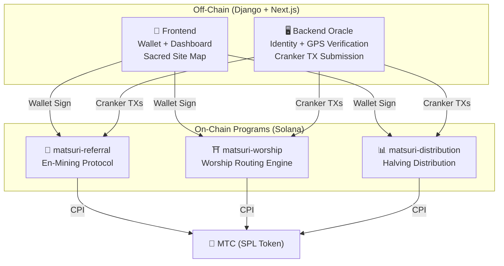
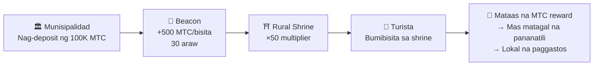
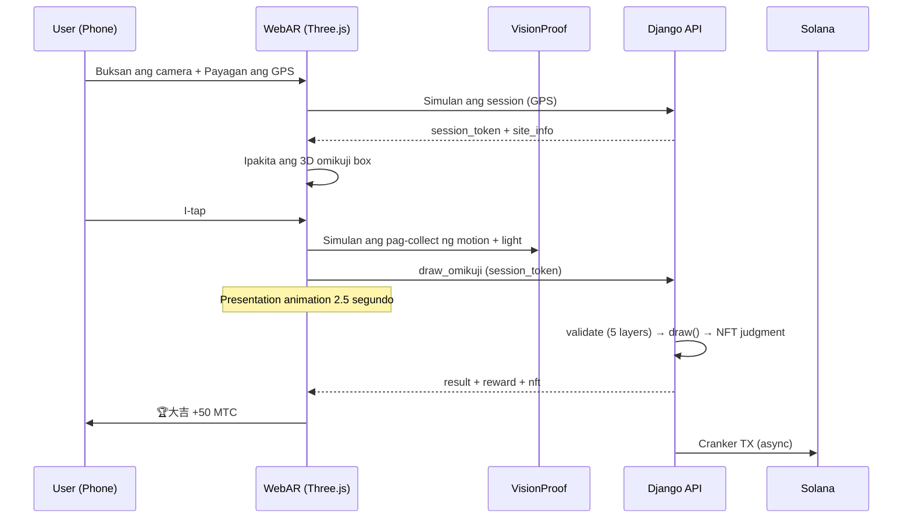

# ⚡ Smart Contracts — Open Source Architecture

> **Trustless by Design.**
> Lahat ng reward logic, referral trees, at halving schedules ay ipinapatupad **on-chain** sa pamamagitan ng auditable Rust programs.
> Source code: [GitHub](https://github.com/Cootakahashi/matsuri-contracts)

---

## Overview

Ang Matsuri ay nagde-deploy ng **tatlong Anchor (Rust) programs** sa Solana, bawat isa ay humahawak ng isang natatanging haligi ng ecosystem:



---

## 1. 📣 En-Mining (縁マイニング) Protocol

**Layunin:** Isang hybrid growth engine na ginagantimpalaan ang parehong *lawak* (referral reach) at *lalim* (economic impact). Hindi lang affiliates — isang full mining protocol kung saan ang real-world economic activity ay gumagawa ng on-chain value.

### Scoring Design

Ang contribution score ay batay sa dalawang weighted component:

| Component | Weight | Layunin |
| :--- | :---: | :--- |
| **Lawak** (bilang ng referral) | 30% | Network reach — ilan ang mga taong dinadala mo |
| **Lalim** (settlement volume) | 70% | Economic impact — tunay na mga pagbili, hindi lang mga signup |

Ang mga score ay nag-iipon sa paglipas ng panahon at kino-convert sa MTC sa bawat halving epoch. Naka-plano ang karagdagang boost mechanisms:

| Boost | Deskripsyon | Status |
| :--- | :--- | :---: |
| **Toku (徳) Staking** | I-lock ang MTC upang i-boost ang iyong contribution score (hanggang ~50% boost). Ang mga tier at eksaktong multiplier ay ika-calibrate batay sa halving pool release schedule | ⬜ Coefficients TBD |
| **Seasonal Rankings** | Ang mga top performer sa bawat epoch ay kumukuha ng **Evangelist** title (permanenteng SBT) at score boost. Ang eksaktong mga porsyento ay tutukuyin sa pamamagitan ng governance | ⬜ Coefficients TBD |

:::info Progressive Parameter Design
Ang mga boost coefficient (staking tiers, ranking bonuses) ay sadyang iniwan na adjustable. Ang mga ito ay tatapusin batay sa tunay na ecosystem data — kabuuang active users, halving pool release rate, at price stability targets — pagkatapos ay ila-lock sa mga smart contract. Tinitiyak ng diskarteng ito ang **patas na distribusyon** nang hindi nag-over-promise ng fixed returns.
:::

### Anti-Sybil Defence (3 Layers)

| Layer | Mekanismo | Saan |
| :--- | :--- | :--- |
| **Identity Gate** | X/Twitter OAuth + SMS | Off-chain (Django) |
| **On-chain Gate** | Tanging `is_verified = true` profiles lang ang kumikita | Smart Contract |
| **Depth Weighting** | 70% ng score = tunay na pagbabayad → walang kinikita ang bots | Scoring Engine |

---

## 2. ⛩️ Worship Routing Engine (巡礼分散エンジン)

**Layunin:** Ang unang **ReFi protocol sa mundo na lumutas sa over-tourism gamit ang token economics.** Bumisita sa mga sagradong lugar → kumita ng MTC. Ngunit narito ang twist: *mas mababang bisita ang isang lugar, mas mataas ang bayad.*

:::tip Ang Insight
Ito ay "reverse Uber surge pricing" — ang mga crowded na lugar ay pina-penalize, ang frontier sites ay binu-boost. Ang mga turista ay nagro-route ng kanilang sarili sa mas mababang bisita na lokasyon dahil **mas profitable ito.**
:::

### Reward Design Principles

Ang contribution score para sa bawat pagbisita ay tinutukoy ng maraming factor:

| Factor | Prinsipyo | Epekto |
| :--- | :--- | :--- |
| **Popularidad ng site** | Mas mataas ang score sa mga mas kakaunting bisita | Nag-ro-route ng turista palayo sa overcrowded areas |
| **Oras ng pagbisita** | Mas mataas ang score ng mga naunang bumisita sa araw | Hinihikayat ang off-peak visits |
| **Regional tier** | Pinakamataas ang ranggo ng rural at frontier sites | Nag-uudyok ng regional revitalisation |
| **Dalas ng pagbisita** | Nag-iipon ng bonus scores ang mga regular na bisita | Ginagantimpalaan ang consistent engagement |
| **Omikuji fortune** | Random bonus draw sa bawat check-in | Masayang gamification layer |
| **Sponsored boosts** | Maaaring i-boost ng mga munisipalidad ang mga partikular na site | B2B/B2G revenue model |

:::info Adjustable ang mga Coefficient
Ang eksaktong mga multiplier para sa bawat factor (hal. kung gaano mas malaki ang kinikita ng rural site kumpara sa major site) ay **ika-calibrate batay sa halving pool schedule** at tunay na usage data, pagkatapos ay unti-unting ila-lock sa mga smart contract. Ang design principle ay fixed — ang mga coefficient ay umuusad kasama ng ecosystem.
:::

### Sponsored Beacons (B2B/B2G)

Ang mga munisipalidad, kompanya ng tren, at tourism boards ay maaaring **mag-deposit ng MTC** upang lumikha ng time-limited high-reward zones sa mga partikular na lugar.



> **B2B Revenue Model:** Ang mga sponsor ay nagbabayad ng MTC upang mag-route ng mga turista. MTC buying pressure → tumataas ang halaga ng token. Win-win-win.

---

## 3. 📊 Halving Distribution

**Layunin:** Ang 550M MTC mining pool na ipinamamahagi sa loob ng ilang dekada sa pamamagitan ng **2-year halving cycle** — mas mabilis kaysa sa 4-year cycle ng Bitcoin.

### Halving Schedule

```
Total Pool: 550,000,000 MTC

Epoch 0 (2027–2029):  275,000,000 MTC  (50%)
Epoch 1 (2029–2031):  137,500,000 MTC  (25%)
Epoch 2 (2031–2033):   68,750,000 MTC  (12.5%)
Epoch 3 (2033–2035):   34,375,000 MTC  (6.25%)
        ...              ...
∑ → 550,000,000 MTC (asymptotic total)
```

### Individual Reward Formula

```
your_reward = epoch_budget × (your_score / total_score)
```

Lahat ng arithmetic ay gumagamit ng **128-bit intermediate computation** — mathematically imposibleng mag-overflow.

### Performance Score Sources

| Aktibidad | Score Weight |
| :--- | :--- |
| **Mga guide session na isinagawa** | Mataas |
| **Mga event ticket sales** | Mataas |
| **Referral network activity** | Katamtaman |
| **Worship mining visits** | Katamtaman |
| **Media engagement** | Mababa |

:::info Permissionless Epoch Advancement
Ang `advance_epoch` instruction ay maaaring tawagin ng **sinuman** — walang admin na kailangan. Ang system clock ang nagde-determine kung kailan magta-transition ang mga epoch, na tinitiyak ang trustless operation kahit mawala ang team.
:::

---

## 4. 🎴 AR Mining — WebAR Omikuji Mining

**Layunin:** Karanasan ng pag-mine ng MTC sa pamamagitan ng pagpapalabas ng AR omikuji sa tunay na espasyo gamit lang ang browser ng smartphone. **Hindi kailangan ng app download.** Ang unang WebAR×blockchain infrastructure sa mundo na pinagsasama ang espirituwalidad ng Shinto at pinakabagong teknolohiya.

### Architecture



### Optimistic UI (Zero Wait Time)

| Hakbang | Oras | Proseso |
|---------|------|---------|
| Tap → Simula ng animation | 0ms | Agad na nag-play ng animation sa frontend |
| API draw_omikuji | ~50ms | Raffle + NFT judgment sa Django |
| Tapos na ang animation | 2500ms | Confirmed na ang resulta → Ipakita |
| Solana TX | ~400ms | Ipinadala sa background |

### Omikuji Settings (GCF Admin)

Basis Points (10000 = 100%) na may 0.01% na katumpakan. Maaaring i-adjust mula sa GCF Admin panel.

| Grade | Rarity | Bonus | NFT |
|-------|---------|------------------|-----|
| 🏆 大吉 | Bihira | Pinakamataas na bonus | ✅ |
| ✨ 吉 | Hindi karaniwan | Mataas na bonus | Opsyonal |
| 🌸 小吉 | Karaniwan | Maliit na bonus | — |
| 🍃 末吉 | Karaniwan | Naitala ang partisipasyon | — |
| 💀 凶 | Hindi karaniwan | Naitala ang partisipasyon | — |

Ang mga probability at reward coefficient ay unti-unting tatapusin batay sa laki ng ecosystem at halving release volume, at ipapatupad sa mga smart contract.

### ZK-Proof of Vision (5-Layer Verification)

Multi-layer na pag-aalis ng GPS spoofing at replay attacks. Hindi nagpapadala ng camera image data para sa privacy protection.

| Layer | Nilalaman ng Verification | Puntos |
|-------|--------------------------|--------|
| Temporal | Session time 5-120 segundo | /20 |
| Motion | Gyro variance 0.005-0.5 (natural na pag-hawak ng kamay) | /20 |
| Light | Ambient light×time zone consistency | /20 |
| HMAC | proof_hash signature verification | /20 |
| Fingerprint | Device uniqueness | /20 |
| **Kabuuan** | **PASS threshold** | **60/100** |

### Reward Design

Ang mga reward ay nire-record bilang isang **contribution score** batay sa maraming factor kabilang ang uri ng site, Omikuji result, at regional tier. Ang mga partikular na coefficient ay unti-unting tatapusin ayon sa halving release schedule at paglago ng ecosystem, at ipapatupad sa mga smart contract.

---

## Math Modules (Open Source Core)

Lahat ng programa ay naghihiwalay ng scoring/reward math sa **pure, auditable `math.rs` modules** na may:

- **Zero side effects** — walang I/O, walang allocations, walang external calls
- **Documented formulas** — LaTeX-style notation sa rustdoc
- **Overflow analysis** — u128 intermediate values na may proven bounds
- **Comprehensive tests** — edge cases, boundary conditions, ratio verification
- **Adjustable coefficients** — ang reward parameters ay dinisenyo na maa-update sa pamamagitan ng governance, na nagpapahintulot ng progressive calibration habang lumalaki ang ecosystem

---

## Security Model (Open Source)

Ang mga contracts na ito ay **fully open source.** Ang seguridad ay umaasa sa mathematical guarantees, hindi sa obscurity.

| Prinsipyo | Implementasyon |
| :--- | :--- |
| **PDA-Only Vaults** | Ang mga token vault ay kinokontrol ng Program Derived Addresses — walang human key ang makakapag-drain |
| **Checked Arithmetic** | Lahat ng computation ay gumagamit ng `checked_*` operations — imposible ang overflow |
| **Authority Separation** | Admin (multisig) ≠ Cranker (limitadong ops) ≠ User (self-custody) |
| **Emergency Pause** | Maaaring i-pause ng admin ang lahat ng programs agad-agad; hindi maaaring nakawin ang funds |
| **Immutable Tokenomics** | Ang halving factor, total pool, at epoch duration ay itinakda nang isang beses at hindi na mababago |
| **Pure Math Modules** | Ang scoring/reward logic ay hiwalay sa auditable, testable math libraries |
| **Vision Proof** | 5-layer anti-spoofing nang hindi nagpapadala ng camera data (privacy-preserving) |

---

**[◀ Bumalik sa Roadmap](/docs/roadmap)** ｜ **[Tingnan ang Source Code](https://github.com/Cootakahashi/matsuri-contracts)**
