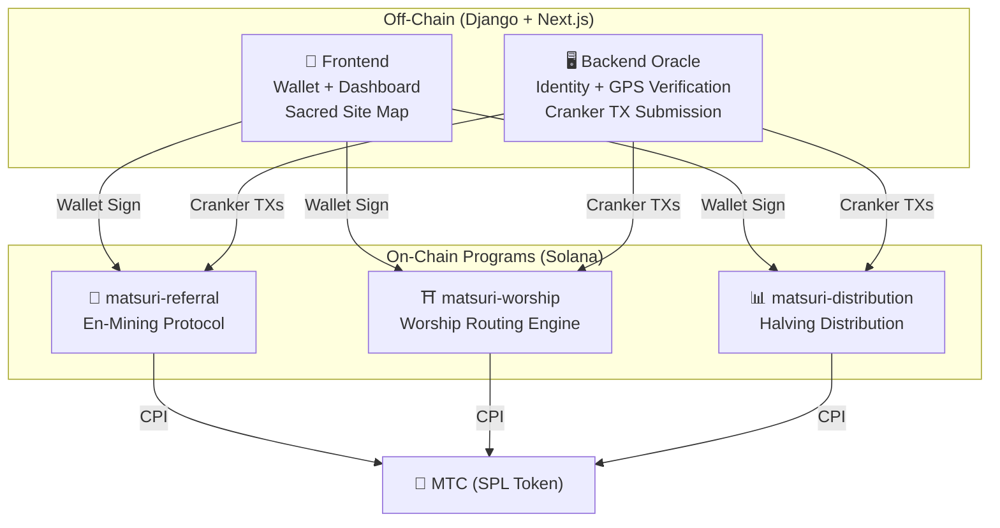
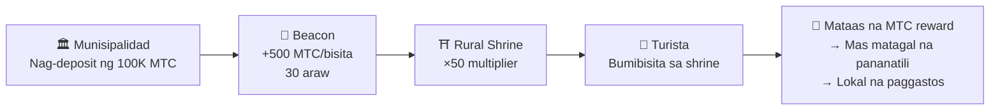
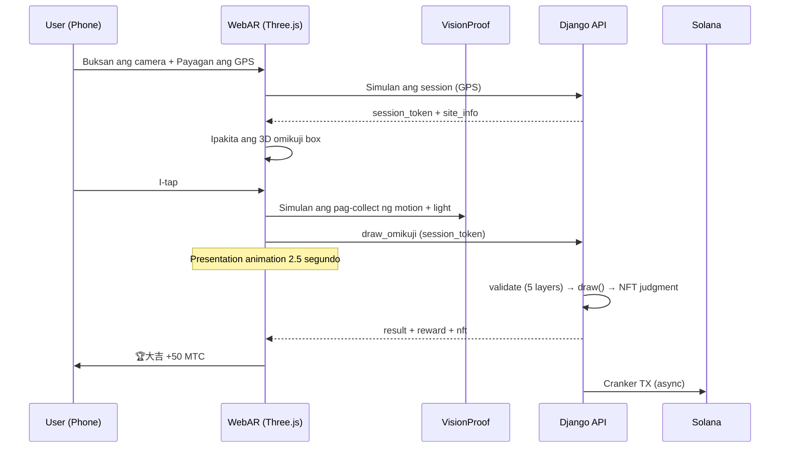

# ⚡ Smart Contracts — Open Source Architecture

> **Trustless by Design.**
> Lahat ng reward logic, referral trees, at halving schedules ay ipinapatupad **on-chain** sa pamamagitan ng auditable Rust programs.
> Source code: [GitHub](https://github.com/Cootakahashi/matsuri-contracts)

---

## Overview

Ang Matsuri ay nagde-deploy ng **tatlong Anchor (Rust) programs** sa Solana, bawat isa ay humahawak ng isang natatanging haligi ng ecosystem:



---

## 1. 📣 En-Mining (縁マイニング) Protocol

**Layunin:** Isang hybrid growth engine na ginagantimpalaan ang parehong *lawak* (referral reach) at *lalim* (economic impact). Hindi lang affiliates — isang full mining protocol kung saan ang real-world economic activity ay gumagawa ng on-chain value.

### Scoring Formula

```
S_final = S_raw × M_toku × B_title

where:
  S_raw   = 0.30 × referrals + 0.70 × (volume / 10^9)
  M_toku  = f(staked_mtc) ∈ [1.0×, 10.0×]
  B_title = 1.0 + min(seasons_ranked × 0.05, 0.50)
```

| Component | Weight | Layunin |
| :--- | :---: | :--- |
| **Lawak** (bilang ng referral) | 30% | Network reach — ilan ang mga taong dinadala mo |
| **Lalim** (settlement volume) | 70% | Economic impact — tunay na mga pagbili, hindi lang mga signup |
| **Toku Multiplier** | ×1–10 | I-lock ang MTC upang palakasin ang mining power |
| **Title Boost** | +5%/season | Permanenteng gantimpala para sa mga consistent top performers |

### Toku (徳) Staking Tiers

| Staked MTC | Multiplier | Tier |
| :--- | :---: | :--- |
| 0 | 1.0× | — |
| 1,000+ | 1.5× | Bronze |
| 10,000+ | 3.0× | Silver |
| 100,000+ | 5.0× | Gold |
| 1,000,000+ | 10.0× | Diamond |

### En no Banzuke (Seasonal Ranking)

Bawat season (epoch), ang mga top performers ay rina-rank. Mga benepisyo:
- Ang top 10% ay kumukuha ng **Evangelist** title (permanenteng SBT flag)
- Bawat season na naka-rank ay nagbibigay ng **+5% mining boost** (cumulative, cap: 50%)

### Anti-Sybil Defence (3 Layers)

| Layer | Mekanismo | Saan |
| :--- | :--- | :--- |
| **Identity Gate** | X/Twitter OAuth + SMS | Off-chain (Django) |
| **On-chain Gate** | Tanging `is_verified = true` profiles lang ang kumikita | Smart Contract |
| **Depth Weighting** | 70% ng score = tunay na pagbabayad → walang kinikita ang bots | Scoring Engine |

---

## 2. ⛩️ Worship Routing Engine (巡礼分散エンジン)

**Layunin:** Ang unang **ReFi protocol sa mundo na lumutas sa over-tourism gamit ang token economics.** Bumisita sa mga sagradong lugar → kumita ng MTC. Ngunit narito ang twist: *mas mababang bisita ang isang lugar, mas mataas ang bayad.*

:::tip Ang Insight
Ito ay "reverse Uber surge pricing" — ang mga crowded na lugar ay pina-penalize, ang frontier sites ay binu-boost. Ang mga turista ay nagro-route ng kanilang sarili sa mas mababang bisita na lokasyon dahil **mas profitable ito.**
:::

### 6-Layer Reward Formula

```
R_final = R_pioneer × M_dynamic × M_regional × M_streak × M_omikuji

where:
  R_pioneer  = daily_pool / visit_order     (harmonic 1/n decay)
  M_dynamic  = admin-controlled ∈ [0.1×, 50×]
  M_regional = tier_table[tier] ∈ {1×, 2×, 5×, 10×}
  M_streak   = 1.0 + min(days × 0.02, 0.50)
  M_omikuji  = fortune_lottery ∈ {1.0, 1.2, 1.5, 3.0}
```

### Layer 1: Pioneer Bonus (先行者利益)

Harmonic decay — ang matematika na nag-ro-route ng mga turista:

| Pagkakasunod ng Bisita | Gantimpala vs 1st | Tunay na Halimbawa (1000 MTC pool) |
| :---: | :---: | :--- |
| 1st | 100% | 1,000 MTC |
| 5th | 20% | 200 MTC |
| 10th | 10% | 100 MTC |
| 100th | 1% | 10 MTC |

> **Unang bisita = 100× na mas mataas ang gantimpala kaysa sa ika-100 na bisita.** Lumilikha ito ng makapangyarihang incentive na bumisita sa off-peak times.

### Layer 2: Dynamic Multiplier (混雑分散)

Kinokontrol sa real-time ng mga admin sa pamamagitan ng GCF Admin panel:

| Senaryo | Multiplier | Epekto |
| :--- | :---: | :--- |
| **Sobrang turista** (Asakusa peak) | 0.1× | 90% na reward penalty |
| **Normal** | 1.0× | Standard |
| **Hindi gaanong binibisita** | 10× | 10× na reward boost |
| **Frontier campaign** | 50× | Maximum incentive |

### Layer 3: Regional Tier

| Tier | Label | Multiplier | Mga Halimbawa |
| :---: | :--- | :---: | :--- |
| 0 | 🏙️ Major | 1× | 浅草寺, 清水寺, 伏見稲荷 |
| 1 | 🌆 Medium | 2× | Mga lokal na Ichinomiya, mga pangunahing shrine sa prefectural capitals |
| 2 | 🏞️ Rural | 5× | Mga makasaysayang lumang templo sa kanayunan |
| 3 | ⛰️ Hidden | 10× | Mga sagradong lugar sa kaibuturan ng bundok, mga shrine sa malalayong isla |

### Layer 4: Streak Bonus

+2% bawat magkakasunod na araw, cap sa +50%. Ginagantimpalaan ang mga regular na bisita.

### Layer 5: 🎲 Omikuji Protocol

| Resulta | Probabilidad | Multiplier |
| :--- | :---: | :---: |
| 🏆 **大吉** | 5% | 3.0× |
| ✨ **吉** | 15% | 1.5× |
| 🌸 **小吉** | 30% | 1.2× |
| 🍃 **末吉** | 35% | 1.0× |
| 💀 **凶** | 15% | 1.0× |

### Layer 6: Sponsored Beacons (B2B/B2G)

Ang mga munisipalidad, kompanya ng tren, at tourism boards ay maaaring **mag-deposit ng MTC** upang lumikha ng time-limited high-reward zones sa mga partikular na lugar.



> **B2B Revenue Model:** Ang mga sponsor ay nagbabayad ng MTC upang mag-route ng mga turista. MTC buying pressure → tumataas ang halaga ng token. Win-win-win.

---

## 3. 📊 Halving Distribution

**Layunin:** Ang 550M MTC mining pool na ipinamamahagi sa loob ng ilang dekada sa pamamagitan ng **2-year halving cycle** — mas mabilis kaysa sa 4-year cycle ng Bitcoin.

### Halving Schedule

```
Total Pool: 550,000,000 MTC

Epoch 0 (2027–2029):  275,000,000 MTC  (50%)
Epoch 1 (2029–2031):  137,500,000 MTC  (25%)
Epoch 2 (2031–2033):   68,750,000 MTC  (12.5%)
Epoch 3 (2033–2035):   34,375,000 MTC  (6.25%)
        ...              ...
∑ → 550,000,000 MTC (asymptotic total)
```

### Individual Reward Formula

```
your_reward = epoch_budget × (your_score / total_score)
```

Lahat ng arithmetic ay gumagamit ng **128-bit intermediate computation** — mathematically imposibleng mag-overflow.

### Performance Score Sources

| Aktibidad | Score Weight |
| :--- | :--- |
| **Mga guide session na isinagawa** | Mataas |
| **Mga event ticket sales** | Mataas |
| **Referral network activity** | Katamtaman |
| **Worship mining visits** | Katamtaman |
| **Media engagement** | Mababa |

:::info Permissionless Epoch Advancement
Ang `advance_epoch` instruction ay maaaring tawagin ng **sinuman** — walang admin na kailangan. Ang system clock ang nagde-determine kung kailan magta-transition ang mga epoch, na tinitiyak ang trustless operation kahit mawala ang team.
:::

---

## 4. 🎴 AR Mining — WebAR Omikuji Mining

**Layunin:** Karanasan ng pag-mine ng MTC sa pamamagitan ng pagpapalabas ng AR omikuji sa tunay na espasyo gamit lang ang browser ng smartphone. **Hindi kailangan ng app download.** Ang unang WebAR×blockchain infrastructure sa mundo na pinagsasama ang espirituwalidad ng Shinto at pinakabagong teknolohiya.

### Architecture



### Optimistic UI (Zero Wait Time)

| Hakbang | Oras | Proseso |
|---------|------|---------|
| Tap → Simula ng animation | 0ms | Agad na nag-play ng animation sa frontend |
| API draw_omikuji | ~50ms | Raffle + NFT judgment sa Django |
| Tapos na ang animation | 2500ms | Confirmed na ang resulta → Ipakita |
| Solana TX | ~400ms | Ipinadala sa background |

### Omikuji Probability Settings (GCF Admin)

Presisyong kontrol sa 0.01% increments gamit ang Basis Points (10000 = 100%).

| Grade | Default | Reward Multiplier | NFT |
|-------|---------|------------------|-----|
| 🏆 大吉 | 5.00% (500bp) | ×3.0 | ✅ |
| ✨ 吉 | 15.00% (1500bp) | ×1.5 | Opsyonal |
| 🌸 小吉 | 30.00% (3000bp) | ×1.2 | — |
| 🍃 末吉 | 35.00% (3500bp) | ×1.0 | — |
| 💀 凶 | 15.00% (1500bp) | ×1.0 | — |

### ZK-Proof of Vision (5-Layer Verification)

Multi-layer na pag-aalis ng GPS spoofing at replay attacks. Hindi nagpapadala ng camera image data para sa privacy protection.

| Layer | Nilalaman ng Verification | Puntos |
|-------|--------------------------|--------|
| Temporal | Session time 5-120 segundo | /20 |
| Motion | Gyro variance 0.005-0.5 (natural na pag-hawak ng kamay) | /20 |
| Light | Ambient light×time zone consistency | /20 |
| HMAC | proof_hash signature verification | /20 |
| Fingerprint | Device uniqueness | /20 |
| **Kabuuan** | **PASS threshold** | **60/100** |

### Reward Calculation Formula

```
Reward = Base(10 MTC) × SiteMultiplier × OmikujiMult × TierMult

TierMult = { Major: 1.0, Medium: 2.0, Rural: 5.0, Hidden: 10.0 }
```

---

## Math Modules (Open Source Core)

Parehong programa ay naghihiwalay ng lahat ng scoring/reward math sa **pure, auditable `math.rs` modules** na may:

- **Zero side effects** — walang I/O, walang allocations, walang external calls
- **Documented formulas** — LaTeX-style notation sa rustdoc
- **Overflow analysis** — u128 intermediate values na may proven bounds
- **Comprehensive tests** — edge cases, boundary conditions, ratio verification

```rust
// Halimbawa: Pioneer Bonus (mula sa worship/math.rs)
#[inline]
pub fn pioneer_reward(daily_pool: u64, visit_order: u32) -> u64 {
    if visit_order == 0 { return 0; }
    (daily_pool as u128 / visit_order as u128) as u64
}
```

---

## Security Model (Open Source)

Ang mga contracts na ito ay **fully open source.** Ang seguridad ay umaasa sa mathematical guarantees, hindi sa obscurity.

| Prinsipyo | Implementasyon |
| :--- | :--- |
| **PDA-Only Vaults** | Ang mga token vault ay kinokontrol ng Program Derived Addresses — walang human key ang makakapag-drain |
| **Checked Arithmetic** | Lahat ng computation ay gumagamit ng `checked_*` operations — imposible ang overflow |
| **Authority Separation** | Admin (multisig) ≠ Cranker (limitadong ops) ≠ User (self-custody) |
| **Emergency Pause** | Maaaring i-pause ng admin ang lahat ng programs agad-agad; hindi maaaring nakawin ang funds |
| **Immutable Tokenomics** | Ang halving factor, total pool, at epoch duration ay itinakda nang isang beses at hindi na mababago |
| **Pure Math Modules** | Ang scoring/reward logic ay hiwalay sa auditable, testable math libraries |
| **Vision Proof** | 5-layer anti-spoofing nang hindi nagpapadala ng camera data (privacy-preserving) |

---

**[◀ Bumalik sa Roadmap](/docs/roadmap)** ｜ **[Tingnan ang Source Code](https://github.com/Cootakahashi/matsuri-contracts)**
