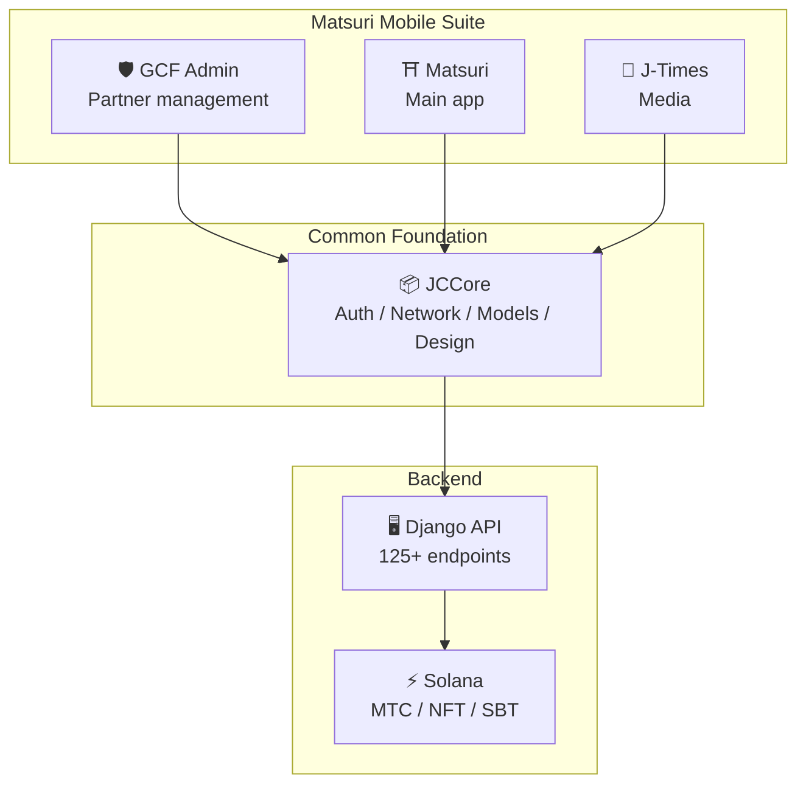
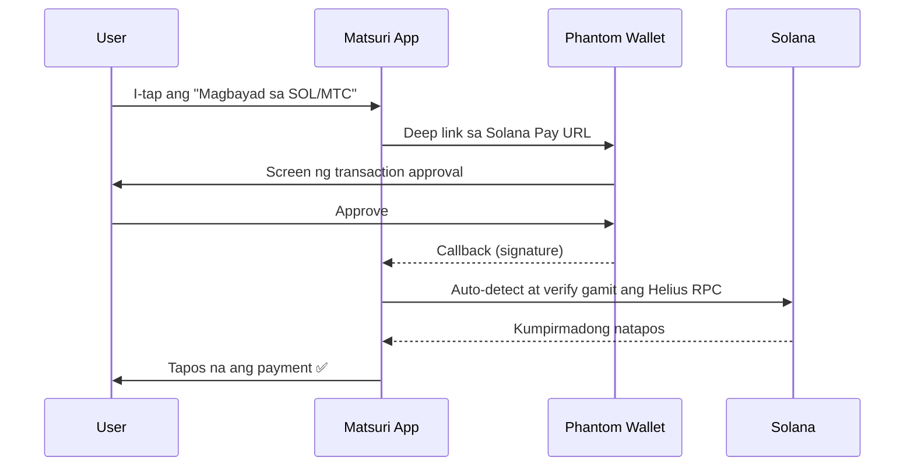
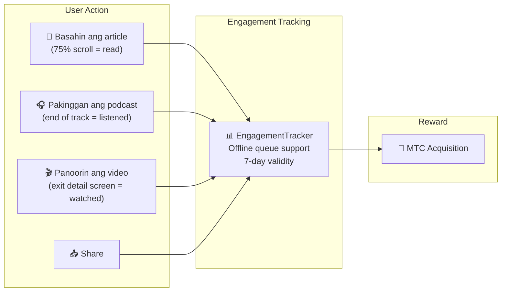
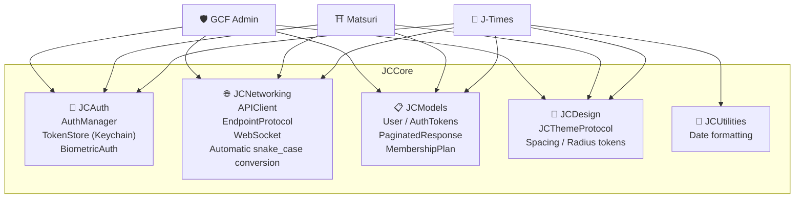
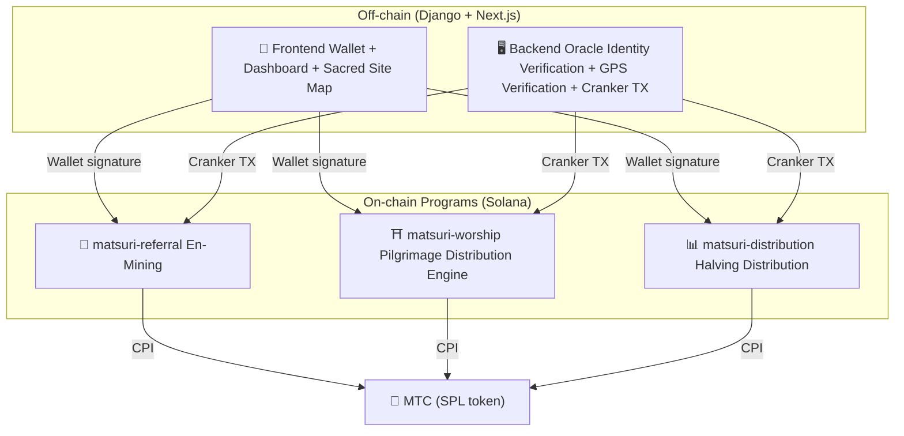
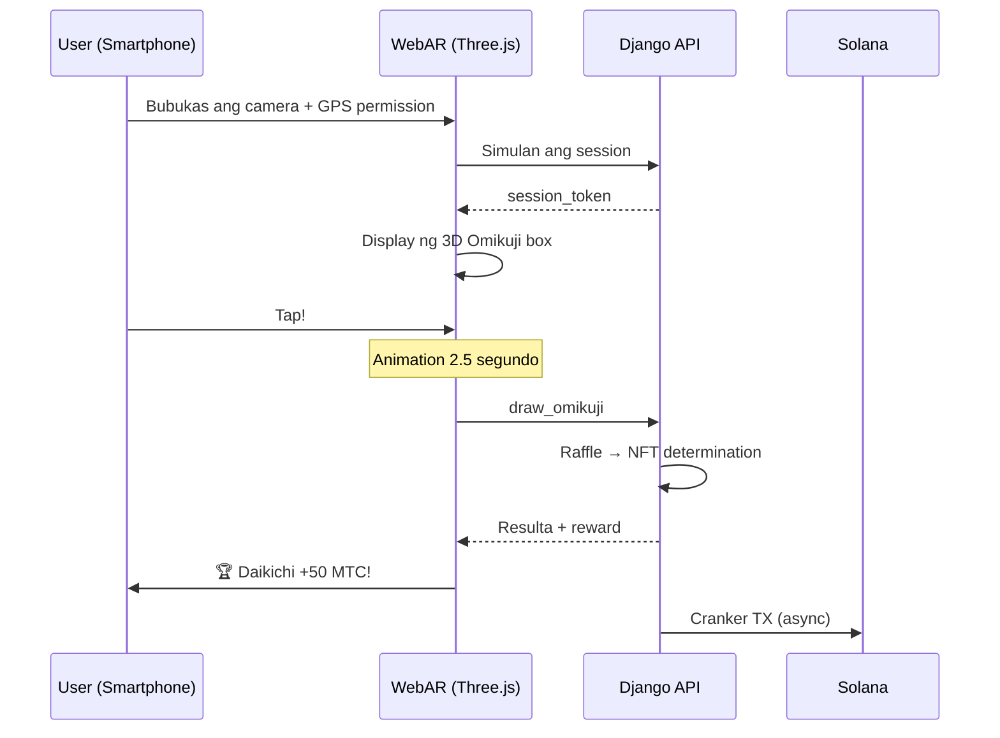

import useBaseUrl from '@docusaurus/useBaseUrl';

# 🔧 Produkto at Teknolohiya — Ang Tumatakbong Bagay ay Nagpapatunay ng Lahat

> **Ang tumatakbong bagay ang nagpapatunay ng lahat.**
> Hindi lang salita ang aming layunin. Ang web platform ay gumagana na, at ang iOS app ay nasa pinal na yugto.

Ang web app at management dashboard ay **nasa production operation**. Ang tatlong native iOS app ay tapos na ang development at ilalabas sa Abril 2026. Ang smart contract sa Solana ay inilabas bilang open source — hindi konsepto, kundi magsasalita kami sa pamamagitan ng **tumatakbong code at malapit nang darating na produkto**.

---

## Listahan ng App

| App | Paggamit | Status | Suportadong Wika |
| :--- | :--- | :---: | :--- |
| **GCF Admin** | Partner management · operation tool | ✅ Released | 🇯🇵🇬🇧🇨🇳🇹🇭🇳🇴 |
| **Matsuri** | Main app para sa pangkalahatang user | 🔜 Abril 2026 release | 🇯🇵🇬🇧🇨🇳🇹🇭🇳🇴 |
| **J-Times** | Culture media at pag-aaral | 🔜 Abril 2026 release | 🇯🇵🇬🇧 |

---

## 1. 🛡️ GCF Admin — Partner Management App

:::info Status: Released na sa App Store (v1.0)
Business management app para sa GCF (Global Community Friends) members. Pinag-isa sa mobile ang lahat ng function ng web admin screen.
:::

  
  
  

  

### Ano ang Magagawa sa App Na Ito

| Kategorya | Feature |
| :--- | :--- |
| **📊 Dashboard** | KPI card, sales chart, quick action |
| **👥 Member Management** | Listahan · detalye · edit · tier management |
| **💰 Revenue Management** | Commission tracking, MTC withdrawal management, payout management |
| **📝 Content Management** | Paglikha · edit · paglathala ng event · article · podcast · video |
| **🎫 Guide Slot** | Management ng guide slot, revenue tracking |
| **🖼️ NFT Dashboard** | Founder's Collection, on-chain verification, NFT transfer |
| **⛩️ Sacred Site Management** | CRUD ng site, beacon configuration |
| **🎲 AR Mining Configuration** | Omikuji probability table, reward parameter management |
| **📊 Analytics** | Error report, usage analysis |
| **🔗 Referral** | Custom QR generation, referral program management |

### Technical Specifications

| Item | Detalye |
| :--- | :--- |
| **Architecture** | Clean Architecture + MVVM + `@Observable` (iOS 17) |
| **Language / SDK** | Swift 6.0 / Xcode 16+ / iOS 17.0+ |
| **API Integration** | Higit 125 endpoints |
| **Test** | 226 tests / 45 test classes |
| **Localization** | 5 wika (Japanese, English, Chinese, Thai, Norwegian) / higit 957 translation keys |
| **Swift Concurrency** | Compliant sa Strict Concurrency / zero build warnings |

### QR Code Integration

Sa GCF Admin, maaaring gumawa ng custom QR code na may Matsuri logo. Supportado sa iba't ibang paggamit tulad ng event invitation, referral link, at payment request.

---

## 2. ⛩️ Matsuri — Main App

:::info Status: Ilalabas sa huling bahagi ng Abril 2026 (v3.0)
Main app para sa pangkalahatang user. Event booking, pagbabayad, Web3 wallet, AR mining — lahat sa isang app.
:::

  
  
  

### Ano ang Magagawa sa App Na Ito

| Kategorya | Feature |
| :--- | :--- |
| **🎪 Event Booking** | Search · booking · Stripe payment · ticket QR management |
| **💳 4 Payment Methods** | Credit card / saved card / MTC balance / crypto (SOL/MTC) |
| **👛 Web3 Wallet** | MTC balance display, send/receive, transaction history |
| **🖼️ NFT Gallery** | Listahan ng held NFT/SBT, on-chain verification |
| **🗺️ Sacred Site Map** | Map display ng shrine at temple, check-in |
| **🎲 AR Mining** | WebAR Omikuji experience, MTC acquisition |
| **💬 Chat** | Messaging na may context menu |
| **⭐ Wishlist** | Pag-save ng paboritong event at experience |
| **🔍 Advanced Search** | Supportado ang voice search |
| **🤝 Referral** | Pagsali sa referral program, reward tracking |
| **📊 GCF Dashboard** | Simpleng management screen para sa GCF members |

### Phantom Wallet Integration — Zero-Input Crypto Payment

>**Hindi kailangan ng user na mag-copy-paste ng address.** Awtomatikong bumubukas ang Phantom Wallet, at sa pag-approve lamang ay tapos na ang payment. Awtomatikong na-de-detect ang transaction signature sa pamamagitan ng Helius RPC.

### Technical Specifications

| Item | Detalye |
| :--- | :--- |
| **Architecture** | Clean Architecture + MVVM + Swift Concurrency |
| **Language / SDK** | Swift 6.0 / Xcode 16+ / iOS 17.0+ |
| **Payment** | Stripe PaymentSheet + MTC Balance + Phantom (Solana Pay) |
| **API Integration** | 72 endpoints / 16 categories |
| **Test** | 230+ (Model, ViewModel, Network, Security, DeepLink, E2E) |
| **Localization** | 5 wika (Japanese, English, Chinese, Thai, Norwegian) / 406 translation keys |
| **ViewModel count** | 25 (kompletong MVVM — zero direct API call mula sa View) |
| **Authentication** | Apple Sign In / Google Sign In (PKCE) |

---

## 3. 📰 J-Times — Culture Media App

:::info Status: Ilalabas sa huling bahagi ng Abril 2026
Media platform na naghahatid ng lalim ng kulturang Hapones. Basahin ang artikulo, pakinggan ang podcast, panoorin ang video — sa bawat aksyon, kumita ng MTC.
:::

  

  
  

### Ano ang Magagawa sa App Na Ito

| Kategorya | Feature |
| :--- | :--- |
| **📖 Article** | Parallax hero, drop cap, reading progress bar, rich content (Markdown, table, quote) |
| **🎧 Podcast** | Series browsing, waveform player, sleep timer, AirPlay, lock screen controls |
| **🎬 Video** | Adaptive grid/list display, short video (TikTok style, double-tap) |
| **🔍 Search** | Multi-filter, trending tags, voice search |
| **🧭 Discovery** | Featured carousel, staff picks, weekly trending |
| **📚 Library** | Favorites, history (by date), downloads, playlists |
| **🎵 Audio Player** | Mini player (swipe operation), full player (waveform, lyrics, repeat) |
| **👤 Membership** | Feature comparison ng 3 tiers (Free / Premium / Pro), restore purchase |

### Media Mining — Basahin · Pakinggan · Panoorin ay Nagiging Mining

>**Naitatala kahit offline.** Kahit basahin ang artikulo sa mountain shrine na walang signal, sa pagbalik ng internet, awtomatikong ipinapadala ang engagement at binibigyan ng MTC.

### Design System — "Four Pillars" ng Japanese Aesthetics

Ang J-Times ay gumagamit ng sariling design system na nagsasama ng tradisyunal na Japanese aesthetics sa modernong UI.

| Pillar | Konsepto | Pag-apply sa UI |
| :--- | :--- | :--- |
| **墨 (Sumi — Ink)** | Mainit na neutral gray | Background color, text hierarchy |
| **朱 (Shu — Vermilion)** | Japanese red (#C53030) | Accent color, importanteng aksyon |
| **間 (Ma — Space)** | 4pt grid spacing | Spacing, sense of breathing |
| **紙 (Kami — Paper)** | Pinong texture, glass morphism | Card surface, depth expression |

### Technical Specifications

| Item | Detalye |
| :--- | :--- |
| **Architecture** | Clean Architecture + MVVM + Swift Concurrency |
| **Language / SDK** | Swift 6.0 / Xcode 16+ / iOS 17.0+ |
| **External Dependencies** | **Zero** — Apple native frameworks lamang |
| **API Integration** | Higit 40 endpoints |
| **Test** | 371 tests / 20 files |
| **Localization** | 2 wika (Japanese, English) / higit 310 translation keys |
| **Offline Support** | ContentCache (50MB) + ImageDiskCache (200MB) + download manager |
| **Authentication** | Apple Sign In / Google Sign In (PKCE) |

---

## Common Foundation: JCCore Library

Swift Package library na ibinabahagi ng tatlong app.

| Module | Papel |
| :--- | :--- |
| **JCAuth** | Keychain-based token management, biometric authentication (Face ID / Touch ID) |
| **JCNetworking** | Type-safe API client, WebSocket, automatic JSON snake_case conversion |
| **JCModels** | Common data models sa lahat ng app (User, AuthTokens, etc.) |
| **JCDesign** | Theme protocol, design tokens (spacing, corner radius) |
| **JCUtilities** | Date at string utilities |

---

## Seguridad at Privacy

| Item | Implementation |
| :--- | :--- |
| **Authentication Token** | Naka-encrypt na save sa iOS Keychain (TokenStore) |
| **Biometric Authentication** | Two-factor authentication sa pamamagitan ng Face ID / Touch ID |
| **API Communication** | HTTPS + Certificate Pinning |
| **Wallet Secret Key** | Hindi naka-save ang secret key sa loob ng app — delegated sa Phantom Wallet |
| **AR Mining** | Hindi ipinapadala sa server ang camera image (VisionProof) |
| **Offline Data** | SwiftData encryption + automatic expiration |
| **Swift Concurrency** | Pag-iwas sa race condition sa pamamagitan ng actor isolation |

---

## Kalidad ng Development

### Mobile App: Nag-implement ng **higit 827 automated tests** sa 3 apps.

| App | Test Count | Coverage Area |
| :--- | :---: | :--- |
| **GCF Admin** | 226 | Model, ViewModel, Repository, API, Localization, Navigation |
| **Matsuri** | 230+ | Model, ViewModel, Network, Security, DeepLink, Regression, Performance, E2E |
| **J-Times** | 371 | Model, ViewModel, API, Repository, Navigation, Localization, Security, Performance |

### Smart Contract: Unti-unting Pinalalawak ang Test Implementation

Para sa Rust program sa Solana, sinimulan ang unit test ng core logic (math module), at unti-unti naming pinalalawak ang test coverage papunta sa security audit (2026 Q2〜Q3).

---

## Smart Contract — Open Source Design

>**Trustless design philosophy.**
> Reward calculation, referral tree, halving schedule — lahat ng logic ay ini-execute **sa on-chain** at maaaring i-audit ng kahit sino.
> Source code: [GitHub](https://github.com/Cootakahashi/matsuri-contracts)

---

### Contributors

| Member | Papel |
| :--- | :--- |
| **Ko Takahashi** | Founder / Lead Developer — Architecture design, smart contract, full-stack development |

> 🌏**Sa hinaharap, ang GCF members at ang global developer community ay magpapatuloy din sa co-development.**
> Ang Matsuri Protocol, bilang "infrastructure ng kultura", ay may prinsipyo ng transparency at shared ownership upang tumakbo habang-buhay.

---

### Overall Structure

Ang Matsuri ay nagde-deploy ng **3 Anchor (Rust) programs** sa Solana, at bawat isa ay nangangasiwa ng isang pillar ng ecosystem.

---

### 1. 📣 En-Mining (縁 — Ties)

**Layunin:** Hybrid growth engine na nag-re-reward sa parehong "lawak (referral network)" at "lalim (economic impact)". Hindi simpleng affiliate, kundi kompletong mining protocol kung saan ang tunay na economic activity ay lumilikha ng halaga sa on-chain.

#### Scoring Design

Ang contribution score ay base sa 2 weighted components:

| Component | Weight | Layunin |
| :--- | :---: | :--- |
| **Lawak** (bilang ng referral) | 30% | Network reach — ilan ang dinala |
| **Lalim** (transaction volume) | 70% | Economic impact — hindi lang sign-up kundi aktwal na pagbili |

Ang score ay umiipon habang lumilipas ang panahon at kino-convert sa MTC tuwing halving epoch. May mga planadong karagdagang boost mechanisms:

| Boost | Description | Status |
| :--- | :--- | :---: |
| **Toku (徳) Staking** | I-lock ang MTC para i-boost ang contribution score (hanggang ~50% boost). Ang tier at eksaktong multiplier ay ia-adjust base sa halving pool emission schedule | ⬜ Coefficient not yet determined |
| **Season Ranking** | Ang top performer ng bawat epoch ay makakakuha ng **Evangelist** title (permanent SBT) at score boost. Ang eksaktong rate ay pinagdedesisyunan ng governance | ⬜ Coefficient not yet determined |

:::info Progressive Parameter Design
Ang boost coefficient (staking tier, ranking bonus) ay sinadyang ginawang adjustable. Ia-adjust base sa aktwal na ecosystem data — total active users, halving pool emission rate, price stability target — at ila-lock sa smart contract. Sa approach na ito, ginagarantiya ang **patas na distribusyon** nang hindi sobrang nangangako ng fixed return.
:::

#### Anti-Sybil Defense (3 Layers)

| Layer | Mechanism | Lokasyon |
| :--- | :--- | :--- |
| **Identity Verification Gate** | X/Twitter OAuth + SMS | Off-chain (Django) |
| **On-chain Gate** | Tanging ang profile na may `is_verified = true` ang makakakuha ng reward | Smart contract |
| **Lalim na Weighting** | 70% ng score = aktwal na payment → walang kitaan ang bots | Scoring engine |

---

### 2. ⛩️ Pilgrimage Distribution Engine (Worship Routing Engine)

**Layunin:** World-first **ReFi protocol** na lumulutas sa overtourism gamit ang token economics. Bumisita sa sagradong lugar at kumita ng MTC. Ngunit mahalaga: *Mas maraming reward ang nakukuha ng mga site na kaunting bumibisita, exponentially.*

:::tip Core Insight
"Reverse Uber surge pricing" — Pinapenalize ang mga masikip na site, bino-boost ang frontier site. Kusang pumupunta ang mga turista sa mga lugar na kaunting bumibisita **dahil mas kumikita**.
:::

#### Reward Design Principles

Ang contribution score ng bawat pagbisita ay pinapasya ng maraming factor:

| Factor | Prinsipyo | Epekto |
| :--- | :--- | :--- |
| **Site popularity** | Mas mataas na score sa site na kaunting bumibisita | Pagkalat ng mga turista mula sa masikip na area |
| **Visit timing** | Mas mataas na score sa mas maagang bisita ng araw | Pag-promote ng off-peak visit |
| **Regional tier** | Ang regional at frontier sites ay pinakamataas | Pag-promote ng rural revitalization |
| **Visit frequency** | Ang regular visitors ay nag-aipon ng bonus score | Pag-gantimpala sa continuous engagement |
| **Omikuji Fortune** | Random bonus draw kada check-in | Masaya na gamification element |
| **Sponsored Boost** | Maaaring i-boost ng local government ang partikular na site | B2B/B2G revenue model |

:::info Adjustable na Coefficient
Ang eksaktong multiplier ng bawat factor (hal., gaano kadami ang kinikita ng regional site kumpara sa major site) ay ia-adjust base sa **halving pool schedule** at aktwal na usage data, at unti-unting ila-lock sa smart contract. Fixed ang design principles — nagde-evolve ang coefficient kasama ng ecosystem.
:::

---

### 3. 📊 Halving Distribution

**Layunin:** Awtomatikong hinahati sa dalawa ang distribusyon ng MTC kada epoch sa halving schedule na ini-inspire ng Bitcoin. Scarcity na ginagarantiya ng matematika.

| Instruction | Description |
| :--- | :--- |
| `initialize` | Initialization ng distribution pool |
| `register_miner` | Registration ng miner |
| `update_score` | Update ng score |
| `advance_epoch` | Pag-uusad ng epoch (pag-execute ng halving) |
| `claim_distribution` | Pagtanggap ng distribution reward |

---

### 4. 🎴 AR Mining — WebAR Omikuji Experience

**Layunin:** Karanasan kung saan lumalabas ang AR Omikuji sa real space sa pamamagitan lamang ng smartphone browser, at mina ng MTC. **Hindi kailangan ang app download**. Ito ang unang WebAR × blockchain infrastructure sa mundo na nagsasama ng Shinto spirituality at state-of-the-art na teknolohiya.

#### Architecture

#### Omikuji Probability Setting (GCF Admin)

Precise control sa 0.01% granularity sa Basis Points (10000 = 100%). Ia-adjust mula sa GCF admin screen.

| Grade | Rarity | Bonus | NFT |
|------|-----------|---------|-----|
| 🏆 Daikichi | Rare | Maximum bonus | ✅ |
| ✨ Kichi | Uncommon | High bonus | Optional |
| 🌸 Shōkichi | Common | Small bonus | — |
| 🍃 Suekichi | Common | Participation record | — |
| 💀 Kyō | Uncommon | Participation record | — |

Ang probability at reward coefficient ay unti-unting ititiyak at ipatutupad sa smart contract base sa laki ng ecosystem at emission ng halving.

#### ZK-Proof of Vision (5-Layer Security)

Inaalis sa maraming layer ang GPS spoofing at replay attack. **Para sa privacy protection, hindi ipinapadala sa server ang camera image.**

| Layer | Verification | Points |
| :--- | :--- | :--- |
| Temporal | Session time 5-120 seconds | /20 |
| Motion | Gyroscope naturalness (hand-held vibration detection) | /20 |
| Light | Ambient light × time of day consistency | /20 |
| HMAC | proof_hash signature verification | /20 |
| Fingerprint | Device uniqueness | /20 |
| **Total** | **PASS sa 60/100 pataas** | |

#### Reward Design

Ang reward ay itinatala bilang **contribution score** base sa maraming factor tulad ng uri ng site, Omikuji resulta, at regional tier. Ang kongkretong coefficient ay unti-unting ititiyak at ipatutupad sa smart contract alinsunod sa halving emission schedule at paglago ng ecosystem.

---

### Pure Math Modules (Auditable Core Logic)

Lahat ng program ay nagsa-separate ng scoring at reward calculation sa **purong at auditable na `math.rs` module**:

- **Zero side-effects** — walang I/O, walang memory allocation, walang external calls
- **Documented formulas** — LaTeX-style notation sa loob ng rustdoc
- **Overflow analysis** — u128 intermediate values na may pinatunayang range
- **Comprehensive tests** — edge case, boundary condition, ratio verification
- **Adjustable coefficient** — Dinesign para ma-update ang reward parameters sa governance, posible ang gradual adjustment alinsunod sa paglago ng ecosystem

---

### Security Model

Ang contract na ito ay **kompletong open source**. Ang seguridad ay hindi base sa opacity kundi sa matematical guarantee.

| Prinsipyo | Implementation |
| :--- | :--- |
| **PDA-only Vault** | Token vault ay kinokontrol ng PDA (Program Derived Address) — hindi mabubunot ng human key |
| **Checked Arithmetic** | Lahat ng kalkulasyon ay gumagamit ng `checked_*` arithmetic — imposible ang overflow |
| **Separation of Authority** | Admin (multi-sig) ≠ Cranker (limited operations) ≠ User (self-management) |
| **Emergency Pause** | Maaaring pansamantalang ipahinto ng admin ang program laban lamang sa security threats. Ngunit **imposible ang paggalaw o pagkuha ng pondo** — ang pag-pause ay "shield para protektahan", hindi paraan ng pagbabago ng tuntunin |
| **Immutable Tokenomics** | Hindi na mababago ang halving rate, total pool, at epoch duration pagkatapos ng initial configuration |
| **Pure Math Modules** | Ang reward/score logic ay nasa separated at testable na math library |
| **Vision Proof** | 5-layer spoofing detection nang hindi ipinapadala ang camera data (privacy protection) |

---

**[▶ Susunod: Roadmap at Team](/docs/roadmap)**｜**[◀ Nakaraan: Tokenomics](/docs/tokenomics)**
