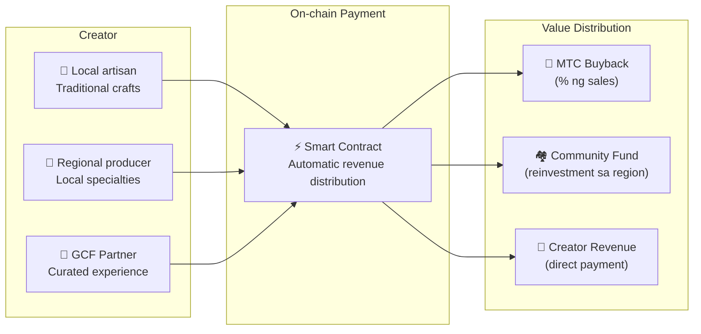

# 🗓️ Roadmap at Team

>**Sa mga nakabasa hanggang dito — lahat ng bisyon, economic design, at technical foundation ay kumpleto na.**
> Hindi kami short-term speculative project.
>**Tapos na ang pangunahing platform development**, at pumapasok na lamang kami sa phase ng expansion.

---

## Strategic Milestone

### 🔥 Phase 1: Pagkagising (Unang Bahagi ng 2026 ── Ngayon)

**Theme: Pagtatayo ng pundasyon at pagtatatag ng cash flow**

Gumagana na ang web platform. Ang iOS app (Matsuri, J-Times) ay ilalabas sa Abril 2026. Pokus sa pagkikita at paghahangad ng initial liquidity sa pamamagitan ng financial system na direktang pinamamahalaan ng CEO.

| Status | Milestone | Detalye |
| :---: | :--- | :--- |
| ✅ | **Web Platform Gumagana** | Nagsimula ang operation ng Matsuri Web app at GCF Admin Dashboard (web version) |
| ✅ | **Pagbabayad at Paglago** | Tapos na ang implementation ng MTC payment function at referral airdrop function |
| ✅ | **Pagsisimula ng Media** | Naitayo ang distribution foundation ng J-Times (web at podcast) |
| ✅ | **Genesis** | Pag-issue ng MTC token sa Solana chain |
| ✅ | **Pagtatatag ng Liquidity** | Tapos ang paglikha ng initial liquidity pool sa Raydium |
| ⬜ | **Pagsisimula ng Incentive** | Pagsisimula ng liquidity mining na may target APY na 20% |
| ⬜ | **On-chain Payment** | Pagsisimula ng production operation ng Solana Pay verification |
| ⬜ | **VIP Member Recruitment** | Pagkumpleto ng selection ng 20 initial VIP members ng GCF |

### 🚀 Phase 2: Expansion (Huling Bahagi ng 2026)

**Theme: Real assets at Adventure Mining**

Gamit nang buong-buo ang tapos nang webapp, palalawakin namin ang physical base at "pilgrimage function".

| Status | Milestone | Detalye |
| :---: | :--- | :--- |
| ⬜ | **Release ng Bagong Feature** | Implementation at release ng Adventure Mining (pilgrimage) |
| ⬜ | **International Expansion** | Paghahanap ng partner base sa Asia (Thailand, Taiwan, atbp.) at pag-host ng VIP events |
| ⬜ | **Asset Management** | Pagtatayo ng real estate, stocks, at crypto asset portfolio |
| ⬜ | **Target na Nakamit** | Kabuuang asset scale ng ecosystem **¥1 bilyon** |

### 🌊 Phase 3: Circulation (2027〜)

**Theme: Malawakang adoption, co-creation economy, at decentralization**

Phase ng general opening, on-chain marketplace, at buong operation ng ecosystem.

| Status | Milestone | Detalye |
| :---: | :--- | :--- |
| ⬜ | **Grand Open** | Global official release ng Matsuri App |
| ⬜ | **Grand Unlock (2027/6/1)** | Founder lockup unlock + simula ng mining pool (550M) + simula ng halving cycle |
| ⬜ | **Co-creation Marketplace** | Local specialty shop + GCF partner store ── On-chain payment na may MTC auto-buyback |
| ⬜ | **Crowdfunding (na may NFT rights)** | Mag-invest ang users sa cultural project sa Solana. Makakatanggap ng NFT ang backer na kumakatawan sa ownership, revenue share, at governance rights |
| ⬜ | **On-chain Payment** | Lahat ng transaksyon ng marketplace ay sini-settle sa smart contract ── isang proporsyon ng sales ay awtomatikong ipinapadala sa MTC buyback pool |
| ⬜ | **Target na Nakamit** | Kabuuang asset scale ng ecosystem **¥10 bilyon (〜$65M)** |
| ⬜ | **Pag-transition sa DAO** | Paglipat ng ilang bahagi ng decision-making authority sa GCF community |

#### 🏪 Konsepto ng Co-creation Marketplace

Ang pinakamalalim na pagpapahayag ng "Cultural OS" ── isang decentralized marketplace kung saan **direktang nagtatrade ang creators at lovers ng kultura**, walang exploitative intermediary.

| Feature | Description | Status |
| :--- | :--- | :---: |
| **🏺 Local Specialty Shop** | Direktang nagbebenta ang artisan at regional producer sa mga customer sa buong mundo. 5〜10% discount sa MTC payment | ⬜ Konsepto |
| **🎫 Crowdfunding + NFT Rights** | Mag-invest sa cultural project (restoration ng shrine, revival ng festival, workshop ng artisan). Makakatanggap ng NFT na nagpapatunay ng kontribusyon, posibleng may revenue share o governance right | ⬜ Konsepto |
| **⚡ On-chain Payment** | Lahat ng marketplace transaction ay sini-settle sa Solana smart contract. Awtomatikong distribusyon ng revenue: bayad sa creator + community fund + MTC buyback ── hindi kailangan ng manual accounting | ⬜ Konsepto |
| **🗳️ Backer Governance** | Boboto ang NFT holders sa resource allocation ng invested project ── hindi basta donation, kundi tunay na co-creation | ⬜ Konsepto |

:::info Bakit Mahalaga ito
Ngayon, bumibili ang mga turista ng souvenir sa mga tindahan na nagbabayad ng rent sa "landlord" na platform. Bukas, ang **artisan sa probinsya ng Kyoto ay direktang magbebenta sa fan sa Copenhagen**, at isang bahagi ng sales ay awtomatikong nagpapalakas sa MTC economy. Ito ang pinaka-kumpletong anyo ng flywheel.
:::

---

## 👤 Team

### Ko Takahashi ── Founder / CEO & Lead Architect

| Item | Detalye |
| :--- | :--- |
| **Papel** | Pangkalahatang pamamahala ng proyekto. Platform design, smart contract, full-stack development |
| **Bisyon** | Tagapagmungkahi ng cultural OS na "mag-export ng kultura, mag-import ng yaman" |
| **Postura** | Practitioner ng "skin in the game" na mismong sumusulat ng code at tumatayo sa larangan (Golden Gai) |

### Jon Anders Jensen ── Director / GCF at Event Operations

| Item | Detalye |
| :--- | :--- |
| **Papel** | Pangkalahatang supervision ng GCF community operations. Operational design at field command ng events at tours |
| **Lakas** | Sumusuporta sa circulation ng "mga tao" ng ecosystem sa pamamagitan ng international perspective at tiwala sa GCF members |

### Ryunosuke Honda ── Director / Regional Culture Ambassador

| Item | Detalye |
| :--- | :--- |
| **Papel** | Tulay na nag-uugnay sa kultura at community ng iba't ibang lugar sa Japan at Matsuri ecosystem |
| **Lakas** | Nagtutuklas ng local cultural resources at naghahatid sa Matsuri platform upang maisakatuparan ang "Deep Japan" experience |

### 🌏 GCF Community ── Development Members na Kumakalat sa Mundo

Hindi lamang ng founding team ginawa ang Matsuri Protocol.
Ang **GCF members sa buong mundo** ay nag-aambag sa ebolusyon ng protocol sa pamamagitan ng testing, feedback, translation, at regional expansion.

| Area | System |
| :--- | :--- |
| **💼 Global Finance** | Pakikipag-ugnay sa private investor network ng Asia |
| **⚙️ Engineering** | Decentralized engineer team ng blockchain at mobile app development |
| **🏮 Operations** | Matibay na pipeline sa local community ng Shinjuku Golden Gai at mga pangunahing tourist destination |
| **🌐 Community** | Multinational GCF members kabilang ang Japan, Norway, Thailand, at Taiwan |

:::tip Infrastructure ng Kultura na Gawa ng Lahat
Sa pagsali sa GCF, ikaw rin ay co-developer ng Matsuri Protocol.
Hindi lang pagsusulat ng code ang kontribusyon. Pagpapakilala ng lokal na sagradong lugar, pagsasalin ng dokumento, pagpaplano ng event ──
Lahat ito ay lakas na nagpapalawak ng protocol na ito sa mundo.
:::

---

## 🏛️ Governance (DAO)

Ang Matsuri Protocol ay unti-unting lumilipat mula sa centralized patungong **Decentralized Autonomous Organization (DAO)**.
Ang GCF members (Platinum/Gold) ay magkakaroon ng **voting rights** sa mga mahahalagang bagay sa hinaharap:

| Voting Matter | Nilalaman |
| :--- | :--- |
| **💰 Fund Allocation** | Sa anong bagong negosyo o marketing ilalagay ang business revenue |
| **⚙️ Protocol Update** | Fine-tuning ng fee rate ng app o mining reward rate |
| **⛩️ Cultural Certification** | Aling festival o shrine ang kikilalanin bilang "opisyal na pilgrimage site" at pondohan |

:::info Sumali sa Rebolusyon
Hindi lang app ang ginagawa namin.
**Cultural economic zone na walang hangganan** ang ginagawa namin.
:::

---

**[◀ Nakaraan: Produkto at Teknolohiya](/docs/product-tech)**｜**[⛩️ Bumalik sa Top ng Whitepaper](/docs/intro)**
