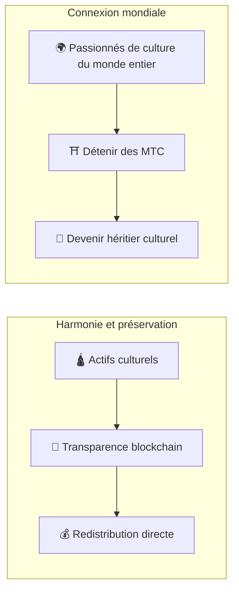

# ⛩️ Bienvenue sur Matsuri Coin

> **Du code pour l'harmonie. De la valeur pour la paix.**
> Un pont de « Wa » dans un monde divisé. MTC est la boussole qui mène de la compétition à la co-création.

**Matsuri Coin (MTC)** est un utility token décentralisé construit sur la blockchain Solana.
Il a été conçu comme un **« Culture OS »** — un système d'exploitation culturel reliant le patrimoine spirituel du Japon, le « Deep Japan », à l'économie mondiale.

Nous ne construisons pas un simple système de paiement.
Nous bâtissons un **pont entre le Japon et le monde** — un nouveau cadre de co-création où les passionnés de culture se rassemblent par-delà les frontières.

---

## 🎯 Notre mission

:::info Canaliser 10 000 milliards de yens d'énergie vers l'avenir de la culture
Le marché du tourisme réceptif au Japon atteint **10 000 milliards de yens** par an.
Mais derrière ces chiffres se cache une **vérité dérangeante**.
:::

### Les problèmes dont personne ne parle

| Problème | Réalité |
| :--- | :--- |
| 💸 **Fuite de revenus** | La majorité des revenus s'évapore en commissions vers des OTA étrangères et des intermédiaires |
| 😤 **Épuisement local** | Le surtourisme remplit les communautés de foules, mais aucun revenu ne revient aux habitants |
| 🚧 **Le mur de l'expérience** | Les circuits standardisés n'effleurent que la surface — les voyageurs ne touchent jamais le *vrai* Japon |

> **« Les Japonais peinent, les voyageurs ne voient qu'une façade, et la richesse disparaît dans les frais de plateforme. »**

Nous utilisons le Web3 pour démanteler ce système défaillant.
Votre paiement atteint les communautés locales et la préservation culturelle **directement** — en toute transparence, sans intermédiaire.

---

## 🏗️ Le modèle hybride : Culture × Technologie

La plupart des projets crypto ne poursuivent que le profit et traitent la culture comme un bien jetable.
MTC renverse le paradigme : nous construisons une **« économie qui protège la culture »** — la structure hybride qui aurait dû exister dès le départ.

| Pilier | Signification |
| :--- | :--- |
| **🛕 Harmonie et préservation** | Les paiements touristiques transitent par la blockchain pour financer directement la préservation culturelle et le soutien aux artisans. Les communautés (GCF) conservent la souveraineté sur leur propre patrimoine |
| **🌍 Connexion mondiale** | Une infrastructure qui permet à quiconque, où qu'il se trouve, de soutenir l'esprit « Wa » du Japon. Détenir des MTC, c'est participer à l'histoire vivante du Japon |

---

## 💎 Pourquoi utiliser MTC ?

L'écosystème MTC offre à ses participants un **enrichissement spirituel** et un **avantage économique tangible**.

### ✨ Valeur expérientielle

| Avantage | Détails |
| :--- | :--- |
| **🎌 Expériences authentiques** | Accédez au « Deep Japan » — zones sacrées fermées au public, cérémonies privées dans les sanctuaires, événements culturels sur invitation |
| **🌐 Un lien pour la vie** | Restez connecté au Japon via MTC longtemps après votre retour. Un endroit où vous pouvez toujours « revenir » |
| **⚖️ Commerce équitable** | Les smart contracts éliminent les intermédiaires. Votre paiement arrive directement à ceux qui le méritent |

### 💰 Avantages financiers

| Avantage | Détails |
| :--- | :--- |
| **🏷️ Tarifs préférentiels** | Payez en MTC et économisez **5 à 10 %** par rapport au prix en yens. Ex : circuit à 30 000 ¥ → ~27 000 ¥ |
| **🔑 Accès exclusif** | NFT-billets pour des lieux « sur invitation uniquement » et des événements limités — réservés aux détenteurs de MTC |
| **🛡️ Couverture de change** | Verrouillez la valeur de vos expériences avant votre voyage — plus de souci de fluctuation |

---

## ⚡ Pourquoi Solana ?

Pour servir à la fois la « demande touristique réelle » et le « trading haute fréquence », il n'existait **qu'une seule blockchain viable**.

| Comparaison | Ethereum | Solana |
| :--- | :---: | :---: |
| **Frais de transaction** | 100 – 1 000+ ¥ | **~0,04 ¥** |
| **Finalité** | 12 s – minutes | **0,4 seconde** |
| **Débit** | ~15 TPS | **Milliers de TPS** |

:::tip Le test de l'offrande
Un micro-paiement aussi petit que « glisser 100 ¥ dans la boîte à offrandes » exige des frais **inférieurs à 1 ¥**. Seule Solana passe ce test.
:::

---

:::note Prêt à démarrer
MTC met fin à l'ère du tourisme qui ne fait que *consommer* la culture. Bienvenue dans le voyage vers la **co-création** — construisons l'avenir ensemble.
:::

**[▶ Vision : Pourquoi maintenant ?](/docs/vision)** ｜ **[▶ Rejoindre le GCF (membres VIP)](/docs/economy)**
