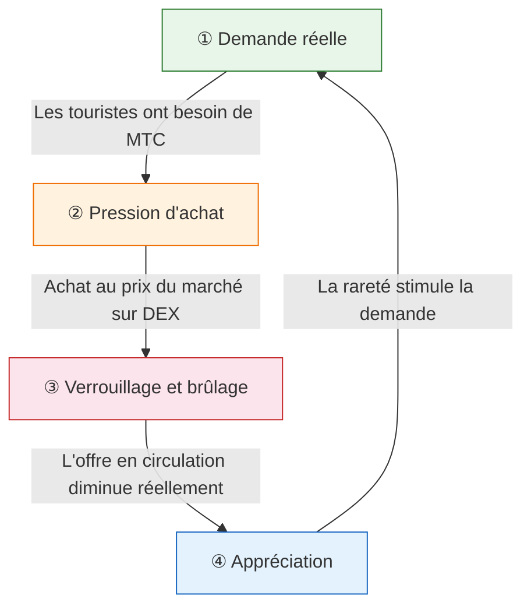
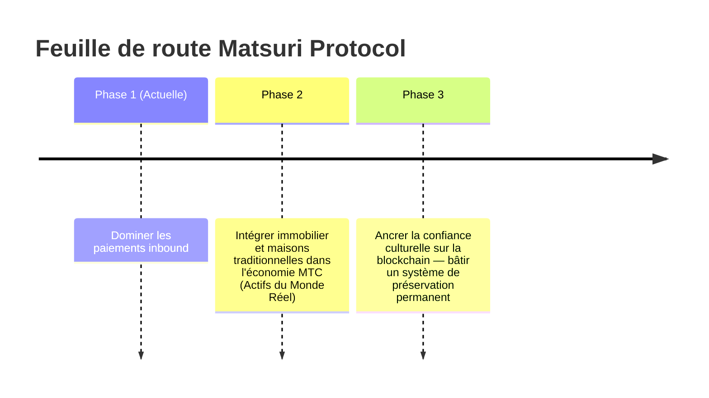

# 🎯 Vision : La stratégie « Inbound First »

> **De la dépendance aux subventions à l'autonomie.**
> L'ère où l'on maintenait les économies locales en perfusion de fonds publics est révolue. Nous injectons les capitaux étrangers directement dans la culture.

La quasi-totalité des projets de revitalisation régionale échouent — parce qu'ils se contentent de redistribuer des budgets publics en décroissance.

**Matsuri Protocol prend l'approche diamétralement opposée.**

---

## 1. Stratégie : Le moteur d'exportation culturelle

Nous redéfinissons les ressources touristiques japonaises — non comme des « biens de consommation », mais comme des **instruments financiers exportables**.

| Problème | Réalité | Impact |
| :--- | :--- | :--- |
| 💸 **Fuite de revenus** | Commissions vers les OTA étrangères (Booking.com, Expedia...) | **15 à 20 % des revenus** s'évaporent — une perte à l'échelle nationale |
| 🚧 **Le mur invisible** | Barrières linguistiques et de paiement | Les voyageurs fortunés n'accèdent pas aux expériences « Deep Japan » |

:::tip Le rôle de MTC
MTC est le **seul passe-partout** qui stoppe la fuite et abat les murs.
:::

---

## 2. Le volant économique

La signature de Matsuri Protocol : **l'enthousiasme des touristes entraîne mathématiquement la hausse du prix de MTC.**
Pas de l'espoir — de la **mécanique d'offre et de demande**.

### Pourquoi MTC prend-il de la valeur ?

Un **cycle automatique en 4 étapes** propulse le prix :

| Étape | Nom | Mécanisme |
| :---: | :--- | :--- |
| **①** | **Demande réelle** | Les touristes ont besoin de MTC pour réserver des guides et acheter des NFT-billets |
| **②** | **Pression d'achat** | MTC est acheté au prix du marché sur le DEX — par la consommation, non la spéculation |
| **③** | **Verrouillage & brûlage** | Une part des MTC utilisés en paiement est instantanément verrouillée ou brûlée — l'offre diminue physiquement |
| **④** | **Appréciation** | La demande d'achat croît, l'offre de vente décroît — la valeur de rareté progresse mathématiquement |

:::info Vérité fondamentale
**« Plus les touristes savourent le Japon, plus la fortune des détenteurs de MTC augmente. »**
Cette équation simple est le battement de cœur du projet.
:::

---

## 3. Destination finale : Le Culture OS

Notre objectif ultime n'est pas une application de paiement.
C'est de **transformer la culture en système d'exploitation**.

> Nous protégeons une **culture millénaire** avec une **technologie blockchain de pointe**.
> Voilà l'avenir que Matsuri Protocol construit.

---

**[▶ Suivant : Comment gagnons-nous réellement ? (L'économie)](/docs/economy)**
