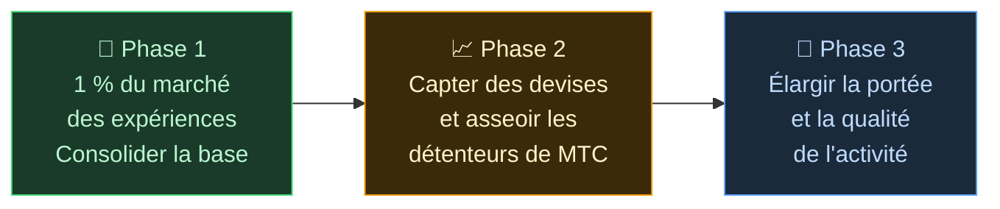

# 🌏 Problèmes et solutions — vérités dérangeantes, et espoir

> **L'ambition est belle. Mais la réalité y fait obstacle.**

---

## La vérité dérangeante qui se dresse sur notre chemin

:::info 10 000 milliards de yens d'énergie de marché qui n'atteignent pas ceux qui portent la culture
Le marché du tourisme réceptif japonais atteint **10 000 milliards de yens (~60 Md €)** par an.
Pourtant, la majeure partie de ces bénéfices ne redescend pas sur le terrain.
:::

### Le marché que vise MTC

Nous ne visons pas la totalité des 10 000 milliards.

Nous ciblons d'abord, à l'intérieur de ce marché, celui des **expériences culturelles, des guides et des tours régionaux**. Notre premier objectif : **1 % de ce segment (environ 100 Md ¥, ~650 M €)** ── commencer petit et se renforcer.

| Phase | Stratégie | Objectif |
| :--- | :--- | :--- |
| **Commencer petit** | Focus sur les expériences culturelles et les tours guidés. Construire du référentiel et grandir par le bouche-à-oreille | Consolider la base de revenus |
| **Se renforcer** | Capter des devises (revenus du tourisme réceptif) et démontrer le mécanisme de partage aux détenteurs de MTC | Construire la confiance dans l'économie MTC |
| **Élever la qualité** | Une fois une certaine échelle atteinte, prioriser la qualité de l'expérience, la portée d'activité et la profondeur communautaire plutôt que l'expansion | Une économie culturelle durable |

> **Nous ne cherchons pas la quantité ; nous grandissons par la qualité des participants et la profondeur de l'expérience.** Voilà la stratégie d'expansion de MTC.

Les plateformes Web2 ont porté au monde la merveille du voyage. Nous leur en sommes reconnaissants.
Mais la structure centralisée a entraîné des effets secondaires inévitables.

Les algorithmes décident « ce qui est montré » et les acteurs sont forcés de se battre pour leur rang. Une seule évaluation peut faire basculer le chiffre d'affaires, et les commissions changent au bon vouloir de la plateforme —— le terrain vit en permanence dans la peur d'« être choisi ou disparaître ».

Cette structure engendre la fragmentation entre acteurs et la peur des règles invisibles.
Le voisin devient un concurrent ; accaparer devient plus rationnel que coopérer. Et les voyageurs n'ont droit qu'à des choix uniformisés par le « nombre d'étoiles » ou le « classement », pendant que les expériences véritablement précieuses restent enfouies.

:::danger Trois problèmes sur le terrain
💸 **Fuite de revenus** — La majeure partie s'évapore à l'étranger sous forme de commissions pour les OTA et les intermédiaires

😤 **Épuisement local** — Seul reste le poids du surtourisme ; les revenus essentiels ne reviennent pas aux communautés

🚧 **Le mur de l'expérience** — Seuls des tours standardisés choisis par algorithme apparaissent ; le « vrai Japon » reste introuvable
:::

> **Les Japonais peinent, les voyageurs ignorent la réalité, et la richesse s'évanouit vers les plateformes.**

---

## Alors, comment changer les choses ?

Aujourd'hui, les technologies capables de transformer cette structure à la racine sont enfin réunies.

:::tip Smart contracts — Des règles communes impossibles à réécrire
Commissions et conditions sont gravées dans le code ; personne ne peut les modifier unilatéralement. Des règles égales pour tous, exécutées automatiquement.
:::

:::tip Blockchain — Transparence totale, tout est visible
Chaque transaction est inscrite dans un registre public vérifiable par quiconque. L'époque où les données restaient enfermées dans les entreprises est révolue.
:::

:::tip Solana — Règlement en 0,4 s, frais de 0,04 ¥
Plus besoin de multiples couches d'intermédiaires ni d'attendre des jours. Les personnes se connectent directement.
:::

:::tip IA — Supprimer le coût de gestion lui-même
Le bond explosif de productivité rend obsolète la structure de coûts nécessaire au maintien des grandes plateformes.
:::

Plus besoin de passer par des intermédiaires : les gens peuvent désormais se connecter directement.

Grâce à cette technologie, nous libérons l'économie réceptive du monopole et redirigeons les revenus vers le terrain, au Japon comme ailleurs.
Et pas seulement pour le Japon : nous bâtissons **un système pour protéger et relier les cultures du monde**.

---

**[◀ Précédent : Vision et ambition](/docs/vision)**｜**[▶ Suivant : L'avenir que dessine MTC](/docs/future)**
