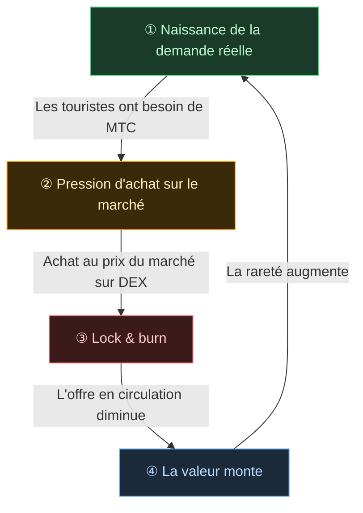

# 🔄 Flywheel économique — le cycle de croissance et l'OS culturel

> **Plus les touristes profitent du Japon, plus la demande de l'écosystème augmente.**
> Ce mécanisme d'offre et de demande est le cœur du projet.

---

## Mécanisme offre/demande de MTC

Le design du Matsuri Protocol fait en sorte que **la hausse de la demande réelle génère une pression d'achat qui, combinée à la baisse de l'offre, crée les conditions d'une valorisation**.
Ce n'est pas un discours émotionnel, c'est un **mécanisme d'offre et de demande**.

Le **cycle en quatre étapes** suivant soutient ce mécanisme.

| Étape | Nom | Mécanisme |
| :---: | :--- | :--- |
| **①** | **Naissance de la demande réelle** | Les touristes ont besoin de MTC pour réserver un guide ou acheter un NFT-ticket |
| **②** | **Pression d'achat sur le marché** | MTC est acheté au prix du marché sur un DEX. Une demande forte basée sur la consommation, pas sur la spéculation |
| **③** | **Lock & burn** | Une partie des MTC utilisés en paiement est immédiatement verrouillée ou brûlée par smart contract. L'offre en circulation se réduit physiquement |
| **④** | **La rareté augmente** | La demande d'achat monte, l'offre à la vente baisse. L'évolution de l'équilibre accroît la rareté unitaire |

---

---

:::note La vision derrière cette formule
La vue d'ensemble de l'« OS culturel » au-delà du flywheel est présentée dans la page suivante, [L'avenir que dessine MTC](/docs/future).
:::

---

**[◀ Précédent : Problèmes et solutions](/docs/challenges)**｜**[▶ Suivant : L'avenir que dessine MTC](/docs/future)**
