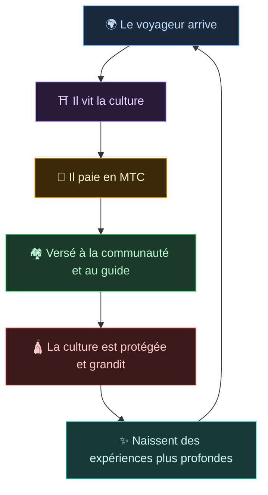
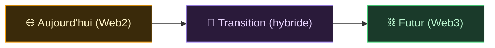
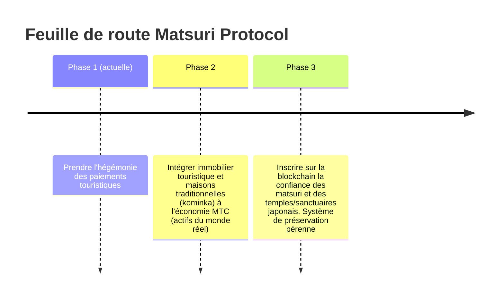

# 🌀 L'avenir que dessine MTC — une économie où chaque « lien » circule

> **Celui qui vit l'expérience, celui qui la transmet, celui qui la protège. Toutes les intentions circulent comme économie et remettent la culture à la génération suivante.**

---

## Le cycle que nous voulons réaliser

MTC n'est pas un jeton spéculatif.

Le voyageur touche la culture japonaise et en est ému.
Le guide transmet cette émotion et est récompensé.
La communauté prospère et peut continuer à protéger sa culture.
Et cette culture, à son tour, attire de nouveaux voyageurs.

Ce cycle est la raison même de l'existence de MTC.

---

## Une économie qui récompense les trois acteurs

Dans le tourisme classique, le voyageur paie, la plateforme prend le bénéfice et rien ne reste sur le terrain.
Dans l'économie MTC, toute personne impliquée est récompensée.

| Acteur | Ce qu'il se passe | Comment il est récompensé |
| :--- | :--- | :--- |
| **🌍 Celui qui vit l'expérience** | Il touche la culture japonaise et paie en MTC | Il accède à des expériences authentiques moins chères qu'en yens. De retour chez lui, il reste connecté via MTC |
| **⛩️ Celui qui transmet** | Il organise des événements comme guide et publie sur J-Times | Récompense directe sans intermédiaires. Plus il est actif, plus il gagne en MTC |
| **🏘️ Celui qui protège** | Il entretient et transmet la culture en tant que communauté locale | Les revenus arrivent directement. Une prospérité durable, sans surtourisme |

---

## Plus l'économie s'étend, plus la culture se renforce

L'économie MTC commence par la réservation d'expériences puis s'étend, avec le temps, à tous les aspects de la vie.

- **Expérience** — Expériences culturelles authentiques, minage de pèlerinage
- **Vie quotidienne** — Maisons d'hôtes, boutiques, gastronomie, mode
- **Projets de co-création** — Investissement pour protéger la culture via crowdfunding
- **Compréhension interculturelle** — Espaces d'échange et de compréhension mutuelle par-delà les frontières

Plus l'économie s'élargit, plus le cycle via MTC s'épaissit et plus grande est la force qui soutient la culture.
Ce n'est pas un simple modèle économique : c'est un **dispositif de survie culturelle**.

---

## Du Web2 au Web3 — sans heurt, par étapes

Nous ne disons pas qu'il faut tout basculer sur la blockchain du jour au lendemain.

Aujourd'hui, la plupart n'est pas familière avec Web3. Nous concevons donc un parcours qui **part de ce que chacun connaît déjà et révèle progressivement les bénéfices de Web3**.

| Phase | Expérience utilisateur | Ce qu'il y a derrière |
| :--- | :--- | :--- |
| **Aujourd'hui** | Réserver et payer comme sur une app classique. Carte de crédit acceptée | Django + Stripe. Pas besoin de wallet pour commencer |
| **Transition** | Gagner et utiliser des MTC dans l'app. Connexion wallet en un clic | Les scores off-chain migrent peu à peu on-chain |
| **Futur** | Toutes les transactions et les droits sont inscrits de façon transparente sur la blockchain. Votre contribution est attestée à jamais | Économie entièrement automatisée et infalsifiable via smart contracts |

:::tip Web3 n'est pas compliqué
Pas besoin de configurer un wallet ni de gérer une seed phrase au départ. À force d'usage, vous entrez naturellement dans le monde Web3 —— **quand vous vous en rendez compte, vous êtes déjà un habitant de Web3.** C'est l'expérience que nous concevons.
:::

---

## Une économie mue par l'empathie, pas par la force

Cet espace économique fonctionne grâce aux smart contracts.
Nul ne peut changer unilatéralement les règles par le pouvoir ou la commodité —— **un système où le statu quo ne peut être altéré par la force**.

Sur cette base, nous continuons à créer de la valeur nouvelle en apprenant de la sagesse ancienne. 温故知新, et au-delà : innovation.

> **Un monde où, même sans yens ni dollars, la vie s'organise autour de la culture.**
>
> Plutôt que de confier la valeur de la monnaie à d'autres, vous créez et utilisez de la valeur par votre propre « lien ».
> Voilà la liberté que MTC veut offrir.

---

## 🏁 Destination finale : « l'OS culturel »

Notre objectif ultime n'est pas une simple app de paiement.
**Nous voulons faire de la culture elle-même un OS (une base)**.

> Nous protégeons la sagesse ancienne par la blockchain la plus avancée.
> Voilà l'avenir que dessine Matsuri Protocol.

---

:::note La partie narrative s'arrête ici
Quiconque est arrivé jusqu'ici a compris pourquoi MTC existe.
Place à la **[partie pratique]** : voyons concrètement ce que l'on peut faire avec MTC.
:::

**[◀ Précédent : Flywheel économique](/docs/flywheel)**｜**[▶ Suivant : Écosystème](/docs/ecosystem)**
