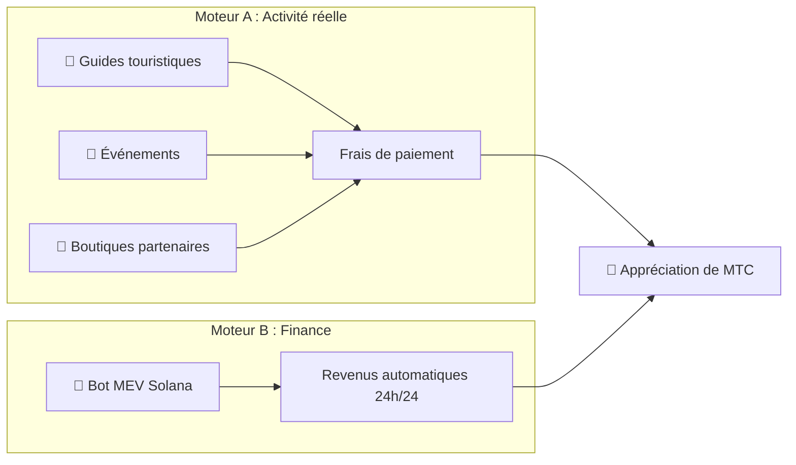

# 💰 Système économique

> L'économie de Matsuri Coin (MTC) est simple mais blindée.
> **Deux moteurs de revenus — activité réelle et algorithmes financiers — génèrent des profits et les redistribuent aux détenteurs de façon programmatique.**


---

## 1. Double moteur de revenus



| Moteur | Source de revenus | Fonctionnement |
| :--- | :--- | :--- |
| **🏯 Moteur A (Activité)** | Frais de paiement des guides, événements et boutiques partenaires | Plus de touristes → plus de capitaux étrangers → expansion de l'écosystème |
| **🤖 Moteur B (Finance)** | Trading automatisé via le bot MEV Solana | Programme de trading haute fréquence sous la direction du CEO, extrayant des profits des inefficiences du marché on-chain 24/7/365 |

---

## 2. Protocole de rachat (mécanisme d'appréciation)

Nous ne mettons pas les profits en poche.
Les règles des smart contracts canalisent les revenus directement vers l'**appréciation de MTC**.

| Source de revenus | Allocation | Action |
| :--- | :---: | :--- |
| **Ventes Matsuri HQ** (Guides et événements) | **20 %** | **Rachat** sur le marché + injection dans le pool de liquidité |
| **Adhésion GCF** (Cotisations) | **25 %** | **Rachat** sur le marché |

:::info Logique fondamentale
**« Croissance de l'activité = MTC constamment racheté sur le marché ouvert. »**
Cette équation sous-tend la valeur de votre actif.
:::

---

## 3. Logique de détermination du prix

Notre mécanisme de prix s'appuie sur la **formule AMM (Automated Market Maker)** — pas sur des vœux pieux.

```
Prix = Liquidité (SOL) ÷ Offre (MTC)
```

| Étape | Ce qui se passe | Résultat |
| :---: | :--- | :--- |
| **①** | Les revenus d'activité (SOL) sont injectés dans le pool | **Numérateur ↑** |
| **②** | MTC est racheté sur le marché et brûlé | **Dénominateur ↓** |
| **③** | Numérateur ↑ × Dénominateur ↓ | **Le prix progresse mathématiquement** |

---

## 4. GCF (Global Community Friends)

Le GCF est l'organisation partenaire **sur invitation uniquement** (DAO) chargée de développer l'écosystème Matsuri.
Ce n'est pas un club — c'est un **collectif d'affaires** partageant les profits.


### Niveaux d'adhésion

| Niveau | Rôle | Privilèges |
| :---: | :--- | :--- |
| **👑 Platinum** | Propriétaire / VIP | Droits maximum. Premières **50 places** uniquement. Pouvoir décisionnel + dividendes substantiels |
| **🥇 Gold** | Ambassadeur | L'équipe terrain. Droit de gagner **sans plafond** par l'activité. Taux de mining et de parrainage maximisés |

### Avantage ① : Real-Work Mining (droits de minage)

Les **550 millions de MTC (~61 % de l'offre totale)** déverrouillés le 1er juin 2027 sont réservés comme **pool de récompenses pour les contributeurs** — et non déversés sur le marché.

:::tip Entièrement basé sur la performance
Les MTC sont distribués automatiquement du pool selon vos contributions (ventes, fréquentation, sessions de guidage).
:::

**Calendrier de halving (cycle de 2 ans) :**

| Période | Émission | Volume |
| :--- | :---: | :--- |
| **Époque 1** 2027 – 2029 | **50 %** | ~275 M tokens |
| **Époque 2** 2029 – 2031 | **25 %** | ~137 M tokens |
| **Époque 3** 2031 – 2033 | **12,5 %** | ~68 M tokens |

:::caution Fenêtre du premier arrivé
Plus rapide que le halving Bitcoin (4 ans) — nous utilisons un **cycle de 2 ans**.
Ceux qui s'investissent à fond les **deux premières années à partir de 2027** s'assurent un avantage de premier arrivé écrasant.
:::

### Avantage ② : Commission de parrainage premium

Parrainez des produits à forte valeur (adhésions, circuits VIP, immobilier partenaire) et gagnez des **commissions premium (USDC + MTC)** — bien au-delà des programmes d'affiliation classiques. Versement **instantané** via smart contract.

---

## 5. Spécifications du token

Nous avons **révoqué** de façon permanente les autorités de Mint et de Freeze sur Solana.
Plus jamais d'émission supplémentaire. Plus jamais de gel de fonds. **Conception entièrement trustless.**

| Élément | Détails |
| :--- | :--- |
| **Nom du token** | Matsuri Coin |
| **Ticker** | MTC |
| **Blockchain** | Solana |
| **Offre totale** | **900 000 000 MTC** (Fixe) |
| **Autorité Mint** | 🚫 Révoquée |
| **Autorité Freeze** | 🚫 Révoquée |
| **Contrat de verrouillage** | Streamflow Finance (Vérifié) |

:::warning Sur invitation uniquement — places limitées
Le GCF cessera le recrutement dès que les places limitées seront pourvues (Platinum : 50 / Gold : en cours d'ajustement).
Détenir ce droit signifie entrer dans le **cercle intérieur** de l'économie Matsuri.
:::

---

**[▶ Suivant : Écosystème et mining](/docs/ecosystem)** ｜ **[Rejoindre Discord](#)**
