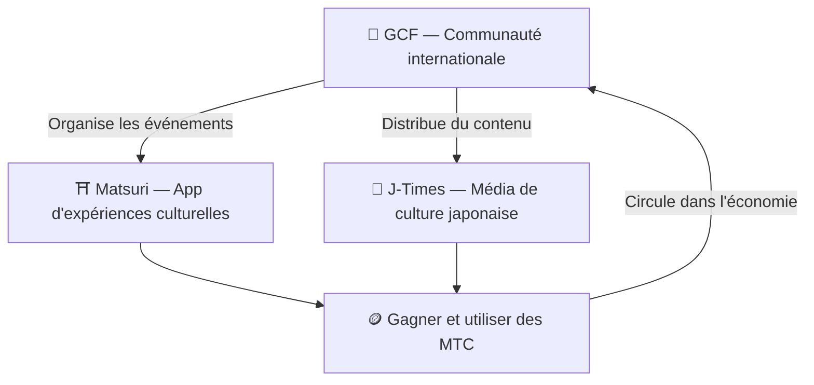

# 🏗️ Écosystème MTC — une économie où expérience, médias et communauté circulent

> **Trois « lieux » pour concrétiser l'ambition.**
> Un lieu pour vivre, un lieu pour apprendre, un lieu pour se connecter —— indépendants mais reliés par MTC en un seul écosystème en circulation.

MTC n'est pas un simple jeton. Trois produits et une communauté internationale collaborent pour concrétiser une économie au service de la culture.

:::tip 🤝 GCF — la communauté internationale qui anime l'écosystème
Un espace où les passionnés de culture japonaise se relient par-delà les frontières. GCF recrute des guides et ces guides GCF opèrent les expériences sur Matsuri. Ils publient aussi du contenu attrayant sur J-Times —— l'activité de la communauté est le moteur qui fait tourner tout l'écosystème.
:::

:::tip ⛩️ Matsuri — app d'expériences culturelles
Cela commence par la réservation d'expériences culturelles, puis s'étend progressivement vers **maisons d'hôtes**, **boutiques** et **crowdfunding**. L'économie s'ouvre de l'expérience à l'habillement, à l'alimentation, au logement et à l'investissement de co-création.

**Minage de pèlerinage (Sanpai)** — Gagnez des MTC en visitant physiquement temples, sanctuaires et sites culturels. Disperse naturellement les flux des sites célèbres vers des lieux cachés en région, résolvant à la fois le surtourisme et la revitalisation locale.
:::

:::tip 📰 J-Times — média de culture japonaise
Une plateforme de média qui porte l'attrait de la culture japonaise dans le monde. Gagnez des MTC en lisant, partageant et interagissant avec les articles.
:::

---

## 🤝 Minage social (gagner en se connectant)

**Intégré au tableau de bord GCF ── version web en marche (app iOS prévue en avril 2026)**

Les membres GCF ont accès au **tableau de bord web GCF** dédié.

| Fonction | Ce que vous pouvez faire |
| :--- | :--- |
| **🎪 Créer des événements** | Concevoir et publier vos propres événements et tours |
| **📢 Distribuer du contenu** | Diffuser articles et contenus J-Times |
| **📊 Suivi des parrainages** | Suivre en temps réel le comportement et les revenus de vos filleuls |

:::info Récompense automatique
Chaque fois qu'un ami parrainé effectue un paiement, le système verse **automatiquement** la récompense (partage de revenus) sur votre wallet.
:::

---

## 🎓 Économie du créateur (gagner en créant)

Au-delà de consommer du contenu, sur la plateforme Matsuri **tout le monde** peut produire et monétiser son contenu.

| Plateforme | Ce que le créateur peut faire | Modèle de revenus |
| :--- | :--- | :--- |
| **📚 Marketplace de cours** | Publier des cours vidéo/texte sur culture, langue et artisanat japonais | Commission par inscription (partage au créateur) |
| **🎙️ Studio podcast** | Produire des séries audio avec diffusion Spotify, Apple Podcasts et RSS | Épisodes exclusifs sur abonnement |
| **🤝 Crowdfunding** | Lancer des campagnes sur Solana pour des projets culturels | Suivi on-chain des contributions |
| **🛍️ Boutique utilisateur** | Ouvrir une boutique au sein de la plateforme (artisanat, merchandising) | Vente directe avec système produits/avis |

:::tip Création assistée par IA
Les hôtes d'événement peuvent utiliser l'**assistant IA intégré (GPT-4 Turbo)** depuis le tableau de bord pour rédiger les descriptions, traduire automatiquement en 5 langues et générer des métadonnées optimisées SEO.
:::

---

  

*Rencontre communautaire à Golden Gai —— les liens deviennent puissance de minage.*

---

:::note Page suivante
Pour découvrir concrètement le mécanisme de minage et comment gagner, rendez-vous sur **[Minage et façons de gagner →](/docs/mining)**.
:::
